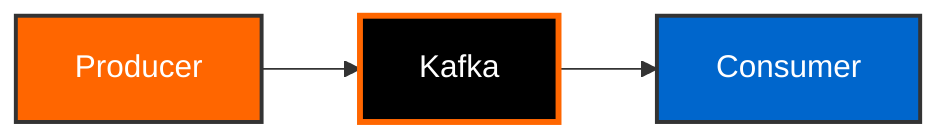

# Kafka Training Documentation

This directory contains the complete MkDocs Material documentation for the Kafka Training project.

## Documentation Structure

```
docs/
├── index.md                    # Homepage
├── getting-started/           # Setup and installation guides
│   ├── index.md
│   ├── overview.md
│   ├── prerequisites.md
│   ├── quick-start.md
│   └── installation.md
├── training/                  # 8-day training curriculum
│   ├── index.md
│   ├── day01-foundation.md
│   ├── day02-dataflow.md
│   ├── day03-producers.md
│   ├── day04-consumers.md
│   ├── day05-schema-registry.md
│   ├── day06-streams.md
│   ├── day07-connect.md
│   └── day08-advanced.md
├── containers/                # Container development guides
│   ├── index.md
│   ├── why-containers.md
│   ├── docker-basics.md
│   ├── docker-compose.md
│   ├── testcontainers.md
│   └── best-practices.md
├── deployment/                # Production deployment
│   ├── index.md
│   ├── kubernetes-overview.md
│   ├── deployment-guide.md
│   ├── monitoring.md
│   ├── scaling.md
│   └── checklist.md
├── api/                      # API reference
│   ├── index.md
│   ├── training-endpoints.md
│   ├── eventmart-api.md
│   ├── actuator.md
│   └── errors.md
├── architecture/             # System architecture
│   ├── index.md
│   ├── system-design.md
│   ├── tech-stack.md
│   ├── data-flow.md
│   ├── container-architecture.md
│   └── security.md
├── contributing/             # Contribution guidelines
│   ├── index.md
│   ├── development-setup.md
│   ├── testing.md
│   └── code-style.md
├── stylesheets/
│   └── extra.css            # Custom Kafka-themed styles
└── javascripts/
    └── mermaid-init.js      # Mermaid diagram initialization
```

## Building the Documentation

### Prerequisites

Install Python 3.8+ and pip:

```bash
# macOS
brew install python3

# Ubuntu/Debian
sudo apt install python3 python3-pip

# Windows
# Download from python.org
```

### Install MkDocs and Dependencies

```bash
# Install from requirements.txt
pip install -r requirements.txt

# Or install manually
pip install mkdocs mkdocs-material pymdown-extensions
```

### Local Development Server

Start the live-reloading development server:

```bash
# Start server
mkdocs serve

# Or specify port
mkdocs serve -a localhost:8001

# Access at: http://localhost:8000
```

The server automatically reloads when you save changes to any documentation file.

### Build Static Site

Generate the static documentation site:

```bash
# Build site
mkdocs build

# Output directory: site/
# Files are ready to deploy to any static hosting
```

### Clean Build

Remove the build directory:

```bash
# Clean build artifacts
rm -rf site/

# Rebuild
mkdocs build
```

## Deployment Options

### GitHub Pages

Deploy to GitHub Pages automatically:

```bash
# Deploy to gh-pages branch
mkdocs gh-deploy

# With custom message
mkdocs gh-deploy -m "Update documentation"
```

### Manual Deployment

Build and deploy manually:

```bash
# 1. Build site
mkdocs build

# 2. Deploy site/ directory to:
# - AWS S3
# - Netlify
# - Vercel
# - Any static hosting service
```

### Docker Deployment

Serve documentation with Docker:

```bash
# Build Docker image
docker build -t kafka-training-docs -f Dockerfile.docs .

# Run container
docker run -p 8000:8000 kafka-training-docs

# Access at http://localhost:8000
```

**Dockerfile.docs:**

```dockerfile
FROM python:3.11-slim

WORKDIR /docs

COPY requirements.txt .
RUN pip install --no-cache-dir -r requirements.txt

COPY mkdocs.yml .
COPY docs/ ./docs/

EXPOSE 8000

CMD ["mkdocs", "serve", "-a", "0.0.0.0:8000"]
```

## Documentation Guidelines

### Writing Style

- Use clear, technical language for data engineers
- Provide practical, hands-on examples
- Include code snippets with syntax highlighting
- Add diagrams for complex concepts
- Progressive difficulty (beginner to advanced)

### Code Blocks

Use language-specific syntax highlighting:

````markdown
```bash
# Bash commands
docker-compose up -d
```

```java
// Java code
public class Example {
    public static void main(String[] args) {
        System.out.println("Hello Kafka");
    }
}
```

```yaml
# YAML configuration
kafka:
  bootstrap-servers: localhost:9092
```
````

### Admonitions

Use admonitions for important information:

```markdown
!!! note "Configuration Required"
    Make sure to set the `DATABASE_URL` environment variable.

!!! warning "Breaking Change"
    Version 2.0 introduces breaking changes.

!!! tip "Performance Tip"
    Enable Redis caching for better performance.

!!! danger "Security Warning"
    Never commit `.env` files to version control.
```

### Mermaid Diagrams

Add diagrams using Mermaid:

````markdown

````

### Tabbed Content

Show multiple options with tabs:

````markdown
=== "Docker Compose"

    ```bash
    docker-compose up -d
    ```

=== "Kubernetes"

    ```bash
    kubectl apply -f k8s/
    ```

=== "Local"

    ```bash
    mvn spring-boot:run
    ```
````

### Tables

Use tables for structured data:

```markdown
| Service | Port | Description |
|---------|------|-------------|
| Training App | 8080 | Spring Boot application |
| Kafka Broker | 9092 | Apache Kafka |
| Kafka UI | 8081 | Visual management |
```

## Theme Customization

### Colors

The documentation uses Kafka-themed orange colors:

- Primary: `deep-orange`
- Accent: `orange`
- Kafka Orange: `#ff6600`

### Custom CSS

Edit `docs/stylesheets/extra.css` for custom styling:

```css
/* Custom container style */
.kafka-container {
  border-left: 4px solid var(--kafka-orange);
  padding: 1em;
  margin: 1em 0;
  background-color: rgba(255, 102, 0, 0.05);
  border-radius: 4px;
}
```

### Custom JavaScript

Edit `docs/javascripts/mermaid-init.js` for Mermaid configuration.

## Navigation Structure

Edit `mkdocs.yml` to modify navigation:

```yaml
nav:
  - Home: index.md
  - Getting Started:
      - getting-started/index.md
      - Overview: getting-started/overview.md
      - Prerequisites: getting-started/prerequisites.md
  - Training Curriculum:
      - training/index.md
      - Day 1: training/day01-foundation.md
      # ... more pages
```

## Search Configuration

MkDocs Material includes search by default:

- Automatically indexes all content
- Supports search suggestions
- Highlights search results
- Configurable in `mkdocs.yml`

## Useful Commands

```bash
# Start development server
mkdocs serve

# Build documentation
mkdocs build

# Deploy to GitHub Pages
mkdocs gh-deploy

# Validate configuration
mkdocs build --strict

# Preview with specific theme
mkdocs serve --theme material

# Build with verbose output
mkdocs build --verbose
```

## Troubleshooting

### Build Errors

```bash
# Check for broken links
mkdocs build --strict

# Validate YAML syntax
python -c "import yaml; yaml.safe_load(open('mkdocs.yml'))"

# Clear cache
rm -rf .cache/ site/
mkdocs build
```

### Theme Issues

```bash
# Reinstall theme
pip install --force-reinstall mkdocs-material

# Check version
mkdocs --version
```

### Mermaid Not Rendering

1. Check JavaScript is loaded in browser console
2. Verify Mermaid CDN is accessible
3. Check syntax of Mermaid diagrams
4. Clear browser cache

## Contributing

To contribute to the documentation:

1. Fork the repository
2. Create a branch: `git checkout -b docs/your-feature`
3. Make changes to `docs/` directory
4. Test locally: `mkdocs serve`
5. Submit pull request

## Resources

- [MkDocs Documentation](https://www.mkdocs.org/)
- [Material for MkDocs](https://squidfunk.github.io/mkdocs-material/)
- [Mermaid Diagrams](https://mermaid-js.github.io/)
- [Markdown Guide](https://www.markdownguide.org/)

## Support

For documentation issues:

1. Check [MkDocs Material Issues](https://github.com/squidfunk/mkdocs-material/issues)
2. Review this README
3. Open an issue in the project repository

---

**Happy Documenting!** Build great docs for great software.
