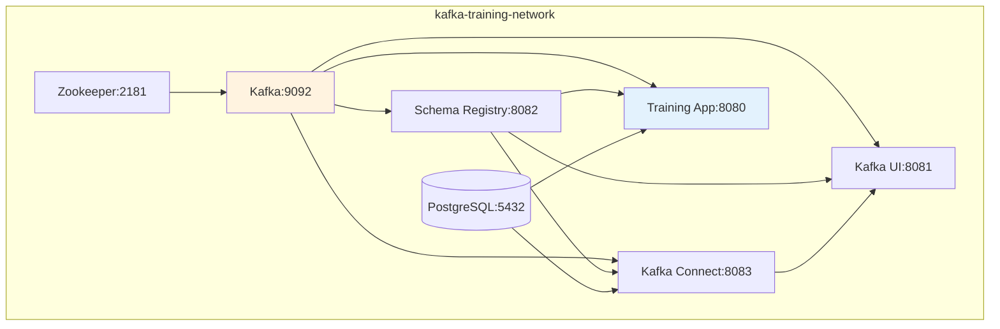
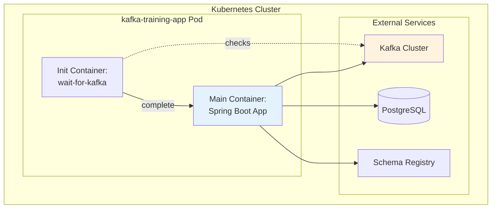

# Container Architecture

## Docker Compose Architecture



## Kubernetes Pod Architecture



## Volume Management

Development mode (ephemeral):
```yaml
# No volumes - clean state on restart
services:
  kafka:
    image: confluentinc/cp-kafka:7.7.0
    # No volumes defined
```

Production mode (persistent):
```yaml
services:
  kafka:
    volumes:
      - kafka-data:/var/lib/kafka/data
volumes:
  kafka-data:
```

## Health Checks

```yaml
kafka:
  healthcheck:
    test: ["CMD-SHELL", "kafka-broker-api-versions --bootstrap-server localhost:9092"]
    interval: 10s
    timeout: 5s
    retries: 5
```

## Next Steps

- [System Design](system-design.md) - Overall architecture
- [Security](security.md) - Container security practices
