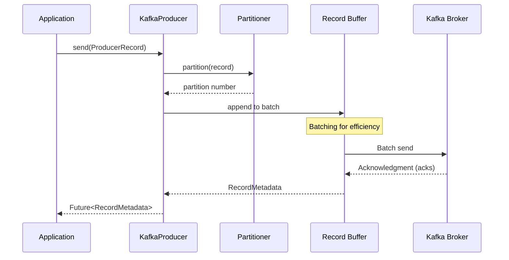
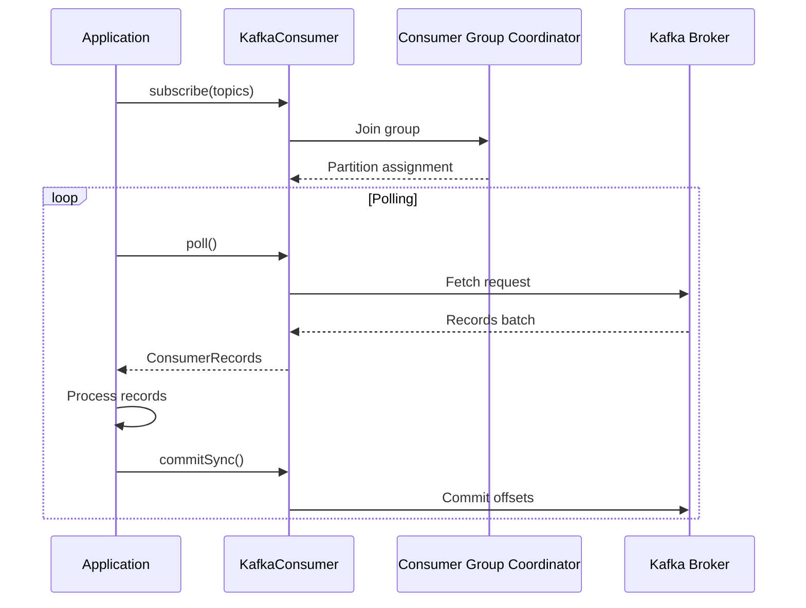
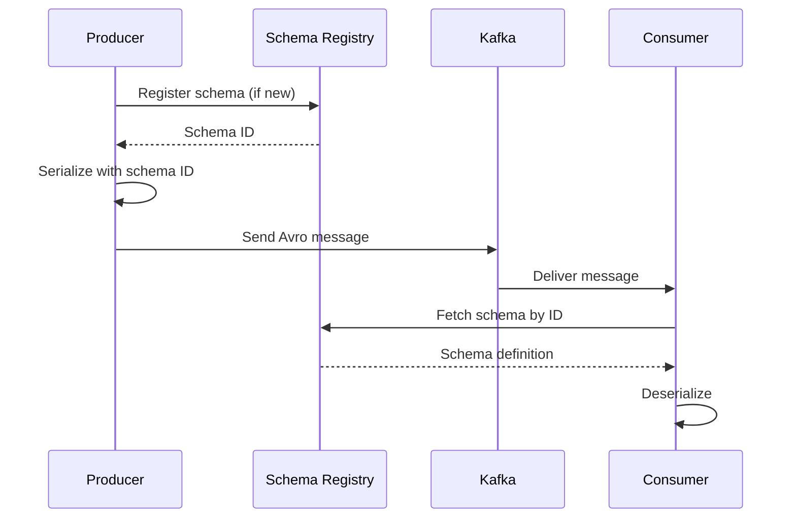
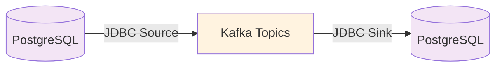
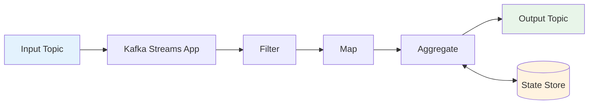

# Data Flow

## Producer Flow

## Consumer Flow

## Schema Registry Flow

## Kafka Connect Flow

## Kafka Streams Flow

## Next Steps

- [System Design](system-design.md) - Overall architecture
- [Container Architecture](container-architecture.md) - Docker/Kubernetes
