# System Architecture

## Overview

The Kafka Training platform is a container-first environment designed to teach Apache Kafka concepts through hands-on practice with pure APIs and CLI tools.

!!! tip "Platform Architecture"
    The architecture supports **both learning tracks**: pure Kafka fundamentals (recommended for data engineers) and Spring Boot integration (optional for Java developers).

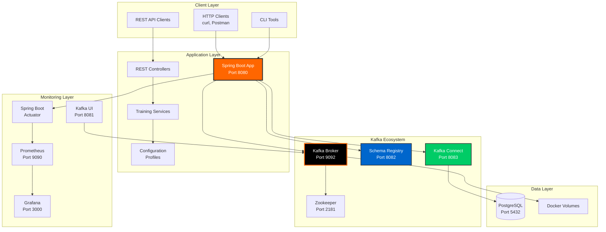

## Architecture Principles

### 1. Container-First Design

All components run in Docker containers for:

- **Development-Production Parity** - Same environment everywhere
- **Easy Onboarding** - `docker-compose up` and you're ready
- **Isolated Dependencies** - No version conflicts
- **Testability** - TestContainers for integration tests

### 2. Event-Driven Architecture

Built on Kafka event streaming:

- **Event Sourcing** - All state changes as events
- **Asynchronous Communication** - Decoupled services
- **Real-time Processing** - Kafka Streams for analytics
- **Scalable** - Partition-based parallelism

### 3. Microservices-Ready

Designed for distributed systems:

- **Independent Deployment** - Each service containerized
- **API-First** - REST endpoints for all operations
- **Resilient** - Circuit breakers and retries
- **Observable** - Comprehensive monitoring

### 4. Cloud-Native

Production-ready from day one:

- **Kubernetes Deployment** - HPA, health checks, secrets
- **Horizontal Scaling** - Stateless design
- **Health Checks** - Startup, liveness, readiness probes
- **Configuration Management** - Spring profiles, ConfigMaps

## Component Architecture

### Spring Boot Application

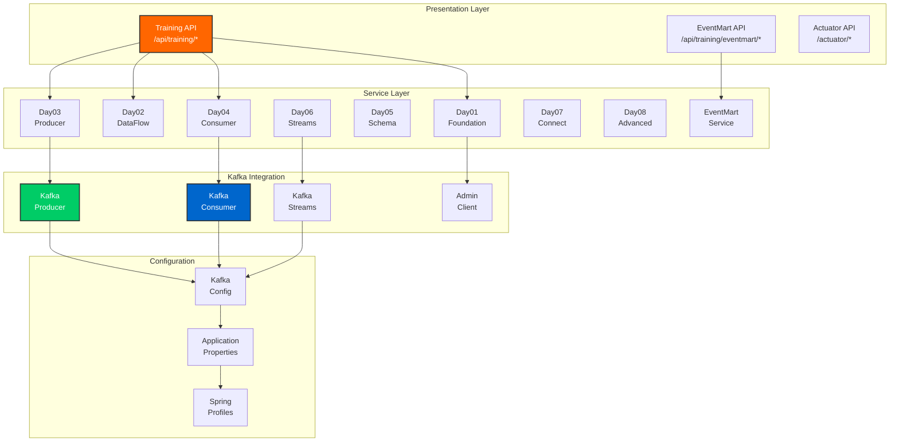

### Kafka Cluster Architecture

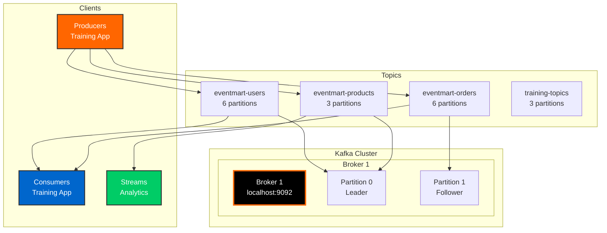

## Data Flow Patterns

### EventMart Data Flow

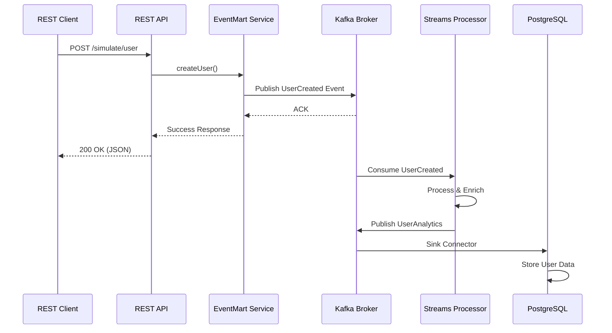

### Training Module Flow

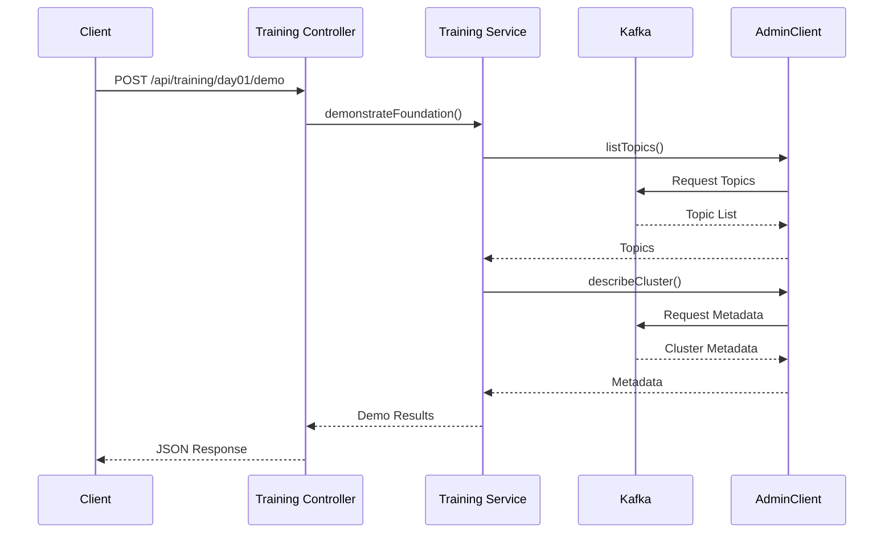

## Container Network Architecture

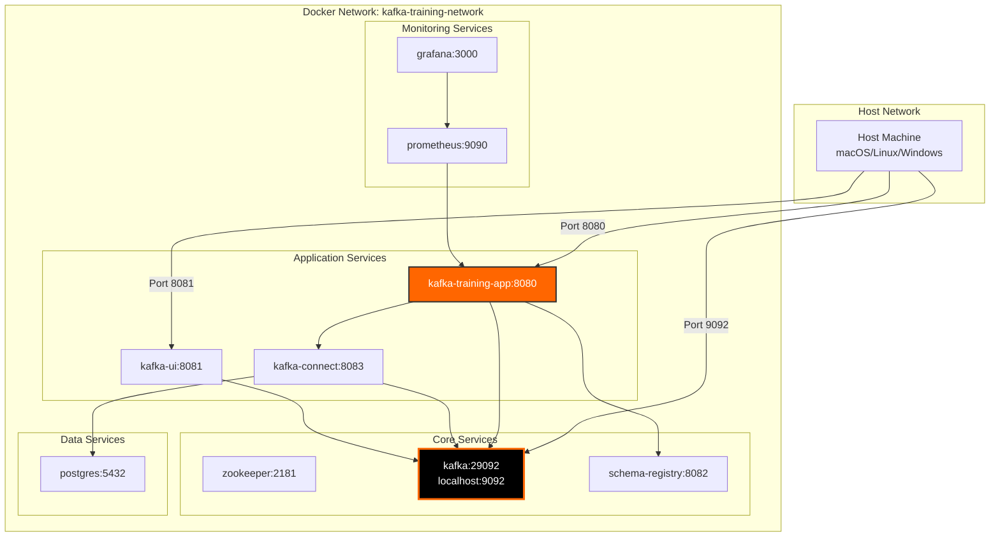

## Technology Stack

### Backend

| Component | Technology | Version | Purpose |
|-----------|-----------|---------|---------|
| **Framework** | Spring Boot | 2.7.18 | Application framework |
| **Kafka Client** | Apache Kafka | 3.8.0 | Event streaming |
| **Schema Registry** | Confluent | 7.7.0 | Schema management |
| **Serialization** | Apache Avro | 1.12.0 | Data serialization |
| **Database** | PostgreSQL | 15 | Data persistence |
| **Build Tool** | Maven | 3.8+ | Build automation |

### Container Platform

| Component | Technology | Purpose |
|-----------|-----------|---------|
| **Runtime** | Docker | Container runtime |
| **Orchestration** | Docker Compose | Local orchestration |
| **Testing** | TestContainers | Integration testing |
| **Production** | Kubernetes | Production orchestration |
| **Monitoring** | Prometheus | Metrics collection |
| **Visualization** | Grafana | Metrics dashboards |

### Development Tools

| Tool | Purpose |
|------|---------|
| **Spring Boot DevTools** | Hot reload |
| **Spring Boot Actuator** | Health checks & metrics |
| **Kafka UI** | Visual management |
| **Maven** | Build & dependency management |

## Deployment Architectures

### Local Development

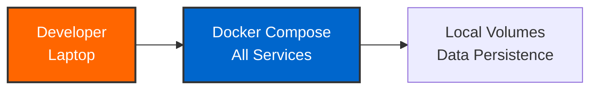

### Kubernetes Production

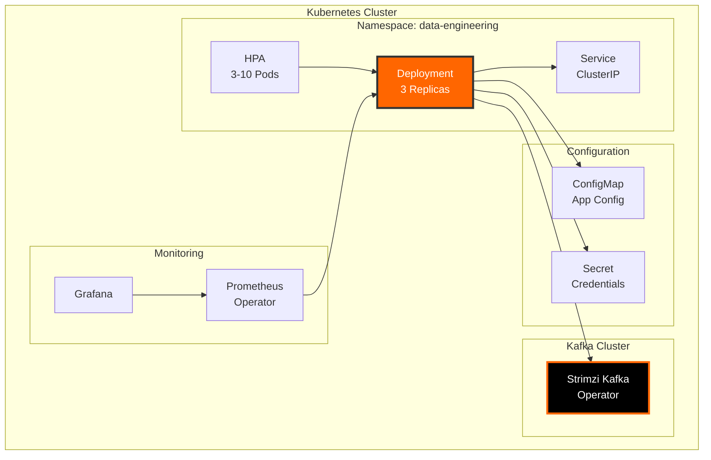

## Security Architecture

### Authentication & Authorization

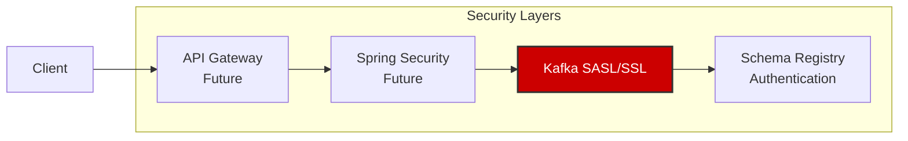

!!! note "Current Security"
    The training environment runs without authentication for simplicity. For production:

    - Enable Spring Security
    - Configure Kafka SSL/SASL
    - Use Kubernetes Secrets
    - Implement API authentication

## Scalability & Performance

### Horizontal Scaling

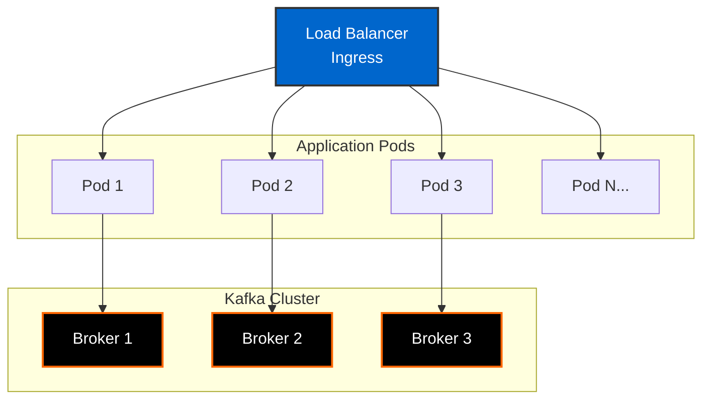

### Performance Characteristics

| Metric | Development | Production |
|--------|-------------|------------|
| **Throughput** | 10K msg/sec | 100K+ msg/sec |
| **Latency** | <100ms | <10ms |
| **Consumers** | 1-3 | Auto-scaled |
| **Partitions** | 3-6 | 12+ |
| **Replication** | 1 | 3 |

## Monitoring & Observability

### Metrics Collection

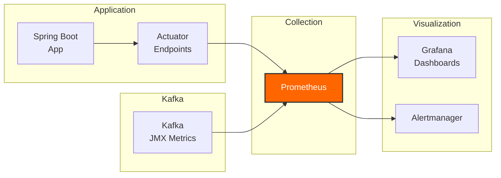

### Key Metrics

- **Application Metrics**: Request rate, error rate, latency
- **Kafka Metrics**: Message rate, consumer lag, partition distribution
- **JVM Metrics**: Memory usage, GC pauses, thread count
- **Container Metrics**: CPU, memory, network I/O

## Related Topics

<a href="system-design/"><strong>System Design</strong></a> 
Detailed design decisions and patterns

<a href="tech-stack/"><strong>Technology Stack</strong></a> 
Deep dive into technologies used

<a href="data-flow/"><strong>Data Flow</strong></a> 
Event flow and processing patterns

<a href="security/"><strong>Security</strong></a> 
Security architecture and best practices

---

Explore detailed architecture topics or proceed to [Deployment Guide](../deployment/deployment-guide/)
