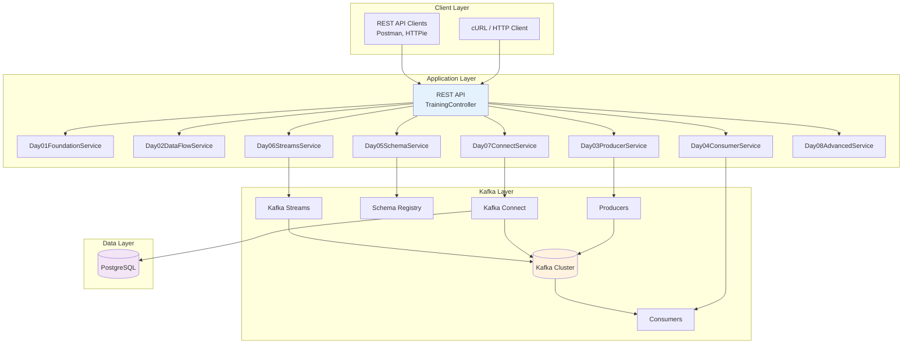
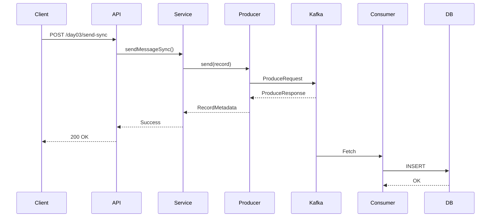

# System Design

## Architecture Overview

The Kafka Training application is a Spring Boot application demonstrating real-world Kafka patterns for data engineers.

## Component Responsibilities

### REST API Layer
- **TrainingController** - Exposes 40+ endpoints for training exercises
- Request validation
- Response formatting
- Error handling

### Service Layer
- **Day01-Day08 Services** - Implements Kafka patterns
- Producer operations
- Consumer management
- Schema Registry integration
- Streams processing
- Connect configuration

### Kafka Layer
- **Producers** - Send messages to topics
- **Consumers** - Process messages from topics
- **Schema Registry** - Manage Avro schemas
- **Kafka Connect** - Data integration (PostgreSQL ↔ Kafka)
- **Kafka Streams** - Real-time processing

### Data Layer
- **PostgreSQL** - EventMart database
- Order, customer, product tables
- Kafka Connect source/sink

## Data Flow

## Next Steps

- [Technology Stack](tech-stack.md) - Technologies used
- [Data Flow](data-flow.md) - Detailed data flows
- [Container Architecture](container-architecture.md) - Docker/Kubernetes design
