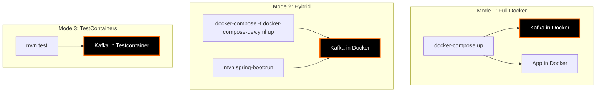

# Container Development Workflow

## Overview

This guide demonstrates the development workflow using Docker Compose for local Kafka development.

## Development Modes

The Kafka Training project supports three development modes:



### Mode 1: Full Docker Stack

Everything runs in Docker. Best for consistent environment.

```bash
# Start complete stack
docker-compose up -d

# View logs
docker-compose logs -f app

# Rebuild and restart
docker-compose up -d --build app
```

**Pros:**
- Production parity
- Consistent environment
- Easy to share

**Cons:**
- Slower rebuild cycle
- No hot reload
- Limited debugging

### Mode 2: Hybrid Development (Recommended)

Kafka runs in Docker, application runs locally. Best for development.

```bash
# Start Kafka infrastructure only
docker-compose -f docker-compose-dev.yml up -d

# Run application locally
mvn spring-boot:run -Dspring-boot.run.profiles=dev

# Or in IDE
# Right-click Application.java > Run
```

**Pros:**
- Fast feedback loop
- Hot reload with Spring DevTools
- IDE debugging
- Access to all IDE features

**Cons:**
- Requires local JDK
- Different from production

### Mode 3: TestContainers

Kafka starts automatically in tests. Best for testing.

```bash
# Run tests (Kafka starts automatically)
mvn test

# Run specific test
mvn test -Dtest=Day01FoundationTest
```

**Pros:**
- No manual setup
- Isolated test environment
- CI/CD friendly

**Cons:**
- Slower test startup
- Requires Docker

## docker-compose-dev.yml

Configuration for hybrid development:

```yaml
version: '3.8'

services:
  zookeeper:
    image: confluentinc/cp-zookeeper:7.5.0
    hostname: zookeeper
    container_name: kafka-training-zookeeper
    ports:
      - "2181:2181"
    environment:
      ZOOKEEPER_CLIENT_PORT: 2181
      ZOOKEEPER_TICK_TIME: 2000
    volumes:
      - zookeeper-data:/var/lib/zookeeper/data
      - zookeeper-logs:/var/lib/zookeeper/log

  kafka:
    image: confluentinc/cp-kafka:7.5.0
    hostname: kafka
    container_name: kafka-training-kafka
    depends_on:
      - zookeeper
    ports:
      - "9092:9092"
      - "9093:9093"
      - "9999:9999"
    environment:
      KAFKA_BROKER_ID: 1
      KAFKA_ZOOKEEPER_CONNECT: zookeeper:2181
      KAFKA_LISTENER_SECURITY_PROTOCOL_MAP: PLAINTEXT:PLAINTEXT,PLAINTEXT_HOST:PLAINTEXT
      KAFKA_ADVERTISED_LISTENERS: PLAINTEXT://kafka:29092,PLAINTEXT_HOST://localhost:9092
      KAFKA_OFFSETS_TOPIC_REPLICATION_FACTOR: 1
      KAFKA_TRANSACTION_STATE_LOG_MIN_ISR: 1
      KAFKA_TRANSACTION_STATE_LOG_REPLICATION_FACTOR: 1
      KAFKA_GROUP_INITIAL_REBALANCE_DELAY_MS: 0
      KAFKA_AUTO_CREATE_TOPICS_ENABLE: 'true'
      KAFKA_JMX_PORT: 9999
      KAFKA_JMX_HOSTNAME: localhost
    volumes:
      - kafka-data:/var/lib/kafka/data

  schema-registry:
    image: confluentinc/cp-schema-registry:7.5.0
    hostname: schema-registry
    container_name: kafka-training-schema-registry
    depends_on:
      - kafka
    ports:
      - "8082:8081"
    environment:
      SCHEMA_REGISTRY_HOST_NAME: schema-registry
      SCHEMA_REGISTRY_KAFKASTORE_BOOTSTRAP_SERVERS: kafka:29092
      SCHEMA_REGISTRY_LISTENERS: http://0.0.0.0:8081

  kafka-ui:
    image: provectuslabs/kafka-ui:latest
    container_name: kafka-training-ui
    depends_on:
      - kafka
      - schema-registry
    ports:
      - "8081:8080"
    environment:
      KAFKA_CLUSTERS_0_NAME: local
      KAFKA_CLUSTERS_0_BOOTSTRAPSERVERS: kafka:29092
      KAFKA_CLUSTERS_0_SCHEMAREGISTRY: http://schema-registry:8081

  postgres:
    image: postgres:15-alpine
    container_name: kafka-training-postgres
    ports:
      - "5432:5432"
    environment:
      POSTGRES_DB: eventmart
      POSTGRES_USER: eventmart_user
      POSTGRES_PASSWORD: eventmart_pass
    volumes:
      - postgres-data:/var/lib/postgresql/data
      - ./scripts/init-db.sql:/docker-entrypoint-initdb.d/init.sql

volumes:
  zookeeper-data:
  zookeeper-logs:
  kafka-data:
  postgres-data:

networks:
  default:
    name: kafka-training-network
```

## Local Development Workflow

### Step 1: Start Infrastructure

```bash
# Start Kafka infrastructure
docker-compose -f docker-compose-dev.yml up -d

# Verify services are running
docker-compose -f docker-compose-dev.yml ps

# View logs
docker-compose -f docker-compose-dev.yml logs -f
```

Expected output:
```
NAME                              STATUS    PORTS
kafka-training-kafka              Up        0.0.0.0:9092->9092/tcp
kafka-training-zookeeper          Up        0.0.0.0:2181->2181/tcp
kafka-training-schema-registry    Up        0.0.0.0:8082->8081/tcp
kafka-training-ui                 Up        0.0.0.0:8081->8080/tcp
kafka-training-postgres           Up        0.0.0.0:5432->5432/tcp
```

### Step 2: Configure Application

**application-dev.properties:**

```properties
# Kafka Configuration
spring.kafka.bootstrap-servers=localhost:9092
spring.kafka.properties.schema.registry.url=http://localhost:8082

# Database Configuration
spring.datasource.url=jdbc:postgresql://localhost:5432/eventmart
spring.datasource.username=eventmart_user
spring.datasource.password=eventmart_pass

# Development Settings
spring.devtools.restart.enabled=true
spring.devtools.livereload.enabled=true
logging.level.com.kafkatraining=DEBUG
```

### Step 3: Run Application Locally

**Using Maven:**

```bash
mvn spring-boot:run -Dspring-boot.run.profiles=dev
```

**Using IDE (IntelliJ IDEA):**

1. Right-click `Application.java`
2. Select "Run 'Application'"
3. Edit Run Configuration
4. Set Active Profiles: `dev`
5. Run

**Using IDE (VS Code):**

1. Open `Application.java`
2. Click "Run" above `main()` method
3. Select "Java" as debugger
4. Set `SPRING_PROFILES_ACTIVE=dev` in launch.json

### Step 4: Develop with Hot Reload

**Add Spring DevTools:**

```xml
<dependency>
    <groupId>org.springframework.boot</groupId>
    <artifactId>spring-boot-devtools</artifactId>
    <scope>runtime</scope>
    <optional>true</optional>
</dependency>
```

**IntelliJ IDEA Settings:**

1. File → Settings → Build, Execution, Deployment → Compiler
2. Enable "Build project automatically"
3. Enable "Allow auto-make to start even if developed application is currently running"

**Changes trigger automatic restart:**
- Java file changes
- Configuration changes
- Resources changes

### Step 5: Test Changes

```bash
# Make code changes
# Application automatically restarts

# Test REST endpoint
curl http://localhost:8080/api/training/day01/demo

# View logs
# Application console shows restart and new requests
```

## Debugging

### Debug Application in IDE

**IntelliJ IDEA:**

1. Set breakpoints in code
2. Right-click `Application.java`
3. Select "Debug 'Application'"
4. Application starts in debug mode
5. Trigger endpoint, execution pauses at breakpoint

**VS Code:**

1. Set breakpoints
2. Open Run and Debug panel (Ctrl+Shift+D)
3. Select "Java" configuration
4. Press F5 to start debugging

### Debug Kafka Container

```bash
# View Kafka logs
docker-compose -f docker-compose-dev.yml logs -f kafka

# Shell into Kafka container
docker-compose -f docker-compose-dev.yml exec kafka bash

# List topics
docker-compose -f docker-compose-dev.yml exec kafka \
  kafka-topics --bootstrap-server localhost:9092 --list

# Consume messages
docker-compose -f docker-compose-dev.yml exec kafka \
  kafka-console-consumer \
  --bootstrap-server localhost:9092 \
  --topic user-events \
  --from-beginning

# Describe consumer group
docker-compose -f docker-compose-dev.yml exec kafka \
  kafka-consumer-groups \
  --bootstrap-server localhost:9092 \
  --describe --group my-group
```

### Debug Database

```bash
# Connect to PostgreSQL
docker-compose -f docker-compose-dev.yml exec postgres \
  psql -U eventmart_user -d eventmart

# View tables
\dt

# Query data
SELECT * FROM users LIMIT 10;

# View logs
docker-compose -f docker-compose-dev.yml logs -f postgres
```

## Environment Variables

### Development Environment

```bash
# .env.dev
SPRING_PROFILES_ACTIVE=dev
KAFKA_BOOTSTRAP_SERVERS=localhost:9092
DATABASE_URL=jdbc:postgresql://localhost:5432/eventmart
LOG_LEVEL=DEBUG
```

### Load Environment Variables

```bash
# Export to shell
export $(cat .env.dev | xargs)

# Run with env file
docker-compose --env-file .env.dev -f docker-compose-dev.yml up -d

# Run Spring Boot with env file
source .env.dev && mvn spring-boot:run
```

## Common Development Tasks

### Reset Kafka State

```bash
# Stop services
docker-compose -f docker-compose-dev.yml down

# Remove volumes (deletes all data)
docker-compose -f docker-compose-dev.yml down -v

# Start fresh
docker-compose -f docker-compose-dev.yml up -d
```

### View Kafka UI

```bash
# Start services
docker-compose -f docker-compose-dev.yml up -d

# Open browser
open http://localhost:8081
```

Features:
- View topics and messages
- Monitor consumer groups
- View schemas in Schema Registry
- Create and configure topics

### Manual Testing Workflow

```bash
# 1. Start infrastructure
docker-compose -f docker-compose-dev.yml up -d

# 2. Run application
mvn spring-boot:run -Dspring-boot.run.profiles=dev

# 3. Run Day 1 demo
curl -X POST http://localhost:8080/api/training/day01/demo

# 4. List topics
docker-compose -f docker-compose-dev.yml exec kafka \
  kafka-topics --bootstrap-server localhost:9092 --list

# 5. Produce test message
curl -X POST http://localhost:8080/api/training/day03/send-async \
  -H "Content-Type: application/json" \
  -d '{"topic":"test","key":"key1","message":"Hello Kafka"}'

# 6. Consume messages
docker-compose -f docker-compose-dev.yml exec kafka \
  kafka-console-consumer \
  --bootstrap-server localhost:9092 \
  --topic test \
  --from-beginning \
  --max-messages 10
```

## Troubleshooting

### Port Already in Use

```bash
# Find process using port 9092
lsof -i :9092

# Kill process
kill -9 <PID>

# Or use different port
docker-compose -f docker-compose-dev.yml down
# Edit docker-compose-dev.yml to change port
docker-compose -f docker-compose-dev.yml up -d
```

### Kafka Won't Start

```bash
# Check logs
docker-compose -f docker-compose-dev.yml logs kafka

# Common issues:
# 1. ZooKeeper not ready - wait and retry
# 2. Port conflict - check ports
# 3. Volume corruption - remove volumes
docker-compose -f docker-compose-dev.yml down -v
docker-compose -f docker-compose-dev.yml up -d
```

### Application Can't Connect to Kafka

```bash
# Verify Kafka is accessible
telnet localhost 9092

# Check Kafka listeners
docker-compose -f docker-compose-dev.yml exec kafka \
  kafka-broker-api-versions --bootstrap-server localhost:9092

# Verify application.properties
# Should use: spring.kafka.bootstrap-servers=localhost:9092
# NOT: spring.kafka.bootstrap-servers=kafka:29092 (Docker internal)
```

### Hot Reload Not Working

**IntelliJ IDEA:**
```
1. Enable "Build project automatically" in Settings
2. Enable compiler.automake.allow.when.app.running
3. Restart IDE
```

**Check DevTools:**
```xml
<!-- Verify in pom.xml -->
<dependency>
    <groupId>org.springframework.boot</groupId>
    <artifactId>spring-boot-devtools</artifactId>
    <scope>runtime</scope>
</dependency>
```

## IDE Integration

### IntelliJ IDEA

**Run Configuration:**

1. Run → Edit Configurations
2. Add new Application configuration
3. Main class: `com.kafkatraining.KafkaTrainingApplication`
4. VM options: `-Dspring.profiles.active=dev`
5. Environment variables: From `.env.dev`
6. Working directory: Project root

**Docker Integration:**

1. View → Tool Windows → Services
2. Add Docker connection
3. View and manage containers
4. View logs in IDE

### VS Code

**launch.json:**

```json
{
  "version": "0.2.0",
  "configurations": [
    {
      "type": "java",
      "name": "Kafka Training (Dev)",
      "request": "launch",
      "mainClass": "com.kafkatraining.KafkaTrainingApplication",
      "projectName": "kafka-training-java",
      "args": "",
      "env": {
        "SPRING_PROFILES_ACTIVE": "dev"
      },
      "envFile": "${workspaceFolder}/.env.dev"
    }
  ]
}
```

**Docker Extension:**

1. Install Docker extension
2. View containers in sidebar
3. Right-click containers for logs/shell
4. Manage containers from IDE

## Best Practices

!!! tip "Development Tips"
    1. **Use hybrid mode** for fast development cycles
    2. **Enable DevTools** for hot reload
    3. **Use .env files** for configuration
    4. **Keep infrastructure running** between sessions
    5. **Use Kafka UI** for visual inspection
    6. **Test with TestContainers** for CI/CD
    7. **Monitor logs** in separate terminal
    8. **Use meaningful topic names** for debugging
    9. **Clean up regularly** to free resources
    10. **Document custom configurations**

## Performance Tips

```bash
# Allocate more memory to Docker
# Docker Desktop → Settings → Resources → Memory: 8GB+

# Use Docker BuildKit for faster builds
export DOCKER_BUILDKIT=1

# Prune unused resources
docker system prune -f

# Use volume mounts for node_modules (if using Node.js tools)
# Avoids copying large directories
```

## Next Steps

- Learn about [TestContainers Testing](testcontainers.md)
- Review [Container Best Practices](best-practices.md)
- Explore [Production Deployment](../deployment/deployment-guide.md)

## Resources

- [Spring Boot DevTools](https://docs.spring.io/spring-boot/docs/current/reference/html/using.html#using.devtools)
- [Docker Compose](https://docs.docker.com/compose/)
- [Kafka UI](https://github.com/provectus/kafka-ui)
