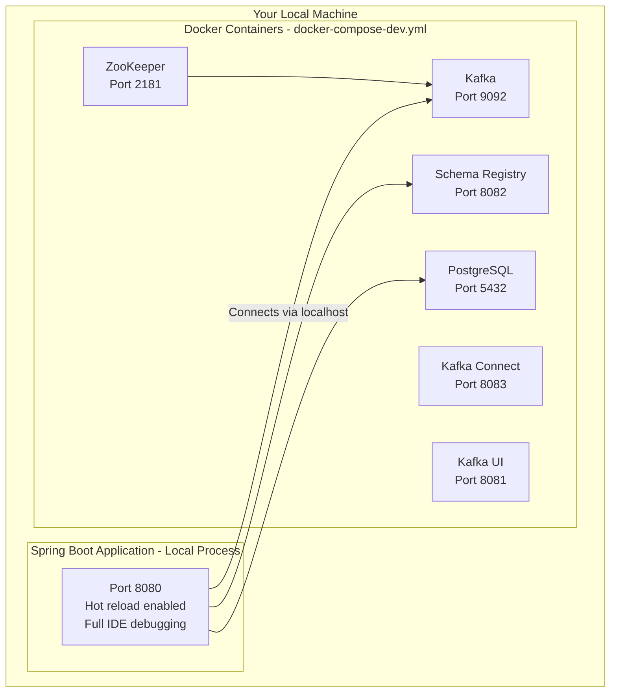
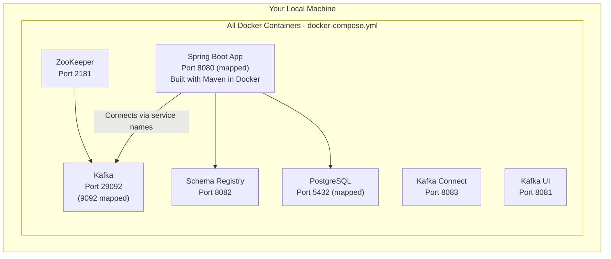

# Docker Compose Development Workflow

!!! info "Training Track Information"
    **Applicable to**: Platform-agnostic track, Spring Boot track

    Docker Compose works with any Kafka client (Java, Python, Node.js, Go) and is framework-independent.

!!! tip "Quick Start for Java Developers"
    Use `docker-compose-dev.yml` for the fastest development experience:

    ```bash
    # Terminal 1: Start Kafka infrastructure
    docker-compose -f docker-compose-dev.yml up -d

    # Terminal 2: Run Spring Boot locally
    mvn spring-boot:run
    ```

    Ready to code in under 1 minute with hot reload enabled.

## Overview

Docker Compose provides a declarative way to define and run multi-container applications. This project includes two Docker Compose configurations optimized for different workflows:

- **`docker-compose-dev.yml`**: Infrastructure-only setup for fast local development
- **`docker-compose.yml`**: Full-stack containerized environment for integration testing

This guide focuses on the Java/Spring Boot development workflow. For Python developers, both configurations work equally well with local Python development.

## Architecture Overview

### Development Mode Architecture



**Performance**: Startup approximately 50 seconds, code reload 2-3 seconds

### Full Stack Mode Architecture



**Performance**: First startup 3-5 minutes (Maven build), subsequent starts 1-2 minutes, code rebuild 1-2 minutes

## Core Concepts

### Services

Each service in `docker-compose.yml` represents a container:

```yaml
services:
  zookeeper:
    image: confluentinc/cp-zookeeper:7.7.0
    environment:
      ZOOKEEPER_CLIENT_PORT: 2181

  kafka:
    image: confluentinc/cp-kafka:7.7.0
    depends_on:
      - zookeeper
    ports:
      - "9092:9092"
```

### Networks

Docker Compose creates a default network for service communication:

```yaml
networks:
  kafka-training-network:
    driver: bridge
```

Services communicate using service names as hostnames (e.g., `kafka:29092`).

### Volumes

Persist data across container restarts:

```yaml
volumes:
  kafka-data:/var/lib/kafka/data
  postgres-data:/var/lib/postgresql/data
```

## Choosing the Right Workflow

### Decision Matrix

| Scenario | Recommended Approach | File to Use |
|----------|---------------------|-------------|
| Daily development and coding | Development Mode | `docker-compose-dev.yml` |
| Days 1-7 training exercises | Development Mode | `docker-compose-dev.yml` |
| Debugging in IDE | Development Mode | `docker-compose-dev.yml` |
| Testing code changes rapidly | Development Mode | `docker-compose-dev.yml` |
| Day 8 deployment exercises | Full Stack Mode | `docker-compose.yml` |
| Production environment simulation | Full Stack Mode | `docker-compose.yml` |
| CI/CD pipeline testing | Full Stack Mode | `docker-compose.yml` |
| Sharing complete environment | Full Stack Mode | `docker-compose.yml` |

### Quick Comparison

| Aspect | Development Mode | Full Stack Mode |
|--------|-----------------|-----------------|
| **File** | `docker-compose-dev.yml` | `docker-compose.yml` |
| **Spring Boot Location** | Runs locally on your machine | Runs in Docker container |
| **First Startup** | 30-50 seconds | 3-5 minutes |
| **Subsequent Startups** | 30-50 seconds | 1-2 minutes |
| **Code Changes** | Auto-reload in 2-3 seconds | Rebuild required (1-2 minutes) |
| **IDE Debugging** | Full support | Limited (container debugging) |
| **Hot Reload** | Yes (Spring DevTools) | No |
| **Use Case** | Fast iteration | Integration testing |

## Development Mode (Recommended)

This is the **recommended approach for 95% of development work**. It runs Kafka infrastructure in Docker while your Spring Boot application runs locally, giving you the best of both worlds.

### What Runs Where

**In Docker containers:**

- Kafka and ZooKeeper (message broker)
- Schema Registry (Avro schema management)
- PostgreSQL (database)
- Kafka Connect (data integration)
- Kafka UI (web-based management)

**On your local machine:**

- Spring Boot application (your training code)
- IDE (IntelliJ IDEA, VS Code, etc.)
- Debugging tools with hot reload

### Getting Started

#### Step 1: Start Infrastructure

```bash
# Start all Kafka infrastructure
docker-compose -f docker-compose-dev.yml up -d

# Verify services are running
docker-compose -f docker-compose-dev.yml ps
```

Expected output:
```
NAME                            STATUS          PORTS
kafka-training-kafka            Up (healthy)    0.0.0.0:9092->9092/tcp
kafka-training-zookeeper        Up              0.0.0.0:2181->2181/tcp
kafka-training-schema-registry  Up (healthy)    0.0.0.0:8082->8082/tcp
kafka-training-postgres         Up (healthy)    0.0.0.0:5432->5432/tcp
kafka-training-kafka-connect    Up (healthy)    0.0.0.0:8083->8083/tcp
kafka-training-kafka-ui         Up              0.0.0.0:8081->8080/tcp
```

#### Step 2: Run Spring Boot Locally

```bash
# Run with Maven (includes hot reload)
mvn spring-boot:run

# Or use your IDE's run configuration
# - IntelliJ: Right-click on KafkaTrainingApplication.java -> Run
# - VS Code: Use Spring Boot Dashboard
```

#### Step 3: Verify Application

```bash
# Check application health
curl http://localhost:8080/actuator/health

# Access web UI
open http://localhost:8080

# Access Kafka UI
open http://localhost:8081
```

### Development Workflow

Typical development cycle:

1. Edit Java code in your IDE
2. Save the file (Ctrl+S or Cmd+S)
3. Spring DevTools automatically reloads in 2-3 seconds
4. Test your changes immediately

No restart required.

### Why This Is Faster

Development mode significantly reduces iteration time compared to full stack mode:

**Full Stack Mode:**
- Code change → Rebuild Docker image (1-2 min) → Restart container → Test
- Total: 1-2 minutes per change

**Development Mode:**
- Code change → Spring DevTools reload (2-3 sec) → Test
- Total: 2-3 seconds per change

This provides 20-40x faster iteration during development.

### Configuration

The Spring Boot application automatically uses `localhost` for all service connections when running outside Docker:

```properties
# application.properties (default profile)
spring.kafka.bootstrap-servers=localhost:9092
spring.kafka.properties.schema.registry.url=http://localhost:8082
spring.datasource.url=jdbc:postgresql://localhost:5432/eventmart
```

No configuration changes are required.

## Full Stack Mode

This approach runs everything in Docker containers, including the Spring Boot application. Use this for integration testing, CI/CD pipelines, and production-like environments.

### What Runs Where

Everything runs in Docker containers:

- Kafka and ZooKeeper
- Schema Registry
- PostgreSQL
- Kafka Connect
- Kafka UI
- Spring Boot application (built with Maven)

### Getting Started

```bash
# Build and start everything
docker-compose up -d

# View build progress (first time)
docker-compose logs -f kafka-training-app
```

### Understanding the Build Time

The first build takes 3-5 minutes. Here is what happens:

**Phase 1: Dependency Download (1-2 minutes first time)**

Maven downloads approximately 150 dependencies from Maven Central including Spring Boot, Kafka clients, PostgreSQL drivers, and testing frameworks. Docker caches these dependencies, so subsequent builds skip this step unless `pom.xml` changes.

**Phase 2: Compilation (30-60 seconds)**

Maven compiles all Java source files including training modules, service layers, REST controllers, and configuration classes.

**Phase 3: Packaging (15-30 seconds)**

Maven packages everything into a Spring Boot executable JAR with compiled classes, application properties, static resources, and embedded Tomcat server.

**Phase 4: Docker Image Creation (15-30 seconds)**

Docker creates the final runtime image by copying the JAR, setting up the JVM environment, configuring health checks, and applying security settings.

**Build Times:**
- First build: 3-5 minutes
- Subsequent builds: 1-2 minutes (when only Java code changes)
- Subsequent builds: 3-5 minutes (when `pom.xml` changes)

### Build Time Optimization

The Dockerfile uses multi-stage builds and BuildKit caching for optimal performance:

```dockerfile
# Cache Maven dependencies separately from source code
COPY pom.xml .
RUN mvn dependency:go-offline -B

# Only rebuild if source changes
COPY src ./src
RUN mvn clean package -DskipTests -B
```

To enable faster builds, use BuildKit:

```bash
# Enable BuildKit (faster builds)
export DOCKER_BUILDKIT=1
docker-compose build

# Or inline
DOCKER_BUILDKIT=1 docker-compose up -d --build
```

### When to Use Full Stack Mode

Use full stack mode for:

1. Day 8 exercises (deployment, monitoring, and production topics)
2. Integration testing (testing the complete system as it runs in production)
3. CI/CD pipelines (automated testing in GitHub Actions, Jenkins, etc.)
4. Environment sharing (providing a complete, reproducible environment to team members)
5. Production simulation (testing with production-like configuration)

Avoid full stack mode for:

1. Daily coding and debugging (too slow for rapid iteration)
2. Days 1-7 training material (development mode is faster)
3. Frequent code changes (rebuild time adds up)

### Configuration

The Spring Boot application uses the `docker` profile when running in containers:

```yaml
# docker-compose.yml excerpt
environment:
  SPRING_PROFILES_ACTIVE: docker
  KAFKA_BOOTSTRAP_SERVERS: kafka:29092
  SPRING_DATASOURCE_URL: jdbc:postgresql://postgres:5432/eventmart
```

```properties
# application-docker.properties
spring.kafka.bootstrap-servers=kafka:29092
spring.kafka.properties.schema.registry.url=http://schema-registry:8082
spring.datasource.url=jdbc:postgresql://postgres:5432/eventmart
```

The application uses Docker service names (`kafka`, `postgres`) instead of `localhost` for container-to-container communication.

## Side-by-Side Workflow Comparison

### Development Mode Workflow

```bash
# Day 1: Initial setup
docker-compose -f docker-compose-dev.yml up -d    # 30 seconds
mvn spring-boot:run                                # 20 seconds
# Total: 50 seconds

# Day 1-7: Daily work
# 1. Edit code
# 2. Save file
# 3. Auto-reload (2-3 seconds)
# 4. Test
# Repeat hundreds of times per day

# End of day
docker-compose -f docker-compose-dev.yml down      # 5 seconds

# Day 2: Resume work
docker-compose -f docker-compose-dev.yml up -d    # 30 seconds (clean state)
mvn spring-boot:run                                # 20 seconds
# Back to coding in 50 seconds
```

### Full Stack Mode Workflow

```bash
# First time setup
docker-compose up -d                               # 3-5 minutes
# Wait for build to complete...
curl http://localhost:8080/actuator/health         # Verify
# Total: 3-5 minutes

# Make a code change
# Edit src/main/java/com/training/kafka/SomeClass.java
docker-compose up -d --build                       # 1-2 minutes (rebuild)
# Wait...
curl http://localhost:8080/actuator/health         # Verify change
# Total: 1-2 minutes per change

# Subsequent starts (without code changes)
docker-compose down
docker-compose up -d                               # 30 seconds (no rebuild)
```

### Time Investment Analysis

With 50 code changes per day:

**Development Mode:**
- Initial setup: 50 seconds
- 50 changes × 3 seconds = 150 seconds
- Total time: 3 minutes

**Full Stack Mode:**
- Initial setup: 5 minutes
- 50 changes × 90 seconds = 4,500 seconds
- Total time: 80 minutes

Development mode saves 77 minutes per day.

## Development Configuration

The project includes `docker-compose-dev.yml` for local development:

```yaml
version: '3.8'

services:
  zookeeper:
    image: confluentinc/cp-zookeeper:7.7.0
    container_name: kafka-training-zookeeper
    ports:
      - "2181:2181"
    environment:
      ZOOKEEPER_CLIENT_PORT: 2181
      ZOOKEEPER_TICK_TIME: 2000

  kafka:
    image: confluentinc/cp-kafka:7.7.0
    container_name: kafka-training-kafka
    depends_on:
      - zookeeper
    ports:
      - "9092:9092"
      - "9093:9093"
    environment:
      KAFKA_BROKER_ID: 1
      KAFKA_ZOOKEEPER_CONNECT: zookeeper:2181
      KAFKA_ADVERTISED_LISTENERS: PLAINTEXT://kafka:29092,PLAINTEXT_HOST://localhost:9092
      KAFKA_LISTENER_SECURITY_PROTOCOL_MAP: PLAINTEXT:PLAINTEXT,PLAINTEXT_HOST:PLAINTEXT
      KAFKA_OFFSETS_TOPIC_REPLICATION_FACTOR: 1
      KAFKA_AUTO_CREATE_TOPICS_ENABLE: 'true'

  schema-registry:
    image: confluentinc/cp-schema-registry:7.7.0
    container_name: kafka-training-schema-registry
    depends_on:
      - kafka
    ports:
      - "8082:8082"
    environment:
      SCHEMA_REGISTRY_HOST_NAME: schema-registry
      SCHEMA_REGISTRY_KAFKASTORE_BOOTSTRAP_SERVERS: kafka:29092
      SCHEMA_REGISTRY_LISTENERS: http://0.0.0.0:8082

  postgres:
    image: postgres:15-alpine
    container_name: kafka-training-postgres
    ports:
      - "5432:5432"
    environment:
      POSTGRES_DB: eventmart
      POSTGRES_USER: eventmart_user
      POSTGRES_PASSWORD: eventmart_pass
    volumes:
      - postgres-data:/var/lib/postgresql/data

volumes:
  postgres-data:

networks:
  default:
    name: kafka-training-network
```

## Common Commands

### Development Mode Commands

**Starting and stopping:**

```bash
# Start infrastructure
docker-compose -f docker-compose-dev.yml up -d

# Start with logs (troubleshooting)
docker-compose -f docker-compose-dev.yml up

# Stop infrastructure
docker-compose -f docker-compose-dev.yml down

# Stop and clean all data (fresh start)
docker-compose -f docker-compose-dev.yml down -v
```

**Monitoring:**

```bash
# Check service status
docker-compose -f docker-compose-dev.yml ps

# View all logs
docker-compose -f docker-compose-dev.yml logs -f

# View specific service logs
docker-compose -f docker-compose-dev.yml logs -f kafka

# Check Kafka health
docker exec kafka-training-kafka kafka-broker-api-versions --bootstrap-server localhost:9092
```

**Spring Boot (separate process):**

```bash
# Run Spring Boot locally
mvn spring-boot:run

# Run with specific profile
mvn spring-boot:run -Dspring-boot.run.profiles=dev

# Clean and run
mvn clean spring-boot:run
```

### Full Stack Mode Commands

**Starting and stopping:**

```bash
# Build and start everything
docker-compose up -d

# Rebuild and start (after code changes)
docker-compose up -d --build

# Stop everything
docker-compose down

# Stop and clean all data
docker-compose down -v
```

**Monitoring:**

```bash
# Check all services including app
docker-compose ps

# View all logs
docker-compose logs -f

# View Spring Boot app logs
docker-compose logs -f kafka-training-app

# View build logs
docker-compose build --progress=plain

# Check app health
curl http://localhost:8080/actuator/health
```

**Rebuilding:**

```bash
# Rebuild only the app (after code changes)
docker-compose build kafka-training-app

# Rebuild with no cache (clean build)
docker-compose build --no-cache kafka-training-app

# Rebuild everything
docker-compose build
```

## Testing Kafka Setup

### Verify Kafka is Running

```bash
# List topics
docker exec kafka-training-kafka \
  kafka-topics --bootstrap-server localhost:9092 --list

# Create test topic
docker exec kafka-training-kafka \
  kafka-topics --bootstrap-server localhost:9092 \
  --create --topic test --partitions 3 --replication-factor 1

# Produce messages
docker exec -it kafka-training-kafka \
  kafka-console-producer --bootstrap-server localhost:9092 --topic test

# Consume messages
docker exec kafka-training-kafka \
  kafka-console-consumer --bootstrap-server localhost:9092 \
  --topic test --from-beginning
```

### Test Schema Registry

```bash
# Check Schema Registry health
curl http://localhost:8082/subjects

# Register test schema
curl -X POST http://localhost:8082/subjects/test-value/versions \
  -H "Content-Type: application/vnd.schemaregistry.v1+json" \
  -d '{"schema": "{\"type\":\"string\"}"}'
```

### Test PostgreSQL

```bash
# Connect to PostgreSQL
docker exec -it kafka-training-postgres \
  psql -U eventmart_user -d eventmart

# Inside psql
\dt              # List tables
\q               # Quit
```

## Environment Variables

Create `.env` file for environment-specific configuration:

```bash
# .env
KAFKA_VERSION=7.7.0
POSTGRES_PASSWORD=secure_password
SCHEMA_REGISTRY_PORT=8082
```

Reference in `docker-compose.yml`:

```yaml
kafka:
  image: confluentinc/cp-kafka:${KAFKA_VERSION}

postgres:
  environment:
    POSTGRES_PASSWORD: ${POSTGRES_PASSWORD}
```

Load with:

```bash
docker-compose --env-file .env up -d
```

## Production Configuration

For production, use separate `docker-compose.prod.yml`:

```yaml
version: '3.8'

services:
  kafka:
    image: confluentinc/cp-kafka:7.7.0
    restart: unless-stopped
    deploy:
      resources:
        limits:
          memory: 4G
          cpus: '2'
        reservations:
          memory: 2G
          cpus: '1'
    environment:
      KAFKA_HEAP_OPTS: "-Xms2g -Xmx4g"
      KAFKA_JMX_PORT: 9999
    volumes:
      - kafka-data:/var/lib/kafka/data
    healthcheck:
      test: ["CMD", "kafka-broker-api-versions", "--bootstrap-server", "localhost:9092"]
      interval: 10s
      timeout: 5s
      retries: 5

volumes:
  kafka-data:
```

## Troubleshooting

### Common Issues - Development Mode

**Problem: Spring Boot cannot connect to Kafka**

```bash
# 1. Verify infrastructure is running
docker-compose -f docker-compose-dev.yml ps

# 2. Check Kafka is healthy
docker exec kafka-training-kafka kafka-broker-api-versions --bootstrap-server localhost:9092

# 3. Verify Spring Boot is using localhost
# Check application.properties:
# spring.kafka.bootstrap-servers=localhost:9092

# 4. Restart infrastructure
docker-compose -f docker-compose-dev.yml down
docker-compose -f docker-compose-dev.yml up -d
```

**Problem: Port already in use**

```bash
# Find what's using the port
lsof -i :9092    # Kafka
lsof -i :8080    # Spring Boot
lsof -i :5432    # PostgreSQL

# Option 1: Stop conflicting service
# Option 2: Change port in docker-compose-dev.yml
```

**Problem: Hot reload not working**

```bash
# 1. Verify Spring DevTools is in pom.xml
# <dependency>
#   <groupId>org.springframework.boot</groupId>
#   <artifactId>spring-boot-devtools</artifactId>
# </dependency>

# 2. Restart Spring Boot
# Ctrl+C in terminal running mvn spring-boot:run
mvn spring-boot:run

# 3. Check IDE auto-build settings
# IntelliJ: Build > Build Project Automatically
# VS Code: File > Auto Save
```

**Problem: Database connection failed**

```bash
# Verify PostgreSQL is running
docker exec kafka-training-postgres pg_isready -U eventmart_user

# Check logs
docker-compose -f docker-compose-dev.yml logs postgres

# Connect manually to test
docker exec -it kafka-training-postgres psql -U eventmart_user -d eventmart
```

### Common Issues - Full Stack Mode

**Problem: Build takes forever**

```bash
# Normal first build: 3-5 minutes
# If longer, check:

# 1. View build progress
docker-compose build --progress=plain

# 2. Check internet connection (Maven downloads)
# Maven Central must be accessible

# 3. Enable BuildKit for caching
export DOCKER_BUILDKIT=1
docker-compose build

# 4. Clear Docker cache if needed
docker builder prune
```

**Problem: Build fails during dependency download**

```bash
# Maven dependency resolution issues

# 1. Check Maven Central is accessible
curl -I https://repo.maven.apache.org/maven2/

# 2. Clear Maven cache
docker-compose down
docker-compose build --no-cache kafka-training-app

# 3. Check for proxy settings
# Add to Dockerfile if behind corporate proxy:
# ENV MAVEN_OPTS="-Dhttp.proxyHost=proxy.corp.com -Dhttp.proxyPort=8080"
```

**Problem: Application won't start in container**

```bash
# 1. Check app logs
docker-compose logs -f kafka-training-app

# 2. Verify all dependencies are healthy
docker-compose ps
# All services should show "Up (healthy)"

# 3. Check environment variables
docker-compose config

# 4. Verify Spring profile
docker exec kafka-training-application env | grep SPRING_PROFILES_ACTIVE
# Should show: SPRING_PROFILES_ACTIVE=docker

# 5. Test health endpoint
curl http://localhost:8080/actuator/health
```

**Problem: Code changes not reflected**

```bash
# Full stack mode requires rebuild!

# 1. Rebuild the app image
docker-compose build kafka-training-app

# 2. Restart the container
docker-compose up -d kafka-training-app

# Or combine:
docker-compose up -d --build kafka-training-app

# Reminder: Use development mode for fast iteration!
```

### General Troubleshooting

**Kafka will not start**

```bash
# Check ZooKeeper is running first
docker-compose -f docker-compose-dev.yml ps zookeeper

# View Kafka logs
docker-compose -f docker-compose-dev.yml logs kafka

# Restart in correct order
docker-compose -f docker-compose-dev.yml down
docker-compose -f docker-compose-dev.yml up -d zookeeper
sleep 10
docker-compose -f docker-compose-dev.yml up -d kafka
```

**Out of disk space**

```bash
# Check Docker disk usage
docker system df

# Clean up unused resources
docker system prune -a

# Remove unused volumes
docker volume prune

# Nuclear option: remove everything
docker-compose -f docker-compose-dev.yml down -v
docker system prune -a --volumes
```

**Services keep restarting**

```bash
# Check logs for the failing service
docker-compose -f docker-compose-dev.yml logs [service-name]

# Common causes:
# - Out of memory (check with: docker stats)
# - Port conflicts
# - Failed health checks
# - Configuration errors

# Increase health check timing
# Edit docker-compose-dev.yml:
# healthcheck:
#   interval: 30s
#   timeout: 10s
#   retries: 5
#   start_period: 60s
```

**Network issues between containers**

```bash
# Verify network exists
docker network ls | grep kafka-training-network

# Check container network
docker inspect kafka-training-kafka | grep -A 10 Networks

# Recreate network
docker-compose -f docker-compose-dev.yml down
docker network prune
docker-compose -f docker-compose-dev.yml up -d
```

### Getting Help

If you encounter issues not covered here:

1. Check service logs: `docker-compose logs [service-name]`
2. Verify service health: `docker-compose ps`
3. Check Docker resources: `docker stats`
4. Review configuration: `docker-compose config`
5. Search GitHub issues in the project repository
6. Ask for help with logs and `docker-compose ps` output included

## Best Practices

### Development Mode Best Practices

1. **Always start infrastructure before Spring Boot**
    ```bash
    docker-compose -f docker-compose-dev.yml up -d
    # Wait for healthy status
    docker-compose -f docker-compose-dev.yml ps
    # Then start Spring Boot
    mvn spring-boot:run
    ```

2. **Use named containers for easy reference**
    ```bash
    # Easier than remembering UUIDs
    docker logs kafka-training-kafka
    docker exec kafka-training-postgres psql -U eventmart_user -d eventmart
    ```

3. **Clean state between training days**
    ```bash
    # End of day: clean shutdown
    docker-compose -f docker-compose-dev.yml down -v
    # Next day: fresh start
    docker-compose -f docker-compose-dev.yml up -d
    ```

4. **Monitor resource usage**
    ```bash
    # Watch Docker resource consumption
    docker stats
    # Kafka can use significant memory
    ```

5. **Use Kafka UI for debugging**
    ```bash
    # Open Kafka UI in browser
    open http://localhost:8081
    # View topics, messages, consumer groups visually
    ```

### Full Stack Mode Best Practices

1. **Use BuildKit for faster builds**
    ```bash
    export DOCKER_BUILDKIT=1
    docker-compose build
    ```

2. **Leverage layer caching**
    ```dockerfile
    # Don't modify pom.xml unless adding dependencies
    # Changes to pom.xml invalidate Maven cache
    ```

3. **Monitor build progress**
    ```bash
    # See what's happening during long builds
    docker-compose build --progress=plain
    ```

4. **Use health checks**
    ```yaml
    # All services have health checks
    # Wait for healthy status before testing
    docker-compose ps
    ```

5. **Tag images for version control**
    ```bash
    # Tag your builds
    docker tag kafka-training-java-kafka-training-app:latest kafka-training-app:v1.0.0
    ```

### General Best Practices

1. Keep Docker Desktop updated (version 4.0 or higher recommended)
2. Allocate sufficient resources (8GB RAM minimum, 16GB recommended)
3. Use volumes sparingly in development mode (ephemeral data is cleaner for training)
4. Check logs when things fail (most issues are visible in logs)
5. Clean up regularly using `docker system prune` weekly

## Quick Reference

### Port Mappings

| Service | Container Port | Host Port | URL |
|---------|---------------|-----------|-----|
| Kafka | 29092 (internal) | 9092 | localhost:9092 |
| ZooKeeper | 2181 | 2181 | localhost:2181 |
| Schema Registry | 8082 | 8082 | http://localhost:8082 |
| PostgreSQL | 5432 | 5432 | localhost:5432 |
| Kafka Connect | 8083 | 8083 | http://localhost:8083 |
| Kafka UI | 8080 | 8081 | http://localhost:8081 |
| Spring Boot App | 8080 | 8080 | http://localhost:8080 |

### Environment URLs

**Development Mode (Spring Boot local):**

- Spring Boot: http://localhost:8080
- Kafka: localhost:9092
- PostgreSQL: localhost:5432
- Schema Registry: http://localhost:8082
- Kafka UI: http://localhost:8081

**Full Stack Mode (everything in Docker):**

- Spring Boot: http://localhost:8080 (mapped from container)
- Kafka: kafka:29092 (from app container), localhost:9092 (from host)
- PostgreSQL: postgres:5432 (from app container), localhost:5432 (from host)
- Schema Registry: http://schema-registry:8082 (from app container)
- Kafka UI: http://localhost:8081

### Common File Locations

| Purpose | Path |
|---------|------|
| Main compose file | `/docker-compose.yml` |
| Dev compose file | `/docker-compose-dev.yml` |
| Dockerfile | `/Dockerfile` |
| Default config | `/src/main/resources/application.properties` |
| Docker config | `/src/main/resources/application-docker.properties` |
| PostgreSQL init | `/scripts/init-postgres.sql` |

## Next Steps

### For Daily Development

1. Start with Development Mode using `docker-compose-dev.yml`
2. Complete Days 1-7 training exercises
3. Learn to use Kafka UI for debugging
4. Practice the fast iteration workflow

### For Advanced Topics

1. Try Full Stack Mode for Day 8 exercises
2. Learn about Testcontainers for integration tests
3. Explore Kubernetes deployment in Day 8
4. Study production best practices

### Additional Resources

- [Docker Compose Documentation](https://docs.docker.com/compose/)
- [Confluent Docker Images](https://docs.confluent.io/platform/current/installation/docker/image-reference.html)
- [Spring Boot Docker Guide](https://spring.io/guides/gs/spring-boot-docker/)
- [Testcontainers](https://www.testcontainers.org/)
- [Kafka Documentation](https://kafka.apache.org/documentation/)

---

## Summary

This guide covered two approaches to running the Kafka training environment:

**Development Mode (Recommended):**

- Fastest way to get started
- Hot reload with Spring DevTools
- Full IDE debugging support
- 50-second startup, 2-3 second code reload
- Use `docker-compose-dev.yml`

**Full Stack Mode:**

- Production-like environment
- Complete containerization
- 3-5 minute first build (Maven dependencies)
- 1-2 minute rebuild after code changes
- Use `docker-compose.yml`

**Key Takeaway:** Use Development Mode for 95% of your work during Days 1-7. Switch to Full Stack Mode only when working on Day 8 deployment exercises or when you need to test the complete containerized environment.
