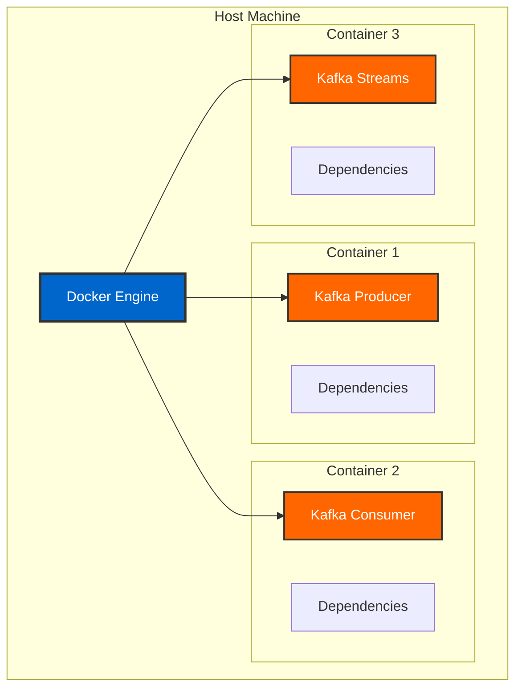

# Docker Basics for Kafka Applications

> **Both Tracks:** This guide covers Docker fundamentals applicable to both Data Engineer and Java Developer tracks. Container concepts work the same whether you're running pure Kafka clients or Spring Boot applications.

## Learning Objectives

After reading this guide, you will understand:

- Docker fundamentals for Kafka development
- Container vs image concepts
- Port mapping and networking
- Volume management and persistence
- Essential Docker commands
- Dockerfile best practices for Kafka applications

## What is Docker?

Docker is a platform for developing, shipping, and running applications in containers.



### Why Docker for Kafka Development?

1. **Consistent Environments** - Same behavior in dev, test, and production
2. **Isolation** - Dependencies don't conflict
3. **Portability** - Run anywhere Docker runs
4. **Reproducibility** - Exact environment specification
5. **Resource Efficiency** - Share host OS kernel
6. **Fast Startup** - Seconds vs minutes for VMs

## Images vs Containers

### Docker Images

An **image** is a read-only template with instructions for creating a container.

```bash
# List images
docker images

# Pull an image
docker pull confluentinc/cp-kafka:7.5.0

# Remove an image
docker rmi confluentinc/cp-kafka:7.5.0

# Build an image
docker build -t kafka-app:latest .

# Tag an image
docker tag kafka-app:latest myregistry/kafka-app:v1.0
```

### Docker Containers

A **container** is a runnable instance of an image.

```bash
# List running containers
docker ps

# List all containers (including stopped)
docker ps -a

# Run a container
docker run -d --name my-kafka confluentinc/cp-kafka:7.5.0

# Stop a container
docker stop my-kafka

# Start a stopped container
docker start my-kafka

# Remove a container
docker rm my-kafka

# Remove all stopped containers
docker container prune
```

### Relationship

```
Image (Template)
    ↓
Container (Running Instance)
    ↓
Modified Container
    ↓
New Image (docker commit)
```

## Port Mapping

Expose container ports to the host machine.

### Syntax

```bash
docker run -p <host-port>:<container-port> image-name
```

### Examples

```bash
# Single port mapping
docker run -p 8080:8080 kafka-app

# Multiple port mappings
docker run \
  -p 9092:9092 \
  -p 9093:9093 \
  -p 9999:9999 \
  confluentinc/cp-kafka:7.5.0

# All interfaces
docker run -p 0.0.0.0:8080:8080 kafka-app

# Random host port
docker run -p 8080 kafka-app

# Map to different host port
docker run -p 8081:8080 kafka-app
```

### Common Kafka Port Mappings

```bash
# Kafka Broker
9092:9092     # Kafka external port
29092:29092   # Kafka internal port (Docker network)

# Kafka Application (CLI or Spring Boot)
8080:8080     # HTTP API (if using REST interface)

# Kafka UI
8081:8080     # Visual Kafka management (web browser)

# Schema Registry
8082:8081     # Schema Registry API

# Kafka Connect
8083:8083     # Connect REST API

# PostgreSQL
5432:5432     # Database

# Prometheus
9090:9090     # Metrics

# Grafana
3000:3000     # Dashboards
```

## Networking

Docker creates virtual networks for container communication.

### Network Types

**Bridge (Default):**
```bash
docker network create kafka-network

docker run --network kafka-network --name zookeeper \
  confluentinc/cp-zookeeper:7.5.0

docker run --network kafka-network --name kafka \
  confluentinc/cp-kafka:7.5.0
```

**Host:**
```bash
# Container uses host network directly
docker run --network host kafka-app
```

**None:**
```bash
# No networking
docker run --network none kafka-app
```

### Network Commands

```bash
# List networks
docker network ls

# Create network
docker network create my-network

# Inspect network
docker network inspect kafka-network

# Connect container to network
docker network connect kafka-network my-container

# Disconnect from network
docker network disconnect kafka-network my-container

# Remove network
docker network rm my-network
```

### Service Discovery

Containers on the same network can communicate using container names:

```bash
# Kafka can connect to ZooKeeper using hostname
KAFKA_ZOOKEEPER_CONNECT=zookeeper:2181

# Application can connect to Kafka using hostname
# Pure Kafka client:
bootstrap.servers=kafka:9092

# Spring Boot application:
SPRING_KAFKA_BOOTSTRAP_SERVERS=kafka:9092
```

## Volumes and Data Persistence

Containers are ephemeral. Volumes persist data.

### Volume Types

**Named Volumes:**
```bash
# Create volume
docker volume create kafka-data

# Use volume
docker run -v kafka-data:/var/lib/kafka/data \
  confluentinc/cp-kafka:7.5.0

# List volumes
docker volume ls

# Inspect volume
docker volume inspect kafka-data

# Remove volume
docker volume rm kafka-data
```

**Bind Mounts:**
```bash
# Mount host directory into container
docker run -v /host/path:/container/path \
  kafka-app

# Mount current directory
docker run -v $(pwd):/app \
  kafka-app

# Read-only mount
docker run -v /host/path:/container/path:ro \
  kafka-app
```

**tmpfs Mounts:**
```bash
# Store in memory (lost on container stop)
docker run --tmpfs /tmp \
  kafka-app
```

### Typical Kafka Volumes

```yaml
volumes:
  zookeeper-data:        # ZooKeeper data
  kafka-data:            # Kafka broker data
  postgres-data:         # PostgreSQL database
  prometheus-data:       # Prometheus metrics
  grafana-data:          # Grafana dashboards
```

### Volume Commands

```bash
# List volumes
docker volume ls

# Inspect volume
docker volume inspect kafka-data

# Remove unused volumes
docker volume prune

# Backup volume
docker run --rm -v kafka-data:/data -v $(pwd):/backup \
  alpine tar czf /backup/kafka-data.tar.gz /data

# Restore volume
docker run --rm -v kafka-data:/data -v $(pwd):/backup \
  alpine tar xzf /backup/kafka-data.tar.gz -C /data
```

## Essential Docker Commands

### Container Lifecycle

```bash
# Run container
docker run [OPTIONS] IMAGE [COMMAND]

# Common options:
-d              # Detached mode (background)
--name          # Container name
-p              # Port mapping
-v              # Volume mount
-e              # Environment variable
--network       # Network
--restart       # Restart policy

# Examples
docker run -d --name kafka \
  -p 9092:9092 \
  -e KAFKA_BROKER_ID=1 \
  --network kafka-network \
  --restart unless-stopped \
  confluentinc/cp-kafka:7.5.0
```

### Container Management

```bash
# List containers
docker ps                # Running only
docker ps -a             # All containers
docker ps -q             # Only IDs

# Start/stop
docker start container-name
docker stop container-name
docker restart container-name

# Pause/unpause
docker pause container-name
docker unpause container-name

# Kill (force stop)
docker kill container-name

# Remove
docker rm container-name
docker rm -f container-name    # Force remove running container
```

### Container Inspection

```bash
# View logs
docker logs container-name
docker logs -f container-name           # Follow logs
docker logs --tail 100 container-name   # Last 100 lines
docker logs --since 10m container-name  # Last 10 minutes

# Execute command in container
docker exec container-name command
docker exec -it container-name bash     # Interactive shell

# Inspect container
docker inspect container-name

# View processes
docker top container-name

# View resource usage
docker stats container-name
```

### Image Management

```bash
# Build image
docker build -t name:tag .
docker build -f Dockerfile.dev -t name:dev .

# Pull image
docker pull image:tag

# Push image
docker push image:tag

# Tag image
docker tag source:tag target:tag

# Remove image
docker rmi image:tag

# Prune unused images
docker image prune
docker image prune -a    # Remove all unused
```

### System Management

```bash
# View disk usage
docker system df

# Clean up everything
docker system prune

# Clean up with volumes
docker system prune --volumes

# View Docker info
docker info

# View version
docker version
```

## Dockerfile Best Practices

### Basic Dockerfile for Kafka Client Application

```dockerfile
# Use official base image
FROM eclipse-temurin:21-jre-alpine

# Set working directory
WORKDIR /app

# Copy application JAR
COPY target/kafka-app-*.jar app.jar

# Expose port (if using HTTP interface)
EXPOSE 8080

# Run application
ENTRYPOINT ["java", "-jar", "app.jar"]
```

### Multi-Stage Build for Java Applications

```dockerfile
# Stage 1: Build
FROM maven:3.9-eclipse-temurin-21 AS build
WORKDIR /app
COPY pom.xml .
RUN mvn dependency:go-offline
COPY src ./src
RUN mvn clean package -DskipTests

# Stage 2: Runtime
FROM eclipse-temurin:21-jre-alpine
WORKDIR /app

# Copy only JAR from build stage
COPY --from=build /app/target/kafka-app-*.jar app.jar

# Add non-root user
RUN addgroup -S appgroup && adduser -S appuser -G appgroup
USER appuser

EXPOSE 8080
HEALTHCHECK --interval=30s --timeout=3s \
  CMD wget -q --spider http://localhost:8080/health || exit 1

ENTRYPOINT ["java", \
  "-XX:+UseContainerSupport", \
  "-XX:MaxRAMPercentage=75.0", \
  "-Djava.security.egd=file:/dev/./urandom", \
  "-jar", "app.jar"]
```

### Best Practices

1. **Use Official Base Images**
```dockerfile
FROM eclipse-temurin:21-jre-alpine
```

2. **Use Specific Tags**
```dockerfile
# Bad
FROM openjdk:latest

# Good
FROM eclipse-temurin:21-jre-alpine
```

3. **Minimize Layers**
```dockerfile
# Bad
RUN apt-get update
RUN apt-get install -y curl
RUN apt-get install -y git

# Good
RUN apt-get update && \
    apt-get install -y curl git && \
    rm -rf /var/lib/apt/lists/*
```

4. **Use .dockerignore**
```
target/
.git/
.idea/
*.md
.env
```

5. **Don't Run as Root**
```dockerfile
RUN adduser -D appuser
USER appuser
```

6. **Add Health Checks**
```dockerfile
HEALTHCHECK --interval=30s --timeout=3s \
  CMD wget -q --spider http://localhost:8080/health || exit 1
```

7. **Use Build Arguments**
```dockerfile
ARG VERSION=1.0.0
LABEL version=${VERSION}
```

8. **Leverage Build Cache**
```dockerfile
# Copy dependencies first (changes less frequently)
COPY pom.xml .
RUN mvn dependency:go-offline

# Copy source code (changes more frequently)
COPY src ./src
RUN mvn package
```

## Docker Compose Primer

Docker Compose manages multi-container applications.

### Basic docker-compose.yml

```yaml
version: '3.8'

services:
  zookeeper:
    image: confluentinc/cp-zookeeper:7.5.0
    environment:
      ZOOKEEPER_CLIENT_PORT: 2181
    ports:
      - "2181:2181"

  kafka:
    image: confluentinc/cp-kafka:7.5.0
    depends_on:
      - zookeeper
    environment:
      KAFKA_BROKER_ID: 1
      KAFKA_ZOOKEEPER_CONNECT: zookeeper:2181
      KAFKA_ADVERTISED_LISTENERS: PLAINTEXT://localhost:9092
    ports:
      - "9092:9092"
```

### Commands

```bash
# Start services
docker-compose up
docker-compose up -d           # Detached mode
docker-compose up --build      # Rebuild images

# Stop services
docker-compose stop
docker-compose down            # Stop and remove containers
docker-compose down -v         # Stop and remove volumes

# View logs
docker-compose logs
docker-compose logs -f kafka   # Follow specific service

# Execute command
docker-compose exec kafka bash

# Scale services
docker-compose up -d --scale kafka=3
```

## Practical Examples

### Run Kafka Infrastructure

```bash
# Start complete Kafka stack
cd kafka-training-java
docker-compose up -d

# View logs
docker-compose logs -f

# Execute command in Kafka
docker-compose exec kafka kafka-topics --list --bootstrap-server localhost:9092

# Stop everything
docker-compose down
```

### Running Pure Kafka Client (Data Engineer Track)

```bash
# Run a Kafka consumer in a container
docker run -it --network kafka-network \
  confluentinc/cp-kafka:7.5.0 \
  kafka-console-consumer \
  --bootstrap-server kafka:9092 \
  --topic user-events \
  --from-beginning

# Run a Kafka producer
docker run -it --network kafka-network \
  confluentinc/cp-kafka:7.5.0 \
  kafka-console-producer \
  --bootstrap-server kafka:9092 \
  --topic user-events
```

### Running Spring Boot Application (Java Developer Track - Optional)

```bash
# Access Spring Boot shell
docker-compose exec app bash

# View application logs
docker-compose logs -f app
```

### Debugging Containers

```bash
# View container logs
docker logs -f kafka-app

# Shell into container
docker exec -it kafka-app bash

# Copy files from container
docker cp kafka-app:/app/logs/app.log ./local-logs/

# Copy files to container
docker cp ./config.yml kafka-app:/app/config.yml

# Inspect container details
docker inspect kafka-app | jq
```

### Clean Up

```bash
# Stop all containers
docker stop $(docker ps -aq)

# Remove all containers
docker rm $(docker ps -aq)

# Remove all images
docker rmi $(docker images -q)

# Nuclear option (careful!)
docker system prune -a --volumes
```

## Cheat Sheet

```bash
# Container Operations
docker run -d --name NAME IMAGE
docker ps
docker logs -f NAME
docker exec -it NAME bash
docker stop NAME
docker rm NAME

# Image Operations
docker pull IMAGE
docker build -t NAME .
docker images
docker rmi IMAGE

# Network Operations
docker network ls
docker network create NAME
docker network inspect NAME

# Volume Operations
docker volume ls
docker volume create NAME
docker volume inspect NAME
docker volume rm NAME

# Compose Operations
docker-compose up -d
docker-compose down
docker-compose logs -f
docker-compose exec SERVICE COMMAND

# Cleanup
docker system prune
docker volume prune
docker image prune
```

## Next Steps

- Learn about [Docker Compose](docker-compose.md) for multi-container setups
- Learn about [Development Workflow](development-workflow.md) with Docker
- Explore [TestContainers](testcontainers.md) for integration testing
- Review [Best Practices](best-practices.md) for production containers

## Resources

- [Official Docker Documentation](https://docs.docker.com/)
- [Docker Compose Documentation](https://docs.docker.com/compose/)
- [Dockerfile Best Practices](https://docs.docker.com/develop/dev-best-practices/)
- [Docker Hub](https://hub.docker.com/)
