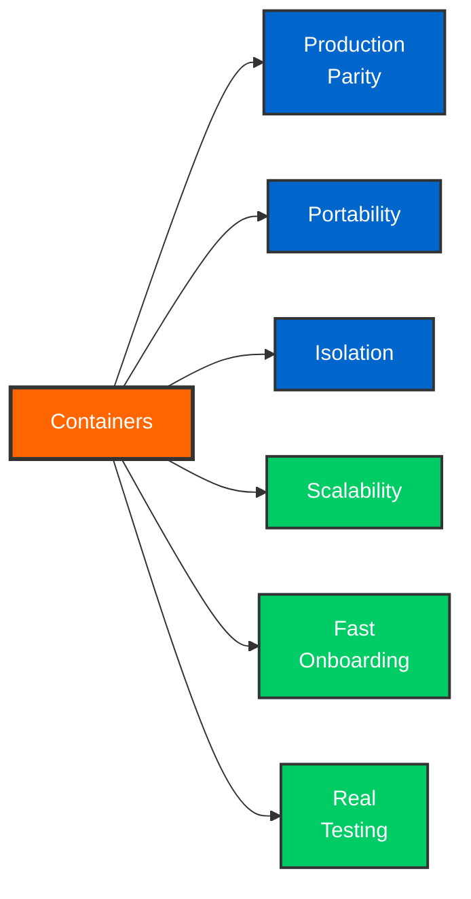
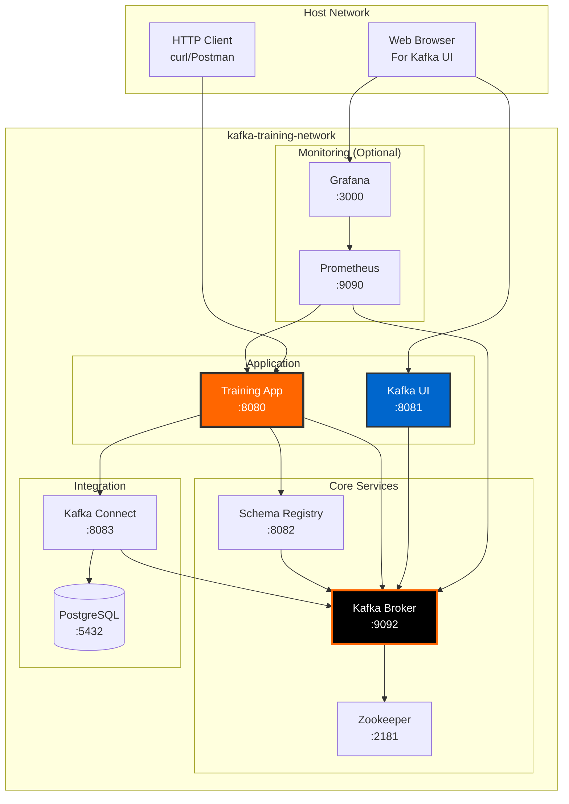
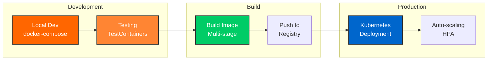

# Container Development

Welcome to the container-first development guide. Learn how to build, test, and deploy Kafka applications using Docker and Kubernetes.

## Why Containers for Data Engineers?

Modern data platforms are **container-native** because containers provide:



### 1. Production Parity

Your development environment matches production exactly:

- Same Kafka version
- Same network configuration
- Same resource constraints
- No "works on my machine" issues

### 2. Portability

Run anywhere without changes:

- Developer laptops (macOS, Windows, Linux)
- CI/CD pipelines
- Cloud platforms (AWS, GCP, Azure)
- On-premises data centers

### 3. Isolation

No dependency conflicts:

- Each service in its own container
- No version conflicts
- Clean environment for each test
- Easy cleanup and reset

### 4. Scalability

Easy horizontal scaling:

- Add more containers for capacity
- Kubernetes auto-scaling
- Load balancing built-in
- Resource management

### 5. Fast Onboarding

New team members productive immediately:

- `docker-compose up -d` - done!
- No complex installation steps
- Self-contained environments
- Automated setup

### 6. Real Testing

TestContainers use real Kafka, not mocks:

- Catch serialization issues
- Test consumer rebalancing
- Verify schema evolution
- Test Kafka Connect pipelines

## Container Learning Path

### Phase 1: Docker Basics (Day 1-2)

<div class="kafka-container">
<strong>Goal:</strong> Understand containers and Docker fundamentals

```bash
# Start Kafka cluster
docker-compose up -d

# View containers
docker ps

# View logs
docker logs -f kafka-training-kafka

# Access container
docker exec -it kafka-training-kafka bash
```

**What You Learn:**

- Containers vs VMs
- Docker images vs containers
- Port mapping and networking
- Volume persistence

<a href="docker-basics/">Learn Docker Basics →</a>
</div>

### Phase 2: Complete Data Platform (Day 3-4)

<div class="kafka-container">
<strong>Goal:</strong> Run full Kafka ecosystem in containers

```bash
# Start complete platform
docker-compose up -d

# Access services:
# - Kafka Broker (localhost:9092)
# - Schema Registry (localhost:8082)
# - Kafka UI (localhost:8081)
# - Training App (localhost:8080)
```

**What You Learn:**

- Multi-container orchestration
- Service dependencies
- Health checks
- Container networking

<a href="docker-compose/">Learn Docker Compose →</a>
</div>

### Phase 3: Development Workflow (Day 5-6)

<div class="kafka-container">
<strong>Goal:</strong> Develop and test like a pro

```bash
# Start dependencies only
docker-compose -f docker-compose-dev.yml up -d

# Run app locally (hot reload)
mvn spring-boot:run

# Rebuild and redeploy
docker-compose build kafka-training-app
docker-compose up -d kafka-training-app
```

**What You Learn:**

- Local development with containerized dependencies
- Hot reload during development
- Building custom images
- Debugging containerized apps

<a href="best-practices/">Container Best Practices →</a>
</div>

### Phase 4: Production Patterns (Day 7-8)

<div class="kafka-container">
<strong>Goal:</strong> Production-ready containerization

```bash
# Start with monitoring
docker-compose --profile monitoring up -d

# Scale Kafka Connect
docker-compose up -d --scale kafka-connect=3

# Backup volumes
docker run --rm \
  -v kafka-training_kafka-data:/data \
  -v $(pwd):/backup alpine \
  tar czf /backup/kafka-data.tar.gz /data
```

**What You Learn:**

- Container monitoring
- Scaling strategies
- Data persistence
- Backup and recovery

<a href="../deployment/kubernetes-overview/">Deploy to Kubernetes →</a>
</div>

## Container Architecture

### Training Environment Architecture



### Container Workflow



## Quick Reference

### Essential Commands

```bash
# Start all services
docker-compose up -d

# Stop all services
docker-compose down

# View logs
docker-compose logs -f [service]

# Restart service
docker-compose restart [service]

# Check status
docker-compose ps

# Shell into container
docker exec -it [container] bash

# Remove everything (⚠️ deletes data)
docker-compose down -v
```

### Common Workflows

#### Development Workflow

```bash
# 1. Start infrastructure
docker-compose -f docker-compose-dev.yml up -d

# 2. Run app locally
mvn spring-boot:run -Dspring-boot.run.profiles=dev

# 3. Make changes - auto reload!

# 4. Test
mvn test
```

#### Integration Testing

```bash
# TestContainers automatically manage Kafka
mvn test

# Tests start Kafka → Run tests → Clean up
```

#### Production Deployment

```bash
# 1. Build image
docker build -t kafka-training:1.0.0 .

# 2. Push to registry
docker push myregistry.com/kafka-training:1.0.0

# 3. Deploy to Kubernetes
kubectl apply -f k8s/deployment.yaml

# 4. Monitor
kubectl logs -f deployment/kafka-training-app
```

## Topics Covered

<div class="card-grid">

<div class="info-box">
<a href="why-containers/"><strong>Why Containers</strong></a><br/>
Benefits for data engineers and modern data platforms
</div>

<div class="info-box">
<a href="docker-basics/"><strong>Docker Basics</strong></a><br/>
Images, containers, networks, and volumes
</div>

<div class="info-box">
<a href="docker-compose/"><strong>Docker Compose</strong></a><br/>
Multi-container orchestration for development
</div>

<div class="info-box">
<a href="testcontainers/"><strong>TestContainers</strong></a><br/>
Integration testing with real Kafka
</div>

<div class="info-box">
<a href="best-practices/"><strong>Best Practices</strong></a><br/>
Container patterns for data engineering
</div>

<div class="info-box">
<a href="../deployment/kubernetes-overview/"><strong>Kubernetes</strong></a><br/>
Production deployment and scaling
</div>

</div>

## Skills You'll Gain

By completing the container development section:

- [x] Understand container fundamentals
- [x] Build and run multi-container applications
- [x] Develop with containerized dependencies
- [x] Test with TestContainers
- [x] Deploy to Kubernetes
- [x] Monitor containerized applications
- [x] Follow container best practices
- [x] Debug container issues

## Next Steps

<div class="card-grid">

<div class="success-box">
<strong>Start Learning</strong><br/>
Begin with <a href="why-containers/">Why Containers for Data Engineers</a>
</div>

<div class="success-box">
<strong>Get Hands-On</strong><br/>
Try <a href="docker-basics/">Docker Basics Tutorial</a>
</div>

<div class="success-box">
<strong>Build Projects</strong><br/>
Follow <a href="docker-compose/">Docker Compose Guide</a>
</div>

<div class="success-box">
<strong>Go to Production</strong><br/>
Deploy with <a href="../deployment/kubernetes-overview/">Kubernetes</a>
</div>

</div>

---

Master containers to become a production-ready data engineer. Start with [Why Containers for Data Engineers](why-containers/)
