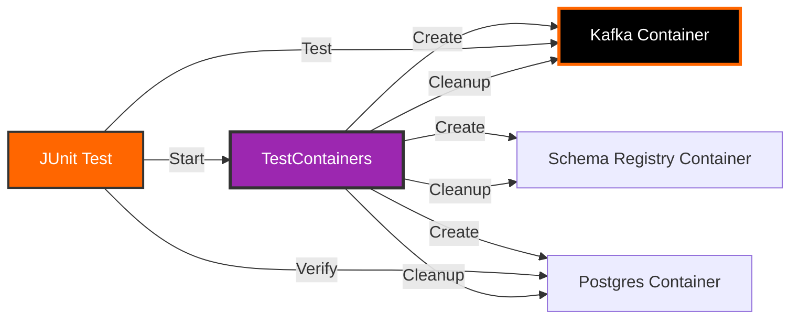

# TestContainers for Kafka Testing

## Overview

TestContainers is a Java library that provides lightweight, disposable containers for integration testing. Perfect for testing Kafka applications without external dependencies.



## Why TestContainers?

### Benefits

1. **Real Dependencies** - Test against actual Kafka, not mocks
2. **Isolated Tests** - Each test gets fresh environment
3. **No Setup Required** - Containers start automatically
4. **CI/CD Friendly** - Works in any environment with Docker
5. **Consistent Behavior** - Same behavior locally and in CI
6. **Easy Cleanup** - Containers automatically removed

### vs Other Testing Approaches

| Approach | Pros | Cons |
|----------|------|------|
| **TestContainers** | Real Kafka, isolated, automatic | Requires Docker |
| **Embedded Kafka** | Fast, no Docker | Not real Kafka, limited features |
| **Mocks** | Very fast | Not testing real integration |
| **External Kafka** | Real environment | Manual setup, not isolated |

## Setup

### Maven Dependencies

```xml
<dependencies>
    <!-- TestContainers Core -->
    <dependency>
        <groupId>org.testcontainers</groupId>
        <artifactId>testcontainers</artifactId>
        <version>1.19.3</version>
        <scope>test</scope>
    </dependency>

    <!-- TestContainers Kafka -->
    <dependency>
        <groupId>org.testcontainers</groupId>
        <artifactId>kafka</artifactId>
        <version>1.19.3</version>
        <scope>test</scope>
    </dependency>

    <!-- TestContainers PostgreSQL -->
    <dependency>
        <groupId>org.testcontainers</groupId>
        <artifactId>postgresql</artifactId>
        <version>1.19.3</version>
        <scope>test</scope>
    </dependency>

    <!-- TestContainers JUnit Jupiter -->
    <dependency>
        <groupId>org.testcontainers</groupId>
        <artifactId>junit-jupiter</artifactId>
        <version>1.19.3</version>
        <scope>test</scope>
    </dependency>

    <!-- JUnit 5 -->
    <dependency>
        <groupId>org.junit.jupiter</groupId>
        <artifactId>junit-jupiter</artifactId>
        <scope>test</scope>
    </dependency>

    <!-- Spring Boot Test -->
    <dependency>
        <groupId>org.springframework.boot</groupId>
        <artifactId>spring-boot-starter-test</artifactId>
        <scope>test</scope>
    </dependency>

    <!-- Spring Kafka Test -->
    <dependency>
        <groupId>org.springframework.kafka</groupId>
        <artifactId>spring-kafka-test</artifactId>
        <scope>test</scope>
    </dependency>
</dependencies>
```

## Basic Kafka Test

### Simple Test Example

```java
@SpringBootTest
@Testcontainers
class KafkaProducerTest {

    @Container
    static KafkaContainer kafka = new KafkaContainer(
        DockerImageName.parse("confluentinc/cp-kafka:7.5.0")
    );

    @DynamicPropertySource
    static void kafkaProperties(DynamicPropertyRegistry registry) {
        registry.add("spring.kafka.bootstrap-servers", kafka::getBootstrapServers);
    }

    @Autowired
    private KafkaTemplate<String, String> kafkaTemplate;

    @Test
    void testSendMessage() {
        // Given
        String topic = "test-topic";
        String message = "Hello Kafka!";

        // When
        kafkaTemplate.send(topic, message);

        // Then
        // Verify message was sent (consumer test)
    }
}
```

### Base Test Class

Create a base class for all Kafka tests:

```java
@SpringBootTest
@Testcontainers
@TestInstance(TestInstance.Lifecycle.PER_CLASS)
public abstract class BaseKafkaTest {

    @Container
    static final KafkaContainer kafka = new KafkaContainer(
        DockerImageName.parse("confluentinc/cp-kafka:7.5.0")
    ).withReuse(true);  // Reuse container across tests

    @DynamicPropertySource
    static void configureProperties(DynamicPropertyRegistry registry) {
        registry.add("spring.kafka.bootstrap-servers", kafka::getBootstrapServers);
        registry.add("spring.kafka.consumer.auto-offset-reset", () -> "earliest");
    }

    @BeforeAll
    void setup() {
        // Wait for Kafka to be ready
        Awaitility.await()
            .atMost(Duration.ofSeconds(30))
            .until(kafka::isRunning);
    }
}
```

### Test with Consumer

```java
@SpringBootTest
@Testcontainers
class KafkaIntegrationTest extends BaseKafkaTest {

    @Autowired
    private KafkaTemplate<String, String> kafkaTemplate;

    @Autowired
    private KafkaListenerEndpointRegistry registry;

    @Test
    void testProduceAndConsume() throws Exception {
        // Given
        String topic = "integration-test";
        String message = "Test Message";

        CountDownLatch latch = new CountDownLatch(1);
        AtomicReference<String> receivedMessage = new AtomicReference<>();

        // Create consumer
        Map<String, Object> consumerProps = new HashMap<>();
        consumerProps.put(ConsumerConfig.BOOTSTRAP_SERVERS_CONFIG,
            kafka.getBootstrapServers());
        consumerProps.put(ConsumerConfig.GROUP_ID_CONFIG, "test-group");
        consumerProps.put(ConsumerConfig.KEY_DESERIALIZER_CLASS_CONFIG,
            StringDeserializer.class);
        consumerProps.put(ConsumerConfig.VALUE_DESERIALIZER_CLASS_CONFIG,
            StringDeserializer.class);
        consumerProps.put(ConsumerConfig.AUTO_OFFSET_RESET_CONFIG, "earliest");

        DefaultKafkaConsumerFactory<String, String> consumerFactory =
            new DefaultKafkaConsumerFactory<>(consumerProps);
        KafkaConsumer<String, String> consumer = consumerFactory.createConsumer();
        consumer.subscribe(Collections.singletonList(topic));

        // Consume in separate thread
        new Thread(() -> {
            ConsumerRecords<String, String> records =
                consumer.poll(Duration.ofSeconds(10));
            for (ConsumerRecord<String, String> record : records) {
                receivedMessage.set(record.value());
                latch.countDown();
            }
            consumer.close();
        }).start();

        // When - Produce message
        kafkaTemplate.send(topic, message).get();

        // Then - Verify consumed
        assertTrue(latch.await(15, TimeUnit.SECONDS));
        assertEquals(message, receivedMessage.get());
    }
}
```

## Advanced Testing Patterns

### Test with Schema Registry

```java
@SpringBootTest
@Testcontainers
class AvroIntegrationTest {

    @Container
    static Network network = Network.newNetwork();

    @Container
    static KafkaContainer kafka = new KafkaContainer(
        DockerImageName.parse("confluentinc/cp-kafka:7.5.0")
    ).withNetwork(network);

    @Container
    static GenericContainer<?> schemaRegistry = new GenericContainer<>(
        DockerImageName.parse("confluentinc/cp-schema-registry:7.5.0")
    )
    .withNetwork(network)
    .withExposedPorts(8081)
    .withEnv("SCHEMA_REGISTRY_HOST_NAME", "schema-registry")
    .withEnv("SCHEMA_REGISTRY_KAFKASTORE_BOOTSTRAP_SERVERS",
        "PLAINTEXT://" + kafka.getNetworkAliases().get(0) + ":9092")
    .dependsOn(kafka);

    @DynamicPropertySource
    static void configureProperties(DynamicPropertyRegistry registry) {
        registry.add("spring.kafka.bootstrap-servers", kafka::getBootstrapServers);
        registry.add("spring.kafka.properties.schema.registry.url",
            () -> "http://" + schemaRegistry.getHost() + ":" +
                  schemaRegistry.getFirstMappedPort());
    }

    @Test
    void testAvroProduceAndConsume() {
        // Test Avro serialization/deserialization
    }
}
```

### Test with PostgreSQL

```java
@SpringBootTest
@Testcontainers
class DatabaseIntegrationTest {

    @Container
    static PostgreSQLContainer<?> postgres = new PostgreSQLContainer<>(
        DockerImageName.parse("postgres:15-alpine")
    )
    .withDatabaseName("testdb")
    .withUsername("testuser")
    .withPassword("testpass");

    @Container
    static KafkaContainer kafka = new KafkaContainer(
        DockerImageName.parse("confluentinc/cp-kafka:7.5.0")
    );

    @DynamicPropertySource
    static void configureProperties(DynamicPropertyRegistry registry) {
        registry.add("spring.datasource.url", postgres::getJdbcUrl);
        registry.add("spring.datasource.username", postgres::getUsername);
        registry.add("spring.datasource.password", postgres::getPassword);
        registry.add("spring.kafka.bootstrap-servers", kafka::getBootstrapServers);
    }

    @Autowired
    private UserRepository userRepository;

    @Autowired
    private KafkaTemplate<String, String> kafkaTemplate;

    @Test
    void testKafkaToDatabase() {
        // Test: Kafka message → Consumer → Database
    }
}
```

### Test with Docker Compose

```java
@SpringBootTest
@Testcontainers
class DockerComposeTest {

    @Container
    static ComposeContainer environment = new ComposeContainer(
        new File("docker-compose-test.yml")
    )
    .withExposedService("kafka", 9092)
    .withExposedService("postgres", 5432)
    .withExposedService("schema-registry", 8081);

    @DynamicPropertySource
    static void configureProperties(DynamicPropertyRegistry registry) {
        registry.add("spring.kafka.bootstrap-servers",
            () -> environment.getServiceHost("kafka", 9092) + ":" +
                  environment.getServicePort("kafka", 9092));
    }

    @Test
    void testWithFullStack() {
        // Test with complete environment from docker-compose
    }
}
```

## Real Test Examples

### Day 1: Foundation Test

```java
@SpringBootTest
@Testcontainers
class Day01FoundationTest extends BaseKafkaTest {

    @Autowired
    private Day01FoundationService service;

    @Autowired
    private AdminClient adminClient;

    @Test
    @DisplayName("Should create topic successfully")
    void testCreateTopic() throws Exception {
        // Given
        String topicName = "test-topic-" + UUID.randomUUID();
        NewTopic newTopic = new NewTopic(topicName, 3, (short) 1);

        // When
        adminClient.createTopics(Collections.singleton(newTopic)).all().get();

        // Then
        Set<String> topics = adminClient.listTopics().names().get();
        assertTrue(topics.contains(topicName));
    }

    @Test
    @DisplayName("Should list topics")
    void testListTopics() {
        // When
        Map<String, Object> result = service.demonstrateFoundation();

        // Then
        assertNotNull(result);
        assertTrue(result.containsKey("topics"));
        assertTrue(result.containsKey("brokers"));
    }
}
```

### Day 2: Producer/Consumer Test

```java
@SpringBootTest
@Testcontainers
class Day02DataFlowTest extends BaseKafkaTest {

    @Autowired
    private KafkaTemplate<String, String> kafkaTemplate;

    @Test
    @DisplayName("Should guarantee message ordering for same key")
    void testMessageOrdering() throws Exception {
        // Given
        String topic = "order-test";
        String key = "user123";
        List<String> messages = List.of("msg1", "msg2", "msg3");

        // When - Send messages with same key
        for (String message : messages) {
            kafkaTemplate.send(topic, key, message).get();
        }

        // Then - Consume and verify order
        Map<String, Object> consumerProps = KafkaTestUtils
            .consumerProps(kafka.getBootstrapServers(), "test-group", "true");
        consumerProps.put(ConsumerConfig.KEY_DESERIALIZER_CLASS_CONFIG,
            StringDeserializer.class);
        consumerProps.put(ConsumerConfig.VALUE_DESERIALIZER_CLASS_CONFIG,
            StringDeserializer.class);

        KafkaConsumer<String, String> consumer =
            new KafkaConsumer<>(consumerProps);
        consumer.subscribe(Collections.singleton(topic));

        ConsumerRecords<String, String> records =
            KafkaTestUtils.getRecords(consumer, Duration.ofSeconds(10));

        List<String> receivedMessages = new ArrayList<>();
        records.forEach(record -> receivedMessages.add(record.value()));

        assertEquals(messages, receivedMessages);
        consumer.close();
    }

    @Test
    @DisplayName("Should handle at-least-once delivery")
    void testAtLeastOnceDelivery() {
        // Test idempotent processing
    }
}
```

### Day 3: Producer Patterns Test

```java
@SpringBootTest
@Testcontainers
class Day03ProducersTest extends BaseKafkaTest {

    @Autowired
    private KafkaTemplate<String, String> kafkaTemplate;

    @Test
    @DisplayName("Should send messages asynchronously")
    void testAsyncSend() {
        // Given
        String topic = "async-test";
        AtomicInteger successCount = new AtomicInteger(0);
        CountDownLatch latch = new CountDownLatch(10);

        // When
        for (int i = 0; i < 10; i++) {
            kafkaTemplate.send(topic, "key" + i, "message" + i)
                .thenAccept(result -> {
                    successCount.incrementAndGet();
                    latch.countDown();
                })
                .exceptionally(ex -> {
                    latch.countDown();
                    return null;
                });
        }

        // Then
        await().atMost(Duration.ofSeconds(10))
            .until(() -> latch.getCount() == 0);
        assertEquals(10, successCount.get());
    }

    @Test
    @DisplayName("Should enable idempotence")
    void testIdempotence() {
        // Verify producer is idempotent
        Map<String, Object> config = kafkaTemplate.getProducerFactory()
            .getConfigurationProperties();
        assertTrue((Boolean) config.get(ProducerConfig.ENABLE_IDEMPOTENCE_CONFIG));
    }
}
```

### Day 4: Consumer Patterns Test

```java
@SpringBootTest
@Testcontainers
class Day04ConsumersTest extends BaseKafkaTest {

    @Test
    @DisplayName("Should commit offsets manually")
    void testManualCommit() throws Exception {
        // Given
        String topic = "manual-commit-test";
        String groupId = "manual-group";

        // Produce messages
        for (int i = 0; i < 5; i++) {
            kafkaTemplate.send(topic, "message" + i).get();
        }

        // When - Consume with manual commit
        Map<String, Object> consumerProps = new HashMap<>();
        consumerProps.put(ConsumerConfig.BOOTSTRAP_SERVERS_CONFIG,
            kafka.getBootstrapServers());
        consumerProps.put(ConsumerConfig.GROUP_ID_CONFIG, groupId);
        consumerProps.put(ConsumerConfig.ENABLE_AUTO_COMMIT_CONFIG, false);
        consumerProps.put(ConsumerConfig.KEY_DESERIALIZER_CLASS_CONFIG,
            StringDeserializer.class);
        consumerProps.put(ConsumerConfig.VALUE_DESERIALIZER_CLASS_CONFIG,
            StringDeserializer.class);

        KafkaConsumer<String, String> consumer =
            new KafkaConsumer<>(consumerProps);
        consumer.subscribe(Collections.singleton(topic));

        ConsumerRecords<String, String> records =
            consumer.poll(Duration.ofSeconds(10));

        // Manually commit
        consumer.commitSync();

        // Then - Verify offset committed
        AdminClient adminClient = AdminClient.create(
            Map.of(AdminClientConfig.BOOTSTRAP_SERVERS_CONFIG,
                kafka.getBootstrapServers())
        );

        Map<TopicPartition, OffsetAndMetadata> offsets =
            adminClient.listConsumerGroupOffsets(groupId)
                .partitionsToOffsetAndMetadata()
                .get();

        assertFalse(offsets.isEmpty());
        consumer.close();
        adminClient.close();
    }
}
```

### Day 6: Streams Test

```java
@SpringBootTest
@Testcontainers
class Day06StreamsTest extends BaseKafkaTest {

    @Autowired
    private StreamsBuilder streamsBuilder;

    @Test
    @DisplayName("Should filter and transform stream")
    void testStreamProcessing() {
        // Given
        String inputTopic = "input-stream";
        String outputTopic = "output-stream";

        // Build topology
        KStream<String, String> input = streamsBuilder.stream(inputTopic);
        input
            .filter((key, value) -> Integer.parseInt(value) > 10)
            .mapValues(value -> "Processed: " + value)
            .to(outputTopic);

        // When - Produce test data
        for (int i = 0; i < 20; i++) {
            kafkaTemplate.send(inputTopic, String.valueOf(i));
        }

        // Then - Verify output
        // Consumer reads from output topic and verifies filtering
    }
}
```

## Best Practices

### 1. Reuse Containers

```java
@Container
static KafkaContainer kafka = new KafkaContainer(
    DockerImageName.parse("confluentinc/cp-kafka:7.5.0")
).withReuse(true);  // Reuse across test runs
```

### 2. Use Test Profiles

```properties
# application-test.properties
spring.kafka.bootstrap-servers=${KAFKA_BOOTSTRAP_SERVERS}
spring.kafka.consumer.auto-offset-reset=earliest
```

### 3. Clean Up Resources

```java
@AfterEach
void cleanup() {
    // Clean up topics, consumer groups, etc.
    adminClient.deleteTopics(testTopics);
}
```

### 4. Use Awaitility for Async Operations

```java
@Test
void testAsyncOperation() {
    // When
    someAsyncOperation();

    // Then
    await().atMost(Duration.ofSeconds(10))
        .until(() -> condition());
}
```

### 5. Parameterized Tests

```java
@ParameterizedTest
@ValueSource(strings = {"msg1", "msg2", "msg3"})
void testMultipleMessages(String message) {
    kafkaTemplate.send("test-topic", message);
    // Verify
}
```

## CI/CD Integration

### GitHub Actions

```yaml
name: Integration Tests

on: [push, pull_request]

jobs:
  test:
    runs-on: ubuntu-latest

    steps:
      - uses: actions/checkout@v3

      - name: Set up JDK 17
        uses: actions/setup-java@v3
        with:
          java-version: '17'
          distribution: 'temurin'

      - name: Run TestContainers tests
        run: mvn test -Dtest=**/*Test

      - name: Publish Test Report
        uses: mikepenz/action-junit-report@v3
        if: always()
        with:
          report_paths: '**/target/surefire-reports/TEST-*.xml'
```

### Performance Optimization

```java
// Parallel test execution
@SpringBootTest
@Testcontainers
@Execution(ExecutionMode.CONCURRENT)  // Run tests in parallel
class ParallelTests extends BaseKafkaTest {
    // Tests
}
```

## Troubleshooting

### Container Startup Timeout

```java
@Container
static KafkaContainer kafka = new KafkaContainer(
    DockerImageName.parse("confluentinc/cp-kafka:7.5.0")
).withStartupTimeout(Duration.ofMinutes(5));  // Increase timeout
```

### Debug Container Logs

```java
@Test
void debugTest() {
    // Print container logs
    String logs = kafka.getLogs();
    System.out.println(logs);
}
```

### Container Not Starting

```bash
# Check Docker daemon
docker info

# Check available resources
docker system df

# Clean up old containers
docker system prune -a
```

## Key Takeaways

!!! success "Testing Best Practices"
    1. **Use TestContainers** for realistic integration tests
    2. **Reuse containers** across tests for speed
    3. **Clean up resources** after tests
    4. **Use base classes** to share configuration
    5. **Test with real dependencies** not mocks
    6. **Run tests in CI/CD** automatically
    7. **Monitor test duration** and optimize

## Next Steps

- Review [Container Best Practices](best-practices.md)
- Learn [Production Deployment](../deployment/deployment-guide.md)
- Explore [CI/CD Integration](../deployment/checklist.md)

## Resources

- [TestContainers Documentation](https://www.testcontainers.org/)
- [TestContainers Kafka Module](https://www.testcontainers.org/modules/kafka/)
- [Spring Kafka Testing](https://docs.spring.io/spring-kafka/reference/html/#testing)
