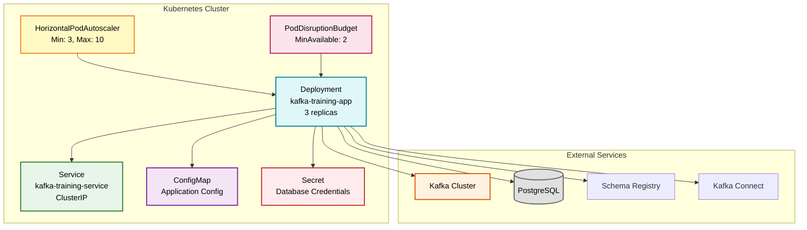

# Kubernetes Deployment Guide

This guide provides step-by-step instructions for deploying the Kafka Training application to a Kubernetes cluster. Whether you're deploying to a local cluster (Minikube, kind) or a cloud provider (EKS, GKE, AKS), this guide covers everything you need.

## Prerequisites

Before deploying, ensure you have:

1. **Kubernetes Cluster**: Running cluster with kubectl access
2. **kubectl**: Command-line tool configured to access your cluster
3. **Docker Image**: Application image built and pushed to registry
4. **Kafka Infrastructure**: Kafka cluster accessible from Kubernetes
5. **PostgreSQL Database**: Database for EventMart examples

### Verify Prerequisites

```bash
# Check kubectl access
kubectl cluster-info
kubectl get nodes

# Verify Docker image
docker images | grep kafka-training

# Test Kafka connectivity (if using external Kafka)
kubectl run kafka-test --rm -it --image=confluentinc/cp-kafka:7.7.0 -- \
  kafka-broker-api-versions --bootstrap-server your-kafka:9092
```

## Deployment Architecture

The deployment includes:



## Step 1: Build and Push Docker Image

### Build the Image

```bash
# Navigate to project root
cd /path/to/kafka-training-java

# Build the Docker image
docker build -t kafka-training:1.0.0 .

# Tag for your registry (replace with your registry URL)
docker tag kafka-training:1.0.0 your-registry.com/kafka-training:1.0.0

# Push to registry
docker push your-registry.com/kafka-training:1.0.0
```

### Using Docker Hub

```bash
# Tag with Docker Hub username
docker tag kafka-training:1.0.0 yourusername/kafka-training:1.0.0

# Login to Docker Hub
docker login

# Push image
docker push yourusername/kafka-training:1.0.0
```

### Using Cloud Registries

#### AWS ECR

```bash
# Authenticate with ECR
aws ecr get-login-password --region us-east-1 | \
  docker login --username AWS --password-stdin 123456789.dkr.ecr.us-east-1.amazonaws.com

# Tag and push
docker tag kafka-training:1.0.0 123456789.dkr.ecr.us-east-1.amazonaws.com/kafka-training:1.0.0
docker push 123456789.dkr.ecr.us-east-1.amazonaws.com/kafka-training:1.0.0
```

#### Google GCR

```bash
# Authenticate with GCR
gcloud auth configure-docker

# Tag and push
docker tag kafka-training:1.0.0 gcr.io/your-project/kafka-training:1.0.0
docker push gcr.io/your-project/kafka-training:1.0.0
```

#### Azure ACR

```bash
# Login to ACR
az acr login --name yourregistry

# Tag and push
docker tag kafka-training:1.0.0 yourregistry.azurecr.io/kafka-training:1.0.0
docker push yourregistry.azurecr.io/kafka-training:1.0.0
```

## Step 2: Create Namespace

Create a dedicated namespace for the data engineering workloads:

```bash
# Create namespace
kubectl create namespace data-engineering

# Set as default (optional)
kubectl config set-context --current --namespace=data-engineering

# Verify namespace
kubectl get namespaces
```

## Step 3: Configure Secrets

Create secrets for sensitive information before deploying.

### PostgreSQL Credentials

```bash
# Create secret from literals
kubectl create secret generic postgres-credentials \
  --from-literal=username=eventmart \
  --from-literal=password='YourSecurePassword123!' \
  --namespace=data-engineering

# Verify secret creation
kubectl get secrets -n data-engineering
kubectl describe secret postgres-credentials -n data-engineering
```

### Using Secret YAML (Not Recommended for Production)

```yaml
# postgres-secret.yaml
apiVersion: v1
kind: Secret
metadata:
  name: postgres-credentials
  namespace: data-engineering
type: Opaque
stringData:
  username: eventmart
  password: 'YourSecurePassword123!'
```

```bash
# Apply secret
kubectl apply -f postgres-secret.yaml
```

!!! warning "Production Secret Management"
    For production, use proper secret management:

    - HashiCorp Vault with Vault Agent Injector
    - AWS Secrets Manager with External Secrets Operator
    - Azure Key Vault with Secrets Store CSI Driver
    - Google Secret Manager
    - Sealed Secrets for GitOps workflows

### Example: Using Sealed Secrets

```bash
# Install kubeseal
wget https://github.com/bitnami-labs/sealed-secrets/releases/download/v0.24.0/kubeseal-linux-amd64
sudo install -m 755 kubeseal-linux-amd64 /usr/local/bin/kubeseal

# Create sealed secret
kubectl create secret generic postgres-credentials \
  --from-literal=username=eventmart \
  --from-literal=password='YourSecurePassword123!' \
  --dry-run=client -o yaml | \
  kubeseal -o yaml > sealed-postgres-secret.yaml

# Apply sealed secret (safe to commit to Git)
kubectl apply -f sealed-postgres-secret.yaml
```

## Step 4: Update Deployment Configuration

Edit `k8s/deployment.yaml` to match your environment:

### Update Image Reference

```yaml
# Change line 70 in k8s/deployment.yaml
containers:
- name: app
  image: your-registry.com/kafka-training:1.0.0  # Update this
  imagePullPolicy: IfNotPresent
```

### Update Kafka Bootstrap Servers

```yaml
# Update line 86-87
- name: TRAINING_KAFKA_BOOTSTRAP_SERVERS
  value: "your-kafka-cluster:9092"  # Update this
```

### Update Database Connection

```yaml
# Update line 96-97
- name: SPRING_DATASOURCE_URL
  value: "jdbc:postgresql://your-postgres-host:5432/eventmart"  # Update this
```

### Update Schema Registry URL

```yaml
# Update line 89-90
- name: TRAINING_KAFKA_SCHEMA_REGISTRY_URL
  value: "http://your-schema-registry:8082"  # Update this
```

### Update Kafka Connect URL

```yaml
# Update line 92-93
- name: TRAINING_KAFKA_CONNECT_URL
  value: "http://your-kafka-connect:8083"  # Update this
```

## Step 5: Deploy to Kubernetes

### Apply All Resources

```bash
# Deploy everything in k8s/ directory
kubectl apply -f k8s/ --namespace=data-engineering

# Or apply specific file
kubectl apply -f k8s/deployment.yaml --namespace=data-engineering
```

### Watch Deployment Progress

```bash
# Watch pods being created
kubectl get pods -n data-engineering -w

# Check deployment status
kubectl rollout status deployment/kafka-training-app -n data-engineering
```

Expected output:

```
deployment "kafka-training-app" successfully rolled out
```

### Verify Deployment

```bash
# Check deployment
kubectl get deployments -n data-engineering

# Check pods
kubectl get pods -n data-engineering

# Check services
kubectl get services -n data-engineering

# Check HPA
kubectl get hpa -n data-engineering

# Check PDB
kubectl get pdb -n data-engineering
```

## Step 6: Verify Application Health

### Check Pod Logs

```bash
# View logs from one pod
kubectl logs -n data-engineering -l app=kafka-training --tail=50

# Follow logs in real-time
kubectl logs -n data-engineering -l app=kafka-training -f

# View logs from specific pod
kubectl logs -n data-engineering kafka-training-app-xyz123
```

Look for successful startup messages:

```
Started KafkaTrainingApplication in 12.3 seconds
Connected to Kafka cluster: localhost:9092
Schema Registry available at: http://localhost:8082
Kafka Connect available at: http://localhost:8083
TrainingController initialized - Web API ready
```

### Check Health Endpoints

```bash
# Port forward to access application
kubectl port-forward -n data-engineering svc/kafka-training-service 8080:8080

# In another terminal, check health
curl http://localhost:8080/actuator/health

# Expected response
{
  "status": "UP",
  "components": {
    "kafka": {
      "status": "UP"
    },
    "db": {
      "status": "UP"
    }
  }
}
```

### Check Readiness and Liveness

```bash
# Check readiness
kubectl get pods -n data-engineering -o wide

# All pods should show READY 1/1 and STATUS Running
```

## Step 7: ConfigMap Management

### View Current ConfigMap

```bash
# View ConfigMap
kubectl get configmap kafka-training-config -n data-engineering -o yaml
```

### Update ConfigMap

```bash
# Edit ConfigMap
kubectl edit configmap kafka-training-config -n data-engineering

# Or apply updated file
kubectl apply -f k8s/deployment.yaml -n data-engineering
```

### Reload Configuration

!!! note "Configuration Reload"
    Spring Boot automatically reloads configuration from ConfigMaps when using Spring Cloud Kubernetes. Otherwise, restart pods to pick up changes.

```bash
# Restart deployment to pick up ConfigMap changes
kubectl rollout restart deployment/kafka-training-app -n data-engineering

# Watch restart progress
kubectl rollout status deployment/kafka-training-app -n data-engineering
```

## Service Exposure Options

### Option 1: ClusterIP (Default)

Access only within cluster:

```bash
# Already configured in deployment.yaml
# No external access - use port-forward for testing

kubectl port-forward -n data-engineering svc/kafka-training-service 8080:8080
```

### Option 2: NodePort

Expose on each node's IP:

```yaml
# Update Service type
apiVersion: v1
kind: Service
metadata:
  name: kafka-training-service
spec:
  type: NodePort  # Changed from ClusterIP
  selector:
    app: kafka-training
  ports:
  - name: http
    port: 8080
    targetPort: 8080
    nodePort: 30080  # Optional: specify port (30000-32767)
```

```bash
# Apply updated service
kubectl apply -f k8s/deployment.yaml -n data-engineering

# Access via node IP
curl http://<node-ip>:30080/actuator/health
```

### Option 3: LoadBalancer (Cloud)

Expose via cloud load balancer:

```yaml
apiVersion: v1
kind: Service
metadata:
  name: kafka-training-service
spec:
  type: LoadBalancer  # Changed from ClusterIP
  selector:
    app: kafka-training
  ports:
  - name: http
    port: 8080
    targetPort: 8080
```

```bash
# Apply updated service
kubectl apply -f k8s/deployment.yaml -n data-engineering

# Wait for external IP
kubectl get service kafka-training-service -n data-engineering -w

# Access via load balancer IP
curl http://<external-ip>:8080/actuator/health
```

### Option 4: Ingress (Recommended for Production)

Use Ingress controller for path-based routing and TLS:

```yaml
# ingress.yaml
apiVersion: networking.k8s.io/v1
kind: Ingress
metadata:
  name: kafka-training-ingress
  namespace: data-engineering
  annotations:
    nginx.ingress.kubernetes.io/rewrite-target: /
    cert-manager.io/cluster-issuer: letsencrypt-prod
spec:
  ingressClassName: nginx
  tls:
  - hosts:
    - kafka-training.yourdomain.com
    secretName: kafka-training-tls
  rules:
  - host: kafka-training.yourdomain.com
    http:
      paths:
      - path: /
        pathType: Prefix
        backend:
          service:
            name: kafka-training-service
            port:
              number: 8080
```

```bash
# Apply Ingress
kubectl apply -f ingress.yaml

# Access via domain
curl https://kafka-training.yourdomain.com/actuator/health
```

## Troubleshooting Common Issues

### Issue 1: Pods Not Starting

```bash
# Check pod status
kubectl get pods -n data-engineering

# Describe pod for events
kubectl describe pod kafka-training-app-xyz123 -n data-engineering

# Check logs
kubectl logs kafka-training-app-xyz123 -n data-engineering
```

Common causes:

- **ImagePullBackOff**: Image not found or authentication failed
- **CrashLoopBackOff**: Application crashing on startup
- **Pending**: Insufficient cluster resources

### Issue 2: Cannot Connect to Kafka

```bash
# Check Kafka connectivity from pod
kubectl exec -it kafka-training-app-xyz123 -n data-engineering -- sh

# Inside pod, test Kafka connection
nc -zv kafka-cluster 9092
```

Solutions:

- Verify Kafka service DNS name
- Check network policies
- Verify security group rules (cloud environments)

### Issue 3: Database Connection Errors

```bash
# Check database secret
kubectl get secret postgres-credentials -n data-engineering -o yaml

# Verify database connectivity
kubectl exec -it kafka-training-app-xyz123 -n data-engineering -- sh
nc -zv postgres-host 5432
```

### Issue 4: Health Checks Failing

```bash
# Check probe configuration
kubectl describe pod kafka-training-app-xyz123 -n data-engineering | grep -A 10 Liveness

# Test health endpoint manually
kubectl exec -it kafka-training-app-xyz123 -n data-engineering -- \
  curl -f http://localhost:8080/actuator/health/liveness
```

Adjust probe timings if application needs more time to start:

```yaml
startupProbe:
  initialDelaySeconds: 20  # Increase if needed
  periodSeconds: 10
  failureThreshold: 30
```

### Issue 5: HPA Not Scaling

```bash
# Check HPA status
kubectl get hpa kafka-training-hpa -n data-engineering

# Describe HPA for metrics
kubectl describe hpa kafka-training-hpa -n data-engineering

# Check metrics server
kubectl top nodes
kubectl top pods -n data-engineering
```

Ensure Metrics Server is installed:

```bash
# Install metrics server (if not present)
kubectl apply -f https://github.com/kubernetes-sigs/metrics-server/releases/latest/download/components.yaml
```

## Deployment Verification Checklist

Use this checklist to verify successful deployment:

- [ ] All pods are running and ready (1/1)
- [ ] Health endpoint returns status UP
- [ ] Application logs show successful Kafka connection
- [ ] Database connectivity confirmed
- [ ] Schema Registry accessible
- [ ] Kafka Connect accessible
- [ ] HPA is active and reporting metrics
- [ ] PDB is configured
- [ ] Service is accessible (via port-forward or LoadBalancer)
- [ ] ConfigMap is mounted correctly
- [ ] Secrets are mounted correctly
- [ ] Resource limits are appropriate
- [ ] Probes are passing

## Update and Rollback Procedures

### Rolling Update

```bash
# Update image version
kubectl set image deployment/kafka-training-app \
  app=kafka-training:2.0.0 \
  -n data-engineering

# Monitor rollout
kubectl rollout status deployment/kafka-training-app -n data-engineering

# Check rollout history
kubectl rollout history deployment/kafka-training-app -n data-engineering
```

### Rollback to Previous Version

```bash
# Rollback to previous version
kubectl rollout undo deployment/kafka-training-app -n data-engineering

# Rollback to specific revision
kubectl rollout undo deployment/kafka-training-app \
  --to-revision=2 \
  -n data-engineering

# Verify rollback
kubectl rollout status deployment/kafka-training-app -n data-engineering
```

### Pause and Resume Rollout

```bash
# Pause rollout (useful for canary testing)
kubectl rollout pause deployment/kafka-training-app -n data-engineering

# Make additional changes...

# Resume rollout
kubectl rollout resume deployment/kafka-training-app -n data-engineering
```

## Clean Up

### Remove Application

```bash
# Delete all resources
kubectl delete -f k8s/ --namespace=data-engineering

# Or delete specific deployment
kubectl delete deployment kafka-training-app -n data-engineering
kubectl delete service kafka-training-service -n data-engineering
```

### Remove Namespace

```bash
# Delete namespace (removes all resources in it)
kubectl delete namespace data-engineering
```

!!! warning "Data Loss"
    Deleting namespace removes all resources including ConfigMaps and Secrets. Ensure you have backups if needed.

## Next Steps

Now that your application is deployed:

- [Monitoring](monitoring.md) - Set up Prometheus and Grafana
- [Scaling](scaling.md) - Configure auto-scaling strategies
- [Production Checklist](checklist.md) - Verify production readiness
- [Container Architecture](../architecture/container-architecture.md) - Understand the deployment architecture

!!! success "Deployment Complete"
    Your Kafka Training application is now running on Kubernetes with production-grade configuration including auto-scaling, health checks, and high availability.
