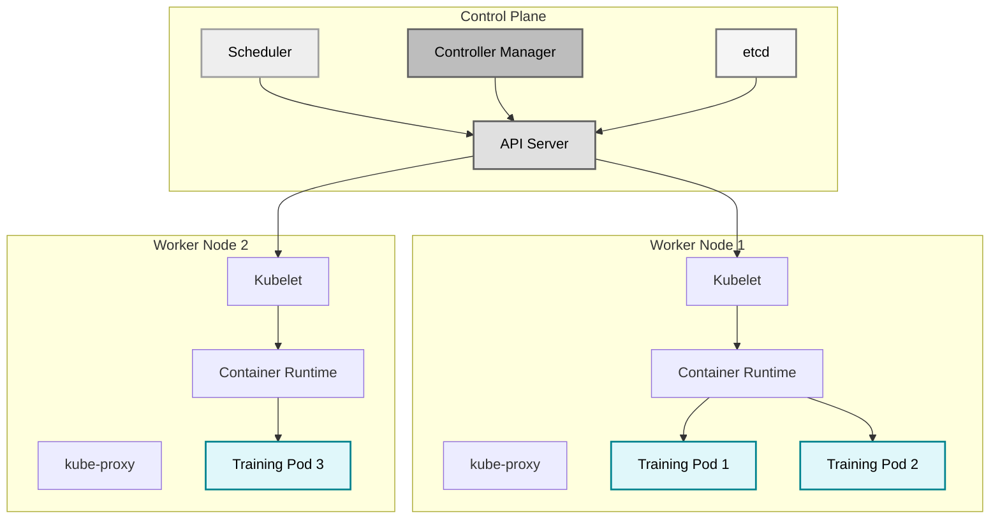
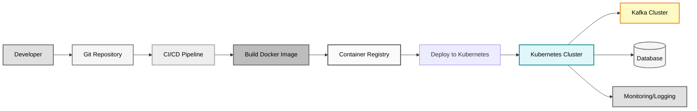

# Kubernetes Overview for Data Engineers

This page provides a comprehensive introduction to Kubernetes from a data engineering perspective, focusing on how Kubernetes helps deploy and manage Apache Kafka applications at scale.

## Introduction

Kubernetes is the industry-standard container orchestration platform for deploying, scaling, and managing containerized applications. For data engineers working with Apache Kafka, Kubernetes provides essential capabilities for running production data pipelines reliably.

This training application is Kubernetes-ready with production-grade deployment configurations that demonstrate best practices for running Kafka applications in container orchestration environments.

## Why Kubernetes for Data Engineers

### Scalability and Resource Management

Kubernetes automatically manages resource allocation and scaling for your Kafka applications:

- Auto-scale consumers based on message lag or CPU usage
- Distribute workloads across multiple nodes for better resource utilization
- Manage memory and CPU limits to prevent resource starvation
- Handle burst traffic with horizontal pod autoscaling

### High Availability

Kubernetes ensures your data pipelines stay online:

- Automatic pod restart on failures
- Health checks (liveness, readiness, startup probes)
- Rolling updates with zero downtime
- Pod disruption budgets to maintain availability during maintenance

### Configuration Management

Kubernetes provides sophisticated configuration management:

- Separate configuration from code using ConfigMaps
- Secure secrets management for database credentials and API keys
- Environment-specific configurations (dev, staging, production)
- Dynamic configuration updates without rebuilding containers

### Observability

Kubernetes integrates with monitoring and logging systems:

- Prometheus metrics collection
- Grafana dashboard integration
- Centralized logging with ELK or Loki
- Distributed tracing support

## Core Kubernetes Concepts

### Pods

A Pod is the smallest deployable unit in Kubernetes. It represents one or more containers that share network and storage.

```yaml
# Example Pod (usually managed by Deployment)
apiVersion: v1
kind: Pod
metadata:
  name: kafka-training-pod
spec:
  containers:
  - name: app
    image: kafka-training:1.0.0
    ports:
    - containerPort: 8080
```

For our Kafka training application, each pod runs a single Spring Boot container with the training application.

!!! note "Pod Lifecycle"
    Pods are ephemeral. They can be created, destroyed, and rescheduled by Kubernetes. Never rely on a specific pod being available - design for pod replacement.

### Deployments

Deployments manage replica sets and provide declarative updates for pods. They ensure the desired number of pod replicas are running.

```yaml
apiVersion: apps/v1
kind: Deployment
metadata:
  name: kafka-training-app
spec:
  replicas: 3
  selector:
    matchLabels:
      app: kafka-training
  template:
    metadata:
      labels:
        app: kafka-training
    spec:
      containers:
      - name: app
        image: kafka-training:1.0.0
```

Key features:

- **Replica management**: Maintains desired number of pods
- **Rolling updates**: Zero-downtime deployments
- **Rollback capability**: Revert to previous versions
- **Self-healing**: Replaces failed pods automatically

### Services

Services provide stable network endpoints for accessing pods. They enable load balancing across pod replicas.

```yaml
apiVersion: v1
kind: Service
metadata:
  name: kafka-training-service
spec:
  type: ClusterIP
  selector:
    app: kafka-training
  ports:
  - name: http
    port: 8080
    targetPort: 8080
```

Service types:

- **ClusterIP**: Internal cluster access only (default)
- **NodePort**: Exposes service on each node's IP
- **LoadBalancer**: Cloud provider load balancer
- **ExternalName**: Maps to external DNS name

### ConfigMaps

ConfigMaps store non-sensitive configuration data as key-value pairs.

```yaml
apiVersion: v1
kind: ConfigMap
metadata:
  name: kafka-training-config
data:
  application.properties: |
    training.kafka.client-id=kafka-training-k8s
    training.features.auto-topic-creation=true
    logging.level.com.training.kafka=INFO
```

Use ConfigMaps for:

- Application configuration files
- Environment-specific settings
- Feature flags
- Non-sensitive URLs and endpoints

### Secrets

Secrets store sensitive information like passwords, tokens, and keys.

```yaml
apiVersion: v1
kind: Secret
metadata:
  name: postgres-credentials
type: Opaque
stringData:
  username: eventmart
  password: changeme-in-production
```

!!! warning "Secret Management"
    The example above stores secrets in plain YAML for demonstration. In production, use proper secret management solutions like HashiCorp Vault, AWS Secrets Manager, or sealed-secrets.

### HorizontalPodAutoscaler

HorizontalPodAutoscaler automatically scales the number of pod replicas based on metrics.

```yaml
apiVersion: autoscaling/v2
kind: HorizontalPodAutoscaler
metadata:
  name: kafka-training-hpa
spec:
  scaleTargetRef:
    apiVersion: apps/v1
    kind: Deployment
    name: kafka-training-app
  minReplicas: 3
  maxReplicas: 10
  metrics:
  - type: Resource
    resource:
      name: cpu
      target:
        type: Utilization
        averageUtilization: 70
```

This automatically scales your Kafka consumers when CPU usage exceeds 70%.

### PodDisruptionBudget

PodDisruptionBudget ensures minimum availability during voluntary disruptions like node maintenance.

```yaml
apiVersion: policy/v1
kind: PodDisruptionBudget
metadata:
  name: kafka-training-pdb
spec:
  minAvailable: 2
  selector:
    matchLabels:
      app: kafka-training
```

This ensures at least 2 pods remain available during rolling updates or node drains.

## kubectl Basics

kubectl is the command-line tool for interacting with Kubernetes clusters.

### Essential Commands

View cluster information:

```bash
# Get cluster info
kubectl cluster-info

# View nodes
kubectl get nodes

# Check cluster health
kubectl get componentstatuses
```

Working with deployments:

```bash
# Apply configuration
kubectl apply -f k8s/deployment.yaml

# View deployments
kubectl get deployments

# View detailed deployment info
kubectl describe deployment kafka-training-app

# View deployment history
kubectl rollout history deployment/kafka-training-app
```

Managing pods:

```bash
# List pods
kubectl get pods

# View pod details
kubectl describe pod kafka-training-app-xyz123

# View pod logs
kubectl logs kafka-training-app-xyz123

# Follow logs in real-time
kubectl logs -f kafka-training-app-xyz123

# Execute command in pod
kubectl exec -it kafka-training-app-xyz123 -- /bin/sh

# View logs from previous pod instance (after crash)
kubectl logs kafka-training-app-xyz123 --previous
```

Scaling applications:

```bash
# Scale deployment manually
kubectl scale deployment kafka-training-app --replicas=5

# View horizontal pod autoscaler
kubectl get hpa

# Describe autoscaler metrics
kubectl describe hpa kafka-training-hpa
```

Updating applications:

```bash
# Update container image
kubectl set image deployment/kafka-training-app app=kafka-training:v2.0.0

# Monitor rollout status
kubectl rollout status deployment/kafka-training-app

# Rollback to previous version
kubectl rollout undo deployment/kafka-training-app

# Rollback to specific revision
kubectl rollout undo deployment/kafka-training-app --to-revision=2
```

Debugging:

```bash
# Get events
kubectl get events --sort-by='.lastTimestamp'

# Describe resource for troubleshooting
kubectl describe pod kafka-training-app-xyz123

# Port forward for local access
kubectl port-forward svc/kafka-training-service 8080:8080

# Execute commands in pod
kubectl exec kafka-training-app-xyz123 -- env | grep KAFKA
```

## Kubernetes Architecture

Understanding Kubernetes architecture helps you design better data pipelines.



### Control Plane Components

- **API Server**: Central management point for all cluster operations
- **etcd**: Distributed key-value store for cluster state
- **Scheduler**: Assigns pods to nodes based on resource requirements
- **Controller Manager**: Maintains desired cluster state

### Worker Node Components

- **Kubelet**: Agent running on each node, manages pod lifecycle
- **kube-proxy**: Network proxy, manages network rules
- **Container Runtime**: Runs containers (Docker, containerd, CRI-O)

## Kubernetes in Data Engineering Workflow



### Typical Workflow

1. **Development**: Write and test code locally using Docker Compose
2. **Version Control**: Commit code and Kubernetes manifests to Git
3. **CI/CD**: Automated builds create Docker images
4. **Registry**: Images pushed to container registry (Docker Hub, ECR, GCR)
5. **Deployment**: kubectl or GitOps tools deploy to Kubernetes
6. **Runtime**: Kubernetes manages pods, scaling, and health
7. **Monitoring**: Prometheus and Grafana track metrics and logs

## Kubernetes for Kafka Consumers

Kubernetes provides specific benefits for Kafka consumer applications:

### Consumer Group Scaling

```bash
# Scale consumers based on lag
kubectl scale deployment kafka-consumer --replicas=10

# Use HPA for automatic scaling
kubectl autoscale deployment kafka-consumer --min=3 --max=20 --cpu-percent=70
```

### Consumer Rebalancing

When pods restart or scale:

1. Kubernetes terminates old pods gracefully
2. Kafka consumer group rebalances
3. New consumers join the group
4. Partitions redistributed across consumers

!!! tip "Graceful Shutdown"
    Set `terminationGracePeriodSeconds` to allow consumers to commit offsets before shutdown.

### Partition Affinity

Use StatefulSets for consumers requiring sticky partition assignment:

```yaml
apiVersion: apps/v1
kind: StatefulSet
metadata:
  name: kafka-consumer-stateful
spec:
  serviceName: kafka-consumer
  replicas: 3
  template:
    spec:
      containers:
      - name: consumer
        image: kafka-training:1.0.0
```

## Best Practices for Data Engineers

### Resource Limits

Always set resource requests and limits:

```yaml
resources:
  requests:
    memory: "512Mi"
    cpu: "500m"
  limits:
    memory: "1Gi"
    cpu: "1000m"
```

### Health Checks

Implement all three probe types:

- **Startup**: Has the application started?
- **Liveness**: Is the application alive?
- **Readiness**: Is the application ready for traffic?

### Configuration Management

Separate configuration from code:

- Use ConfigMaps for application settings
- Use Secrets for sensitive data
- Use environment variables for runtime configuration

### Logging

Use structured logging with JSON format for better log parsing:

```yaml
env:
- name: LOGGING_PATTERN_CONSOLE
  value: '{"timestamp":"%d","level":"%p","thread":"%t","logger":"%c","message":"%m"}%n'
```

### Monitoring

Expose Prometheus metrics:

```yaml
annotations:
  prometheus.io/scrape: "true"
  prometheus.io/port: "8080"
  prometheus.io/path: "/actuator/prometheus"
```

## Namespace Organization

Organize resources by environment or team:

```bash
# Create namespaces
kubectl create namespace data-engineering
kubectl create namespace data-platform
kubectl create namespace monitoring

# Deploy to specific namespace
kubectl apply -f deployment.yaml -n data-engineering

# Set default namespace
kubectl config set-context --current --namespace=data-engineering
```

## Next Steps

Now that you understand Kubernetes fundamentals, explore the following topics:

- [Deployment Guide](deployment-guide.md) - Step-by-step deployment instructions
- [Monitoring](monitoring.md) - Set up Prometheus and Grafana
- [Scaling](scaling.md) - Configure auto-scaling for your Kafka consumers
- [Production Checklist](checklist.md) - Production readiness verification

!!! success "Kubernetes Ready"
    This training application includes production-grade Kubernetes manifests in the `k8s/` directory. You can deploy it directly to any Kubernetes cluster.
