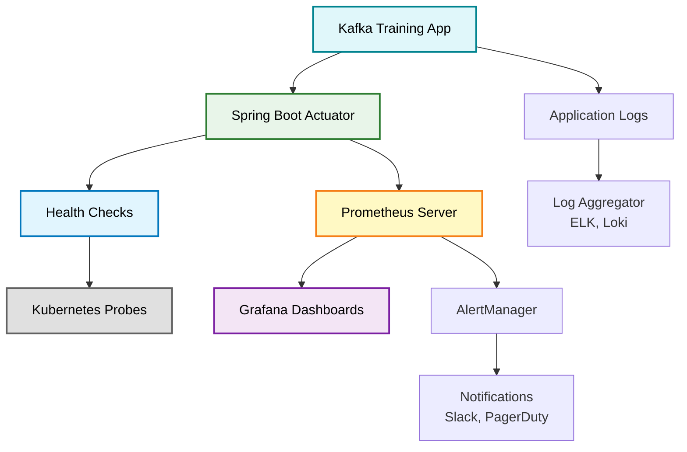

# Monitoring and Observability

This guide covers comprehensive monitoring and observability for the Kafka Training application deployed on Kubernetes. Learn how to collect metrics, set up dashboards, configure alerting, and troubleshoot issues using industry-standard tools.

## Overview

Effective monitoring is essential for production data pipelines. This application exposes metrics in Prometheus format and provides health checks for Kubernetes orchestration.

### Monitoring Stack



## Spring Boot Actuator Endpoints

The application exposes comprehensive metrics and health information through Spring Boot Actuator.

### Health Endpoints

#### Overall Health

```bash
# Check overall application health
curl http://localhost:8080/actuator/health

# Expected response
{
  "status": "UP",
  "components": {
    "diskSpace": {
      "status": "UP"
    },
    "kafka": {
      "status": "UP"
    },
    "ping": {
      "status": "UP"
    }
  }
}
```

#### Kubernetes Probes

The application implements Kubernetes-specific health endpoints:

**Startup Probe** - Has the application started?

```bash
curl http://localhost:8080/actuator/health/startup
```

**Liveness Probe** - Is the application alive?

```bash
curl http://localhost:8080/actuator/health/liveness
```

**Readiness Probe** - Is the application ready for traffic?

```bash
curl http://localhost:8080/actuator/health/readiness
```

### Metrics Endpoints

#### Application Metrics

```bash
# View all available metrics
curl http://localhost:8080/actuator/metrics

# View specific metric
curl http://localhost:8080/actuator/metrics/jvm.memory.used

# Expected response
{
  "name": "jvm.memory.used",
  "measurements": [
    {
      "statistic": "VALUE",
      "value": 268435456.0
    }
  ],
  "availableTags": [
    {
      "tag": "area",
      "values": ["heap", "nonheap"]
    }
  ]
}
```

#### Prometheus Format

```bash
# Get metrics in Prometheus format
curl http://localhost:8080/actuator/prometheus

# Sample output
# HELP jvm_memory_used_bytes The amount of used memory
# TYPE jvm_memory_used_bytes gauge
jvm_memory_used_bytes{area="heap",id="PS Eden Space",} 1.34217728E8
jvm_memory_used_bytes{area="heap",id="PS Survivor Space",} 0.0
jvm_memory_used_bytes{area="heap",id="PS Old Gen",} 2.4117248E7

# HELP kafka_consumer_fetch_manager_records_lag_max
# TYPE kafka_consumer_fetch_manager_records_lag_max gauge
kafka_consumer_fetch_manager_records_lag_max{client_id="consumer-1",} 0.0

# HELP http_server_requests_seconds
# TYPE http_server_requests_seconds summary
http_server_requests_seconds_count{exception="None",method="GET",outcome="SUCCESS",status="200",uri="/actuator/health",} 42.0
http_server_requests_seconds_sum{exception="None",method="GET",outcome="SUCCESS",status="200",uri="/actuator/health",} 0.123456789
```

### Information Endpoint

```bash
# Application information
curl http://localhost:8080/actuator/info

# Response includes build info, Git commit, etc.
{
  "app": {
    "name": "kafka-training-java",
    "version": "1.0.0"
  },
  "build": {
    "artifact": "kafka-training-java",
    "name": "kafka-training-java",
    "version": "1.0.0"
  }
}
```

## Prometheus Setup

Prometheus is the de facto standard for Kubernetes monitoring.

### Install Prometheus

#### Using Helm (Recommended)

```bash
# Add Prometheus Helm repository
helm repo add prometheus-community https://prometheus-community.github.io/helm-charts
helm repo update

# Install Prometheus with custom values
helm install prometheus prometheus-community/kube-prometheus-stack \
  --namespace monitoring \
  --create-namespace \
  --set prometheus.prometheusSpec.serviceMonitorSelectorNilUsesHelmValues=false
```

#### Using Kubernetes Manifests

```yaml
# prometheus-deployment.yaml
apiVersion: v1
kind: ConfigMap
metadata:
  name: prometheus-config
  namespace: monitoring
data:
  prometheus.yml: |
    global:
      scrape_interval: 15s
      evaluation_interval: 15s

    scrape_configs:
    - job_name: 'kafka-training'
      kubernetes_sd_configs:
      - role: pod
        namespaces:
          names:
          - data-engineering
      relabel_configs:
      - source_labels: [__meta_kubernetes_pod_annotation_prometheus_io_scrape]
        action: keep
        regex: true
      - source_labels: [__meta_kubernetes_pod_annotation_prometheus_io_path]
        action: replace
        target_label: __metrics_path__
        regex: (.+)
      - source_labels: [__address__, __meta_kubernetes_pod_annotation_prometheus_io_port]
        action: replace
        regex: ([^:]+)(?::\d+)?;(\d+)
        replacement: $1:$2
        target_label: __address__
      - action: labelmap
        regex: __meta_kubernetes_pod_label_(.+)
      - source_labels: [__meta_kubernetes_namespace]
        action: replace
        target_label: kubernetes_namespace
      - source_labels: [__meta_kubernetes_pod_name]
        action: replace
        target_label: kubernetes_pod_name

---
apiVersion: apps/v1
kind: Deployment
metadata:
  name: prometheus
  namespace: monitoring
spec:
  replicas: 1
  selector:
    matchLabels:
      app: prometheus
  template:
    metadata:
      labels:
        app: prometheus
    spec:
      containers:
      - name: prometheus
        image: prom/prometheus:v2.48.0
        args:
        - '--config.file=/etc/prometheus/prometheus.yml'
        - '--storage.tsdb.path=/prometheus'
        - '--storage.tsdb.retention.time=15d'
        ports:
        - containerPort: 9090
        volumeMounts:
        - name: config
          mountPath: /etc/prometheus
        - name: storage
          mountPath: /prometheus
      volumes:
      - name: config
        configMap:
          name: prometheus-config
      - name: storage
        emptyDir: {}

---
apiVersion: v1
kind: Service
metadata:
  name: prometheus
  namespace: monitoring
spec:
  type: ClusterIP
  selector:
    app: prometheus
  ports:
  - port: 9090
    targetPort: 9090
```

```bash
# Apply Prometheus configuration
kubectl apply -f prometheus-deployment.yaml
```

### Verify Prometheus Scraping

```bash
# Port forward to Prometheus
kubectl port-forward -n monitoring svc/prometheus 9090:9090

# Access Prometheus UI
open http://localhost:9090

# Check targets
# Navigate to Status > Targets
# You should see kafka-training pods listed
```

### Example Prometheus Queries

```promql
# JVM memory usage
jvm_memory_used_bytes{area="heap"}

# HTTP request rate
rate(http_server_requests_seconds_count[5m])

# Kafka consumer lag
kafka_consumer_fetch_manager_records_lag_max

# Pod CPU usage
rate(container_cpu_usage_seconds_total{pod=~"kafka-training-app-.*"}[5m])

# Request latency p95
histogram_quantile(0.95, sum(rate(http_server_requests_seconds_bucket[5m])) by (le, uri))

# Error rate
sum(rate(http_server_requests_seconds_count{status=~"5.."}[5m])) / sum(rate(http_server_requests_seconds_count[5m]))
```

## Grafana Dashboard Setup

Grafana provides beautiful, interactive dashboards for visualizing Prometheus metrics.

### Install Grafana

```bash
# Using Helm (included with kube-prometheus-stack)
helm install grafana prometheus-community/kube-prometheus-stack \
  --namespace monitoring \
  --create-namespace

# Or install Grafana separately
helm install grafana grafana/grafana \
  --namespace monitoring \
  --set adminPassword='admin'
```

### Access Grafana

```bash
# Get admin password
kubectl get secret -n monitoring grafana -o jsonpath="{.data.admin-password}" | base64 --decode

# Port forward to Grafana
kubectl port-forward -n monitoring svc/grafana 3000:80

# Access Grafana
open http://localhost:3000
# Login: admin / <password from above>
```

### Add Prometheus Data Source

1. Navigate to Configuration > Data Sources
2. Click "Add data source"
3. Select "Prometheus"
4. Set URL: `http://prometheus:9090`
5. Click "Save & Test"

### Import Spring Boot Dashboard

```bash
# Download Spring Boot dashboard JSON
curl -o spring-boot-dashboard.json \
  https://grafana.com/api/dashboards/11378/revisions/9/download

# Import in Grafana UI:
# 1. Click "+" > Import
# 2. Upload spring-boot-dashboard.json
# 3. Select Prometheus data source
# 4. Click "Import"
```

### Custom Kafka Training Dashboard

Create a custom dashboard with these panels:

#### Panel 1: Request Rate

```promql
sum(rate(http_server_requests_seconds_count{namespace="data-engineering"}[5m])) by (uri)
```

#### Panel 2: Request Latency

```promql
histogram_quantile(0.95,
  sum(rate(http_server_requests_seconds_bucket{namespace="data-engineering"}[5m]))
  by (le, uri)
)
```

#### Panel 3: Kafka Consumer Lag

```promql
kafka_consumer_fetch_manager_records_lag_max{namespace="data-engineering"}
```

#### Panel 4: JVM Memory

```promql
jvm_memory_used_bytes{area="heap", namespace="data-engineering"}
```

#### Panel 5: Pod Count

```promql
count(kube_pod_info{namespace="data-engineering", pod=~"kafka-training-app-.*"})
```

#### Panel 6: Error Rate

```promql
sum(rate(http_server_requests_seconds_count{status=~"5..", namespace="data-engineering"}[5m]))
```

## Application Metrics

The application exposes custom metrics for Kafka operations.

### Kafka Producer Metrics

```promql
# Messages sent per second
kafka_producer_record_send_total

# Producer request latency
kafka_producer_request_latency_avg

# Producer buffer available bytes
kafka_producer_buffer_available_bytes
```

### Kafka Consumer Metrics

```promql
# Messages consumed per second
kafka_consumer_records_consumed_total

# Consumer lag by partition
kafka_consumer_records_lag

# Consumer fetch latency
kafka_consumer_fetch_latency_avg

# Last poll age (should be low)
kafka_consumer_last_poll_seconds_ago
```

### Kafka Streams Metrics

```promql
# Stream processing rate
kafka_streams_stream_task_process_rate

# State store size
kafka_streams_stream_state_bytes_total

# Stream thread state
kafka_streams_stream_thread_state
```

### Consumer Lag Monitoring

Consumer lag is critical for data pipeline health.

```promql
# Total consumer lag across all partitions
sum(kafka_consumer_fetch_manager_records_lag_max) by (client_id, topic)

# Alert if lag > 1000
ALERTS FOR lag > 1000
```

**Consumer Lag Calculation**:

```
Lag = Latest Offset - Consumer Offset
```

Monitor lag to detect:

- Slow consumers
- Increased message volume
- Consumer failures
- Partition imbalance

## Alerting

Configure alerts for critical conditions.

### AlertManager Configuration

```yaml
# alertmanager-config.yaml
apiVersion: v1
kind: ConfigMap
metadata:
  name: alertmanager-config
  namespace: monitoring
data:
  alertmanager.yml: |
    global:
      slack_api_url: 'https://hooks.slack.com/services/YOUR/SLACK/WEBHOOK'

    route:
      receiver: 'slack-notifications'
      group_by: ['alertname', 'cluster', 'service']
      group_wait: 10s
      group_interval: 10s
      repeat_interval: 12h

    receivers:
    - name: 'slack-notifications'
      slack_configs:
      - channel: '#alerts'
        title: 'Kafka Training Alert'
        text: '{{ range .Alerts }}{{ .Annotations.description }}{{ end }}'
```

### Prometheus Alert Rules

```yaml
# prometheus-rules.yaml
apiVersion: v1
kind: ConfigMap
metadata:
  name: prometheus-rules
  namespace: monitoring
data:
  kafka-training-alerts.yml: |
    groups:
    - name: kafka-training
      interval: 30s
      rules:

      # High consumer lag
      - alert: HighConsumerLag
        expr: kafka_consumer_fetch_manager_records_lag_max > 1000
        for: 5m
        labels:
          severity: warning
        annotations:
          summary: "High consumer lag detected"
          description: "Consumer {{ $labels.client_id }} has lag of {{ $value }} messages"

      # Pod not ready
      - alert: PodNotReady
        expr: kube_pod_status_ready{namespace="data-engineering", pod=~"kafka-training-app-.*", condition="true"} == 0
        for: 5m
        labels:
          severity: critical
        annotations:
          summary: "Pod not ready"
          description: "Pod {{ $labels.pod }} has been not ready for 5 minutes"

      # High error rate
      - alert: HighErrorRate
        expr: sum(rate(http_server_requests_seconds_count{status=~"5..", namespace="data-engineering"}[5m])) / sum(rate(http_server_requests_seconds_count{namespace="data-engineering"}[5m])) > 0.05
        for: 5m
        labels:
          severity: warning
        annotations:
          summary: "High HTTP error rate"
          description: "Error rate is {{ $value | humanizePercentage }}"

      # High memory usage
      - alert: HighMemoryUsage
        expr: jvm_memory_used_bytes{area="heap", namespace="data-engineering"} / jvm_memory_max_bytes{area="heap", namespace="data-engineering"} > 0.9
        for: 5m
        labels:
          severity: warning
        annotations:
          summary: "High JVM heap usage"
          description: "JVM heap usage is {{ $value | humanizePercentage }} for pod {{ $labels.pod }}"

      # Kafka connection down
      - alert: KafkaConnectionDown
        expr: up{job="kafka-training"} == 0
        for: 1m
        labels:
          severity: critical
        annotations:
          summary: "Cannot connect to Kafka"
          description: "Application cannot connect to Kafka cluster"

      # High request latency
      - alert: HighRequestLatency
        expr: histogram_quantile(0.95, sum(rate(http_server_requests_seconds_bucket{namespace="data-engineering"}[5m])) by (le, uri)) > 1
        for: 10m
        labels:
          severity: warning
        annotations:
          summary: "High request latency"
          description: "P95 latency for {{ $labels.uri }} is {{ $value }}s"
```

```bash
# Apply alert rules
kubectl apply -f prometheus-rules.yaml
```

## Health Checks

Kubernetes uses health checks to manage pod lifecycle.

### Startup Probe

Allows slow-starting applications time to initialize:

```yaml
startupProbe:
  httpGet:
    path: /actuator/health/startup
    port: http
  initialDelaySeconds: 10
  periodSeconds: 5
  timeoutSeconds: 3
  failureThreshold: 30  # 150 seconds total startup time
```

### Liveness Probe

Restarts container if application becomes unresponsive:

```yaml
livenessProbe:
  httpGet:
    path: /actuator/health/liveness
    port: http
  initialDelaySeconds: 60
  periodSeconds: 10
  timeoutSeconds: 5
  failureThreshold: 3  # Restart after 3 failed checks
```

### Readiness Probe

Removes pod from service if not ready to serve traffic:

```yaml
readinessProbe:
  httpGet:
    path: /actuator/health/readiness
    port: http
  initialDelaySeconds: 30
  periodSeconds: 5
  timeoutSeconds: 3
  failureThreshold: 3  # Remove from service after 3 failed checks
```

### Custom Health Indicators

The application implements custom health indicators:

```java
@Component
public class KafkaHealthIndicator implements HealthIndicator {
    @Override
    public Health health() {
        try {
            // Check Kafka connectivity
            adminClient.listTopics().names().get(5, TimeUnit.SECONDS);
            return Health.up()
                .withDetail("kafka", "Connected")
                .build();
        } catch (Exception e) {
            return Health.down()
                .withDetail("kafka", "Disconnected")
                .withDetail("error", e.getMessage())
                .build();
        }
    }
}
```

## Log Aggregation

Centralized logging is essential for troubleshooting distributed systems.

### ELK Stack (Elasticsearch, Logstash, Kibana)

```bash
# Install ELK using Helm
helm repo add elastic https://helm.elastic.co
helm repo update

# Install Elasticsearch
helm install elasticsearch elastic/elasticsearch \
  --namespace logging \
  --create-namespace

# Install Kibana
helm install kibana elastic/kibana \
  --namespace logging

# Install Filebeat for log collection
helm install filebeat elastic/filebeat \
  --namespace logging
```

### Loki and Promtail (Lightweight Alternative)

```bash
# Install Loki stack
helm repo add grafana https://grafana.github.io/helm-charts
helm install loki grafana/loki-stack \
  --namespace logging \
  --create-namespace \
  --set grafana.enabled=true
```

### Structured Logging

Configure structured JSON logging for better parsing:

```yaml
# application-kubernetes.yml
logging:
  pattern:
    console: '{"timestamp":"%d{yyyy-MM-dd HH:mm:ss.SSS}","level":"%p","thread":"%t","logger":"%c{1}","message":"%m","trace":"%X{traceId}","span":"%X{spanId}"}%n'
  level:
    root: INFO
    com.training.kafka: INFO
```

### Query Logs

```bash
# Using kubectl logs
kubectl logs -n data-engineering -l app=kafka-training --tail=100

# Filter logs
kubectl logs -n data-engineering -l app=kafka-training | grep ERROR

# Multiple pods with stern (better than kubectl)
stern -n data-engineering kafka-training
```

## Troubleshooting with Metrics

### High CPU Usage

```promql
# Check CPU usage
rate(container_cpu_usage_seconds_total{pod=~"kafka-training-app-.*"}[5m])

# Identify hot threads
jvm_threads_states_threads{state="runnable"}
```

Actions:
- Check for infinite loops
- Review Kafka consumer poll settings
- Optimize stream processing logic
- Scale horizontally

### Memory Leaks

```promql
# Heap usage over time
jvm_memory_used_bytes{area="heap"} / jvm_memory_max_bytes{area="heap"}

# Garbage collection frequency
rate(jvm_gc_pause_seconds_count[5m])
```

Actions:
- Enable heap dump on OOM: `-XX:+HeapDumpOnOutOfMemoryError`
- Analyze heap dump with MAT or VisualVM
- Check for unclosed resources
- Review caching strategies

### Slow Requests

```promql
# Request duration P99
histogram_quantile(0.99,
  sum(rate(http_server_requests_seconds_bucket[5m])) by (le, uri)
)
```

Actions:
- Enable distributed tracing
- Check database query performance
- Review Kafka consumer fetch settings
- Add caching layer

## Next Steps

Continue with production preparation:

- [Scaling](scaling.md) - Configure auto-scaling for optimal resource usage
- [Production Checklist](checklist.md) - Verify production readiness
- [Security](../architecture/security.md) - Implement security best practices

!!! success "Monitoring Configured"
    With Prometheus, Grafana, and proper health checks, you now have complete observability into your Kafka data pipelines.
