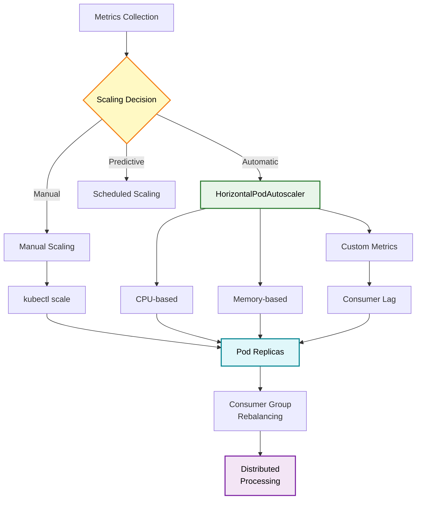

# Scaling Kafka Applications on Kubernetes

This guide covers scaling strategies for Kafka consumer applications deployed on Kubernetes. Learn how to scale manually, configure auto-scaling based on metrics, and optimize resource allocation for maximum throughput.

## Overview

Proper scaling ensures your Kafka consumers can handle message volume while minimizing costs. Kubernetes provides powerful scaling capabilities perfect for data pipelines.

### Scaling Strategies



## Manual Scaling

Manual scaling gives you direct control over replica count.

### Scale Up

```bash
# Scale to 5 replicas
kubectl scale deployment kafka-training-app --replicas=5 -n data-engineering

# Verify scaling
kubectl get pods -n data-engineering -l app=kafka-training -w
```

### Scale Down

```bash
# Scale down to 2 replicas
kubectl scale deployment kafka-training-app --replicas=2 -n data-engineering

# Watch graceful shutdown
kubectl get pods -n data-engineering -w
```

### Scaling Considerations

When scaling Kafka consumers:

1. **Consumer Group Rebalancing**: Kafka redistributes partitions across consumers
2. **Graceful Shutdown**: Consumers commit offsets before terminating
3. **Maximum Parallelism**: Cannot exceed number of partitions
4. **Resource Allocation**: Ensure cluster has sufficient resources

!!! warning "Partition Limit"
    If a topic has 10 partitions, scaling beyond 10 consumer replicas provides no additional parallelism. Extra consumers will remain idle.

### Check Consumer Group

```bash
# Port forward to application
kubectl port-forward -n data-engineering svc/kafka-training-service 8080:8080

# Check consumer group lag
curl http://localhost:8080/api/training/day02/consumer-lag/training-consumer-group
```

## HorizontalPodAutoscaler (HPA)

HPA automatically adjusts replica count based on observed metrics.

### CPU-Based Autoscaling

The default HPA configuration scales based on CPU utilization:

```yaml
apiVersion: autoscaling/v2
kind: HorizontalPodAutoscaler
metadata:
  name: kafka-training-hpa
  namespace: data-engineering
spec:
  scaleTargetRef:
    apiVersion: apps/v1
    kind: Deployment
    name: kafka-training-app
  minReplicas: 3
  maxReplicas: 10
  metrics:
  - type: Resource
    resource:
      name: cpu
      target:
        type: Utilization
        averageUtilization: 70  # Target 70% CPU
```

```bash
# Apply HPA
kubectl apply -f k8s/deployment.yaml -n data-engineering

# View HPA status
kubectl get hpa -n data-engineering

# Expected output:
# NAME                  REFERENCE                      TARGETS   MINPODS   MAXPODS   REPLICAS
# kafka-training-hpa    Deployment/kafka-training-app  45%/70%   3         10        3
```

### Memory-Based Autoscaling

Add memory-based scaling alongside CPU:

```yaml
apiVersion: autoscaling/v2
kind: HorizontalPodAutoscaler
metadata:
  name: kafka-training-hpa
  namespace: data-engineering
spec:
  scaleTargetRef:
    apiVersion: apps/v1
    kind: Deployment
    name: kafka-training-app
  minReplicas: 3
  maxReplicas: 10
  metrics:
  - type: Resource
    resource:
      name: cpu
      target:
        type: Utilization
        averageUtilization: 70
  - type: Resource
    resource:
      name: memory
      target:
        type: Utilization
        averageUtilization: 80  # Target 80% memory
```

!!! tip "Multiple Metrics"
    When using multiple metrics, HPA scales based on the metric suggesting the highest replica count.

### Scaling Behavior

Control how quickly HPA scales up and down:

```yaml
apiVersion: autoscaling/v2
kind: HorizontalPodAutoscaler
metadata:
  name: kafka-training-hpa
  namespace: data-engineering
spec:
  scaleTargetRef:
    apiVersion: apps/v1
    kind: Deployment
    name: kafka-training-app
  minReplicas: 3
  maxReplicas: 10
  metrics:
  - type: Resource
    resource:
      name: cpu
      target:
        type: Utilization
        averageUtilization: 70

  behavior:
    scaleDown:
      stabilizationWindowSeconds: 300  # Wait 5 minutes before scaling down
      policies:
      - type: Percent
        value: 10  # Scale down max 10% of current replicas
        periodSeconds: 60  # Every 60 seconds
      selectPolicy: Min  # Use most conservative policy

    scaleUp:
      stabilizationWindowSeconds: 0  # Scale up immediately
      policies:
      - type: Percent
        value: 50  # Scale up max 50% of current replicas
        periodSeconds: 60
      - type: Pods
        value: 2  # Or add max 2 pods
        periodSeconds: 60
      selectPolicy: Max  # Use most aggressive policy
```

**Key Parameters**:

- `stabilizationWindowSeconds`: Prevents flapping by waiting before scaling
- `policies`: Define rate of scaling changes
- `selectPolicy`: Choose between `Min`, `Max`, or `Disabled`

### Monitor HPA Activity

```bash
# Watch HPA in real-time
kubectl get hpa -n data-engineering -w

# View HPA details
kubectl describe hpa kafka-training-hpa -n data-engineering

# Check HPA events
kubectl get events -n data-engineering --field-selector involvedObject.name=kafka-training-hpa
```

## Custom Metrics Autoscaling

Scale based on Kafka-specific metrics like consumer lag.

### Prerequisites

Install metrics adapter:

```bash
# Install Prometheus Adapter
helm repo add prometheus-community https://prometheus-community.github.io/helm-charts
helm install prometheus-adapter prometheus-community/prometheus-adapter \
  --namespace monitoring \
  --set prometheus.url=http://prometheus.monitoring.svc \
  --set prometheus.port=9090
```

### Configure Custom Metrics

Create a custom metric for consumer lag:

```yaml
# prometheus-adapter-values.yaml
rules:
- seriesQuery: 'kafka_consumer_fetch_manager_records_lag_max{namespace="data-engineering"}'
  resources:
    overrides:
      namespace:
        resource: namespace
      pod:
        resource: pod
  name:
    matches: "^kafka_consumer_fetch_manager_records_lag_max$"
    as: "kafka_consumer_lag"
  metricsQuery: 'max(kafka_consumer_fetch_manager_records_lag_max{<<.LabelMatchers>>}) by (<<.GroupBy>>)'
```

### Consumer Lag-Based HPA

```yaml
apiVersion: autoscaling/v2
kind: HorizontalPodAutoscaler
metadata:
  name: kafka-training-lag-hpa
  namespace: data-engineering
spec:
  scaleTargetRef:
    apiVersion: apps/v1
    kind: Deployment
    name: kafka-training-app
  minReplicas: 3
  maxReplicas: 20
  metrics:
  - type: Pods
    pods:
      metric:
        name: kafka_consumer_lag
      target:
        type: AverageValue
        averageValue: "1000"  # Scale when avg lag > 1000 messages per pod
```

**Scaling Logic**:
- If average lag per pod > 1000: scale up
- If average lag per pod < 1000: scale down (within behavior constraints)
- Ensures lag stays under control as message volume increases

### Request Rate-Based Scaling

Scale based on API request rate:

```yaml
apiVersion: autoscaling/v2
kind: HorizontalPodAutoscaler
metadata:
  name: kafka-training-requests-hpa
  namespace: data-engineering
spec:
  scaleTargetRef:
    apiVersion: apps/v1
    kind: Deployment
    name: kafka-training-app
  minReplicas: 3
  maxReplicas: 15
  metrics:
  - type: Pods
    pods:
      metric:
        name: http_requests_per_second
      target:
        type: AverageValue
        averageValue: "100"  # Target 100 req/sec per pod
```

### Verify Custom Metrics

```bash
# List available custom metrics
kubectl get --raw /apis/custom.metrics.k8s.io/v1beta1 | jq .

# Query specific metric
kubectl get --raw "/apis/custom.metrics.k8s.io/v1beta1/namespaces/data-engineering/pods/*/kafka_consumer_lag" | jq .
```

## Resource Requests and Limits

Proper resource allocation is critical for scaling.

### Understanding Requests vs Limits

```yaml
resources:
  requests:
    memory: "512Mi"  # Guaranteed minimum
    cpu: "500m"      # Guaranteed minimum (0.5 CPU)
  limits:
    memory: "1Gi"    # Maximum allowed
    cpu: "1000m"     # Maximum allowed (1 CPU)
```

- **Requests**: Kubernetes uses this for scheduling decisions
- **Limits**: Container is throttled (CPU) or killed (memory) if exceeded

### Calculate Resource Requirements

#### Memory Sizing

```
Total Memory = Base JVM + Heap + Off-Heap + Overhead

Base JVM:        ~100 MB
Heap:            -Xmx setting (e.g., 512 MB)
Off-Heap:        ~200 MB (buffers, direct memory)
Container:       ~50 MB
Kubernetes:      ~138 MB overhead
-------------------
Total:           ~1 GB
```

Set limits with 20-30% headroom:

```yaml
resources:
  requests:
    memory: "768Mi"
  limits:
    memory: "1Gi"
```

#### CPU Sizing

Monitor actual CPU usage:

```bash
# Check current CPU usage
kubectl top pods -n data-engineering
```

Typical patterns:
- **Idle**: 50-100m CPU
- **Light load**: 200-500m CPU
- **Heavy load**: 800m-2000m CPU

Set requests to typical usage, limits to peak:

```yaml
resources:
  requests:
    cpu: "500m"  # Typical usage
  limits:
    cpu: "2000m"  # Peak usage (bursts)
```

### JVM Tuning for Containers

Configure JVM to respect container limits:

```yaml
env:
- name: JAVA_OPTS
  value: >-
    -XX:+UseContainerSupport
    -XX:MaxRAMPercentage=75.0
    -XX:InitialRAMPercentage=50.0
    -XX:+UseG1GC
    -XX:MaxGCPauseMillis=200
    -XX:+ParallelRefProcEnabled
    -XX:+UseStringDeduplication
```

**Key Options**:
- `UseContainerSupport`: Detect container memory limits
- `MaxRAMPercentage=75`: Use 75% of container memory for heap
- `UseG1GC`: Low-latency garbage collector
- `MaxGCPauseMillis=200`: Target GC pause time

## Performance Tuning for Kafka Consumers

### Consumer Configuration

Optimize consumer settings for throughput:

```yaml
env:
- name: SPRING_KAFKA_CONSUMER_MAX_POLL_RECORDS
  value: "500"  # Messages per poll

- name: SPRING_KAFKA_CONSUMER_FETCH_MIN_SIZE
  value: "50000"  # Min bytes per fetch (50 KB)

- name: SPRING_KAFKA_CONSUMER_FETCH_MAX_WAIT
  value: "500"  # Max wait time (ms)

- name: SPRING_KAFKA_CONSUMER_SESSION_TIMEOUT
  value: "30000"  # Session timeout (30 sec)

- name: SPRING_KAFKA_CONSUMER_HEARTBEAT_INTERVAL
  value: "3000"  # Heartbeat interval (3 sec)
```

### Producer Configuration

Optimize producer for batch efficiency:

```yaml
env:
- name: SPRING_KAFKA_PRODUCER_BATCH_SIZE
  value: "65536"  # Batch size (64 KB)

- name: SPRING_KAFKA_PRODUCER_LINGER_MS
  value: "20"  # Wait time to fill batch

- name: SPRING_KAFKA_PRODUCER_COMPRESSION_TYPE
  value: "lz4"  # Fast compression

- name: SPRING_KAFKA_PRODUCER_BUFFER_MEMORY
  value: "67108864"  # Buffer memory (64 MB)
```

### Thread Pool Sizing

Configure consumer concurrency:

```yaml
env:
- name: SPRING_KAFKA_LISTENER_CONCURRENCY
  value: "3"  # Concurrent consumer threads per pod
```

**Total Consumers** = Pods × Concurrency

Example: 5 pods × 3 concurrency = 15 total consumers

!!! tip "Partition Alignment"
    For optimal resource usage, align total consumers with partition count. If you have 30 partitions, use 10 pods × 3 concurrency = 30 consumers.

## PodDisruptionBudget

Ensure availability during maintenance and scaling operations.

```yaml
apiVersion: policy/v1
kind: PodDisruptionBudget
metadata:
  name: kafka-training-pdb
  namespace: data-engineering
spec:
  minAvailable: 2  # Always keep at least 2 pods running
  selector:
    matchLabels:
      app: kafka-training
```

Alternatively, use percentage:

```yaml
spec:
  minAvailable: 50%  # Keep at least 50% of pods running
```

Or specify max unavailable:

```yaml
spec:
  maxUnavailable: 1  # At most 1 pod can be unavailable
```

**Use Cases**:
- Node drains during cluster upgrades
- Rolling deployment updates
- Auto-scaling scale-down events

```bash
# Verify PDB
kubectl get pdb -n data-engineering

# Test disruption
kubectl drain node-1 --ignore-daemonsets
# PDB prevents draining too many pods at once
```

## Scaling Strategies by Workload

### Real-Time Processing

For low-latency, real-time processing:

```yaml
# Fast scaling, low lag tolerance
minReplicas: 5
maxReplicas: 20
metrics:
- type: Pods
  pods:
    metric:
      name: kafka_consumer_lag
    target:
      averageValue: "100"  # Scale at low lag

behavior:
  scaleUp:
    stabilizationWindowSeconds: 0
    policies:
    - type: Percent
      value: 100  # Double capacity quickly
```

### Batch Processing

For batch processing with higher lag tolerance:

```yaml
# Slower scaling, higher lag tolerance
minReplicas: 2
maxReplicas: 50
metrics:
- type: Pods
  pods:
    metric:
      name: kafka_consumer_lag
    target:
      averageValue: "10000"  # Scale at higher lag

behavior:
  scaleUp:
    stabilizationWindowSeconds: 60
    policies:
    - type: Pods
      value: 5  # Add 5 pods at a time
```

### Cost-Optimized

For cost-sensitive workloads:

```yaml
# Aggressive scale-down
minReplicas: 1
maxReplicas: 10
metrics:
- type: Resource
  resource:
    name: cpu
    target:
      averageUtilization: 80  # Higher threshold

behavior:
  scaleDown:
    stabilizationWindowSeconds: 600  # Wait 10 min
    policies:
    - type: Percent
      value: 25  # Reduce by 25% at most
```

## Node Affinity and Pod Placement

Control where pods are scheduled for optimal performance.

### Spread Across Zones

Distribute pods across availability zones:

```yaml
spec:
  affinity:
    podAntiAffinity:
      preferredDuringSchedulingIgnoredDuringExecution:
      - weight: 100
        podAffinityTerm:
          labelSelector:
            matchLabels:
              app: kafka-training
          topologyKey: topology.kubernetes.io/zone
```

### Spread Across Nodes

Prevent all pods on same node:

```yaml
spec:
  affinity:
    podAntiAffinity:
      requiredDuringSchedulingIgnoredDuringExecution:
      - labelSelector:
          matchLabels:
            app: kafka-training
        topologyKey: kubernetes.io/hostname
```

### Collocate with Kafka

Schedule pods on same nodes as Kafka brokers:

```yaml
spec:
  affinity:
    podAffinity:
      preferredDuringSchedulingIgnoredDuringExecution:
      - weight: 50
        podAffinityTerm:
          labelSelector:
            matchLabels:
              app: kafka
          topologyKey: kubernetes.io/hostname
```

## Testing Scaling

### Load Testing

Generate load to trigger scaling:

```bash
# Generate traffic
kubectl run load-generator --rm -it --image=busybox -- /bin/sh

# Inside the container
while true; do
  wget -q -O- http://kafka-training-service.data-engineering.svc:8080/api/training/day03/send-batch?count=1000
  sleep 1
done
```

### Observe Scaling

```bash
# Watch HPA in action
kubectl get hpa -n data-engineering -w

# Monitor pod count
kubectl get pods -n data-engineering -l app=kafka-training -w

# Check metrics
kubectl top pods -n data-engineering
```

### Verify Consumer Rebalancing

```bash
# Watch logs for rebalance events
kubectl logs -n data-engineering -l app=kafka-training -f | grep -i rebalance

# Expected output:
# (Re-)joining group
# Successfully joined group with generation 42
# Setting offset for partition user-events-0 to 12345
```

## Troubleshooting Scaling Issues

### HPA Not Scaling

**Problem**: HPA shows `<unknown>` for metrics

```bash
kubectl describe hpa kafka-training-hpa -n data-engineering
```

**Solutions**:
- Install/verify metrics-server
- Check resource requests are set
- Verify pods are running and ready

### Excessive Scaling

**Problem**: HPA constantly scales up and down

**Solutions**:
- Increase `stabilizationWindowSeconds`
- Adjust metric thresholds
- Review scaling behavior policies
- Check for metric spikes

### Pods Pending After Scale-Up

**Problem**: New pods stuck in Pending state

```bash
kubectl describe pod kafka-training-app-xyz -n data-engineering
```

**Causes**:
- Insufficient cluster resources
- Node selector constraints
- PodDisruptionBudget too restrictive
- Image pull errors

**Solutions**:
- Add cluster nodes
- Increase node resources
- Adjust pod resource requests
- Review affinity rules

## Best Practices

1. **Start Conservative**: Begin with lower replica counts and scale gradually
2. **Monitor First**: Establish baseline metrics before enabling auto-scaling
3. **Set Appropriate Limits**: Match max replicas to partition count
4. **Use PDB**: Prevent too many pods terminating simultaneously
5. **Test Thoroughly**: Load test scaling behavior before production
6. **Gradual Scale-Down**: Use longer stabilization windows for scale-down
7. **Resource Alignment**: Ensure requests match actual usage patterns
8. **Multi-Metric**: Combine CPU, memory, and custom metrics
9. **Track Costs**: Monitor resource usage and costs, especially with auto-scaling

## Next Steps

- [Production Checklist](checklist.md) - Verify readiness before going live
- [Monitoring](monitoring.md) - Set up comprehensive observability
- [Security](../architecture/security.md) - Implement security best practices

!!! success "Scaling Configured"
    Your Kafka consumers now automatically scale based on load, ensuring optimal performance and cost efficiency.
