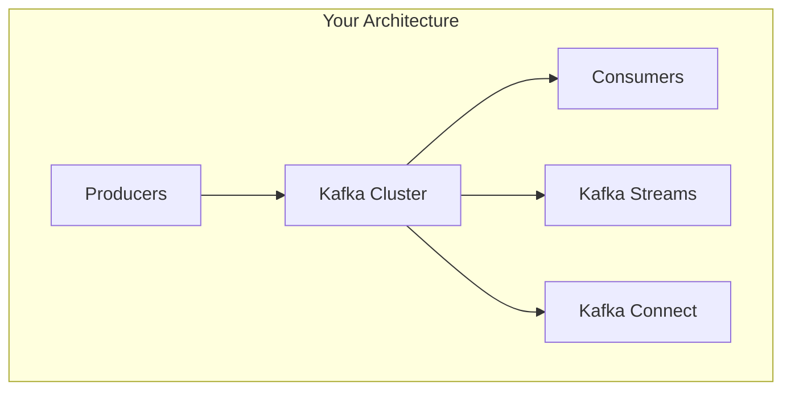

# Capstone Presentation Guide - Java Track

!!! note "Track Selection"
    This guide is for Java/Spring Boot developers working on the EventMart microservices project.

    - Python/Data Engineering Track: See [Python Capstone Guide](capstone-guide-python.md)
    - Optional Extensions: See [Capstone Extensions](capstone-extensions.md)

## Overview

The capstone presentation is your opportunity to demonstrate mastery of Apache Kafka and event-driven architecture using **Java and Spring Boot**. This guide will help you prepare a compelling presentation that showcases your technical skills and understanding of the **EventMart** e-commerce platform.

## Presentation Format

### Duration: 25 Minutes Total

- **Architecture Overview**: 5 minutes
- **Live Demonstration**: 10 minutes
- **Technical Deep Dive**: 5 minutes
- **Q&A**: 5 minutes

### Audience

Your presentation will be evaluated by:
- Technical instructors
- Fellow trainees
- Potential technical leads or architects

Assume your audience has Kafka knowledge but wants to see YOUR implementation and understanding.

## Part 1: Architecture Overview (5 minutes)

### What to Cover

#### System Architecture Diagram
Present a clear diagram showing:
- Kafka cluster topology
- Topics and partitions
- Producer applications
- Consumer groups
- Stream processing pipelines
- External integrations (databases, APIs)



#### Key Design Decisions
Explain:
1. **Why this architecture?** - Business requirements that drove design
2. **Partition strategy** - How you chose partition counts and keys
3. **Replication factor** - Your reliability vs performance tradeoffs
4. **Topic organization** - How you structured your event model

#### Technology Stack
Show your complete stack:
- Apache Kafka 3.8.0
- Spring Boot 2.7.18 with Spring Kafka
- Schema Registry with Avro
- Docker & Kubernetes for deployment
- Monitoring tools (Prometheus/Grafana)

### Presentation Tips

✅ **Do:**

- Use visual diagrams - not bullet points
- Explain your reasoning for design choices
- Reference real-world patterns you followed
- Show understanding of tradeoffs

❌ **Don't:**

- Read from slides
- Go into code details yet (save for deep dive)
- Rush through - this sets context for everything
- Use unexplained jargon

### Example Talking Points

> "I designed a microservices architecture with 5 core topics: users, products, orders, payments, and inventory. I chose 6 partitions for the orders topic based on expected throughput of 1000 orders/sec, giving us ~170 orders/sec per partition which Kafka handles easily. The partition key is order_id to ensure all events for an order go to the same partition, maintaining order-level consistency."

## Part 2: Live Demonstration (10 minutes)

### Pre-Demo Checklist

Before your presentation:

- [ ] System is running and stable
- [ ] Demo data is loaded and ready
- [ ] Monitoring dashboards are visible
- [ ] Backup recorded demo ready (if live demo fails)
- [ ] Terminal windows sized for projector
- [ ] Kafka UI is accessible
- [ ] All necessary tabs/windows are open

### Demo Flow

#### 1. Show the System Running (2 min)

```bash
# Show all services healthy
docker-compose ps

# Access Kafka UI
open http://localhost:8081

# Show topics and partitions
# Show consumer groups
# Show lag metrics
```

**Narrate what you're showing:**
> "Here's my complete event-driven system running in Docker. You can see all 8 services are healthy - Kafka broker, Schema Registry, Kafka Connect, and my 5 microservices. In Kafka UI, I have 5 core topics with real-time data flowing..."

#### 2. Demonstrate Core Functionality (4 min)

**Choose 2-3 key features to demonstrate:**

**Example 1: Order Processing Pipeline**
```bash
# Create a new order (Producer)
curl -X POST http://localhost:8080/api/orders \
  -H "Content-Type: application/json" \
  -d '{
    "userId": "user123",
    "items": [{"productId": "prod456", "quantity": 2}]
  }'

# Show event in Kafka UI
# Show order ID in response

# Show consumer processing
docker-compose logs -f order-processor

# Show state in database
docker-compose exec postgres psql -U kafka -c "SELECT * FROM orders WHERE order_id='...'"
```

**Example 2: Stream Processing**
```bash
# Show real-time aggregations
curl http://localhost:8080/api/analytics/sales-by-product

# Demonstrate windowed operations
curl http://localhost:8080/api/analytics/revenue-last-hour

# Show Kafka Streams topology
open http://localhost:8080/api/streams/topology
```

**Example 3: Schema Evolution**
```bash
# Show current schema
curl http://localhost:8082/subjects/orders-value/versions/1

# Deploy new schema version
curl -X POST http://localhost:8082/subjects/orders-value/versions \
  -H "Content-Type: application/vnd.schemaregistry.v1+json" \
  -d '{"schema": "..."}'

# Show backward compatibility
# Demonstrate old consumers still work
```

#### 3. Show Monitoring & Observability (2 min)

**Metrics Dashboard:**
```bash
# Open Grafana
open http://localhost:3000

# Show key metrics:
# - Messages per second
# - Consumer lag
# - Partition distribution
# - Error rates
```

**Explain what you're monitoring:**
> "This Grafana dashboard shows our key metrics. You can see we're processing 500 messages/second with zero consumer lag, indicating our system is keeping up with load. The partition distribution is balanced across all brokers..."

#### 4. Demonstrate Resilience (2 min)

**Show fault tolerance:**
```bash
# Kill a consumer
docker-compose stop order-processor

# Show rebalancing in Kafka UI
# Show lag increasing

# Restart consumer
docker-compose start order-processor

# Show lag recovering
# Show messages being processed
```

### Demo Best Practices

✅ **Do:**

- Rehearse multiple times
- Keep terminal windows organized
- Narrate what you're doing
- Show interesting failure scenarios
- Have data ready to demonstrate
- Show real-time monitoring

❌ **Don't:**

- Type long commands live (use aliases or scripts)
- Assume things will work (test right before)
- Show errors you can't explain
- Spend time waiting for builds
- Navigate confusing UIs without explanation

### Demo Backup Plan

If live demo fails:

1. Have a recorded video ready
2. Have screenshots of key screens
3. Can walk through code instead
4. Don't panic - explain what should happen

## Part 3: Technical Deep Dive (5 minutes)

### Code Walkthrough

Choose 2-3 code sections that demonstrate Kafka expertise:

#### Example 1: Producer Implementation

```java
@Service
public class OrderProducer {

    @Autowired
    private KafkaTemplate<String, Order> kafkaTemplate;

    public CompletableFuture<SendResult<String, Order>> publishOrder(Order order) {
        // Partition key selection
        String key = order.getUserId();

        // Async send with callback
        return kafkaTemplate.send("orders", key, order)
            .whenComplete((result, ex) -> {
                if (ex != null) {
                    log.error("Failed to send order {}: {}",
                        order.getOrderId(), ex.getMessage());
                    // Implement retry or DLQ logic
                } else {
                    log.info("Order {} sent to partition {}",
                        order.getOrderId(),
                        result.getRecordMetadata().partition());
                }
            });
    }
}
```

**Explain your choices:**
> "I use the userId as the partition key to ensure all orders from the same user go to the same partition, maintaining order-level consistency. The async send with callback allows me to handle errors gracefully without blocking. In production, failed sends would go to a dead letter queue..."

#### Example 2: Consumer Implementation

```java
@KafkaListener(topics = "orders", groupId = "order-processor")
public void processOrder(
    @Payload Order order,
    @Header(KafkaHeaders.RECEIVED_PARTITION_ID) int partition,
    @Header(KafkaHeaders.OFFSET) long offset) {

    try {
        // Idempotent processing check
        if (orderRepository.existsById(order.getOrderId())) {
            log.warn("Order {} already processed, skipping",
                order.getOrderId());
            return;
        }

        // Process order
        Order processed = orderService.process(order);
        orderRepository.save(processed);

        log.info("Processed order {} from partition {} offset {}",
            order.getOrderId(), partition, offset);

    } catch (Exception e) {
        log.error("Error processing order {}: {}",
            order.getOrderId(), e.getMessage());
        // Send to DLQ for manual review
        dlqProducer.send(order, e);
    }
}
```

**Explain your patterns:**
> "This consumer implements idempotent processing by checking if an order was already processed before saving. This handles duplicate deliveries that can occur during rebalancing. Errors are caught and sent to a dead letter queue for manual review rather than blocking the entire pipeline..."

#### Example 3: Stream Processing

```java
@Bean
public KStream<String, Order> orderStream(StreamsBuilder builder) {

    KStream<String, Order> orders = builder.stream("orders");

    // Real-time sales aggregation
    orders
        .groupBy((key, order) -> order.getProductId())
        .windowedBy(TimeWindows.of(Duration.ofHours(1)))
        .aggregate(
            () -> new SalesMetrics(),
            (key, order, metrics) -> {
                metrics.incrementCount();
                metrics.addRevenue(order.getTotalAmount());
                return metrics;
            },
            Materialized.as("sales-by-product-hourly")
        )
        .toStream()
        .to("sales-metrics");

    return orders;
}
```

**Explain your approach:**
> "This Kafka Streams topology performs real-time sales aggregation. I use tumbling windows of 1 hour to calculate rolling metrics. The results are materialized to a state store for querying and also published to a sales-metrics topic for downstream consumers. This pattern allows for both real-time dashboards and batch analytics..."

### Challenges Overcome

Discuss 1-2 interesting problems you solved:

**Example: Handling Backpressure**

> "During testing, I discovered that the payment service couldn't keep up with order volume during peak hours. I implemented a rate limiter on the producer side and added more consumer instances with partition reassignment. This reduced end-to-end latency from 5 seconds to under 500ms..."

**Example: Schema Evolution**

> "I needed to add optional fields to the order schema without breaking existing consumers. I used Avro's BACKWARD compatibility mode and set default values for new fields. This allowed me to deploy new producers without downtime..."

## Part 4: Q&A (5 minutes)

### Expected Questions

Be prepared to answer:

#### Architecture Questions

- "Why did you choose this partition count?"
- "How would you scale this to handle 10x traffic?"
- "What happens if a broker fails?"
- "How do you ensure exactly-once semantics?"

#### Implementation Questions

- "How do you handle duplicate messages?"
- "What's your strategy for schema evolution?"
- "How do you monitor consumer lag?"
- "What happens if processing fails?"

#### Operations Questions

- "How do you deploy updates without downtime?"
- "What's your disaster recovery plan?"
- "How do you handle rebalancing during peak load?"
- "What security measures did you implement?"

### Answering Tips

✅ **Good Answer Structure:**
1. **Direct answer** - Answer the question first
2. **Reasoning** - Explain your thought process
3. **Tradeoffs** - Acknowledge alternatives
4. **Evidence** - Reference what you observed

**Example:**
> Q: "How do you handle duplicate messages?"
>
> A: "I implement idempotent processing by checking for duplicate order IDs before saving to the database. This is necessary because Kafka guarantees at-least-once delivery, so duplicates can occur during rebalancing. An alternative would be transactions, but that adds complexity and I determined the DB check was sufficient for our use case. During testing, I confirmed this prevented duplicate orders from being billed..."

❌ **Avoid:**
- "I don't know" (say "I'd research that approach...")
- Guessing at answers
- Defensive responses
- Overly long explanations

## Assessment Criteria

### Technical Implementation (40 points)

**Excellent (36-40):**

- Correct Kafka patterns throughout
- Robust error handling
- Appropriate configurations
- Clean, maintainable code

**Good (30-35):**

- Mostly correct patterns
- Basic error handling
- Reasonable configurations
- Working code

**Needs Improvement (<30):**

- Incorrect patterns
- Missing error handling
- Default configurations
- Buggy code

### System Design (30 points)

**Excellent (27-30):**

- Well-reasoned architecture
- Scalability considered
- Monitoring implemented
- Production-ready

**Good (22-26):**

- Reasonable architecture
- Basic scalability
- Some monitoring
- Nearly production-ready

**Needs Improvement (<22):**

- Poor architecture
- No scalability plan
- No monitoring
- Not production-ready

### Demonstration (20 points)

**Excellent (18-20):**

- Smooth, rehearsed demo
- Clear explanations
- Working system
- Good storytelling

**Good (15-17):**

- Working demo
- Adequate explanations
- Minor issues
- Gets point across

**Needs Improvement (<15):**

- Failed demo
- Poor explanations
- Major issues
- Confusing

### Understanding (10 points)

**Excellent (9-10):**

- Deep understanding
- Explains tradeoffs
- Answers all questions
- Shows expertise

**Good (7-8):**

- Good understanding
- Answers most questions
- Some depth
- Competent

**Needs Improvement (<7):**

- Surface understanding
- Can't answer questions
- No depth
- Learning mode

## Preparation Timeline

### 1 Week Before

- [ ] Complete all core features
- [ ] Write comprehensive tests
- [ ] Set up monitoring
- [ ] Document architecture decisions
- [ ] Create initial slides

### 3 Days Before

- [ ] Polish implementation
- [ ] Rehearse demo flow
- [ ] Prepare demo data
- [ ] Test on clean environment
- [ ] Record backup video

### 1 Day Before

- [ ] Final rehearsal
- [ ] Test all demo scenarios
- [ ] Prepare Q&A answers
- [ ] Review slides
- [ ] Check equipment

### Presentation Day

- [ ] Arrive early
- [ ] Test projection/screen
- [ ] Start services
- [ ] Load demo data
- [ ] Verify connectivity
- [ ] Stay calm and confident!

## Sample Presentation Structure

### Slide Deck Outline

**Slide 1: Title**

- Project name
- Your name
- Date

**Slide 2: Problem Statement**

- Business challenge
- Technical requirements
- Success criteria

**Slide 3: Architecture Overview**

- System diagram
- Key components
- Data flow

**Slide 4: Technology Stack**

- Kafka ecosystem
- Frameworks and tools
- Infrastructure

**Slide 5: Key Design Decisions**

- Partition strategy
- Schema approach
- Error handling
- Monitoring

**Slide 6: Demo (Live)**

- No slides needed
- Just your running system

**Slide 7: Technical Highlights**

- Code snippets
- Interesting problems solved
- Performance results

**Slide 8: Metrics & Results**

- Throughput achieved
- Latency measurements
- Error rates
- Scalability demonstrated

**Slide 9: Lessons Learned**

- What worked well
- What was challenging
- What you'd do differently

**Slide 10: Next Steps**

- Future enhancements
- Production readiness tasks
- Questions?

## Additional Resources

### Example Projects to Study

- EventMart (in this repository)
- Confluent Examples GitHub
- Kafka Summit presentations
- Apache Kafka use cases

### Presentation Skills

- Practice with peers
- Record yourself
- Get feedback
- Watch technical talks online

### Technical Resources

- [Kafka Documentation](https://kafka.apache.org/documentation/)
- [Spring Kafka Reference](https://docs.spring.io/spring-kafka/reference/)
- [Confluent Blog](https://www.confluent.io/blog/)
- Your training day documentation

---

## Final Tips

**Remember:**

- You know this material - you built it
- Technical depth matters more than polish
- Show your problem-solving process
- It's okay to say "I'd need to research that"
- Your understanding is what's being assessed

**You've got this!**

You've spent 8 days mastering Kafka. Now show what you've learned with confidence!

---

**Questions?** Review this guide thoroughly and practice your presentation multiple times. Good luck!
