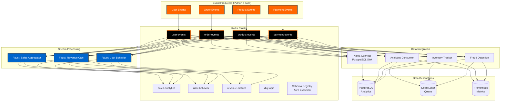

# Capstone Presentation Guide - Python Data Engineering Track

!!! note "Track Selection"
    This guide is for Python data engineers working on the Real-Time E-Commerce Analytics Platform.

    - Java/Spring Boot Track: See [Java Capstone Guide](capstone-guide-java.md)
    - Optional Extensions: See [Capstone Extensions](capstone-extensions.md)

## Overview

The capstone presentation is your opportunity to demonstrate mastery of Apache Kafka and real-time data engineering using Python. This guide will help you prepare a compelling presentation that showcases your technical skills in building production-grade streaming analytics platforms.

**Project:** Real-Time E-Commerce Analytics Platform

**Tech Stack:** Python, Kafka, Faust, Avro, PostgreSQL, Docker

**Days Covered:** All concepts from Days 1-8

## Project Architecture

### System Overview



### Core Components

| Component | Technology | Purpose | Days Covered |
|-----------|-----------|---------|--------------|
| **Topic Management** | kafka-python AdminClient | Create/configure topics | Day 1 |
| **Event Producers** | confluent-kafka + Avro | Publish e-commerce events | Days 3, 5 |
| **Event Consumers** | confluent-kafka + Avro | Process events, DLQ handling | Days 4, 8 |
| **Stream Processing** | Faust | Real-time aggregations, windowing | Day 6 |
| **Data Integration** | Kafka Connect | Sink to PostgreSQL | Day 7 |
| **Security** | SASL_SSL | Authentication & encryption | Day 8 |
| **Monitoring** | Prometheus + Grafana | Metrics, lag tracking | Day 8 |

## Presentation Format

### Duration: 25 Minutes Total

- **Architecture Overview**: 5 minutes
- **Live Demonstration**: 10 minutes
- **Technical Deep Dive**: 5 minutes
- **Q&A**: 5 minutes

### Audience

Your presentation will be evaluated by:

- Data engineering instructors
- Fellow data engineers
- Potential technical leads or data platform architects

Assume your audience understands Kafka concepts but wants to see YOUR Python implementation and data engineering decisions.

## Part 1: Architecture Overview (5 minutes)

### Business Problem

**Example Opening:**

> "I built a real-time analytics platform for an e-commerce company that needs to process millions of events per day - user registrations, product views, orders, and payments. The business needs to see sales metrics, inventory levels, and fraud alerts in real-time, not hours later in a batch job."

### Data Architecture

Present your architecture showing:

- **Data Sources**: 4 event types (users, orders, products, payments)
- **Kafka Topics**: 8 topics with partition strategy
- **Stream Processing**: Faust applications
- **Data Sinks**: PostgreSQL for analytics, DLQ for errors
- **Monitoring**: Prometheus metrics

**Key Talking Points:**

- **Partition Strategy**: "I chose 6 partitions for orders topic because we expect 1000 orders/sec peak, giving us ~170/sec per partition which Kafka handles easily."
- **Schema Evolution**: "All events use Avro schemas registered in Schema Registry, allowing backward-compatible schema evolution without breaking consumers."
- **DLQ Pattern**: "Failed messages go to a dead letter queue topic instead of blocking the pipeline, where they can be debugged and replayed."

### Topic Design

Show your topic layout:

| Topic | Partitions | Retention | Purpose |
|-------|-----------|-----------|---------|
| `user-events` | 3 | 7 days | User registration, profile updates |
| `order-events` | 6 | 30 days | Orders placed, confirmed, cancelled |
| `product-events` | 3 | 7 days | Product updates, inventory changes |
| `payment-events` | 6 | 90 days | Payment lifecycle (compliance) |
| `sales-analytics` | 3 | 7 days | Real-time sales aggregations |
| `user-behavior` | 3 | 7 days | User session tracking |
| `revenue-metrics` | 3 | 30 days | Revenue calculations |
| `dlq-topic` | 1 | 14 days | Failed message handling |

**Explain Your Reasoning:**

- Why these partition counts? (Expected throughput)
- Why these retention periods? (Business requirements, compliance)
- Why separate topics? (Decoupling, scaling, security)

### Technology Stack

**Data Ingestion:**

- `confluent-kafka[avro]` for production-grade producers (Days 3, 5)
- Avro Schema Registry for type safety (Day 5)
- Idempotent producers for exactly-once (Day 3)

**Data Processing:**

- `faust-streaming` for real-time aggregations (Day 6)
- Windowing (hourly, daily) for time-based metrics
- Stateful processing with RocksDB state store

**Data Integration:**

- Kafka Connect JDBC Sink to PostgreSQL (Day 7)
- Python REST client for connector management

**Operations:**

- Docker Compose for local development
- Prometheus for metrics collection (Day 8)
- Grafana for visualization
- SASL_SSL for security (Day 8)

### Presentation Tips

!!! tip "Best Practices"
    - Use diagrams, not bullet points
    - Explain WHY you made design choices
    - Show understanding of tradeoffs
    - Reference data engineering best practices

!!! warning "Common Mistakes"
    - Reading from slides
    - Skipping explanation of your reasoning
    - Using jargon without explanation
    - Rushing through - this sets context

## Part 2: Live Demonstration (10 minutes)

### Pre-Demo Checklist

Before your presentation:

- [ ] All Docker containers running (`docker-compose ps`)
- [ ] Topics created and verified (`kafka-topics --list`)
- [ ] Schema Registry has all 4 schemas
- [ ] Sample data loaded
- [ ] Kafka UI accessible (http://localhost:8080)
- [ ] Grafana dashboard open (http://localhost:3000)
- [ ] Terminal windows prepared
- [ ] Backup screenshots ready

### Demo Flow

#### Show the System Running (2 min)

```bash
# Show all services healthy
docker-compose ps

# Expected output:
# kafka                    Up
# schema-registry          Up
# kafka-connect            Up
# postgres                 Up
# analytics-consumer       Up
# sales-aggregator         Up
# prometheus               Up
# grafana                  Up
```

**Open Kafka UI:**

```bash
# Show topics and their messages
open http://localhost:8080

# Narrate:
# "Here are my 8 topics with real-time data flowing..."
# "You can see the partition distribution and consumer groups..."
```

#### Generate Real-Time Events (3 min)

**Run the demo data generator:**

```bash
# Generate 100 events across all types
python -m ecommerce_analytics.demo.run_demo --events 100

# Narrate what's happening:
# "I'm generating user registrations, product views, orders, and payments..."
# "Each event is serialized with Avro and sent to the appropriate topic..."
```

**Show events in Kafka UI:**

- Navigate to `order-events` topic
- Show message with Avro schema
- Explain the event structure

**Show consumer processing:**

```bash
# View consumer logs
docker-compose logs -f analytics-consumer --tail=50

# Point out:
# - Manual offset commits (Day 4)
# - Idempotent processing checks
# - Error handling with DLQ
```

#### Demonstrate Stream Processing (3 min)

**Show Faust aggregations:**

```bash
# Check Faust web UI
curl http://localhost:6066/

# Or view logs
docker-compose logs -f sales-aggregator --tail=30
```

**Explain what you're seeing:**

> "This Faust app is doing real-time sales aggregation. It groups orders by product_id and maintains a running total. The state is stored in RocksDB for fault tolerance."

**Show windowed metrics:**

```bash
# Query revenue metrics (windowed by hour)
docker-compose logs -f revenue-calculator --tail=20

# Explain:
# "This uses tumbling windows of 1 hour to calculate revenue..."
# "Each window is materialized and queryable via Faust web API..."
```

#### Show Data Integration (2 min)

**PostgreSQL data:**

```bash
# Query analytics database
docker-compose exec postgres psql -U kafka -d analytics -c "
  SELECT product_id, total_sales, last_updated
  FROM sales_metrics
  ORDER BY total_sales DESC
  LIMIT 10;
"

# Explain:
# "Kafka Connect JDBC Sink is continuously writing aggregated data..."
# "This allows our BI team to query with standard SQL tools..."
```

**Show Kafka Connect status:**

```bash
# Check connector health
curl http://localhost:8083/connectors/postgres-sink/status | python -m json.tool

# Point out:
# - Connector state (RUNNING)
# - Task status
# - Last error (should be none)
```

#### Demonstrate Error Handling (Optional if time)

**Show DLQ:**

```bash
# Simulate bad event (manually publish malformed JSON)
# Show it lands in DLQ topic

# View DLQ messages
kafka-console-consumer --bootstrap-server localhost:9092 \
  --topic dlq-topic --from-beginning --max-messages 5

# Explain:
# "Instead of crashing the pipeline, bad messages go to DLQ..."
# "We can debug them later and replay if needed..."
```

### Demo Best Practices

!!! tip "Successful Demo Techniques"
    - Rehearse multiple times
    - Narrate what's happening
    - Show interesting data patterns
    - Highlight key concepts from Days 1-8
    - Use terminal aliases for long commands

!!! warning "Demo Pitfalls to Avoid"
    - Typing complex commands live (use scripts)
    - Assuming things will work perfectly
    - Showing errors you can't explain
    - Rushing through without explanation

## Part 3: Technical Deep Dive (5 minutes)

### Code Walkthrough

Choose 2-3 code sections that demonstrate your mastery:

### Example 1: Avro Producer with Error Handling (Days 3, 5, 8)

```python
# producers/order_event_producer.py

from confluent_kafka import Producer
from confluent_kafka.schema_registry import SchemaRegistryClient
from confluent_kafka.schema_registry.avro import AvroSerializer
from error_handling.dlq_handler import DLQHandler

class OrderEventProducer:
    def __init__(self):
        # Schema Registry client (Day 5)
        self.schema_registry = SchemaRegistryClient({'url': 'http://localhost:8081'})

        # Load Avro schema
        with open('schemas/order_events.avsc') as f:
            schema_str = f.read()

        # Avro serializer (Day 5)
        self.avro_serializer = AvroSerializer(
            self.schema_registry,
            schema_str,
            self._order_to_dict
        )

        # Producer config with idempotence (Day 3)
        self.producer = Producer({
            'bootstrap.servers': 'localhost:9092',
            'enable.idempotence': True,      # Exactly-once (Day 3)
            'acks': 'all',                    # Durability (Day 3)
            'retries': 3,                     # Retry logic (Day 3)
            'compression.type': 'snappy',     # Compression (Day 3)
            'linger.ms': 10,                  # Batching (Day 3)
            'max.in.flight.requests.per.connection': 5
        })

        self.dlq_handler = DLQHandler()  # Day 8

    def send_order_placed(self, order):
        """Send order event with error handling"""
        try:
            # Serialize with Avro (Day 5)
            value = self.avro_serializer(order, SerializationContext('order-events', MessageField.VALUE))

            # Async send with callback (Day 3)
            self.producer.produce(
                topic='order-events',
                key=order['user_id'].encode('utf-8'),  # Partition by user
                value=value,
                on_delivery=self._delivery_callback
            )

            # Flush to ensure delivery
            self.producer.flush(timeout=10)

        except Exception as e:
            # Send to DLQ instead of failing (Day 8)
            self.dlq_handler.send_to_dlq('order-events', order, e)
            raise

    def _delivery_callback(self, err, msg):
        """Handle delivery confirmation (Day 3)"""
        if err:
            logger.error(f"Delivery failed: {err}")
        else:
            logger.info(f"Message delivered to {msg.topic()} [{msg.partition()}] @ {msg.offset()}")
```

**Explain Your Choices:**

> "I use confluent-kafka instead of kafka-python here because it's C-based and performs better for production workloads. The idempotent producer ensures exactly-once semantics - critical for financial data like orders. If serialization fails, the event goes to DLQ so I can debug it later without blocking the pipeline."

### Example 2: Consumer with Manual Commits and DLQ (Days 4, 8)

```python
# consumers/analytics_consumer.py

from confluent_kafka import Consumer, KafkaError
from confluent_kafka.schema_registry.avro import AvroDeserializer
import psycopg2

class AnalyticsConsumer:
    def __init__(self):
        # Consumer config (Day 4)
        self.consumer = Consumer({
            'bootstrap.servers': 'localhost:9092',
            'group.id': 'analytics-processor',
            'auto.offset.reset': 'earliest',
            'enable.auto.commit': False,      # Manual commits (Day 4)
            'max.poll.records': 100,
            'session.timeout.ms': 30000
        })

        # Avro deserializer (Day 5)
        self.avro_deserializer = AvroDeserializer(
            self.schema_registry,
            schema_str=None  # Auto-fetch from registry
        )

        self.consumer.subscribe(['order-events'])
        self.db_conn = psycopg2.connect(...)
        self.dlq_handler = DLQHandler()

    def process_batch(self):
        """Process messages with idempotent handling (Day 4)"""
        messages = self.consumer.consume(num_messages=100, timeout=1.0)

        for msg in messages:
            if msg.error():
                if msg.error().code() == KafkaError._PARTITION_EOF:
                    continue
                else:
                    raise KafkaException(msg.error())

            try:
                # Deserialize Avro (Day 5)
                order = self.avro_deserializer(msg.value(), SerializationContext(msg.topic(), MessageField.VALUE))

                # Idempotent check (Day 4)
                if self._already_processed(order['order_id']):
                    logger.warning(f"Order {order['order_id']} already processed, skipping")
                    self.consumer.commit(message=msg)  # Manual commit (Day 4)
                    continue

                # Process order
                self._update_analytics(order)

                # Commit offset after successful processing (Day 4)
                self.consumer.commit(message=msg)

            except ValueError as e:
                # Deserialization error - send to DLQ (Day 8)
                logger.error(f"Invalid message format: {e}")
                self.dlq_handler.send_to_dlq(msg.topic(), msg.value(), e)
                self.consumer.commit(message=msg)  # Commit to move past bad message

            except Exception as e:
                # Processing error - send to DLQ (Day 8)
                logger.error(f"Processing failed: {e}")
                self.dlq_handler.send_to_dlq(msg.topic(), order, e)
                # Don't commit - will retry on rebalance

    def _already_processed(self, order_id):
        """Check if order already in database (idempotency)"""
        cursor = self.db_conn.cursor()
        cursor.execute("SELECT 1 FROM orders WHERE order_id = %s", (order_id,))
        return cursor.fetchone() is not None
```

**Explain Your Pattern:**

> "This consumer implements at-least-once processing with idempotency checks. Manual offset commits ensure we only commit after successful processing. The database check prevents duplicate orders if Kafka delivers the same message twice during rebalancing. Errors go to DLQ for debugging without blocking the entire consumer group."

### Example 3: Faust Stream Processing (Day 6)

```python
# streams/sales_aggregator.py

import faust
from datetime import timedelta

# Faust app definition (Day 6)
app = faust.App(
    'sales-aggregator',
    broker='kafka://localhost:9092',
    value_serializer='json',
    store='rocksdb://'  # Stateful processing
)

# Define Avro-compatible record
class OrderEvent(faust.Record, serializer='json'):
    order_id: str
    product_id: str
    quantity: int
    amount: float
    timestamp: int

# Input topic
orders_topic = app.topic('order-events', value_type=OrderEvent)

# State table for aggregations (Day 6)
sales_table = app.Table('sales_by_product', default=float)

# Stream processing agent (Day 6)
@app.agent(orders_topic)
async def aggregate_sales(orders):
    """Real-time sales aggregation by product"""
    async for order in orders.group_by(OrderEvent.product_id):
        # Update running total (stateful)
        current_total = sales_table[order.product_id]
        new_total = current_total + order.amount
        sales_table[order.product_id] = new_total

        # Emit to output topic
        await sales_output_topic.send(value={
            'product_id': order.product_id,
            'total_sales': new_total,
            'last_updated': order.timestamp
        })

        logger.info(f"Product {order.product_id}: ${new_total:.2f}")

# Windowed revenue calculation (Day 6)
@app.agent(orders_topic)
async def hourly_revenue(orders):
    """Calculate revenue per hour using tumbling windows"""
    async for window in orders.tumbling(3600.0):  # 1-hour windows
        total_revenue = sum(order.amount for order in window)

        await revenue_topic.send(value={
            'window_start': window.start,
            'window_end': window.end,
            'revenue': total_revenue
        })

# Web endpoint for interactive queries (Day 6)
@app.page('/sales/{product_id}')
async def get_sales(self, request, product_id):
    """Query current sales for product"""
    total = sales_table[product_id]
    return self.json({'product_id': product_id, 'total_sales': total})
```

**Explain Your Approach:**

> "Faust is Python's answer to Kafka Streams - it provides stateful stream processing with a clean async API. This aggregator maintains running totals in RocksDB, which survives restarts. The windowing function uses tumbling windows to calculate hourly revenue. I can query the current state via the web API, making it useful for dashboards."

## Part 4: Q&A (5 minutes)

### Expected Questions & How to Answer

### Architecture Questions

**Q: "Why did you choose these partition counts?"**

**Good Answer:**

> "I chose 6 partitions for orders based on expected throughput. We're processing about 1000 orders/sec at peak, so 6 partitions gives us ~170 orders/sec per partition. Kafka can easily handle 10,000+ messages/sec per partition, so this gives us 60x headroom. For user events, I only used 3 partitions because registration rate is much lower, around 100/sec."

**Q: "How would you scale this to handle 10x more traffic?"**

**Good Answer:**

> "First, I'd increase partition counts proportionally - 60 partitions for orders instead of 6. Then I'd scale consumer groups by adding more consumer instances up to the partition count. For Faust, I'd run multiple worker instances. The JDBC sink might become a bottleneck, so I'd switch to batch inserts or use ClickHouse for better write throughput. I'd also consider separating hot path (real-time) from cold path (historical analytics)."

### Implementation Questions

**Q: "How do you handle duplicate messages?"**

**Good Answer:**

> "I implement idempotent processing by checking the order_id in PostgreSQL before inserting. This handles Kafka's at-least-once delivery guarantee. I also use idempotent producers with `enable.idempotence=True`, which prevents duplicates on the producer side. The combination gives us effectively exactly-once semantics without the complexity of transactions."

**Q: "What's your strategy for schema evolution?"**

**Good Answer:**

> "All my schemas use BACKWARD compatibility mode in Schema Registry. When I need to add fields, I make them optional with default values. For example, if I add an 'order_priority' field, I set `default: 'NORMAL'`. This lets new producers send the field while old consumers ignore it. I test compatibility with `schema-registry-client` before deploying. Breaking changes require creating a new topic."

**Q: "How do you monitor consumer lag?"**

**Good Answer:**

> "I export consumer lag metrics to Prometheus using the `kafka-python` consumer's `position()` and `end_offsets()` methods. The lag is calculated as `end_offset - current_position`. Grafana shows this in real-time. I alert if lag exceeds 10,000 messages for more than 5 minutes, which indicates consumers can't keep up. My DLQ pattern prevents poison pills from causing lag."

### Data Engineering Questions

**Q: "Why use Faust instead of PySpark Streaming?"**

**Good Answer:**

> "Faust is lighter weight and easier to deploy for this use case. It's built specifically for Kafka and has lower latency than Spark micro-batching. For simple aggregations and windowing, Faust is perfect. However, for complex joins across multiple data sources or heavy ML inference, I'd switch to PySpark. It's about using the right tool - Faust for operational analytics, Spark for complex batch+stream processing."

**Q: "How do you ensure data quality?"**

**Good Answer:**

> "Schema validation is my first line of defense - Avro ensures type safety. I also implement business logic validation in consumers before processing. For example, order amounts must be positive, timestamps must be recent. Invalid events go to DLQ with the validation error logged. I could extend this with Great Expectations for comprehensive data profiling and quality checks."

### Answering Tips

!!! tip "Good Answer Structure"
    1. **Direct answer** - Answer the question immediately
    2. **Reasoning** - Explain your thought process
    3. **Tradeoffs** - Acknowledge alternatives
    4. **Evidence** - Reference what you observed/measured

!!! warning "What to Avoid"
    - "I don't know" → Say "I'd research that approach and consider..."
    - Guessing without basis
    - Getting defensive about design choices
    - Overly long explanations

## Assessment Criteria

### Technical Implementation (40 points)

**Excellent (36-40):**

- All Days 1-8 concepts correctly implemented
- Production-grade error handling (DLQ, retries)
- Proper Avro schema design with evolution
- Idempotent producers and consumers
- Comprehensive monitoring

**Good (30-35):**

- Most concepts correctly implemented
- Basic error handling present
- Avro schemas used consistently
- Manual offset commits
- Some monitoring

**Needs Improvement (<30):**

- Missing key concepts
- No error handling
- Schema evolution not addressed
- Auto-commit still enabled
- No monitoring

### System Design (30 points)

**Excellent (27-30):**

- Well-reasoned partition strategy
- Appropriate topic design
- Security implemented (SASL_SSL)
- Scalability considered
- Data quality checks

**Good (22-26):**

- Reasonable partition counts
- Topics properly separated
- Basic security (SSL)
- Some scalability planning

**Needs Improvement (<22):**

- Poor partition strategy
- Topics not well designed
- No security
- No scalability plan

### Demonstration (20 points)

**Excellent (18-20):**

- Smooth, rehearsed demo
- Shows all components working
- Clear narration
- Handles questions during demo
- Good storytelling

**Good (15-17):**

- Working demo
- Shows main components
- Adequate explanations
- Minor issues

**Needs Improvement (<15):**

- Demo failures
- Unclear explanations
- Major technical issues

### Understanding (10 points)

**Excellent (9-10):**

- Deep understanding of Kafka
- Explains data engineering patterns
- Answers all Q&A confidently
- Shows mastery of Python ecosystem

**Good (7-8):**

- Good Kafka understanding
- Answers most questions
- Shows competence

**Needs Improvement (<7):**

- Surface understanding
- Can't answer technical questions
- Lacks depth

## Preparation Timeline

### 1 Week Before

- [ ] Complete all producers, consumers, streams
- [ ] All Avro schemas registered
- [ ] DLQ handling implemented
- [ ] Kafka Connect sinks configured
- [ ] Monitoring dashboard created
- [ ] Documentation written

### 3 Days Before

- [ ] Full end-to-end test in Docker
- [ ] Generate realistic sample data
- [ ] Create demo script
- [ ] Record backup video
- [ ] Prepare slides

### 1 Day Before

- [ ] Final rehearsal (3x minimum)
- [ ] Test all demo commands
- [ ] Review Days 1-8 concepts
- [ ] Prepare Q&A answers
- [ ] Get good sleep!

### Presentation Day

- [ ] Arrive 15 min early
- [ ] Start all Docker services
- [ ] Verify Kafka UI accessible
- [ ] Verify Grafana dashboard
- [ ] Load sample data
- [ ] Breathe and be confident!

## Resources

### Your Training Materials

- [Day 1: Kafka Foundation](../training/day01-foundation.md)
- [Day 3: Producers](../training/day03-producers.md)
- [Day 4: Consumers](../training/day04-consumers.md)
- [Day 5: Schema Registry](../training/day05-schema-registry.md)
- [Day 6: Streams](../training/day06-streams.md)
- [Day 7: Kafka Connect](../training/day07-connect.md)
- [Day 8: Security & Advanced](../training/day08-advanced.md)

### Python Examples

- `examples/python/day01_admin.py` - Topic management
- `examples/python/day03_producer.py` - Producer patterns
- `examples/python/day04_consumer.py` - Consumer patterns
- `examples/python/day05_avro_producer.py` - Avro serialization
- `examples/python/day06_streams_faust.py` - Faust streaming
- `examples/python/day08_security.py` - Security configs

### External Resources

- [Confluent Kafka Python Docs](https://docs.confluent.io/kafka-clients/python/current/overview.html)
- [Faust Documentation](https://faust.readthedocs.io/)
- [Avro Specification](https://avro.apache.org/docs/current/spec.html)
- [Kafka Connect Guide](https://docs.confluent.io/platform/current/connect/index.html)

## Final Tips

**Remember:**

- You've built this system - you know it best
- Data engineering is about understanding tradeoffs
- Show your problem-solving process
- It's okay to say "I'd research that" for unknowns
- Your implementation demonstrates Days 1-8 mastery

**You've got this!**

You've spent 8 days mastering Kafka from a data engineering perspective. Now showcase your real-time analytics platform with confidence!

**Next Steps:**

- Review [Capstone Extensions](capstone-extensions.md) for Airflow/Flink add-ons
- Check your Python source code in `src/main/python/ecommerce_analytics/`
- Run the demo: `python -m ecommerce_analytics.demo.run_demo`

Good luck with your presentation!
