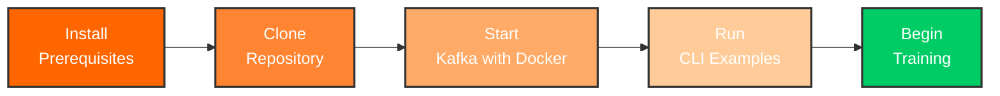

# Getting Started

Welcome to the Kafka Training program for data engineers! This section will help you set up your environment and start learning Apache Kafka with platform-agnostic, container-first practices.

!!! tip "Data Engineer Focused"
    This training teaches pure Kafka fundamentals using CLI tools and raw APIs - no framework lock-in. Perfect for data engineers working with Spark, Flink, Python, or any data platform.

## Choose Your Learning Path

### Data Engineer (Recommended)

If you're a data engineer learning Kafka:

1. Read the [Overview](overview.md) to understand the curriculum
2. Check [Prerequisites](prerequisites.md) and install Docker + Java
3. Follow the [Installation Guide](installation.md) for detailed setup
4. Run pure Kafka examples with [Quick Start](quick-start.md)

**Estimated Time**: 30-45 minutes

### Java Developer (Alternative Spring Boot Track)

If you want Spring Boot integration patterns:

1. Verify [Prerequisites](prerequisites.md) are installed
2. Jump to [Quick Start](quick-start.md) and choose Spring Boot tab
3. Start with [Day 1 Training](../training/day01-foundation.md)

**Estimated Time**: 10-15 minutes

### Experienced Kafka User

If you've used Kafka before and want container-first workflows:

1. Verify [Prerequisites](prerequisites.md)
2. Clone and run with [Quick Start](quick-start.md)
3. Explore [Container Development](../containers/index.md)
4. Jump to [Advanced Topics](../training/day08-advanced.md)

**Estimated Time**: 5 minutes

## What's Included

This training provides:

- **8 Days of Structured Learning** - From basics to production
- **Pure Kafka APIs** - No framework abstractions, transferable skills
- **CLI-First Workflows** - Master native Kafka command-line tools
- **Complete Development Environment** - Docker Compose setup
- **Production Deployment** - Kubernetes manifests and guides
- **EventMart Project** - Real-world e-commerce platform
- **Optional Spring Boot Track** - REST API and web UI examples

## Quick Setup Overview

## Next Steps

Start with the [Overview](overview.md) to understand the training program, or jump directly to [Quick Start](quick-start.md) if you're ready to begin!
