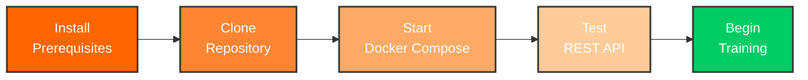

# Getting Started

Welcome to the Kafka Training program! This section will help you set up your environment and start learning Apache Kafka with a container-first approach.

## Choose Your Learning Path

### Complete Beginner (New to Kafka)

If you're new to Kafka or distributed systems:

1. Read the [Overview](overview.md) to understand what you'll learn
2. Check [Prerequisites](prerequisites.md) and install required tools
3. Follow the [Installation Guide](installation.md) for detailed setup
4. Run your first Kafka application with [Quick Start](quick-start.md)

**Estimated Time**: 30-45 minutes

### Experienced Developer (Know Java, New to Kafka)

If you're comfortable with Java but new to Kafka:

1. Verify [Prerequisites](prerequisites.md) are installed
2. Jump to [Quick Start](quick-start.md) for 5-minute setup
3. Start with [Day 1 Training](../training/day01-foundation.md)

**Estimated Time**: 10-15 minutes

### Kafka User (Want to Deepen Knowledge)

If you've used Kafka before:

1. Verify [Prerequisites](prerequisites.md)
2. Clone and run with [Quick Start](quick-start.md)
3. Explore [Container Development](../containers/index.md)
4. Jump to [Advanced Topics](../training/day08-advanced.md)

**Estimated Time**: 5 minutes

## What's Included

This training provides:

- **8 Days of Structured Learning** - From basics to production
- **90+ Integration Tests** - Using TestContainers with real Kafka
- **Complete Development Environment** - Docker Compose setup
- **Production Deployment** - Kubernetes manifests and guides
- **REST API** - Spring Boot application with JSON endpoints
- **EventMart Project** - Real-world e-commerce platform

## Quick Setup Overview

## Next Steps

Start with the [Overview](overview.md) to understand the training program, or jump directly to [Quick Start](quick-start.md) if you're ready to begin!
