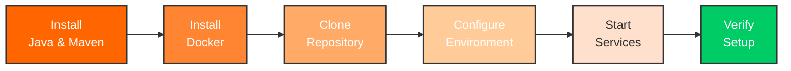

# Installation Guide

This guide provides detailed installation instructions for all components of the Kafka Training environment.

## Installation Overview



## Step 1: Install Java Development Kit

### macOS

```bash
# Install using Homebrew
brew install openjdk@11

# Add to PATH (add to ~/.zshrc or ~/.bash_profile)
echo 'export PATH="/usr/local/opt/openjdk@11/bin:$PATH"' >> ~/.zshrc
echo 'export JAVA_HOME=$(/usr/libexec/java_home -v 11)' >> ~/.zshrc

# Reload shell configuration
source ~/.zshrc

# Verify installation
java -version
```

### Ubuntu/Debian

```bash
# Update package index
sudo apt update

# Install OpenJDK 11
sudo apt install openjdk-11-jdk -y

# Set JAVA_HOME (add to ~/.bashrc)
echo 'export JAVA_HOME=/usr/lib/jvm/java-11-openjdk-amd64' >> ~/.bashrc
echo 'export PATH=$JAVA_HOME/bin:$PATH' >> ~/.bashrc

# Reload shell configuration
source ~/.bashrc

# Verify installation
java -version
```

### Windows

1. Download OpenJDK from [Adoptium](https://adoptium.net/)
2. Run the installer
3. Set environment variables:
    - Add `JAVA_HOME` pointing to JDK installation
    - Add `%JAVA_HOME%\bin` to PATH
4. Verify: `java -version`

## Step 2: Install Maven

### macOS

```bash
# Install using Homebrew
brew install maven

# Verify installation
mvn -version
```

### Ubuntu/Debian

```bash
# Install Maven
sudo apt update
sudo apt install maven -y

# Verify installation
mvn -version
```

### Windows

1. Download from [Maven Downloads](https://maven.apache.org/download.cgi)
2. Extract to `C:\Program Files\Apache\maven`
3. Add to PATH: `C:\Program Files\Apache\maven\bin`
4. Verify: `mvn -version`

## Step 3: Install Docker

### macOS

```bash
# Install Docker Desktop using Homebrew
brew install --cask docker

# Or download from https://www.docker.com/products/docker-desktop/

# Start Docker Desktop from Applications

# Verify installation
docker --version
docker-compose --version
```

**Configure Docker Desktop:**

1. Open Docker Desktop preferences
2. Go to Resources
3. Set:
    - Memory: 4-8 GB
    - CPUs: 2-4 cores
    - Disk: 20 GB+

### Ubuntu/Debian

```bash
# Install Docker
curl -fsSL https://get.docker.com -o get-docker.sh
sudo sh get-docker.sh

# Add current user to docker group
sudo usermod -aG docker $USER

# Install Docker Compose plugin
sudo apt update
sudo apt install docker-compose-plugin -y

# Log out and back in for group changes to take effect
# Then verify
docker --version
docker compose version
```

### Windows

1. Download [Docker Desktop for Windows](https://www.docker.com/products/docker-desktop/)
2. Run installer
3. Enable WSL 2 integration
4. Configure resources (Settings → Resources):
    - Memory: 4-8 GB
    - CPUs: 2-4 cores
5. Verify: `docker --version`

## Step 4: Install Git

### macOS

```bash
# Git is usually pre-installed
git --version

# If not installed
brew install git
```

### Ubuntu/Debian

```bash
sudo apt update
sudo apt install git -y

# Verify
git --version
```

### Windows

1. Download from [git-scm.com](https://git-scm.com/)
2. Run installer (use default options)
3. Verify: `git --version`

## Step 5: Clone the Repository

```bash
# Clone the repository
git clone https://github.com/yourusername/kafka-training-java.git

# Navigate to project directory
cd kafka-training-java

# Verify project structure
ls -la
```

Expected output:

```
drwxr-xr-x  README.md
drwxr-xr-x  docker-compose.yml
drwxr-xr-x  docker-compose-dev.yml
drwxr-xr-x  Dockerfile
drwxr-xr-x  pom.xml
drwxr-xr-x  src/
drwxr-xr-x  k8s/
drwxr-xr-x  docs/
```

## Step 6: Build the Application

### Compile and Package

```bash
# Clean and compile
mvn clean compile

# Run tests to verify setup
mvn test -Dtest=SpringBootKafkaTrainingTest

# Package application
mvn clean package -DskipTests
```

!!! note "First Build"
    The first build may take 5-10 minutes as Maven downloads all dependencies.

### Verify JAR File

```bash
# Check the built JAR
ls -lh target/*.jar

# Expected output:
# kafka-training-java-1.0-SNAPSHOT.jar
```

## Step 7: Configure Environment

### Option 1: Use Default Configuration

The default `docker-compose.yml` works out of the box:

```bash
# No configuration needed - use defaults
docker-compose up -d
```

### Option 2: Custom Configuration

Create `.env` file for custom settings:

```bash
# Create .env file
cat > .env << 'EOF'
# Kafka Configuration
KAFKA_BROKER_ID=1
KAFKA_LISTENERS=PLAINTEXT://0.0.0.0:9092

# Spring Boot Configuration
SPRING_PROFILES_ACTIVE=docker
SERVER_PORT=8080

# PostgreSQL Configuration
POSTGRES_DB=eventmart
POSTGRES_USER=eventmart
POSTGRES_PASSWORD=eventmart123

# Monitoring (optional)
PROMETHEUS_ENABLED=false
GRAFANA_ENABLED=false
EOF
```

### Environment Variables

Key environment variables:

| Variable | Default | Description |
|----------|---------|-------------|
| `SPRING_PROFILES_ACTIVE` | `docker` | Spring Boot profile |
| `KAFKA_BOOTSTRAP_SERVERS` | `kafka:29092` | Kafka broker address |
| `TRAINING_KAFKA_SCHEMA_REGISTRY_URL` | `http://schema-registry:8082` | Schema Registry URL |
| `SPRING_DATASOURCE_URL` | `jdbc:postgresql://postgres:5432/eventmart` | Database URL |

## Step 8: Start Services

### Full Stack Deployment

```bash
# Pull Docker images (first time only)
docker-compose pull

# Start all services
docker-compose up -d

# Check status
docker-compose ps
```

Expected services:

```
kafka-training-zookeeper       running
kafka-training-kafka           running
kafka-training-schema-registry running
kafka-training-postgres        running
kafka-training-connect         running
kafka-training-ui              running
kafka-training-application     running
```

### Development Mode

```bash
# Start only infrastructure
docker-compose -f docker-compose-dev.yml up -d

# Run Spring Boot locally
mvn spring-boot:run -Dspring-boot.run.profiles=dev
```

### With Monitoring

```bash
# Start with Prometheus and Grafana
docker-compose --profile monitoring up -d

# Access Grafana at http://localhost:3000
# Default credentials: admin / admin
```

## Step 9: Verify Installation

### Check Service Health

```bash
# Check all containers are running
docker-compose ps

# Check application health
curl http://localhost:8080/actuator/health

# Expected response:
# {"status":"UP"}

# Check Kafka broker
docker exec kafka-training-kafka \
  kafka-broker-api-versions --bootstrap-server localhost:9092

# Check Schema Registry
curl http://localhost:8082/subjects

# Check Kafka Connect
curl http://localhost:8083/
```

### Run Verification Script

```bash
# Create verification script
cat > verify-setup.sh << 'EOF'
#!/bin/bash

echo "🔍 Verifying Kafka Training Setup..."
echo ""

# Check Java
echo "✓ Checking Java..."
java -version 2>&1 | head -1

# Check Maven
echo "✓ Checking Maven..."
mvn -version | head -1

# Check Docker
echo "✓ Checking Docker..."
docker --version

# Check containers
echo "✓ Checking containers..."
docker-compose ps

# Check application
echo "✓ Checking application..."
curl -s http://localhost:8080/actuator/health | jq -r .status

# Check Kafka
echo "✓ Checking Kafka..."
docker exec kafka-training-kafka \
  kafka-broker-api-versions --bootstrap-server localhost:9092 2>&1 | head -1

echo ""
echo "✅ Setup verification complete!"
EOF

chmod +x verify-setup.sh
./verify-setup.sh
```

### Test Training APIs

```bash
# Get training modules
curl http://localhost:8080/api/training/modules | jq

# Run Day 1 demo
curl -X POST http://localhost:8080/api/training/day01/demo | jq

# Create EventMart topics
curl -X POST http://localhost:8080/api/training/eventmart/topics | jq
```

## Step 10: Access Services

Access these services:

<div class="card-grid">

<div class="success-box">
<strong>Training REST API</strong><br/>
<a href="http://localhost:8080/api/training/modules">http://localhost:8080/api/training/modules</a><br/>
JSON API endpoints (use curl, Postman)
</div>

<div class="success-box">
<strong>Kafka UI</strong> (Web Browser)<br/>
<a href="http://localhost:8081">http://localhost:8081</a><br/>
Visual Kafka management interface
</div>

<div class="success-box">
<strong>Schema Registry API</strong><br/>
<a href="http://localhost:8082/subjects">http://localhost:8082/subjects</a><br/>
Schema management REST API
</div>

<div class="success-box">
<strong>Kafka Connect API</strong><br/>
<a href="http://localhost:8083">http://localhost:8083</a><br/>
Connector management REST API
</div>

</div>

## IDE Setup (Optional)

### IntelliJ IDEA

1. **Import Project:**
    - File → Open
    - Select `kafka-training-java` directory
    - Import as Maven project

2. **Configure JDK:**
    - File → Project Structure → Project
    - Set Project SDK to Java 11

3. **Enable Annotation Processing:**
    - Preferences → Build → Compiler → Annotation Processors
    - Enable annotation processing

4. **Configure Spring Boot:**
    - Run → Edit Configurations
    - Add new Spring Boot configuration
    - Main class: `com.training.kafka.KafkaTrainingApplication`
    - Active profiles: `dev`

5. **Run Application:**
    - Click Run button
    - Access at http://localhost:8080

### Visual Studio Code

1. **Install Extensions:**
    - Extension Pack for Java
    - Spring Boot Extension Pack
    - Docker

2. **Open Project:**
    - File → Open Folder
    - Select `kafka-training-java`

3. **Configure Java:**
    - Cmd/Ctrl + Shift + P
    - Java: Configure Java Runtime
    - Select Java 11

4. **Run Application:**
    - Open `KafkaTrainingApplication.java`
    - Click "Run" above the main method
    - Or use integrated terminal: `mvn spring-boot:run`

## Post-Installation

### Update Configuration

Edit `src/main/resources/application.yml` if needed:

```yaml
training:
  kafka:
    bootstrap-servers: localhost:9092
    schema-registry-url: http://localhost:8082

  features:
    debug-mode: true
    web-interface-enabled: true
```

### Create Topics Manually

```bash
# Create training topics
docker exec kafka-training-kafka kafka-topics \
  --bootstrap-server localhost:9092 \
  --create --topic training-topic \
  --partitions 3 --replication-factor 1
```

### Load Sample Data

```bash
# Run EventMart simulation
curl -X POST http://localhost:8080/api/training/eventmart/topics
curl -X POST "http://localhost:8080/api/training/eventmart/simulate/user?userId=user1&email=user@example.com&name=User%20One"
```

## Troubleshooting

### Common Issues

!!! warning "Port Already in Use"
    ```bash
    # Find process using port 8080
    lsof -i :8080

    # Kill the process
    kill -9 <PID>

    # Or change port in docker-compose.yml
    ```

!!! warning "Docker Out of Memory"
    ```bash
    # Increase Docker memory in preferences
    # Docker Desktop → Preferences → Resources → Memory
    # Set to at least 4GB
    ```

!!! warning "Maven Build Fails"
    ```bash
    # Clean Maven cache
    rm -rf ~/.m2/repository

    # Rebuild
    mvn clean install -U
    ```

### Get Help

If issues persist:

1. Check logs: `docker-compose logs -f`
2. Review [Troubleshooting Guide](../contributing/troubleshooting.md)
3. Search GitHub issues
4. Ask in community forums

## Next Steps

Installation complete! Now:

1. [Start Learning](../training/day01-foundation.md) - Begin Day 1
2. [Explore API](../api/training-endpoints.md) - Check REST endpoints
3. [Container Guide](../containers/docker-basics.md) - Learn Docker basics
4. [Run Tests](../contributing/testing.md) - Understand testing approach

!!! success "Installation Complete!"
    Your Kafka training environment is ready! Head to [Quick Start](quick-start.md) to verify everything works, then begin [Day 1: Foundation](../training/day01-foundation.md).
