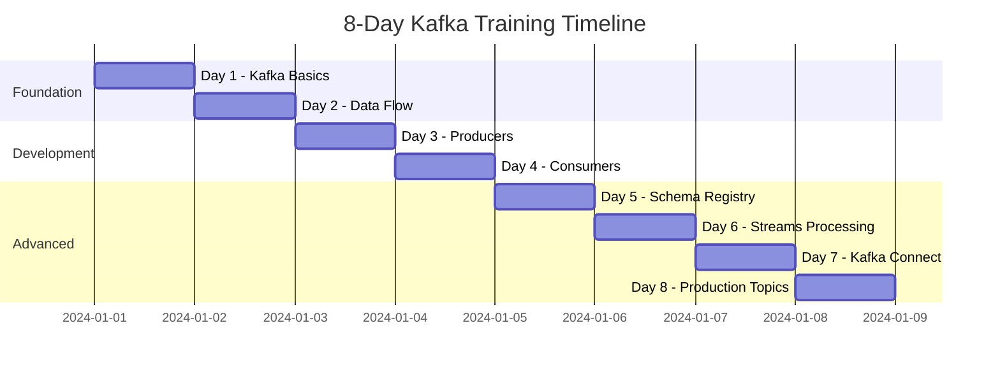
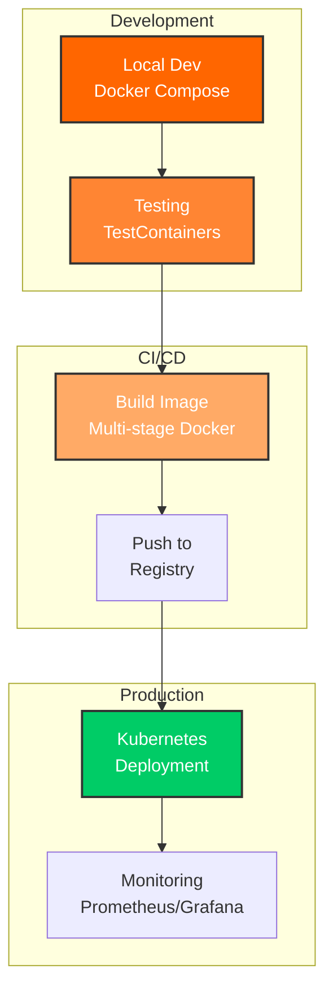
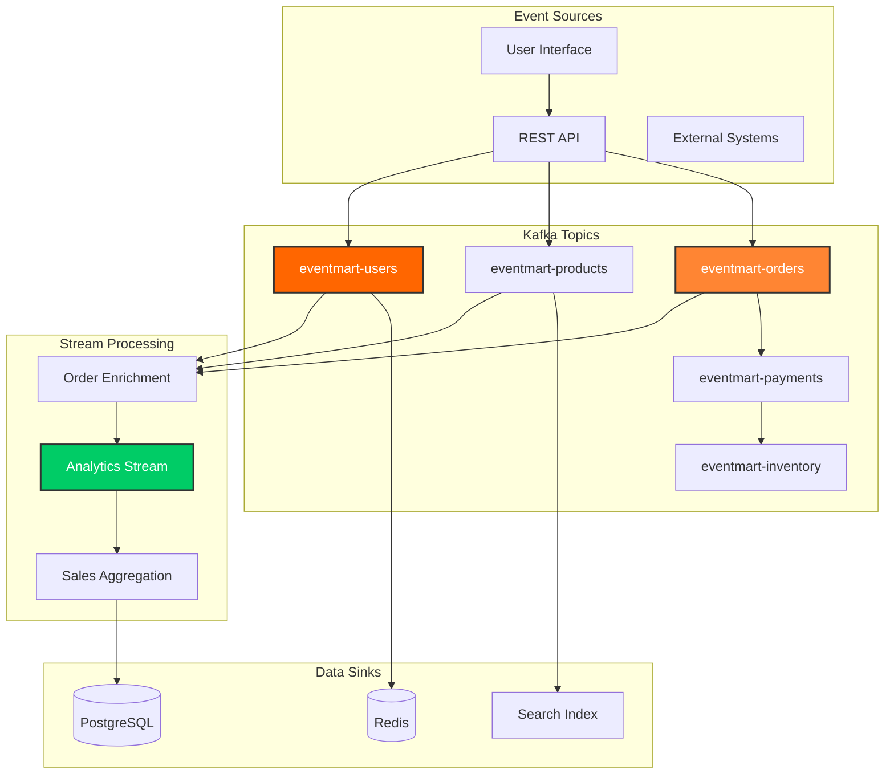

# Training Overview

## Program Structure

This 8-day comprehensive Kafka training program is designed for **data engineers** learning Apache Kafka fundamentals. Master platform-agnostic Kafka skills using pure APIs, CLI tools, and container-first practices.

!!! tip "Data Engineer First"
    This training teaches **transferable Kafka knowledge** that works with any data platform - Spark, Flink, Python, Scala, or Java. No framework lock-in.

### Learning Phases

## Daily Curriculum

### Phase 1: Foundation (Days 1-2)

**Day 1: Kafka Fundamentals and Foundation**

- Kafka architecture and core concepts
- Brokers, topics, partitions, and replication
- AdminClient API for cluster management
- Topic creation and configuration
- Cluster metadata operations

**Day 2: Data Flow and Message Patterns**

- Event-driven architecture principles
- Message ordering and partitioning strategies
- Delivery semantics (at-most-once, at-least-once, exactly-once)
- Message keys and partition assignment
- Consumer offsets and commit strategies

### Phase 2: Producer & Consumer Development (Days 3-4)

**Day 3: Producer Development**

- Pure KafkaProducer API deep dive
- Synchronous vs asynchronous sending
- Producer configurations and tuning
- Error handling and retries
- Idempotent producers and transactions
- Custom partitioners and serializers

**Day 4: Consumer Implementation**

- Pure KafkaConsumer API fundamentals
- Consumer groups and load balancing
- Partition assignment and rebalancing
- Offset management strategies
- Consumer configurations and tuning
- Error handling and dead letter queues

### Phase 3: Schema & Streams (Days 5-6)

**Day 5: Schema Registry and Avro**

- Schema management importance
- Apache Avro serialization format
- Confluent Schema Registry
- Schema evolution and compatibility
- Schema versioning strategies
- Integration with Spring Boot

**Day 6: Stream Processing**

- Kafka Streams API overview
- Stateless transformations (map, filter, flatMap)
- Stateful operations (aggregations, joins)
- Windowing operations
- State stores and fault tolerance
- Stream processing topologies

### Phase 4: Integration & Production (Days 7-8)

**Day 7: Kafka Connect**

- Kafka Connect architecture
- Source and sink connectors
- JDBC connector for databases
- Connector configuration and deployment
- Custom connector development
- Monitoring connector health

**Day 8: Advanced Topics and Production**

- Security (SSL/TLS, SASL authentication)
- Access control and authorization
- Monitoring and observability
- Performance tuning and optimization
- Production deployment patterns
- Disaster recovery and backup strategies

## Container-First Methodology

### Why Container-First?

This training emphasizes containers because modern data platforms are container-native:

<strong>Production Parity</strong> 
Development environment matches production exactly

<strong>Portability</strong> 
Run anywhere: laptop, cloud, on-premises

<strong>Isolation</strong> 
No dependency conflicts or version issues

<strong>Scalability</strong> 
Easy horizontal scaling with Kubernetes

<strong>Fast Onboarding</strong> 
New team members productive immediately

<strong>Real Testing</strong> 
TestContainers use real Kafka, not mocks

### Container Workflow

## EventMart Progressive Project

Throughout the 8 days, you'll build **EventMart** - a complete event-driven e-commerce platform:

### Features by Day

| Day | EventMart Feature | Skills Learned |
|-----|-------------------|----------------|
| 1 | Topic Architecture | Topic design, partitioning strategy |
| 2 | Event Modeling | Event schemas, message patterns |
| 3 | Event Publishing | Producers, reliability guarantees |
| 4 | Event Consumption | Consumers, processing patterns |
| 5 | Schema Management | Avro schemas, schema evolution |
| 6 | Real-time Analytics | Stream processing, aggregations |
| 7 | Database Integration | Kafka Connect, data pipelines |
| 8 | Production Deployment | Security, monitoring, scaling |

### EventMart Architecture

## Learning Approach

### Daily Structure

Each day follows a consistent pattern:

1. **Theory (1 hour)** - Core concepts and architecture
2. **Hands-on Examples (1.5 hours)** - Guided code walkthrough
3. **Practice Exercises (1 hour)** - Independent practice
4. **EventMart Integration (0.5 hours)** - Build progressive project

### Hands-On Philosophy

!!! tip "Learning by Doing"
    This training emphasizes practical, hands-on learning:

    - **Run Every Example** - Don't just read the code, execute it
    - **Experiment** - Try variations and see what happens
    - **Break Things** - Learn from errors and troubleshooting
    - **Build EventMart** - Apply concepts to a real project

## Skills You'll Gain

### Technical Skills

- [x] Apache Kafka architecture and operations
- [x] Pure KafkaProducer and KafkaConsumer APIs
- [x] Kafka CLI tools and workflows
- [x] Stream processing with Kafka Streams
- [x] Schema management with Avro
- [x] Data integration with Kafka Connect
- [x] Container orchestration with Docker & Kubernetes
- [x] Integration testing strategies
- [x] Monitoring and observability with Prometheus
- [x] Production deployment patterns

### Data Engineering Skills

- [x] Event-driven architecture design
- [x] Real-time data processing
- [x] Data pipeline development
- [x] Stream analytics implementation
- [x] Microservices communication patterns
- [x] Scalable system design
- [x] Production operations and troubleshooting

## Career Impact

### Industry Demand

According to recent job market analysis:

- **75%** of data engineering roles require Kafka knowledge
- **60%** of positions require Kubernetes experience
- **80%** of companies use containerized data platforms
- **25-30%** salary increase with Kafka + Container skills

### Roles This Prepares You For

- Data Engineer
- Streaming Data Engineer
- Platform Engineer
- DevOps Engineer (Data Platform)
- Solutions Architect (Data)
- Senior Backend Engineer (Event-Driven Systems)

## Time Commitment

### Full Course (8 Days)

- **Daily Time**: 3-4 hours
- **Total Time**: 24-32 hours
- **Best For**: Comprehensive learning, building portfolio project

### Fast Track (4 Days)

- **Daily Time**: 6-8 hours
- **Total Time**: 24-32 hours (compressed)
- **Best For**: Experienced developers, intensive bootcamp

### Self-Paced

- **Weekly**: 8-10 hours over 3-4 weeks
- **Total Time**: 24-32 hours spread out
- **Best For**: Working professionals, flexible learning

## Support Resources

### Documentation

- Comprehensive guides for each day
- API reference documentation
- Troubleshooting guides
- Best practices and patterns

### Code Examples

- 90+ integration tests
- Real-world examples
- EventMart progressive project
- Production-ready patterns

### Tools & Environments

- Docker Compose for local development
- TestContainers for testing
- Kubernetes manifests for production
- Monitoring stack (Prometheus/Grafana)

## Next Steps

Ready to begin? Continue to:

1. [Prerequisites](prerequisites.md) - Verify your setup
2. [Installation](installation.md) - Detailed installation guide
3. [Quick Start](quick-start.md) - Get running in 5 minutes

Or jump directly to [Day 1 Training](../training/day01-foundation.md) if you're all set!
