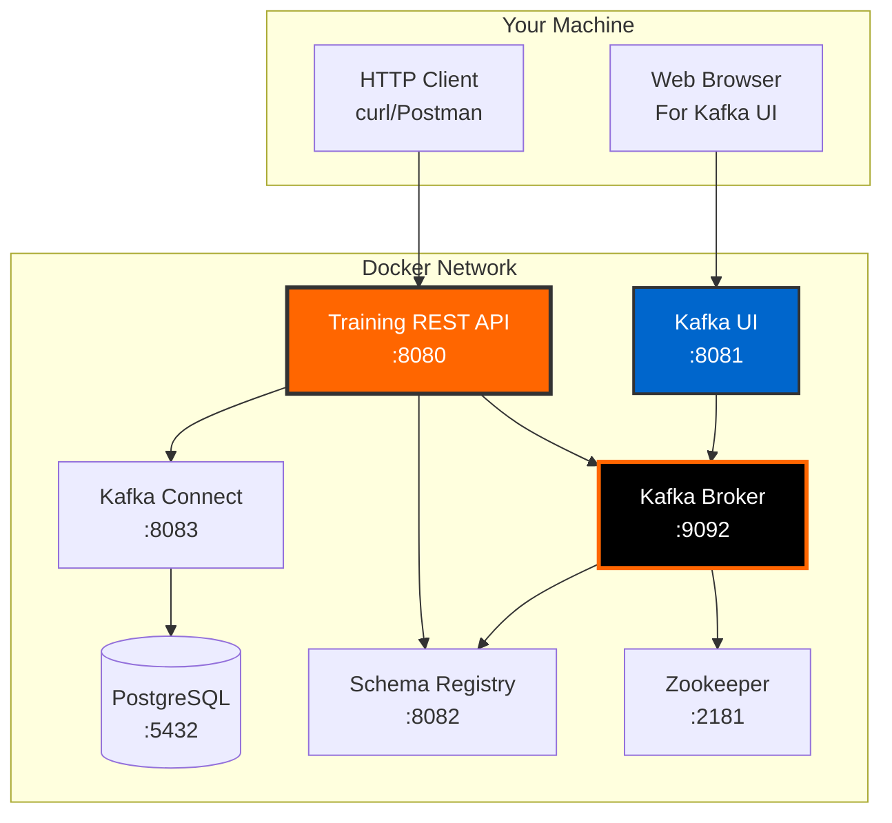

# Quick Start

Get up and running with Kafka Training in 5 minutes using Docker Compose.

## 5-Minute Setup

### Step 1: Clone the Repository

```bash
git clone https://github.com/yourusername/kafka-training-java.git
cd kafka-training-java
```

### Step 2: Start the Environment

Choose your preferred method:

=== "Full Stack (Recommended)"

    Start the complete Kafka ecosystem with all services:

    ```bash
    # Start all services
    docker-compose up -d

    # Verify services are running
    docker-compose ps
    ```

    **Services Started:**

    - Kafka Broker (port 9092)
    - Zookeeper (port 2181)
    - Schema Registry (port 8082)
    - Kafka Connect (port 8083)
    - PostgreSQL (port 5432)
    - Kafka UI (port 8081)
    - Training App (port 8080)

=== "Development Mode"

    Start only infrastructure, run app locally for hot reload:

    ```bash
    # Start only Kafka infrastructure
    docker-compose -f docker-compose-dev.yml up -d

    # Run Spring Boot app locally
    mvn spring-boot:run -Dspring-boot.run.profiles=dev
    ```

    **Best For:** Active development with code changes

=== "TestContainers"

    Run tests with automatic container management:

    ```bash
    # TestContainers automatically starts Kafka
    mvn test

    # Run specific test
    mvn test -Dtest=SpringBootKafkaTrainingTest
    ```

    **Best For:** Testing without manual setup

### Step 3: Verify Installation

```bash
# Check all containers are running
docker-compose ps

# Expected output:
# kafka-training-kafka         running
# kafka-training-zookeeper     running
# kafka-training-schema-registry running
# kafka-training-postgres      running
# kafka-training-ui            running
# kafka-training-application   running
```

### Step 4: Access Services

Access these services via HTTP clients (curl, Postman, etc):

<div class="card-grid">

<div class="success-box">
<strong>Training REST API</strong><br/>
<a href="http://localhost:8080/api/training/modules" target="_blank">http://localhost:8080/api/training/modules</a><br/>
REST API endpoints (JSON responses)
</div>

<div class="success-box">
<strong>Kafka UI</strong><br/>
<a href="http://localhost:8081" target="_blank">http://localhost:8081</a><br/>
Visual Kafka management
</div>

<div class="success-box">
<strong>API Docs</strong><br/>
<a href="http://localhost:8080/api/training/modules" target="_blank">/api/training/modules</a><br/>
REST API endpoints
</div>

<div class="success-box">
<strong>Health Check</strong><br/>
<a href="http://localhost:8080/actuator/health" target="_blank">/actuator/health</a><br/>
Application health status
</div>

</div>

### Step 5: Run Your First Example

Test the training API:

```bash
# Get available training modules
curl http://localhost:8080/api/training/modules

# Run Day 1 foundation demo
curl -X POST http://localhost:8080/api/training/day01/demo

# Create EventMart topics
curl -X POST http://localhost:8080/api/training/eventmart/topics

# Simulate a user registration
curl -X POST "http://localhost:8080/api/training/eventmart/simulate/user?userId=user123&email=john@example.com&name=John%20Doe"
```

## Environment Architecture



## Quick Validation

### Test Kafka is Running

```bash
# List topics
docker exec kafka-training-kafka \
  kafka-topics --bootstrap-server localhost:9092 --list

# Create a test topic
docker exec kafka-training-kafka \
  kafka-topics --bootstrap-server localhost:9092 \
  --create --topic test-topic --partitions 3 --replication-factor 1

# Produce a message
echo "Hello Kafka" | docker exec -i kafka-training-kafka \
  kafka-console-producer --bootstrap-server localhost:9092 --topic test-topic

# Consume the message
docker exec kafka-training-kafka \
  kafka-console-consumer --bootstrap-server localhost:9092 \
  --topic test-topic --from-beginning --max-messages 1
```

### Test Spring Boot App

```bash
# Check application health
curl http://localhost:8080/actuator/health

# Expected response:
# {"status":"UP"}

# Get training modules
curl http://localhost:8080/api/training/modules | jq

# Run Day 1 demo
curl -X POST http://localhost:8080/api/training/day01/demo | jq
```

### Test EventMart Platform

```bash
# 1. Create EventMart topics
curl -X POST http://localhost:8080/api/training/eventmart/topics

# 2. Register a user
curl -X POST "http://localhost:8080/api/training/eventmart/simulate/user?userId=user001&email=alice@example.com&name=Alice%20Smith"

# 3. Create a product
curl -X POST "http://localhost:8080/api/training/eventmart/simulate/product?productId=prod001&name=Laptop&category=Electronics&price=999.99"

# 4. Place an order
curl -X POST "http://localhost:8080/api/training/eventmart/simulate/order?orderId=order001&userId=user001&amount=999.99"

# 5. Check EventMart status
curl http://localhost:8080/api/training/eventmart/status | jq
```

## Common Tasks

### View Logs

```bash
# View all logs
docker-compose logs -f

# View specific service logs
docker-compose logs -f kafka-training-app
docker-compose logs -f kafka

# View last 100 lines
docker-compose logs --tail=100 kafka-training-app
```

### Restart Services

```bash
# Restart all services
docker-compose restart

# Restart specific service
docker-compose restart kafka-training-app

# Stop all services
docker-compose down

# Stop and remove volumes (⚠️ deletes data)
docker-compose down -v
```

### Access Container Shell

```bash
# Access Kafka container
docker exec -it kafka-training-kafka bash

# Access application container
docker exec -it kafka-training-application bash

# Access PostgreSQL
docker exec -it kafka-training-postgres psql -U eventmart -d eventmart
```

## Development Workflow

### Hot Reload Development

For active development with instant code changes:

```bash
# 1. Start only infrastructure
docker-compose -f docker-compose-dev.yml up -d

# 2. Run Spring Boot with dev profile
mvn spring-boot:run -Dspring-boot.run.profiles=dev

# 3. Make code changes - app auto-reloads!

# 4. Run tests
mvn test

# 5. Build and deploy to Docker
docker-compose build kafka-training-app
docker-compose up -d kafka-training-app
```

### Testing Workflow

```bash
# Run all tests (TestContainers auto-start Kafka)
mvn test

# Run specific test class
mvn test -Dtest=Day01FoundationTest

# Run with coverage report
mvn test jacoco:report

# View coverage report
open target/site/jacoco/index.html
```

## Troubleshooting

### Services Not Starting

```bash
# Check Docker is running
docker ps

# Check port conflicts
lsof -i :8080
lsof -i :9092

# View service logs
docker-compose logs kafka-training-kafka
docker-compose logs kafka-training-app

# Restart services
docker-compose down
docker-compose up -d
```

### Application Errors

```bash
# Check application logs
docker-compose logs -f kafka-training-app

# Check Kafka connectivity
docker exec kafka-training-kafka \
  kafka-broker-api-versions --bootstrap-server localhost:9092

# Verify health endpoint
curl http://localhost:8080/actuator/health
```

### Database Issues

```bash
# Check PostgreSQL is running
docker-compose ps postgres

# Access PostgreSQL
docker exec -it kafka-training-postgres psql -U eventmart -d eventmart

# Check tables
\dt

# Reset database (⚠️ deletes data)
docker-compose down -v
docker-compose up -d
```

### Clean Start

If you encounter issues, perform a clean restart:

```bash
# Stop everything
docker-compose down -v

# Clean Docker system
docker system prune -f

# Remove old images
docker-compose pull

# Start fresh
docker-compose up -d

# Verify
docker-compose ps
```

## Next Steps

Now that your environment is running:

<div class="card-grid">

<div class="kafka-container">
<strong>Start Learning</strong><br/>
Begin with <a href="../training/day01-foundation/">Day 1: Foundation</a>
</div>

<div class="kafka-container">
<strong>Explore API</strong><br/>
Check the <a href="../api/training-endpoints/">API Reference</a>
</div>

<div class="kafka-container">
<strong>Build EventMart</strong><br/>
Follow the <a href="../api/eventmart-api/">EventMart Guide</a>
</div>

<div class="kafka-container">
<strong>Learn Containers</strong><br/>
Read <a href="../containers/why-containers/">Why Containers</a>
</div>

</div>

## Useful Commands Cheat Sheet

```bash
# Start all services
docker-compose up -d

# Stop all services
docker-compose down

# View logs
docker-compose logs -f [service-name]

# Restart service
docker-compose restart [service-name]

# Check status
docker-compose ps

# Access container shell
docker exec -it [container-name] bash

# Run tests
mvn test

# Run Spring Boot locally
mvn spring-boot:run -Dspring-boot.run.profiles=dev

# Clean build
mvn clean package

# Create Kafka topic
docker exec kafka-training-kafka \
  kafka-topics --bootstrap-server localhost:9092 \
  --create --topic [topic-name] --partitions 3

# List topics
docker exec kafka-training-kafka \
  kafka-topics --bootstrap-server localhost:9092 --list
```

!!! success "You're Ready!"
    Your Kafka training environment is now running! Head to [Day 1: Foundation](../training/day01-foundation.md) to start learning.
