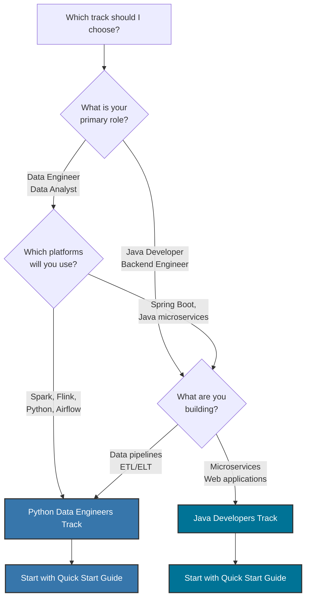

# Track Selection Guide

## Which Learning Track is Right for You?

This Kafka training offers two distinct learning paths designed for different audiences and career goals. This guide will help you choose the track that aligns with your role, goals, and technical background.

## Track Overview

<div class="card-grid">

<div class="track-card">
<h3>Python Data Engineers</h3>
<p><strong>Focus:</strong> Pure Kafka fundamentals, platform-agnostic patterns</p>
<p><strong>Tools:</strong> CLI, Python, confluent-kafka, Faust</p>
<p><strong>Entry:</strong> Command-line based workflows</p>
<p><a href="../exercises/capstone-guide-python.md">View Python Capstone</a></p>
</div>

<div class="track-card">
<h3>Java Developers</h3>
<p><strong>Focus:</strong> Spring Boot integration, microservices</p>
<p><strong>Tools:</strong> Spring Kafka, REST APIs, Web UI</p>
<p><strong>Entry:</strong> Browser-based, http://localhost:8080</p>
<p><a href="../exercises/capstone-guide-java.md">View Java Capstone</a></p>
</div>

</div>

## Decision Tree



## Detailed Comparison

### Python Data Engineers Track

**Best for:**

- Data engineers building real-time data pipelines
- Python developers working with streaming data
- Engineers integrating Kafka with Spark, Flink, or Airflow
- Platform engineers who need language-agnostic Kafka knowledge
- Data scientists building event-driven ML pipelines

**What you'll learn:**

- Pure Kafka APIs (KafkaProducer, KafkaConsumer)
- CLI-based workflows and kafka-console-* tools
- Python Kafka clients (confluent-kafka, kafka-python)
- Faust for stream processing
- Platform-agnostic patterns that transfer to any language
- Container-first development with Docker
- Integration with data platforms (Spark, Flink)

**Technology stack:**

- Python 3.8+
- confluent-kafka[avro]
- kafka-python
- Faust-streaming
- Avro schemas
- Docker and Docker Compose
- PostgreSQL (via Kafka Connect)

**Entry point:**

```bash
# Command-line based
docker-compose -f docker-compose-dev.yml up -d
./bin/kafka-training-cli.sh --day 1 --demo foundation
python examples/python/day03_producer.py
```

**Capstone project:**

Real-Time E-Commerce Analytics Platform - Build streaming analytics using Python, Faust, and Kafka Connect to process millions of events per day.

### Java Developers Track

**Best for:**

- Java developers building Spring Boot microservices
- Backend engineers working on event-driven systems
- Full-stack developers creating real-time web applications
- Spring framework developers learning Kafka integration
- Software engineers building enterprise applications

**What you'll learn:**

- Spring Kafka integration patterns
- Spring Boot auto-configuration
- @KafkaListener and KafkaTemplate abstractions
- Spring Cloud Stream
- REST API development with Kafka
- Web UI for Kafka management
- Microservices messaging patterns
- EventMart e-commerce platform

**Technology stack:**

- Java 21
- Spring Boot 3.3.4
- Spring Kafka
- Kafka Streams
- Avro with Spring Boot integration
- PostgreSQL with Spring Data JPA
- Docker and Kubernetes

**Entry point:**

```bash
# Web browser based
docker-compose -f docker-compose-dev.yml up -d
mvn spring-boot:run -Dspring-boot.run.profiles=dev
open http://localhost:8080
```

**Capstone project:**

EventMart E-Commerce Platform - Build a complete microservices-based e-commerce platform with Spring Boot, featuring REST APIs, real-time processing, and web UI.

## Key Differences

| Aspect | Python Data Engineers | Java Developers |
|--------|----------------------|-----------------|
| **Primary Language** | Python | Java |
| **Kafka APIs** | Raw KafkaProducer/Consumer | Spring Kafka (KafkaTemplate) |
| **Stream Processing** | Faust-streaming | Kafka Streams |
| **Development Style** | CLI-first, script-based | Web UI, REST API based |
| **Entry Point** | Terminal commands | Web browser |
| **Primary Use Cases** | Data pipelines, ETL, analytics | Microservices, web apps |
| **Framework** | None (pure Kafka) | Spring Boot |
| **Learning Curve** | Kafka-focused | Kafka + Spring Boot |
| **Career Path** | Data Engineer, Platform Engineer | Backend Developer, Software Engineer |
| **Transferability** | Spark, Flink, Scala, Go, etc. | Spring ecosystem |
| **Deployment** | Docker, K8s, Airflow | Docker, K8s, Spring Cloud |

## Quiz: Find Your Track

Answer these questions to identify the best track for you:

### Question 1: What describes your role best?

- **A**: I build data pipelines that transform and move data between systems
- **B**: I build REST APIs and web applications that users interact with

### Question 2: Which technologies do you use daily?

- **A**: Python, Jupyter, Pandas, SQL, Spark, or Airflow
- **B**: Java, Spring Framework, Maven, IntelliJ, or REST APIs

### Question 3: What are you trying to accomplish?

- **A**: Process streaming data for analytics, reporting, or machine learning
- **B**: Build event-driven microservices or real-time web applications

### Question 4: How do you prefer to work?

- **A**: Command-line tools, scripts, and programmatic workflows
- **B**: IDEs, web browsers, and visual interfaces

### Question 5: What's your career goal?

- **A**: Data Engineer, Analytics Engineer, ML Engineer
- **B**: Backend Developer, Full-Stack Developer, Software Architect

### Results:

- **Mostly A's**: Python Data Engineers Track - You'll benefit from pure Kafka patterns that integrate with your data platform stack
- **Mostly B's**: Java Developers Track - You'll learn Spring Boot integration patterns for building production microservices
- **Mix of A's and B's**: Start with Python Data Engineers track for fundamentals, then explore Java track for Spring Boot patterns

## Can I Do Both Tracks?

Absolutely! The tracks are complementary, not mutually exclusive.

### Recommended Approach:

1. **Start with Python Data Engineers track** to learn pure Kafka fundamentals
    - Days 1-4: Master core Kafka concepts without framework abstractions
    - Days 5-6: Schema Registry and stream processing
    - Days 7-8: Kafka Connect and production patterns

2. **Then explore Java Developers track** to see Spring Boot integration
    - See how Spring Boot simplifies Kafka configuration
    - Learn microservices messaging patterns
    - Understand framework abstractions and their tradeoffs

### Benefits of Both:

- Deeper understanding of Kafka internals
- Flexibility to work in both ecosystems
- Better debugging skills (you know what's happening under the hood)
- More career opportunities

## Track-Specific Resources

### Python Data Engineers

- **Getting Started**: [Quick Start Guide](quick-start.md)
- **Capstone Guide**: [capstone-guide-python.md](../exercises/capstone-guide-python.md)
- **Examples**: Python examples in capstone guide
- **CLI Tools**: Kafka command-line tools and Python scripts

### Java Developers

- **Getting Started**: [Quick Start Guide](quick-start.md)
- **Capstone Guide**: [capstone-guide-java.md](../exercises/capstone-guide-java.md)
- **Spring Boot Services**: `src/main/java/com/training/kafka/services/`
- **Web Interface**: http://localhost:8080

## Still Unsure?

If you're still unsure which track to choose:

1. **Review the Rosetta Stone**: See the same Kafka concepts implemented in both Python and Java - [Rosetta Stone](../learning/rosetta-stone.md)

2. **Check your project requirements**: What platforms and languages will you use in production?

3. **Consider your team**: What technologies does your team use?

4. **Start with fundamentals**: When in doubt, start with Python Data Engineers track for pure Kafka concepts

## Career Paths

### Python Data Engineers Track

**Typical roles:**

- Data Engineer
- Analytics Engineer
- Platform Engineer
- ML Engineer
- Data Architect

**Typical tech stacks:**

- Python, Spark, Flink, Airflow, dbt
- Kafka, Kinesis, Pub/Sub
- Data warehouses (Snowflake, BigQuery, Redshift)
- Container orchestration (Kubernetes, ECS)

**Salary range (US, 2024):** $120,000 - $200,000+

### Java Developers Track

**Typical roles:**

- Backend Developer
- Full-Stack Developer
- Software Engineer
- Solutions Architect
- Technical Lead

**Typical tech stacks:**

- Java, Spring Boot, Microservices
- Kafka, RabbitMQ, Event-driven architecture
- REST APIs, GraphQL
- Container orchestration (Kubernetes)

**Salary range (US, 2024):** $110,000 - $190,000+

## Getting Started

Once you've chosen your track:

=== "Python Data Engineers"

    ```bash
    # 1. Start Kafka infrastructure
    docker-compose -f docker-compose-dev.yml up -d

    # 2. Verify setup
    docker-compose -f docker-compose-dev.yml ps

    # 3. Run Python Kafka examples
    # See capstone guide for Python code examples

    # 4. Start Day 1
    # Follow Day 1: Foundation training materials
    ```

    **Next:** [Quick Start Guide](quick-start.md) → [Day 1: Foundation](../training/day01-foundation.md) → [Python Capstone](../exercises/capstone-guide-python.md)

=== "Java Developers"

    ```bash
    # 1. Start Kafka infrastructure
    docker-compose -f docker-compose-dev.yml up -d

    # 2. Start Spring Boot application locally
    mvn spring-boot:run -Dspring-boot.run.profiles=dev

    # 3. Open web interface
    open http://localhost:8080

    # 4. Start Day 1
    # Follow training modules via REST API or web UI
    ```

    **Next:** [Quick Start Guide](quick-start.md) → [Day 1: Foundation](../training/day01-foundation.md) → [Java Capstone](../exercises/capstone-guide-java.md)

## Need Help?

- **Track comparison**: Review the [Rosetta Stone](../learning/rosetta-stone.md) to see both tracks side-by-side
- **Capstone projects**: Compare [Python Capstone](../exercises/capstone-guide-python.md) vs [Java Capstone](../exercises/capstone-guide-java.md)
- **Technology stack**: Review [Tech Stack](../architecture/tech-stack.md) for version details

## Summary

**Choose Python Data Engineers track if:**

- You work primarily with data pipelines and analytics
- You use or plan to use Spark, Flink, Python, or Airflow
- You prefer CLI-based workflows
- You want language-agnostic Kafka knowledge

**Choose Java Developers track if:**

- You build Spring Boot microservices or web applications
- You work in the Java/Spring ecosystem
- You prefer web UI and REST APIs
- You want to learn Spring Kafka integration patterns

**Remember:** You can always switch tracks or do both. The fundamental Kafka concepts are the same - only the implementation approach differs.

Ready to begin? Choose your track and start learning!
