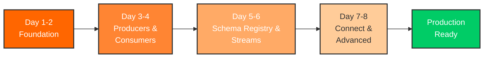
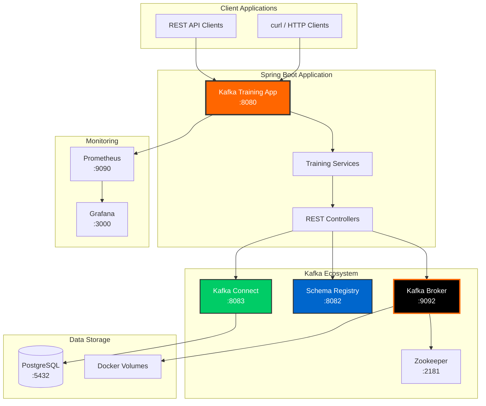
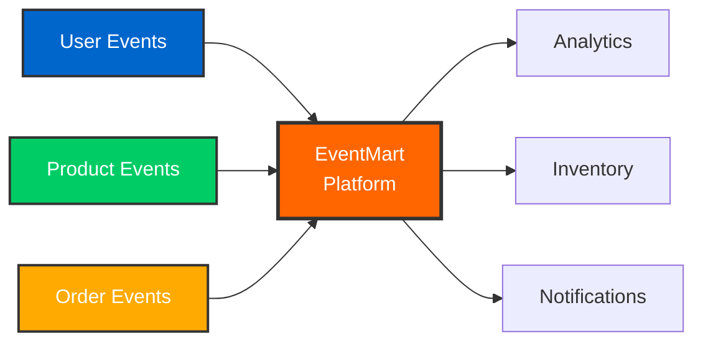

# Apache Kafka Training for Data Engineers

## Welcome to Container-First Kafka Training

This 8-day training program teaches **platform-agnostic Apache Kafka fundamentals** for data engineers. Learn pure Kafka concepts that transfer to any data platform - Spark, Flink, Python, Scala, or Java.

!!! note "Primary Audience: Data Engineers"
    This training focuses on **pure Kafka APIs and CLI-based workflows** without framework abstractions. Perfect for data engineers building real-time data pipelines, stream processing applications, and event-driven architectures.

## Learning Tracks

### **Recommended: Data Engineer Track (Pure Kafka)**

Learn Kafka using raw KafkaProducer/KafkaConsumer APIs, CLI tools, and platform-agnostic patterns.

- **Pure Kafka APIs** - No framework abstractions, transferable to any language
- **CLI-First Workflows** - kafka-console-producer, kafka-console-consumer, kafka-topics
- **Container-Native** - Docker and Kubernetes from day one
- **Platform Agnostic** - Works with Spark, Flink, Airflow, Python, Scala

**[Start Here: README-DATA-ENGINEERS.md](../README-DATA-ENGINEERS.md)**

### **Alternative: Java Developer Track (Spring Boot)**

Optional track for Java developers who want Spring Boot integration patterns.

- **Spring Boot Integration** - Spring Kafka abstractions and auto-configuration
- **Web UI Examples** - REST APIs and browser-based demonstrations
- **Microservices Patterns** - Event-driven microservices with Spring Cloud

**[Alternative Track: README.md](../README.md)**

---

This documentation covers Kafka concepts applicable to **both tracks**, with emphasis on platform-agnostic fundamentals.



## Key Features

<div class="card-grid">

<div class="metrics-card">
<h4>8-Day Curriculum</h4>
Progressive learning from Kafka basics to advanced production patterns with real-world exercises.
</div>

<div class="metrics-card">
<h4>Platform-Agnostic</h4>
Pure Kafka APIs transferable to Python, Scala, Spark, Flink, or any data platform.
</div>

<div class="metrics-card">
<h4>Container-First</h4>
Learn with Docker and Kubernetes from day one. Production-ready container workflows.
</div>

<div class="metrics-card">
<h4>CLI-Based</h4>
Master Kafka CLI tools and raw producer/consumer APIs without framework abstractions.
</div>

<div class="metrics-card">
<h4>Production Ready</h4>
Kubernetes deployment manifests, monitoring setup, and production best practices.
</div>

<div class="metrics-card">
<h4>Hands-On Project</h4>
Build EventMart - a complete e-commerce event streaming platform throughout the course.
</div>

</div>

## Quick Start

Get up and running in 5 minutes:

=== "Data Engineers (Recommended)"

    ```bash
    # Clone the repository
    git clone https://github.com/yourusername/kafka-training-java.git
    cd kafka-training-java

    # Start Kafka with Docker
    docker-compose up -d

    # Run pure Kafka CLI examples
    ./bin/kafka-training-cli.sh --day 1 --demo foundation
    ./bin/kafka-training-cli.sh --day 3 --demo producer

    # Or use Kafka's native CLI tools
    kafka-topics --bootstrap-server localhost:9092 --list
    kafka-console-producer --broker-list localhost:9092 --topic test
    ```

=== "Java Developers (Alternative)"

    ```bash
    # Clone the repository
    git clone https://github.com/yourusername/kafka-training-java.git
    cd kafka-training-java

    # Start with Spring Boot
    docker-compose up -d
    mvn spring-boot:run -Dspring-boot.run.profiles=dev

    # Test the REST API
    curl http://localhost:8080/api/training/modules
    ```

=== "TestContainers"

    ```bash
    # Clone the repository
    git clone https://github.com/yourusername/kafka-training-java.git
    cd kafka-training-java

    # Run comprehensive tests (no manual setup needed)
    mvn test
    ```

## What You'll Learn

### Phase 1: Foundation (Days 1-2)

- **Day 1**: Kafka architecture, brokers, topics, partitions, and AdminClient API
- **Day 2**: Data flow patterns, message ordering, and delivery guarantees

### Phase 2: Development (Days 3-4)

- **Day 3**: Producer patterns, configurations, idempotence, and transactions
- **Day 4**: Consumer groups, offset management, rebalancing, and at-least-once processing

### Phase 3: Schema & Streams (Days 5-6)

- **Day 5**: Avro schemas, Schema Registry, schema evolution, and compatibility
- **Day 6**: Kafka Streams API, stateless/stateful operations, and windowing

### Phase 4: Integration & Advanced (Days 7-8)

- **Day 7**: Kafka Connect, JDBC connectors, source/sink connectors, and data pipelines
- **Day 8**: Security (SSL/SASL), monitoring, performance tuning, and production patterns

## Training Environment

Access multiple services included in the training environment:

| Service | URL | Description | Track |
|---------|-----|-------------|-------|
| **Kafka Broker** | localhost:9092 | Apache Kafka broker | All |
| **Schema Registry** | http://localhost:8082 | Confluent Schema Registry | All |
| **Kafka Connect** | http://localhost:8083 | Kafka Connect REST API | All |
| **PostgreSQL** | localhost:5432 | Demo database for connectors | All |
| **Kafka UI** | http://localhost:8081 | Visual Kafka management | All (Optional) |
| **Prometheus** | http://localhost:9090 | Metrics collection | All (Optional) |
| **Grafana** | http://localhost:3000 | Metrics visualization | All (Optional) |
| **Training REST API** | http://localhost:8080/api/training/* | Spring Boot API endpoints | Java Track Only |

## Architecture Overview



## Container-First Approach

This training emphasizes a **container-first** methodology because:

1. **Production Parity** - Your development environment matches production exactly
2. **Portability** - Run anywhere: laptop, cloud, on-premises
3. **Isolation** - No dependency conflicts or "works on my machine" issues
4. **Scalability** - Easy to scale with Kubernetes
5. **Fast Onboarding** - New team members productive in minutes
6. **Real Testing** - TestContainers use real Kafka, not mocks

!!! tip "Why Containers for Data Engineers?"
    Modern data platforms run in containers. Learning Kafka with containers from day one prepares you for real-world data engineering roles where Docker and Kubernetes are standard tools.

## EventMart Progressive Project

Throughout the training, you'll build **EventMart** - a complete e-commerce event streaming platform:

- **User Management** - Registration, authentication, profile updates
- **Product Catalog** - Product creation, updates, inventory management
- **Order Processing** - Order placement, payment processing, fulfillment
- **Real-time Analytics** - Sales metrics, user behavior, inventory tracking
- **Event Sourcing** - Complete audit trail of all business events



## Technology Stack

<div class="card-grid">

<div class="info-box">
<strong>Core Kafka</strong><br/>
Apache Kafka 3.8.0<br/>
Pure KafkaProducer/Consumer APIs
</div>

<div class="info-box">
<strong>Kafka Ecosystem</strong><br/>
Kafka Streams API<br/>
Kafka Connect<br/>
Schema Registry
</div>

<div class="info-box">
<strong>Containerization</strong><br/>
Docker & Docker Compose<br/>
Kubernetes & Helm
</div>

<div class="info-box">
<strong>Schema Management</strong><br/>
Apache Avro 1.12.0<br/>
Confluent Schema Registry
</div>

<div class="info-box">
<strong>Monitoring</strong><br/>
Prometheus & Grafana<br/>
JMX Metrics
</div>

<div class="info-box">
<strong>Optional: Spring Boot</strong><br/>
Spring Boot 3.3.4<br/>
Spring Kafka (Java track only)
</div>

</div>

## Learning Outcomes

By completing this training, you will:

- [x] Master Apache Kafka architecture and core concepts
- [x] Build production-ready producers and consumers with pure Kafka APIs
- [x] Implement real-time stream processing with Kafka Streams
- [x] Manage schemas with Avro and Schema Registry
- [x] Configure data integration pipelines with Kafka Connect
- [x] Deploy Kafka applications to Kubernetes
- [x] Implement monitoring and observability with Prometheus
- [x] Master CLI-based Kafka workflows
- [x] Follow container-first development patterns
- [x] Build a complete event-driven platform (EventMart)

## Prerequisites

!!! note "What You Need"
    - **Java 11+** - JDK installed and configured
    - **Docker** - Docker Desktop or Docker Engine
    - **Maven 3.8+** - For building the project
    - **Git** - For cloning the repository
    - **IDE** - IntelliJ IDEA, VS Code, or Eclipse (optional)

## Next Steps

Ready to begin? Choose your path:

<div class="card-grid">

<div class="success-box">
<strong>Complete Beginner?</strong><br/>
Start with <a href="getting-started/overview/">Getting Started Overview</a>
</div>

<div class="success-box">
<strong>Know Java?</strong><br/>
Jump to <a href="getting-started/quick-start/">5-Minute Quick Start</a>
</div>

<div class="success-box">
<strong>Know Kafka?</strong><br/>
Explore <a href="containers/why-containers/">Container-First Approach</a>
</div>

<div class="success-box">
<strong>Ready for Production?</strong><br/>
Check <a href="deployment/kubernetes-overview/">Kubernetes Deployment</a>
</div>

</div>

---

**Platform-agnostic Kafka training for modern data engineers.** Start your container-first journey today!
