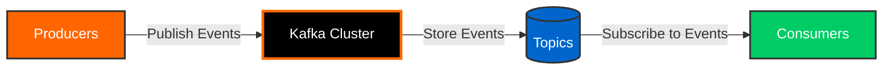
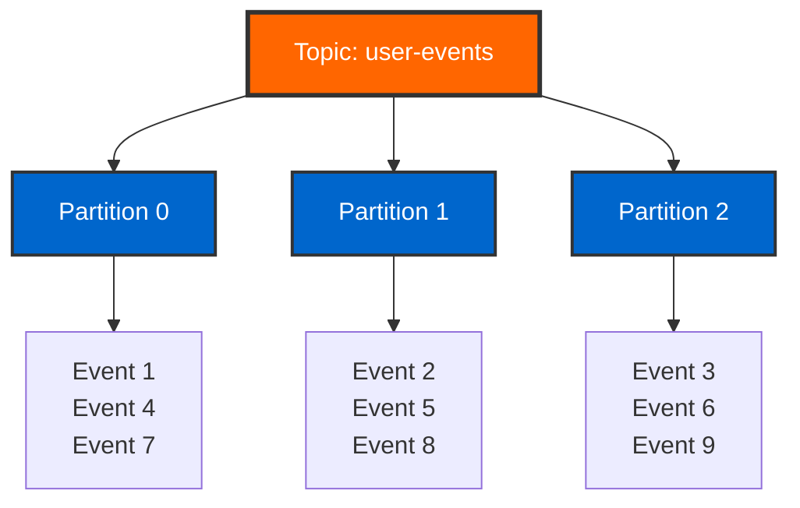
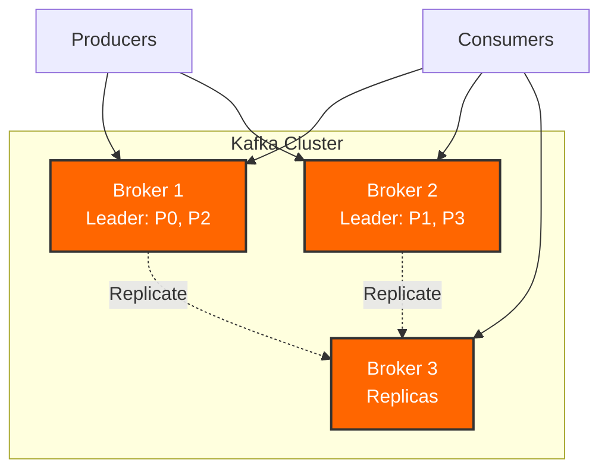
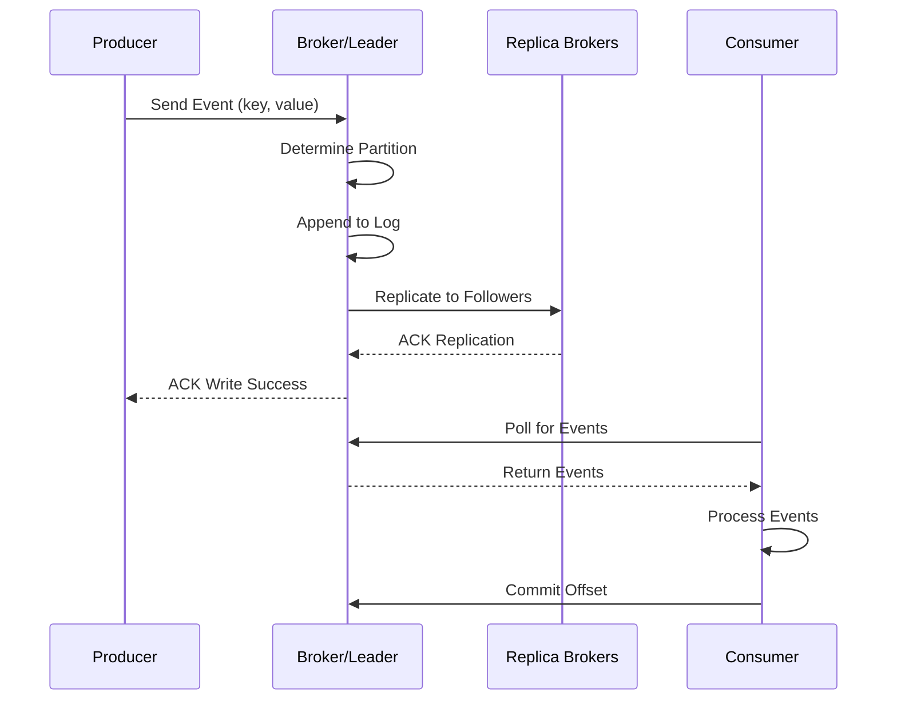
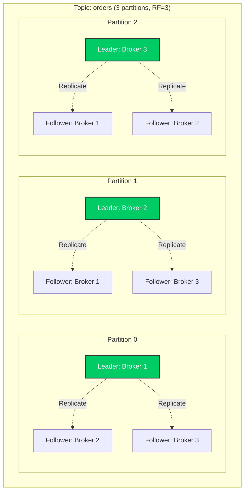

# Day 1: Kafka Fundamentals and Foundation

> **Primary Audience:** Data Engineers
> **Learning Track:** Platform-agnostic Kafka fundamentals. CLI tools and pure APIs work for all languages (Java, Python, Go, Scala, etc.). Spring Boot integration is optional.

## Learning Objectives

By the end of Day 1, you will:

- [ ] Understand Apache Kafka architecture and core concepts
- [ ] Set up a containerized Kafka development environment
- [ ] Create and manage topics using AdminClient API
- [ ] Understand producers, consumers, and brokers
- [ ] Run Kafka examples using CLI or Spring Boot (based on your track)

## What is Apache Kafka?

Apache Kafka is a **distributed event streaming platform** that enables:

- **Publishing and subscribing** to streams of events
- **Storing** events durably and reliably
- **Processing** events in real-time or retrospectively



## Core Concepts

### Events

An event records that "something happened" in your system.

**Event Structure:**

- **Key** - Identifies the event (optional, used for partitioning)
- **Value** - The event payload (actual data)
- **Timestamp** - When the event occurred
- **Headers** - Optional metadata

**Example Event:**

```json
{
  "key": "user-123",
  "value": {
    "userId": "user-123",
    "action": "login",
    "timestamp": "2025-10-17T10:30:00Z",
    "ipAddress": "192.168.1.100"
  },
  "headers": {
    "source": "web-app",
    "version": "1.0"
  }
}
```

### Topics

Topics are **named streams of events**, like folders in a filesystem.

**Key Characteristics:**

- Events are organized and stored in topics
- Topics are multi-subscriber (many consumers can read)
- Topics are durable (events persist)
- Topics are partitioned for scalability



### Partitions

Topics are divided into **partitions** for scalability:

- Events with the same key go to the same partition
- Partitions enable parallel processing
- Each partition is an ordered, immutable sequence
- Order is guaranteed **within a partition**, not across partitions

!!! note "Partition Key Rule"
    `partition = hash(key) % number_of_partitions`

    Same key → Same partition → Guaranteed order

### Brokers

Kafka **brokers** are servers that store and serve data:

- A cluster consists of multiple brokers
- Each broker handles read/write requests
- Brokers replicate data for fault tolerance
- Brokers elect leaders for each partition



## Container-First Setup

### Start Kafka with Docker Compose

=== "Full Stack"

    ```bash
    # Start complete Kafka ecosystem
    docker-compose up -d

    # Verify services
    docker-compose ps
    ```

=== "Development Mode"

    ```bash
    # Start only Kafka infrastructure
    docker-compose -f docker-compose-dev.yml up -d

    # Run Spring Boot app locally
    mvn spring-boot:run -Dspring-boot.run.profiles=dev
    ```

=== "TestContainers"

    ```bash
    # Tests automatically start Kafka containers
    mvn test -Dtest=Day01FoundationTest
    ```

### Verify Kafka is Running

```bash
# Check Kafka broker
docker exec kafka-training-kafka \
  kafka-broker-api-versions --bootstrap-server localhost:9092

# List existing topics
docker exec kafka-training-kafka \
  kafka-topics --bootstrap-server localhost:9092 --list
```

## Topic Operations with AdminClient

### Pure Java AdminClient (Data Engineer Track - Recommended)

Use the raw Kafka AdminClient API to manage topics programmatically:

```java
// Pure Kafka AdminClient - no Spring dependencies
import org.apache.kafka.clients.admin.*;
import java.util.*;

public class TopicManager {

    public static void main(String[] args) throws Exception {
        // Configure AdminClient
        Properties props = new Properties();
        props.put(AdminClientConfig.BOOTSTRAP_SERVERS_CONFIG, "localhost:9092");

        try (AdminClient adminClient = AdminClient.create(props)) {

            // Create a new topic
            NewTopic newTopic = new NewTopic("my-first-topic", 3, (short) 1);
            CreateTopicsResult result = adminClient.createTopics(
                Collections.singletonList(newTopic)
            );
            result.all().get();
            System.out.println("Topic created: my-first-topic");

            // List all topics
            Set<String> topics = adminClient.listTopics().names().get();
            System.out.println("All topics: " + topics);

            // Get cluster info
            Collection<Node> nodes = adminClient.describeCluster().nodes().get();
            System.out.println("Brokers in cluster: " + nodes.size());
        }
    }
}
```

**Location**: `src/main/java/com/training/kafka/Day01Foundation/BasicTopicOperations.java`

**Run**:
```bash
java -cp target/kafka-training-java-1.0.0.jar \
  com.training.kafka.Day01Foundation.BasicTopicOperations
```

### Create Topics

=== "CLI (Data Engineer Track)"

    ```bash
    # Using custom training CLI
    ./bin/kafka-training-cli.sh create-topic \
      --name my-first-topic \
      --partitions 3 \
      --replication-factor 1

    # Or using native Kafka tools
    docker exec kafka-training-kafka kafka-topics \
      --bootstrap-server localhost:9092 \
      --create \
      --topic my-first-topic \
      --partitions 3 \
      --replication-factor 1

    # Verify creation
    docker exec kafka-training-kafka kafka-topics \
      --bootstrap-server localhost:9092 \
      --describe \
      --topic my-first-topic
    ```

=== "Pure Java (Data Engineer Track)"

    ```java
    // Raw Kafka AdminClient API - no Spring
    import org.apache.kafka.clients.admin.*;

    public class TopicCreator {

        public static void createTopic(String topicName, int partitions)
            throws Exception {

            Properties props = new Properties();
            props.put(AdminClientConfig.BOOTSTRAP_SERVERS_CONFIG,
                "localhost:9092");

            try (AdminClient admin = AdminClient.create(props)) {
                NewTopic newTopic = new NewTopic(
                    topicName,
                    partitions,
                    (short) 1
                );

                CreateTopicsResult result = admin.createTopics(
                    Collections.singletonList(newTopic)
                );

                result.all().get();
                System.out.println("Created topic: " + topicName);
            }
        }
    }
    ```

=== "Spring Boot (Java Developer Track)"

    ```java
    @Service
    public class Day01FoundationService {

        @Autowired
        private KafkaAdmin kafkaAdmin;

        public Map<String, Object> demonstrateFoundation() {
            // Spring Boot wraps AdminClient
            try (AdminClient adminClient = AdminClient.create(
                kafkaAdmin.getConfigurationProperties())) {

                // List topics
                Set<String> topics = adminClient.listTopics()
                    .names()
                    .get();

                // Get cluster info
                Collection<Node> nodes = adminClient.describeCluster()
                    .nodes()
                    .get();

                return Map.of(
                    "topics", topics,
                    "brokers", nodes.size()
                );
            }
        }
    }
    ```

=== "REST API (Java Developer Track)"

    ```bash
    # Run Day 1 demonstration
    curl -X POST http://localhost:8080/api/training/day01/demo

    # Create EventMart topics
    curl -X POST http://localhost:8080/api/training/eventmart/topics
    ```

=== "Python (Data Engineer Track)"

    **Complete Example**: `examples/python/day01_admin.py`

    ```bash
    # Run the Python AdminClient example
    python examples/python/day01_admin.py
    ```

    **Key code from day01_admin.py:**

    ```python
    from kafka.admin import KafkaAdminClient, NewTopic

    # Create AdminClient (same concept as Java AdminClient.create())
    admin_client = KafkaAdminClient(
        bootstrap_servers=BOOTSTRAP_SERVERS,
        client_id='python-admin-client'
    )

    # Create topics with configurations
    topics = [
        NewTopic(
            name='python-demo-topic-1',
            num_partitions=3,
            replication_factor=1
        ),
        NewTopic(
            name='python-demo-topic-2',
            num_partitions=6,
            replication_factor=1,
            topic_configs={
                'retention.ms': '86400000',  # 1 day
                'compression.type': 'snappy'
            }
        )
    ]

    result = admin_client.create_topics(new_topics=topics, validate_only=False)

    # List all topics
    topics_list = admin_client.list_topics()

    # Get cluster metadata
    cluster_metadata = admin_client.describe_cluster()
    ```

    **Install Python Dependencies:**

    ```bash
    # Install kafka-python library
    pip install kafka-python

    # Or install all training dependencies
    pip install -r examples/python/requirements.txt
    ```

    **Python AdminClient Benefits:**
    - **Platform-Agnostic**: Same Kafka operations as Java
    - **Interoperable**: Manage topics created by any Kafka client
    - **Data Pipelines**: Integrate with Airflow, Prefect, Luigi
    - **Automation**: Deploy topics as part of infrastructure as code

    See the complete working example at `examples/python/day01_admin.py` for demonstrations of:
    - Creating topics with configurations
    - Listing and describing topics
    - Getting cluster metadata
    - Deleting topics
    - Error handling

### List Topics

```bash
# Using Docker
docker exec kafka-training-kafka kafka-topics \
  --bootstrap-server localhost:9092 \
  --list

# Using REST API
curl http://localhost:8080/api/training/day01/topics

# Using Kafka UI
open http://localhost:8081
```

### Describe Topics

```bash
# Describe specific topic
docker exec kafka-training-kafka kafka-topics \
  --bootstrap-server localhost:9092 \
  --describe \
  --topic user-events

# Output shows:
# - Partition count
# - Replication factor
# - Leader broker for each partition
# - In-sync replicas (ISR)
```

## Kafka Architecture Deep Dive

### Message Flow



### Partition Leadership

- Each partition has one **leader** broker
- Leader handles all reads and writes
- **Followers** replicate data from leader
- If leader fails, a follower becomes the new leader

### Replication



## Hands-On Exercises

### Exercise 1: Create and Explore Topics

```bash
# 1. Create a topic for user events
docker exec kafka-training-kafka kafka-topics \
  --bootstrap-server localhost:9092 \
  --create --topic user-events \
  --partitions 6 --replication-factor 1

# 2. Create a topic for order events
docker exec kafka-training-kafka kafka-topics \
  --bootstrap-server localhost:9092 \
  --create --topic order-events \
  --partitions 3 --replication-factor 1

# 3. List all topics
docker exec kafka-training-kafka kafka-topics \
  --bootstrap-server localhost:9092 \
  --list

# 4. Describe user-events topic
docker exec kafka-training-kafka kafka-topics \
  --bootstrap-server localhost:9092 \
  --describe --topic user-events
```

### Exercise 2: Producer and Consumer Basics

```bash
# 1. Start console producer
docker exec -it kafka-training-kafka kafka-console-producer \
  --bootstrap-server localhost:9092 \
  --topic user-events

# Type messages (Ctrl+C to exit):
# {"userId": "user1", "action": "login"}
# {"userId": "user2", "action": "signup"}
# {"userId": "user1", "action": "view_product"}

# 2. Start console consumer (in new terminal)
docker exec -it kafka-training-kafka kafka-console-consumer \
  --bootstrap-server localhost:9092 \
  --topic user-events \
  --from-beginning
```

### Exercise 3: Test Partitioning

```bash
# Produce with keys to see partitioning
docker exec -it kafka-training-kafka kafka-console-producer \
  --bootstrap-server localhost:9092 \
  --topic user-events \
  --property "parse.key=true" \
  --property "key.separator=:"

# Type key:value pairs:
# user1:{"action":"login"}
# user2:{"action":"login"}
# user1:{"action":"logout"}
# user2:{"action":"logout"}

# Same keys (user1, user2) go to same partitions!
```

### Exercise 4: CLI and Pure Java Practice (Data Engineer Track)

```bash
# Use the training CLI wrapper
./bin/kafka-training-cli.sh --day 1 --demo foundation

# Or run pure Java directly
java -cp target/kafka-training-java-1.0.0.jar \
  com.training.kafka.Day01Foundation.BasicTopicOperations

# Practice with native Kafka CLI tools
docker exec kafka-training-kafka kafka-topics \
  --bootstrap-server localhost:9092 \
  --list
```

### Exercise 5: Spring Boot API (Java Developer Track - Optional)

```bash
# Run Day 1 foundation demo
curl -X POST http://localhost:8080/api/training/day01/demo | jq

# Expected response:
{
  "status": "success",
  "message": "Day 1 foundation demonstration completed",
  "operations": [
    "Listed existing topics",
    "Retrieved cluster information",
    "Demonstrated basic admin operations"
  ]
}
```

## Project Integration

### Data Engineer Track

Apply concepts with pure Java examples:

```bash
# Run individual topic management examples
java -cp target/kafka-training-java-1.0.0.jar \
  com.training.kafka.Day01Foundation.BasicTopicOperations

# Practice with different configurations
# - Vary partition counts
# - Change replication factors
# - Test different topic names
```

### Java Developer Track - EventMart Integration

Apply today's concepts to the EventMart project:

```bash
# 1. Create EventMart topics
curl -X POST http://localhost:8080/api/training/eventmart/topics

# 2. Verify topics created
curl http://localhost:8080/api/training/eventmart/status | jq

# Expected topics:
# - eventmart-users (6 partitions)
# - eventmart-products (3 partitions)
# - eventmart-orders (6 partitions)
# - eventmart-payments (3 partitions)
# - eventmart-inventory (3 partitions)
```

## Key Takeaways

!!! success "What You Learned"
    1. **Kafka is a distributed streaming platform** for high-throughput event processing
    2. **Topics are partitioned** for scalability and parallel processing
    3. **Keys determine partition assignment** - same key always goes to same partition
    4. **AdminClient provides programmatic access** to cluster management
    5. **Brokers store and serve data** in a distributed, replicated manner
    6. **Container-first approach** enables production-parity development

## Common Issues & Solutions

### Port Already in Use

```bash
# Find what's using port 9092
lsof -i :9092

# Stop conflicting process or restart Kafka
docker-compose restart kafka
```

### Topic Already Exists

```bash
# Delete topic
docker exec kafka-training-kafka kafka-topics \
  --bootstrap-server localhost:9092 \
  --delete --topic my-topic

# Or use a different name
```

### Container Not Starting

```bash
# Check logs
docker-compose logs kafka

# Restart with clean state
docker-compose down -v
docker-compose up -d
```

## Practice Exercises

Ready to practice what you learned? Complete the **[Day 1 Exercises](../exercises/day01-exercises.md)** to reinforce:

- Topic creation and management
- Partition distribution and leadership
- Configuration management
- AdminClient API usage

These hands-on exercises will solidify your understanding before moving forward.

## Learning Track Guidance

This training supports two distinct approaches:

### Data Engineer Track (Recommended)
- **Focus**: Pure Kafka concepts, CLI tools, platform-agnostic
- **Examples**: `src/main/java/com/training/kafka/Day01Foundation/`
- **Run**: `./bin/kafka-training-cli.sh` or `java -cp target/*.jar`
- **Best for**: Data pipelines, platform integration, transferable skills

### Java Developer Track
- **Focus**: Spring Boot integration, web UI, REST APIs
- **Examples**: `src/main/java/com/training/kafka/services/Day01FoundationService.java`
- **Run**: `mvn spring-boot:run` then use `http://localhost:8080`
- **Best for**: Microservices, Java-specific development, EventMart project

**Both tracks cover the same Kafka concepts** - choose based on your role and goals.

See [Track Selection Guide](../getting-started/track-selection.md) for detailed comparison.

## Next Steps

Ready for Day 2? Continue to [Day 2: Data Flow and Message Patterns](day02-dataflow.md)

Or explore:

- **[Track Selection Guide](../getting-started/track-selection.md)** - Compare Python vs Java tracks
- **[Quick Start Guide](../getting-started/quick-start.md)** - Get started quickly
- [Container Development Guide](../containers/docker-basics.md)
- [Architecture Overview](../architecture/system-design.md)
- **[All Practice Exercises](../exercises/index.md)** - Hands-on challenges

---

**Practice is key!** Spend time experimenting with topics, partitions, and the AdminClient API (either via CLI or Spring Boot) before moving to Day 2.
