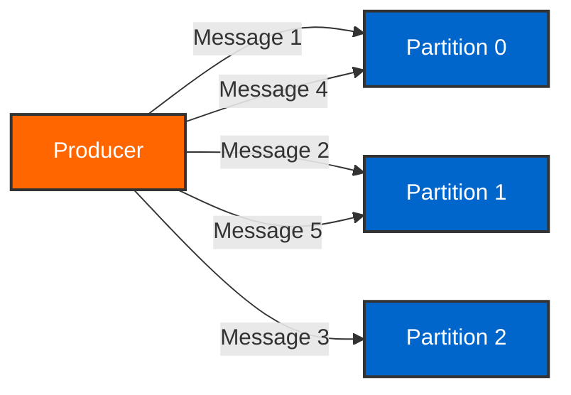
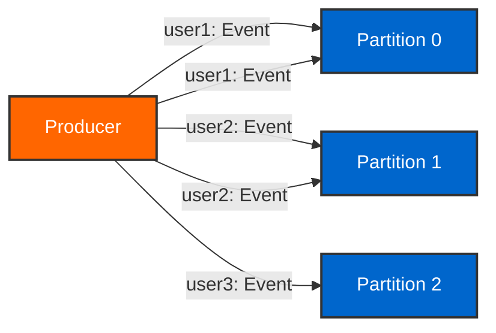
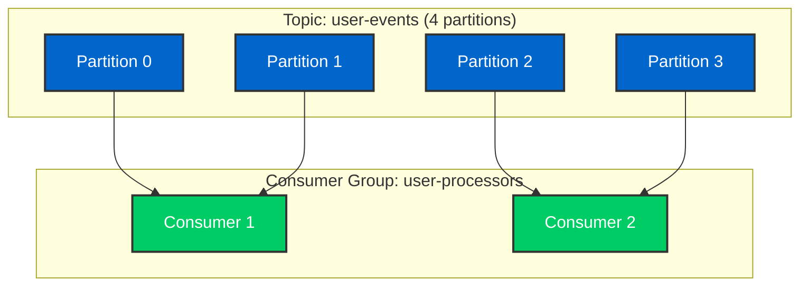
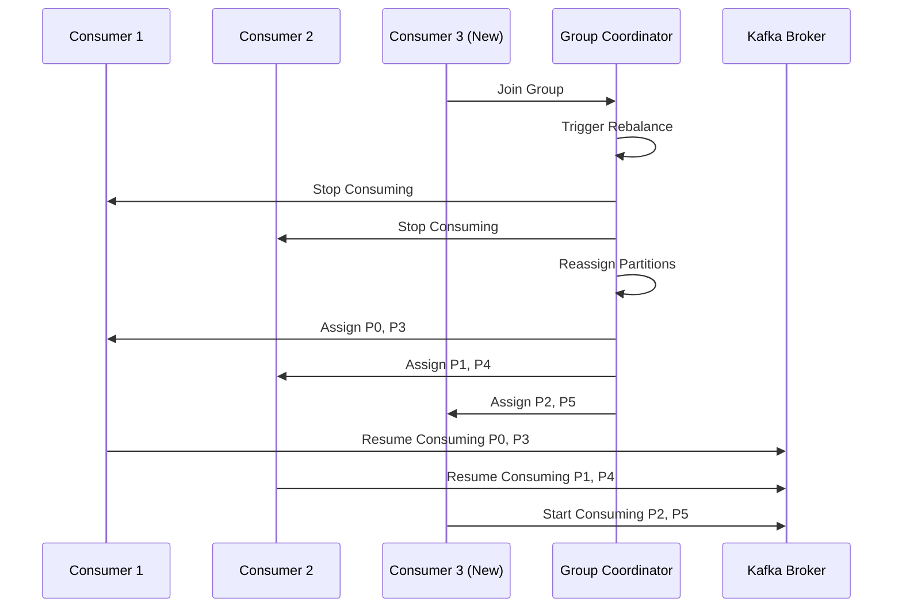
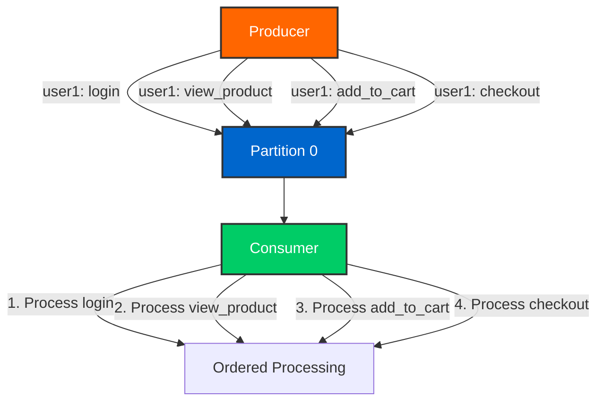

# Day 2: Data Flow and Message Patterns

> **Primary Audience:** Data Engineers

> **Learning Track:** This content is platform-agnostic and applies to both Data Engineer and Java Developer tracks. Implementation examples are provided for both approaches.

## Learning Objectives

By the end of Day 2, you will:

- [ ] Understand producer delivery semantics (at-least-once, at-most-once, exactly-once)
- [ ] Master partitioning strategies (round-robin, key-based, custom)
- [ ] Configure and manage consumer groups
- [ ] Handle consumer rebalancing
- [ ] Manage offsets (auto-commit vs manual commit)
- [ ] Guarantee message ordering
- [ ] Monitor consumer lag and offsets

## Core Concepts

### Producer Delivery Semantics

Kafka supports three delivery guarantees that balance performance, durability, and consistency.

#### At-Most-Once Delivery

Messages are sent without acknowledgment. May be lost but never duplicated.

**Configuration:**

```properties
# Producer doesn't wait for acknowledgment
acks=0
retries=0
```

**Use Cases:**

- Metrics collection where occasional data loss is acceptable
- High-throughput logging
- Non-critical telemetry data

!!! warning "Data Loss Risk"
    At-most-once delivery provides no guarantees. Messages can be lost if the broker fails or network issues occur.

#### At-Least-Once Delivery (Default)

Messages are guaranteed to be delivered at least once. May result in duplicates.

**Configuration:**

```properties
# Wait for acknowledgment from leader
acks=1
# Retry on failure
retries=2147483647
# Ensure ordering during retries
max.in.flight.requests.per.connection=5
enable.idempotence=true
```

**Use Cases:**

- Most production applications
- Order processing
- Financial transactions (with idempotent consumers)
- Event sourcing

!!! tip "Idempotent Consumers"
    When using at-least-once delivery, implement idempotent consumers to handle duplicate messages gracefully.

#### Exactly-Once Semantics (EOS)

Guarantees that messages are delivered exactly once, no duplicates, no losses.

**Configuration:**

```properties
# Enable exactly-once semantics
enable.idempotence=true
transactional.id=my-transactional-producer-1
acks=all
retries=2147483647
max.in.flight.requests.per.connection=5
```

**Use Cases:**
- Financial transactions
- Critical business events
- Data pipelines requiring strong consistency
- Event sourcing with strict guarantees

!!! success "Production Recommendation"
    Use exactly-once semantics for critical business logic. The performance overhead is minimal compared to the consistency benefits.

### Partitioning Strategies

Partitioning determines how messages are distributed across topic partitions.

#### Round-Robin Partitioning

When no key is provided, messages are distributed evenly across partitions.



**Characteristics:**
- Even distribution across partitions
- No ordering guarantees
- Maximum throughput
- Parallel processing

#### Key-Based Partitioning

Messages with the same key always go to the same partition.



**Characteristics:**
- Ordering guaranteed per key
- Same key → same partition
- Useful for entity-based processing
- Hot partitions possible with skewed keys

!!! note "Partition Calculation"
    ```
    partition = hash(key) % number_of_partitions
    ```

    Changing partition count breaks this guarantee for existing keys!

### Consumer Groups and Rebalancing

Consumer groups enable parallel processing and fault tolerance.

#### Consumer Group Concepts



**Key Rules:**
- Each partition is consumed by exactly one consumer in a group
- A consumer can consume multiple partitions
- Maximum consumers = number of partitions
- Different consumer groups consume independently

#### Consumer Rebalancing



**Rebalance Triggers:**
- Consumer joins the group
- Consumer leaves the group (graceful or crash)
- Consumer heartbeat timeout
- Topic partition count changes

**Rebalance Strategies:**

```properties
# Partition assignment strategy
partition.assignment.strategy=org.apache.kafka.clients.consumer.RangeAssignor

# Available strategies:
# - RangeAssignor (default): Assigns partitions in ranges
# - RoundRobinAssignor: Round-robin across consumers
# - StickyAssignor: Minimizes partition movement
# - CooperativeStickyAssignor: Incremental rebalancing
```

!!! tip "Minimize Rebalancing"
    - Use `CooperativeStickyAssignor` for incremental rebalancing
    - Increase `session.timeout.ms` and `heartbeat.interval.ms`
    - Ensure consumers process messages quickly
    - Handle rebalancing gracefully in your application

### Offset Management

Offsets track consumer progress in each partition.

#### Auto-Commit Offsets

Kafka automatically commits offsets periodically.

**Configuration:**

```properties
enable.auto.commit=true
auto.commit.interval.ms=5000
```

**Pros:**
- Simple configuration
- No manual offset management
- Good for at-most-once semantics

**Cons:**
- May lose messages on consumer crash
- May process duplicates after rebalance
- Less control over commit timing

#### Manual Commit Offsets

Application controls when offsets are committed.

**Configuration:**

```properties
enable.auto.commit=false
```

**Commit Strategies:**

1. **MANUAL** - Explicitly call acknowledgment
2. **MANUAL_IMMEDIATE** - Commit immediately when acknowledged
3. **BATCH** - Commit after processing batch of records
4. **RECORD** - Commit after each record (safest, slowest)

!!! success "Best Practice"
    Use manual commits for at-least-once delivery with proper error handling and idempotent processing.

#### Offset Reset Strategies

Control behavior when no offset exists or offset is invalid.

```properties
# What to do when no initial offset
auto.offset.reset=earliest

# Options:
# - earliest: Start from beginning of partition
# - latest: Start from end of partition (default)
# - none: Throw exception if no offset found
```

### Message Ordering Guarantees

Kafka provides ordering guarantees at the partition level.

#### Ordering Within Partition

Messages in the same partition are strictly ordered.



**Requirements for Ordering:**
- Use consistent key for related messages
- Single partition for ordered messages
- `max.in.flight.requests.per.connection=1` (without idempotence)
- Or `enable.idempotence=true` (allows up to 5 in-flight)

## Hands-On Examples

### CLI Approach (Data Engineer Track - Recommended)

#### Using Kafka CLI Tools

**Test Delivery Semantics:**

```bash
# 1. Terminal 1: Start consumer with auto-commit
docker exec -it kafka-training-kafka kafka-console-consumer \
  --bootstrap-server localhost:9092 \
  --topic test-semantics \
  --group semantics-group \
  --property enable.auto.commit=true

# 2. Terminal 2: Send messages
docker exec -it kafka-training-kafka kafka-console-producer \
  --bootstrap-server localhost:9092 \
  --topic test-semantics

# Type messages:
# message-1
# message-2
# message-3

# 3. Stop consumer (Ctrl+C) immediately after seeing messages
# 4. Restart consumer - messages may be replayed or skipped
# 5. Observe the difference in behavior
```

**Partitioning Experiment:**

```bash
# Create topic with 3 partitions
docker exec kafka-training-kafka kafka-topics \
  --bootstrap-server localhost:9092 \
  --create --topic partition-test \
  --partitions 3 --replication-factor 1

# Produce with keys
docker exec -it kafka-training-kafka kafka-console-producer \
  --bootstrap-server localhost:9092 \
  --topic partition-test \
  --property "parse.key=true" \
  --property "key.separator=:"

# Type:
# user1:Event A
# user2:Event B
# user1:Event C
# user3:Event D
# user2:Event E
# user1:Event F

# Consume and show partition
docker exec kafka-training-kafka kafka-console-consumer \
  --bootstrap-server localhost:9092 \
  --topic partition-test \
  --from-beginning \
  --property print.partition=true \
  --property print.key=true

# Observe: Same keys go to same partitions!
```

**Consumer Group Scaling:**

```bash
# Terminal 1: Start first consumer
docker exec -it kafka-training-kafka kafka-console-consumer \
  --bootstrap-server localhost:9092 \
  --topic user-events \
  --group scaling-group \
  --property print.partition=true

# Terminal 2: Start second consumer (triggers rebalance)
docker exec -it kafka-training-kafka kafka-console-consumer \
  --bootstrap-server localhost:9092 \
  --topic user-events \
  --group scaling-group \
  --property print.partition=true

# Terminal 3: Produce messages
docker exec -it kafka-training-kafka kafka-console-producer \
  --bootstrap-server localhost:9092 \
  --topic user-events

# Observe: Messages distributed across both consumers
```

**Monitor Consumer Lag:**

```bash
# Check consumer group details
docker exec kafka-training-kafka kafka-consumer-groups \
  --bootstrap-server localhost:9092 \
  --describe \
  --group my-consumer-group

# Output shows:
# - Current offset
# - Log end offset
# - Lag (difference)
# - Consumer ID
# - Host
```

#### Pure Java Implementation

**At-Least-Once Producer (Raw Kafka API):**

```java
// Raw Kafka Producer API - no Spring dependencies
import org.apache.kafka.clients.producer.*;
import java.util.Properties;

public class AtLeastOnceProducer {

    public static void main(String[] args) {
        // Configure producer
        Properties props = new Properties();
        props.put(ProducerConfig.BOOTSTRAP_SERVERS_CONFIG, "localhost:9092");
        props.put(ProducerConfig.KEY_SERIALIZER_CLASS_CONFIG,
            "org.apache.kafka.common.serialization.StringSerializer");
        props.put(ProducerConfig.VALUE_SERIALIZER_CLASS_CONFIG,
            "org.apache.kafka.common.serialization.StringSerializer");

        // At-least-once configuration
        props.put(ProducerConfig.ACKS_CONFIG, "1");
        props.put(ProducerConfig.RETRIES_CONFIG, Integer.MAX_VALUE);
        props.put(ProducerConfig.MAX_IN_FLIGHT_REQUESTS_PER_CONNECTION, 5);
        props.put(ProducerConfig.ENABLE_IDEMPOTENCE_CONFIG, true);

        try (KafkaProducer<String, String> producer = new KafkaProducer<>(props)) {
            String topic = "user-events";
            String key = "user1";
            String value = "{\"action\":\"login\"}";

            ProducerRecord<String, String> record =
                new ProducerRecord<>(topic, key, value);

            // Send with callback
            producer.send(record, (metadata, exception) -> {
                if (exception != null) {
                    System.err.println("Failed to send: " + exception.getMessage());
                } else {
                    System.out.printf("Sent to partition %d at offset %d%n",
                        metadata.partition(), metadata.offset());
                }
            });
        }
    }
}
```

**Manual Offset Consumer (Raw Kafka API):**

```java
// Raw Kafka Consumer API - no Spring dependencies
import org.apache.kafka.clients.consumer.*;
import java.time.Duration;
import java.util.*;

public class ManualOffsetConsumer {

    public static void main(String[] args) {
        // Configure consumer
        Properties props = new Properties();
        props.put(ConsumerConfig.BOOTSTRAP_SERVERS_CONFIG, "localhost:9092");
        props.put(ConsumerConfig.GROUP_ID_CONFIG, "manual-commit-group");
        props.put(ConsumerConfig.KEY_DESERIALIZER_CLASS_CONFIG,
            "org.apache.kafka.common.serialization.StringDeserializer");
        props.put(ConsumerConfig.VALUE_DESERIALIZER_CLASS_CONFIG,
            "org.apache.kafka.common.serialization.StringDeserializer");

        // Manual offset configuration
        props.put(ConsumerConfig.ENABLE_AUTO_COMMIT_CONFIG, false);

        try (KafkaConsumer<String, String> consumer = new KafkaConsumer<>(props)) {
            consumer.subscribe(Collections.singletonList("orders"));

            while (true) {
                ConsumerRecords<String, String> records =
                    consumer.poll(Duration.ofMillis(100));

                for (ConsumerRecord<String, String> record : records) {
                    try {
                        // Process message
                        processOrder(record.value());

                        // Commit offset after successful processing
                        Map<TopicPartition, OffsetAndMetadata> offsets = Map.of(
                            new TopicPartition(record.topic(), record.partition()),
                            new OffsetAndMetadata(record.offset() + 1)
                        );
                        consumer.commitSync(offsets);

                        System.out.printf("Processed and committed offset: %d%n",
                            record.offset());

                    } catch (Exception e) {
                        System.err.println("Processing failed, will retry: " + e.getMessage());
                        // Don't commit - message will be reprocessed
                    }
                }
            }
        }
    }

    private static void processOrder(String orderJson) {
        // Process order logic
        System.out.println("Processing order: " + orderJson);
    }
}
```

**Location**: `src/main/java/com/training/kafka/Day02DataFlow/`

**Run Pure Java Examples:**

```bash
# Compile and run
javac -cp "target/kafka-training-java-1.0.0.jar" \
  src/main/java/com/training/kafka/Day02DataFlow/AtLeastOnceProducer.java

java -cp target/kafka-training-java-1.0.0.jar \
  com.training.kafka.Day02DataFlow.AtLeastOnceProducer
```

### Spring Boot Approach (Java Developer Track - Optional)

> **Java Developer Track Only**
> The following section uses Spring Boot integration with KafkaTemplate and @KafkaListener annotations. Data engineers should focus on the raw Kafka API examples above.

**At-Least-Once Producer (Spring Boot):**

```java
@Service
public class AtLeastOnceProducer {

    @Autowired
    private KafkaTemplate<String, String> kafkaTemplate;

    public void sendWithRetries(String topic, String key, String message) {
        SendResult<String, String> result = kafkaTemplate.send(topic, key, message)
            .thenApply(sendResult -> {
                RecordMetadata metadata = sendResult.getRecordMetadata();
                log.info("Message sent to partition {} at offset {}",
                    metadata.partition(), metadata.offset());
                return sendResult;
            })
            .exceptionally(ex -> {
                log.error("Failed to send message", ex);
                throw new RuntimeException("Send failed", ex);
            })
            .join();
    }
}
```

**Manual Commit Consumer (Spring Boot):**

```java
@Service
public class ManualCommitConsumer {

    @KafkaListener(
        topics = "orders",
        groupId = "manual-commit-group",
        properties = {
            "enable.auto.commit=false"
        }
    )
    public void consume(ConsumerRecord<String, String> record,
                       Acknowledgment acknowledgment) {
        try {
            // Process message
            processOrder(record.value());

            // Commit offset after successful processing
            acknowledgment.acknowledge();

            log.info("Successfully processed and committed offset {}",
                record.offset());

        } catch (Exception e) {
            log.error("Failed to process message, will retry", e);
            // Don't commit - message will be reprocessed
        }
    }
}
```

### REST API Testing (Java Developer Track - Optional)

> **Java Developer Track Only**
> For those using the web UI and REST API approach.

**Run Day 2 Demo:**

```bash
curl -X POST http://localhost:8080/api/training/day02/demo
```

**Response:**

```json
{
  "status": "success",
  "message": "Day 2 data flow demonstration completed",
  "demonstrations": [
    "Producer semantics (at-least-once, at-most-once, exactly-once)",
    "Partitioning strategies (round-robin, key-based)",
    "Consumer group operations",
    "Offset management"
  ]
}
```

**Check Consumer Lag:**

```bash
curl http://localhost:8080/api/training/day02/consumer-lag/my-consumer-group | jq
```

**Response:**

```json
{
  "groupId": "my-consumer-group",
  "totalLag": 1542,
  "partitions": [
    {
      "partition": 0,
      "currentOffset": 10000,
      "endOffset": 10500,
      "lag": 500
    },
    {
      "partition": 1,
      "currentOffset": 9800,
      "endOffset": 10842,
      "lag": 1042
    }
  ]
}
```

## Practice Exercises

### Data Engineer Track Exercises

Complete these exercises using pure Kafka CLI tools and Java APIs:

1. **Test Delivery Semantics**: Create producers with different acks configurations and observe behavior
2. **Partitioning Experiment**: Send messages with and without keys, observe partition assignment
3. **Consumer Group Scaling**: Start multiple consumers in the same group, observe rebalancing
4. **Manual Offset Management**: Implement manual offset commit logic
5. **Monitor Consumer Lag**: Use CLI tools to track consumer lag over time

### Java Developer Track Exercises (Optional)

Complete these exercises using Spring Boot integration:

1. **Spring Boot Producer**: Implement producers with different delivery semantics
2. **Spring Boot Consumer**: Implement manual commit consumers with error handling
3. **REST API Testing**: Use the web UI to demonstrate data flow concepts
4. **EventMart Integration**: Apply concepts to EventMart order processing

**See**: Full exercises in [exercises/day02-exercises.md](../../exercises/day02-exercises.md)

## Learning Track Guidance

### Data Engineer Track

Focus on:
- Pure Kafka API patterns with Properties configuration
- CLI tool usage for testing and monitoring
- Platform-agnostic offset management strategies
- Consumer group behavior with native tools
- Understanding Kafka internals without framework abstraction

### Java Developer Track

Additionally explore:
- Spring Boot integration with KafkaTemplate
- @KafkaListener annotations and Acknowledgment
- REST API endpoints for demonstrations
- Web UI for visualizing data flow

## Key Takeaways

!!! success "What You Learned"
    1. **Producer semantics** provide different delivery guarantees (at-most-once, at-least-once, exactly-once)
    2. **Partitioning strategies** determine message distribution and ordering
    3. **Consumer groups** enable parallel processing and fault tolerance
    4. **Rebalancing** redistributes partitions when consumers change
    5. **Manual offset management** provides precise control over message processing
    6. **Ordering is guaranteed within partitions** but not across partitions
    7. **Consumer lag monitoring** is essential for production systems

## Common Issues & Solutions

### High Consumer Lag

**Problem:** Consumer can't keep up with producer rate.

**Solutions:**
```bash
# 1. Add more consumers (up to partition count)
# 2. Optimize consumer processing
# 3. Increase partition count (requires data migration)
# 4. Use batch processing
```

### Duplicate Messages

**Problem:** Messages processed multiple times.

**Solution:** Make consumers idempotent by tracking processed message IDs.

### Frequent Rebalancing

**Problem:** Consumer group constantly rebalancing.

**Solution:**
```properties
# Increase session timeout
session.timeout.ms=30000
# Decrease heartbeat interval
heartbeat.interval.ms=3000
# Increase max poll interval
max.poll.interval.ms=300000
# Ensure consumers process quickly
```

## Next Steps

Ready for Day 3? Continue to [Day 3: Producers](day03-producers.md) for deep dive into producer patterns and configurations.

Or explore:

- **[README-DATA-ENGINEERS.md](../../README-DATA-ENGINEERS.md)** - CLI-first track
- **[WEB-UI-GETTING-STARTED.md](../../WEB-UI-GETTING-STARTED.md)** - Spring Boot track
- [Container Development Guide](../containers/testcontainers.md)
- [API Reference](../api/training-endpoints.md)
- **[All Practice Exercises](../exercises/index.md)** - Progressive challenges

---

**Experiment with different delivery semantics and partitioning strategies to understand their trade-offs before moving to Day 3.**
