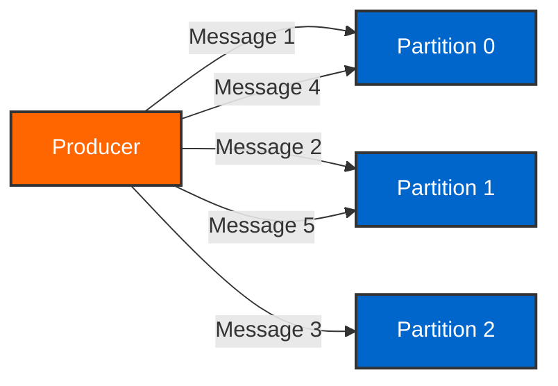
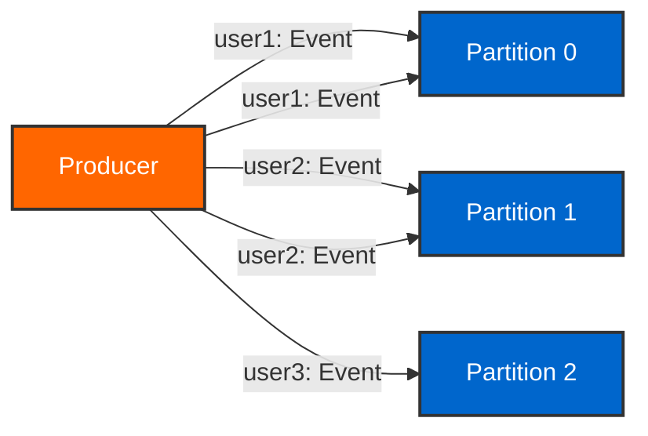
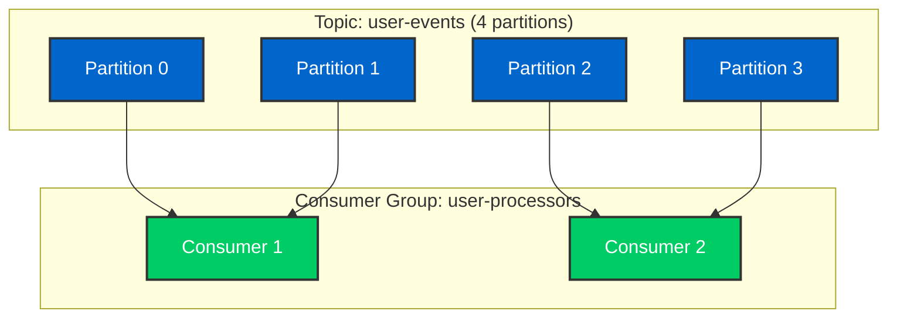
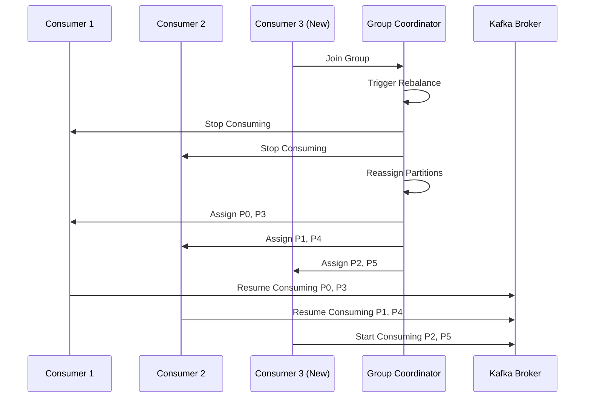
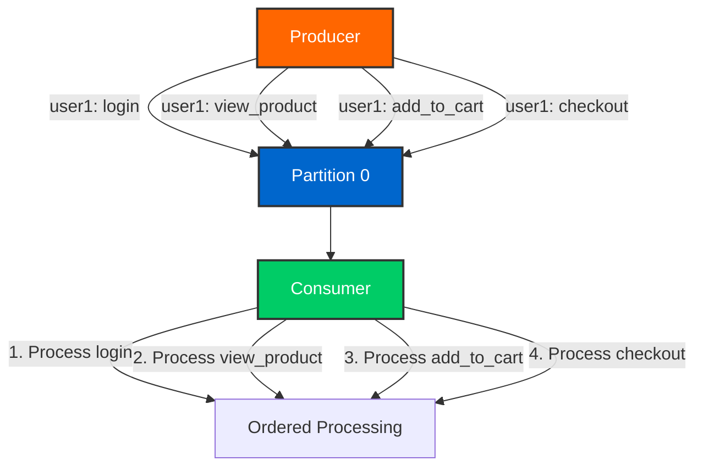

# Day 2: Data Flow and Message Patterns

## Learning Objectives

By the end of Day 2, you will:

- [ ] Understand producer delivery semantics (at-least-once, at-most-once, exactly-once)
- [ ] Master partitioning strategies (round-robin, key-based, custom)
- [ ] Configure and manage consumer groups
- [ ] Handle consumer rebalancing
- [ ] Manage offsets (auto-commit vs manual commit)
- [ ] Guarantee message ordering
- [ ] Monitor consumer lag and offsets

## Producer Delivery Semantics

Kafka supports three delivery guarantees that balance performance, durability, and consistency.

### At-Most-Once Delivery

Messages are sent without acknowledgment. May be lost but never duplicated.

```java
@Service
public class AtMostOnceProducer {

    @Autowired
    private KafkaTemplate<String, String> kafkaTemplate;

    public void sendFireAndForget(String topic, String message) {
        // No callback, no waiting for acknowledgment
        kafkaTemplate.send(topic, message);
        // If broker fails, message is lost
    }
}
```

**Configuration:**

```properties
# Producer doesn't wait for acknowledgment
acks=0
retries=0
```

**Use Cases:**
- Metrics collection where occasional data loss is acceptable
- High-throughput logging
- Non-critical telemetry data

!!! warning "Data Loss Risk"
    At-most-once delivery provides no guarantees. Messages can be lost if the broker fails or network issues occur.

### At-Least-Once Delivery (Default)

Messages are guaranteed to be delivered at least once. May result in duplicates.

```java
@Service
public class AtLeastOnceProducer {

    @Autowired
    private KafkaTemplate<String, String> kafkaTemplate;

    public void sendWithRetries(String topic, String key, String message) {
        SendResult<String, String> result = kafkaTemplate.send(topic, key, message)
            .thenApply(sendResult -> {
                RecordMetadata metadata = sendResult.getRecordMetadata();
                log.info("Message sent to partition {} at offset {}",
                    metadata.partition(), metadata.offset());
                return sendResult;
            })
            .exceptionally(ex -> {
                log.error("Failed to send message", ex);
                throw new RuntimeException("Send failed", ex);
            })
            .join();
    }
}
```

**Configuration:**

```properties
# Wait for acknowledgment from leader
acks=1
# Retry on failure
retries=Integer.MAX_VALUE
# Ensure ordering during retries
max.in.flight.requests.per.connection=5
enable.idempotence=true
```

**Use Cases:**
- Most production applications
- Order processing
- Financial transactions (with idempotent consumers)
- Event sourcing

!!! tip "Idempotent Consumers"
    When using at-least-once delivery, implement idempotent consumers to handle duplicate messages gracefully.

### Exactly-Once Semantics (EOS)

Guarantees that messages are delivered exactly once, no duplicates, no losses.

```java
@Service
public class ExactlyOnceProducer {

    @Autowired
    private KafkaTemplate<String, String> kafkaTemplate;

    @Transactional("kafkaTransactionManager")
    public void sendTransactional(String topic, List<String> messages) {
        try {
            for (String message : messages) {
                kafkaTemplate.send(topic, message);
            }
            // All messages committed together
            kafkaTemplate.flush();
        } catch (Exception e) {
            // All messages rolled back on failure
            throw new RuntimeException("Transaction failed", e);
        }
    }
}
```

**Configuration:**

```properties
# Enable exactly-once semantics
enable.idempotence=true
transactional.id=my-transactional-producer-1
acks=all
retries=Integer.MAX_VALUE
max.in.flight.requests.per.connection=5
```

**Use Cases:**
- Financial transactions
- Critical business events
- Data pipelines requiring strong consistency
- Event sourcing with strict guarantees

!!! success "Production Recommendation"
    Use exactly-once semantics for critical business logic. The performance overhead is minimal compared to the consistency benefits.

## Partitioning Strategies

Partitioning determines how messages are distributed across topic partitions.

### Round-Robin Partitioning

When no key is provided, messages are distributed evenly across partitions.

```java
@Service
public class RoundRobinProducer {

    @Autowired
    private KafkaTemplate<String, String> kafkaTemplate;

    public void sendRoundRobin(String topic, String message) {
        // No key = round-robin distribution
        kafkaTemplate.send(topic, message);
    }
}
```



**Characteristics:**
- Even distribution across partitions
- No ordering guarantees
- Maximum throughput
- Parallel processing

### Key-Based Partitioning

Messages with the same key always go to the same partition.

```java
@Service
public class KeyBasedProducer {

    @Autowired
    private KafkaTemplate<String, String> kafkaTemplate;

    public void sendWithKey(String topic, String userId, String message) {
        // Same userId always goes to same partition
        kafkaTemplate.send(topic, userId, message);
    }

    public void sendUserEvent(String userId, String event) {
        String topic = "user-events";
        String key = userId;  // Partition by user ID
        String value = String.format("{\"userId\":\"%s\",\"event\":\"%s\"}",
            userId, event);

        kafkaTemplate.send(topic, key, value);
        // All events for user123 go to same partition
    }
}
```



**Characteristics:**
- Ordering guaranteed per key
- Same key → same partition
- Useful for entity-based processing
- Hot partitions possible with skewed keys

!!! note "Partition Calculation"
    ```
    partition = hash(key) % number_of_partitions
    ```

    Changing partition count breaks this guarantee for existing keys!

### Custom Partitioning

Implement custom logic for partition assignment.

```java
public class CustomPartitioner implements Partitioner {

    @Override
    public int partition(String topic, Object key, byte[] keyBytes,
                        Object value, byte[] valueBytes,
                        Cluster cluster) {

        List<PartitionInfo> partitions = cluster.partitionsForTopic(topic);
        int numPartitions = partitions.size();

        if (key == null) {
            // Random partition for null keys
            return ThreadLocalRandom.current().nextInt(numPartitions);
        }

        // Custom logic: VIP users go to partition 0
        if (key.toString().startsWith("VIP-")) {
            return 0;
        }

        // Others use hash-based partitioning
        return Math.abs(key.hashCode()) % numPartitions;
    }

    @Override
    public void close() {}

    @Override
    public void configure(Map<String, ?> configs) {}
}
```

**Configuration:**

```properties
# Use custom partitioner
partitioner.class=com.kafkatraining.partitioner.CustomPartitioner
```

## Consumer Groups and Rebalancing

Consumer groups enable parallel processing and fault tolerance.

### Consumer Group Concepts



**Key Rules:**
- Each partition is consumed by exactly one consumer in a group
- A consumer can consume multiple partitions
- Maximum consumers = number of partitions
- Different consumer groups consume independently

### Consumer Rebalancing

Rebalancing redistributes partitions when consumers join or leave.



**Rebalance Triggers:**
- Consumer joins the group
- Consumer leaves the group (graceful or crash)
- Consumer heartbeat timeout
- Topic partition count changes

**Rebalance Strategies:**

```properties
# Partition assignment strategy
partition.assignment.strategy=org.apache.kafka.clients.consumer.RangeAssignor

# Available strategies:
# - RangeAssignor (default): Assigns partitions in ranges
# - RoundRobinAssignor: Round-robin across consumers
# - StickyAssignor: Minimizes partition movement
# - CooperativeStickyAssignor: Incremental rebalancing
```

!!! tip "Minimize Rebalancing"
    - Use `CooperativeStickyAssignor` for incremental rebalancing
    - Increase `session.timeout.ms` and `heartbeat.interval.ms`
    - Ensure consumers process messages quickly
    - Handle rebalancing gracefully in your application

## Offset Management

Offsets track consumer progress in each partition.

### Auto-Commit Offsets

Kafka automatically commits offsets periodically.

```java
@Service
public class AutoCommitConsumer {

    @KafkaListener(
        topics = "user-events",
        groupId = "auto-commit-group",
        properties = {
            "enable.auto.commit=true",
            "auto.commit.interval.ms=5000"
        }
    )
    public void consume(ConsumerRecord<String, String> record) {
        log.info("Consumed: partition={}, offset={}, value={}",
            record.partition(), record.offset(), record.value());

        // Process message
        processEvent(record.value());

        // Offset auto-committed every 5 seconds
    }
}
```

**Configuration:**

```properties
enable.auto.commit=true
auto.commit.interval.ms=5000
```

**Pros:**
- Simple configuration
- No manual offset management
- Good for at-most-once semantics

**Cons:**
- May lose messages on consumer crash
- May process duplicates after rebalance
- Less control over commit timing

### Manual Commit Offsets

Application controls when offsets are committed.

```java
@Service
public class ManualCommitConsumer {

    @KafkaListener(
        topics = "order-events",
        groupId = "manual-commit-group",
        properties = {
            "enable.auto.commit=false"
        }
    )
    public void consume(ConsumerRecord<String, String> record,
                       Acknowledgment acknowledgment) {
        try {
            // Process message
            processOrder(record.value());

            // Save to database
            orderRepository.save(parseOrder(record.value()));

            // Commit offset only after successful processing
            acknowledgment.acknowledge();

            log.info("Successfully processed and committed offset {}",
                record.offset());

        } catch (Exception e) {
            log.error("Failed to process message, will retry", e);
            // Don't commit - message will be reprocessed
        }
    }
}
```

**Configuration:**

```properties
enable.auto.commit=false
# Spring Kafka acknowledgment mode
spring.kafka.listener.ack-mode=MANUAL
```

**Commit Strategies:**

1. **MANUAL** - Explicitly call `acknowledgment.acknowledge()`
2. **MANUAL_IMMEDIATE** - Commit immediately when acknowledged
3. **BATCH** - Commit after processing batch of records
4. **RECORD** - Commit after each record (safest, slowest)

!!! success "Best Practice"
    Use manual commits for at-least-once delivery with proper error handling and idempotent processing.

### Offset Reset Strategies

Control behavior when no offset exists or offset is invalid.

```properties
# What to do when no initial offset
auto.offset.reset=earliest

# Options:
# - earliest: Start from beginning of partition
# - latest: Start from end of partition (default)
# - none: Throw exception if no offset found
```

```java
@KafkaListener(
    topics = "historical-events",
    groupId = "batch-processor",
    properties = {
        "auto.offset.reset=earliest"
    }
)
public void processHistoricalEvents(String event) {
    // Processes all events from the beginning
}
```

## Message Ordering Guarantees

Kafka provides ordering guarantees at the partition level.

### Ordering Within Partition

Messages in the same partition are strictly ordered.

```java
@Service
public class OrderedProducer {

    @Autowired
    private KafkaTemplate<String, String> kafkaTemplate;

    public void sendUserEvents(String userId, List<String> events) {
        for (String event : events) {
            // All events for same userId go to same partition
            // Guaranteed to be processed in order
            kafkaTemplate.send("user-events", userId, event);
        }
    }
}
```



**Requirements for Ordering:**
- Use consistent key for related messages
- Single partition for ordered messages
- `max.in.flight.requests.per.connection=1` (without idempotence)
- Or `enable.idempotence=true` (allows up to 5 in-flight)

### No Ordering Across Partitions

Messages in different partitions have no ordering guarantees.

```java
// DON'T do this if order matters
kafkaTemplate.send("events", null, "event1");  // Random partition
kafkaTemplate.send("events", null, "event2");  // Random partition
kafkaTemplate.send("events", null, "event3");  // Random partition
// event2 might be consumed before event1!

// DO this for ordered events
kafkaTemplate.send("events", "user123", "event1");  // Same partition
kafkaTemplate.send("events", "user123", "event2");  // Same partition
kafkaTemplate.send("events", "user123", "event3");  // Same partition
// Guaranteed order: event1 -> event2 -> event3
```

## REST API Endpoints

The Day 2 training module provides these REST endpoints:

### Run Day 2 Demo

```bash
curl -X POST http://localhost:8080/api/training/day02/demo
```

**Response:**

```json
{
  "status": "success",
  "message": "Day 2 data flow demonstration completed",
  "demonstrations": [
    "Producer semantics (at-least-once, at-most-once, exactly-once)",
    "Partitioning strategies (round-robin, key-based)",
    "Consumer group operations",
    "Offset management"
  ]
}
```

### Get Day 2 Concepts

```bash
curl http://localhost:8080/api/training/day02/concepts
```

**Response:**

```json
{
  "concepts": [
    {
      "name": "At-Least-Once",
      "description": "Messages delivered at least once, may have duplicates",
      "config": "acks=1, retries>0"
    },
    {
      "name": "Exactly-Once",
      "description": "Messages delivered exactly once, no duplicates",
      "config": "enable.idempotence=true, transactional.id set"
    }
  ]
}
```

### Check Consumer Lag

```bash
curl http://localhost:8080/api/training/day02/consumer-lag/my-consumer-group
```

**Response:**

```json
{
  "groupId": "my-consumer-group",
  "totalLag": 1542,
  "partitions": [
    {
      "partition": 0,
      "currentOffset": 10000,
      "endOffset": 10500,
      "lag": 500
    },
    {
      "partition": 1,
      "currentOffset": 9800,
      "endOffset": 10842,
      "lag": 1042
    }
  ]
}
```

### Get Consumer Offsets

```bash
curl http://localhost:8080/api/training/day02/offsets/my-consumer-group
```

**Response:**

```json
{
  "groupId": "my-consumer-group",
  "offsets": {
    "user-events-0": 10000,
    "user-events-1": 9800,
    "user-events-2": 11200
  }
}
```

## Hands-On Exercises

### Exercise 1: Test Delivery Semantics

```bash
# 1. Terminal 1: Start consumer with auto-commit
docker exec -it kafka-training-kafka kafka-console-consumer \
  --bootstrap-server localhost:9092 \
  --topic test-semantics \
  --group semantics-group \
  --property enable.auto.commit=true

# 2. Terminal 2: Send messages
docker exec -it kafka-training-kafka kafka-console-producer \
  --bootstrap-server localhost:9092 \
  --topic test-semantics

# Type messages:
# message-1
# message-2
# message-3

# 3. Stop consumer (Ctrl+C) immediately after seeing messages
# 4. Restart consumer - messages may be replayed or skipped
# 5. Observe the difference in behavior
```

### Exercise 2: Partitioning Experiment

```bash
# Create topic with 3 partitions
docker exec kafka-training-kafka kafka-topics \
  --bootstrap-server localhost:9092 \
  --create --topic partition-test \
  --partitions 3 --replication-factor 1

# Produce with keys
docker exec -it kafka-training-kafka kafka-console-producer \
  --bootstrap-server localhost:9092 \
  --topic partition-test \
  --property "parse.key=true" \
  --property "key.separator=:"

# Type:
# user1:Event A
# user2:Event B
# user1:Event C
# user3:Event D
# user2:Event E
# user1:Event F

# Consume and show partition
docker exec kafka-training-kafka kafka-console-consumer \
  --bootstrap-server localhost:9092 \
  --topic partition-test \
  --from-beginning \
  --property print.partition=true \
  --property print.key=true

# Observe: Same keys go to same partitions!
```

### Exercise 3: Consumer Group Scaling

```bash
# Terminal 1: Start first consumer
docker exec -it kafka-training-kafka kafka-console-consumer \
  --bootstrap-server localhost:9092 \
  --topic user-events \
  --group scaling-group \
  --property print.partition=true

# Terminal 2: Start second consumer (triggers rebalance)
docker exec -it kafka-training-kafka kafka-console-consumer \
  --bootstrap-server localhost:9092 \
  --topic user-events \
  --group scaling-group \
  --property print.partition=true

# Terminal 3: Produce messages
docker exec -it kafka-training-kafka kafka-console-producer \
  --bootstrap-server localhost:9092 \
  --topic user-events

# Observe: Messages distributed across both consumers
```

### Exercise 4: Monitor Consumer Lag

```bash
# Check consumer group details
docker exec kafka-training-kafka kafka-consumer-groups \
  --bootstrap-server localhost:9092 \
  --describe \
  --group my-consumer-group

# Output shows:
# - Current offset
# - Log end offset
# - Lag (difference)
# - Consumer ID
# - Host

# Or use REST API
curl http://localhost:8080/api/training/day02/consumer-lag/my-consumer-group | jq
```

## EventMart Application

Apply Day 2 concepts to EventMart:

### Order Processing with Ordering Guarantees

```java
@Service
public class EventMartOrderProducer {

    @Autowired
    private KafkaTemplate<String, OrderEvent> kafkaTemplate;

    public void createOrder(Order order) {
        // Use orderId as key to guarantee order event ordering
        String key = order.getOrderId();

        // Send order created event
        sendOrderEvent(key, new OrderCreatedEvent(order));

        // Send payment initiated event
        sendOrderEvent(key, new PaymentInitiatedEvent(order));

        // Both events guaranteed to be processed in order
    }

    private void sendOrderEvent(String key, OrderEvent event) {
        kafkaTemplate.send("eventmart-orders", key, event)
            .thenAccept(result -> {
                log.info("Order event sent: partition={}, offset={}",
                    result.getRecordMetadata().partition(),
                    result.getRecordMetadata().offset());
            });
    }
}
```

### Consumer with Manual Offset Management

```java
@Service
public class EventMartOrderConsumer {

    @Autowired
    private OrderService orderService;

    @KafkaListener(
        topics = "eventmart-orders",
        groupId = "order-processor",
        properties = {
            "enable.auto.commit=false"
        }
    )
    public void processOrder(ConsumerRecord<String, OrderEvent> record,
                            Acknowledgment acknowledgment) {
        try {
            OrderEvent event = record.value();

            // Process order event
            orderService.processEvent(event);

            // Commit offset after successful processing
            acknowledgment.acknowledge();

            log.info("Processed order event: {}", event.getOrderId());

        } catch (Exception e) {
            log.error("Failed to process order event", e);
            // Don't commit - will retry on next poll
        }
    }
}
```

## Key Takeaways

!!! success "What You Learned"
    1. **Producer semantics** provide different delivery guarantees (at-most-once, at-least-once, exactly-once)
    2. **Partitioning strategies** determine message distribution and ordering
    3. **Consumer groups** enable parallel processing and fault tolerance
    4. **Rebalancing** redistributes partitions when consumers change
    5. **Manual offset management** provides precise control over message processing
    6. **Ordering is guaranteed within partitions** but not across partitions
    7. **Consumer lag monitoring** is essential for production systems

## Best Practices

!!! tip "Production Guidelines"
    - Use **exactly-once semantics** for critical business logic
    - Implement **key-based partitioning** for ordered message processing
    - Use **manual commits** with proper error handling
    - Monitor **consumer lag** to detect processing bottlenecks
    - Choose **CooperativeStickyAssignor** for incremental rebalancing
    - Make consumers **idempotent** to handle duplicate messages
    - Set appropriate **session timeout** and **heartbeat interval**

## Common Issues & Solutions

### High Consumer Lag

**Problem:** Consumer can't keep up with producer rate.

**Solutions:**
```bash
# 1. Add more consumers (up to partition count)
# 2. Optimize consumer processing
# 3. Increase partition count (requires data migration)
# 4. Use batch processing
```

### Duplicate Messages

**Problem:** Messages processed multiple times.

**Solution:**
```java
// Make consumer idempotent
@Service
public class IdempotentConsumer {

    @Autowired
    private ProcessedMessageRepository repository;

    public void consume(ConsumerRecord<String, String> record) {
        String messageId = extractMessageId(record);

        // Check if already processed
        if (repository.exists(messageId)) {
            log.info("Message {} already processed, skipping", messageId);
            return;
        }

        // Process message
        processMessage(record);

        // Mark as processed
        repository.save(messageId);
    }
}
```

### Frequent Rebalancing

**Problem:** Consumer group constantly rebalancing.

**Solution:**
```properties
# Increase session timeout
session.timeout.ms=30000
# Decrease heartbeat interval
heartbeat.interval.ms=3000
# Increase max poll interval
max.poll.interval.ms=300000
# Ensure consumers process quickly
```

## Practice Exercises

Ready to practice what you learned? Complete the **[Day 2 Exercises](../exercises/day02-exercises.md)** to apply:

- Delivery semantics (at-least-once, at-most-once, exactly-once)
- Partitioning strategies (round-robin, key-based)
- Consumer group operations
- Offset management

These hands-on exercises will help you master the material before moving forward.

## Next Steps

Continue to [Day 3: Producers](day03-producers.md) for deep dive into producer patterns and configurations.

**Related Resources:**
- [Container Development Guide](../containers/testcontainers.md)
- [API Reference](../api/training-endpoints.md)
- [Data Flow Architecture](../architecture/data-flow.md)
- **[All Practice Exercises](../exercises/index.md)** - Progressive challenges for capstone presentation

---

**Experiment with different delivery semantics and partitioning strategies to understand their trade-offs before moving to Day 3.**
