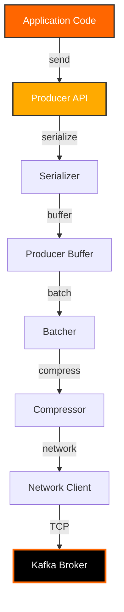
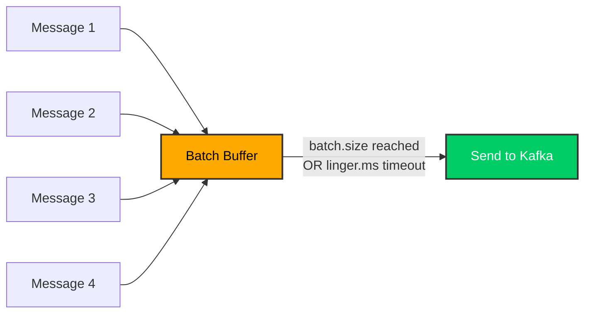
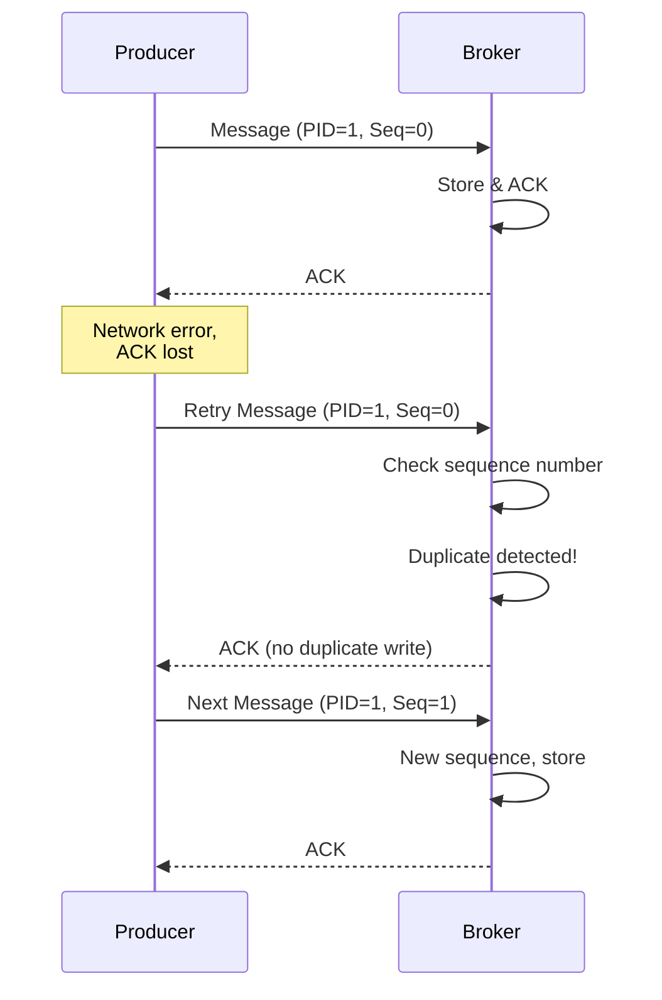

# Day 3: Kafka Producers

> **Primary Audience:** Data Engineers
> **Learning Track:** This content teaches platform-agnostic Kafka producer patterns. Data engineers should focus on CLI tools and pure Kafka API. Java developers may optionally use Spring Boot integration (see end of document).

## Learning Objectives

By the end of Day 3, you will:

- [ ] Configure Kafka producers for different use cases
- [ ] Understand synchronous vs asynchronous sending
- [ ] Implement batching and compression strategies
- [ ] Use idempotent producers and transactions
- [ ] Handle errors and implement retry logic
- [ ] Work with callbacks and futures
- [ ] Optimize producer performance

## Producer Architecture



## CLI Producer Basics

### Console Producer

```bash
# Basic console producer
kafka-console-producer \
  --bootstrap-server localhost:9092 \
  --topic orders

# Producer with key
kafka-console-producer \
  --bootstrap-server localhost:9092 \
  --topic orders \
  --property "parse.key=true" \
  --property "key.separator=:"

# Example messages
user1:{"orderId":"123","total":99.99}
user2:{"orderId":"124","total":149.99}

# Producer with compression
kafka-console-producer \
  --bootstrap-server localhost:9092 \
  --topic orders \
  --producer-property compression.type=snappy

# Producer with acks
kafka-console-producer \
  --bootstrap-server localhost:9092 \
  --topic orders \
  --producer-property acks=all

# Producer from file
cat orders.txt | kafka-console-producer \
  --bootstrap-server localhost:9092 \
  --topic orders
```

### Performance Producer Tool

```bash
# Performance testing
kafka-producer-perf-test \
  --topic perf-test \
  --num-records 1000000 \
  --record-size 1024 \
  --throughput 10000 \
  --producer-props \
    bootstrap.servers=localhost:9092 \
    acks=1 \
    batch.size=16384 \
    linger.ms=10 \
    compression.type=snappy

# Results show:
# - Total records sent
# - Records/sec
# - MB/sec
# - Average latency
# - Max latency
# - 50th, 95th, 99th percentile latency
```

## Core Producer Configuration

### Essential Properties

```properties
# Connection Settings
bootstrap.servers=localhost:9092
client.id=my-producer-1

# Serialization
key.serializer=org.apache.kafka.common.serialization.StringSerializer
value.serializer=org.apache.kafka.common.serialization.StringSerializer

# Reliability
acks=all                                      # Wait for all replicas
retries=2147483647                            # Retry indefinitely
retry.backoff.ms=100                          # Wait between retries
max.in.flight.requests.per.connection=5       # Parallel requests
enable.idempotence=true                       # Prevent duplicates
transactional.id=my-transactional-id         # For transactions

# Performance
batch.size=16384                              # Batch size in bytes
linger.ms=10                                  # Wait time before send
compression.type=snappy                       # snappy, gzip, lz4, zstd
buffer.memory=33554432                        # Total memory buffer (32MB)
max.block.ms=60000                            # Max wait for buffer space

# Request Settings
request.timeout.ms=30000                      # Request timeout
delivery.timeout.ms=120000                    # Overall delivery timeout
max.request.size=1048576                      # Max message size (1MB)

# Partitioning
partitioner.class=org.apache.kafka.clients.producer.internals.DefaultPartitioner
```

### Configuration Files

Create `producer.properties`:

```properties
bootstrap.servers=localhost:9092
key.serializer=org.apache.kafka.common.serialization.StringSerializer
value.serializer=org.apache.kafka.common.serialization.StringSerializer
acks=all
enable.idempotence=true
batch.size=32768
linger.ms=10
compression.type=snappy
```

Use with console producer:

```bash
kafka-console-producer \
  --bootstrap-server localhost:9092 \
  --topic orders \
  --producer.config producer.properties
```

## Production Example: SimpleProducer.java

> **See Working Example**: `src/main/java/com/training/kafka/Day03Producers/SimpleProducer.java`

This is the actual producer implementation from the repository, showing production-ready patterns for reliability and performance.

### Producer Configuration (Lines 27-43)

From `SimpleProducer.java:27-43`:

```java
Properties props = new Properties();
props.put(ProducerConfig.BOOTSTRAP_SERVERS_CONFIG, bootstrapServers);
props.put(ProducerConfig.CLIENT_ID_CONFIG, "simple-producer");
props.put(ProducerConfig.KEY_SERIALIZER_CLASS_CONFIG, StringSerializer.class.getName());
props.put(ProducerConfig.VALUE_SERIALIZER_CLASS_CONFIG, StringSerializer.class.getName());

// Producer reliability settings
props.put(ProducerConfig.ACKS_CONFIG, "all"); // Wait for all replicas
props.put(ProducerConfig.RETRIES_CONFIG, 3);
props.put(ProducerConfig.RETRY_BACKOFF_MS_CONFIG, 100);

// Performance settings
props.put(ProducerConfig.LINGER_MS_CONFIG, 10); // Batch messages for 10ms
props.put(ProducerConfig.BATCH_SIZE_CONFIG, 16384); // 16KB batch size
props.put(ProducerConfig.COMPRESSION_TYPE_CONFIG, "snappy");

this.producer = new KafkaProducer<>(props);
```

**Key Configuration Decisions:**
- `acks=all`: Wait for all in-sync replicas (strongest durability)
- `retries=3`: Retry failed sends up to 3 times
- `linger.ms=10`: Wait up to 10ms to batch messages (improves throughput)
- `batch.size=16384`: Batch up to 16KB before sending
- `compression.type=snappy`: Fast compression with good ratio

### Synchronous Send (Lines 49-59)

From `SimpleProducer.java:49-59`:

```java
public void sendMessageSync(String key, String message) {
    ProducerRecord<String, String> record = new ProducerRecord<>(topicName, key, message);

    try {
        RecordMetadata metadata = producer.send(record).get();
        logger.info("Message sent successfully: topic={}, partition={}, offset={}, key={}",
            metadata.topic(), metadata.partition(), metadata.offset(), key);
    } catch (ExecutionException | InterruptedException e) {
        logger.error("Failed to send message: {}", e.getMessage(), e);
    }
}
```

**When to use**: One-off critical messages, debugging, when you need confirmation before proceeding.

### Asynchronous Send with Callback (Lines 64-75)

From `SimpleProducer.java:64-75`:

```java
public void sendMessageAsync(String key, String message) {
    ProducerRecord<String, String> record = new ProducerRecord<>(topicName, key, message);

    producer.send(record, (metadata, exception) -> {
        if (exception == null) {
            logger.info("Message sent async: topic={}, partition={}, offset={}, key={}",
                metadata.topic(), metadata.partition(), metadata.offset(), key);
        } else {
            logger.error("Failed to send message async: {}", exception.getMessage(), exception);
        }
    });
}
```

**When to use**: High-throughput scenarios, streaming data, when you can handle failures asynchronously.

### Batch Message Sending (Lines 80-94)

From `SimpleProducer.java:80-94`:

```java
public void sendBatchMessages(int count) {
    logger.info("Sending {} messages...", count);

    for (int i = 0; i < count; i++) {
        String key = "user-" + (i % 5); // 5 different users for partitioning
        String message = String.format("{\"user_id\":\"%s\", \"action\":\"login\", \"timestamp\":\"%s\", \"session_id\":\"%d\"}",
            key, LocalDateTime.now(), System.currentTimeMillis() + i);

        sendMessageAsync(key, message);
    }

    // Flush to ensure all messages are sent
    producer.flush();
    logger.info("All {} messages sent successfully", count);
}
```

**Key Pattern**: Use async sends in a loop, then call `flush()` to ensure all buffered messages are sent before returning.

## Python Producer Implementation (Data Engineer Track)

### Using kafka-python

Install the library:
```bash
pip install kafka-python
```

**Complete Python Example**: `examples/python/day03_producer.py`

```bash
# Run the Python producer example
python examples/python/day03_producer.py
```

**Key code from day03_producer.py:**

```python
from kafka import KafkaProducer
import json
from datetime import datetime

def create_producer():
    """
    Create Kafka producer with configuration
    Compare to Java: new KafkaProducer<>(properties)
    """
    return KafkaProducer(
        # Connection
        bootstrap_servers='localhost:9092',
        client_id='python-producer-cli',

        # Serialization (Java: StringSerializer)
        key_serializer=lambda k: k.encode('utf-8') if k else None,
        value_serializer=lambda v: json.dumps(v).encode('utf-8'),

        # Reliability (same as Java)
        acks='all',                 # ProducerConfig.ACKS_CONFIG
        retries=3,                  # ProducerConfig.RETRIES_CONFIG
        enable_idempotence=True,    # ProducerConfig.ENABLE_IDEMPOTENCE_CONFIG

        # Performance (same as Java)
        batch_size=16384,           # ProducerConfig.BATCH_SIZE_CONFIG (16KB)
        linger_ms=10,               # ProducerConfig.LINGER_MS_CONFIG (10ms)
        compression_type='snappy'   # ProducerConfig.COMPRESSION_TYPE_CONFIG
    )

def send_message_sync(producer, key, value):
    """
    Send message synchronously (blocks until complete)
    Compare to Java: producer.send(record).get()
    """
    message_data = {
        'user': key,
        'action': value,
        'timestamp': datetime.utcnow().isoformat(),
        'source': 'python-cli'
    }

    # Send and wait for response
    future = producer.send('training-day01-cli', key=key, value=message_data)
    record_metadata = future.get(timeout=10)  # Synchronous - waits

    print(f"✓ Sent: partition={record_metadata.partition}, offset={record_metadata.offset}")

def send_message_async(producer, key, value):
    """
    Send message asynchronously (with callback)
    Compare to Java: producer.send(record, callback)
    """
    def on_send_success(record_metadata):
        print(f"✓ Async sent: partition={record_metadata.partition}")

    def on_send_error(exception):
        print(f"❌ Async failed: {exception}")

    # Send with callback
    producer.send('training-day01-cli', key=key, value={'action': value}) \
            .add_callback(on_send_success) \
            .add_errback(on_send_error)

# Usage
producer = create_producer()
send_message_sync(producer, 'user-123', 'login')
send_message_async(producer, 'user-456', 'logout')
producer.flush()  # Ensure all async messages sent
producer.close()
```

**Install Dependencies:**

```bash
pip install kafka-python
# Or install all training dependencies
pip install -r examples/python/requirements.txt
```

### Using confluent-kafka (Faster, C-based)

> **Note**: This section shows confluent-kafka for comparison. Day 3 examples use kafka-python. For working confluent-kafka examples, see Day 5 (Avro with Schema Registry) at `examples/python/day05_avro_producer.py`.

Install the library:
```bash
pip install confluent-kafka
```

**Confluent Kafka Producer (Reference):**

```python
from confluent_kafka import Producer
import json
import time

class ConfluentProducer:
    def __init__(self, bootstrap_servers='localhost:9092'):
        self.config = {
            'bootstrap.servers': bootstrap_servers,
            'client.id': 'simple-producer',

            # Reliability settings
            'acks': 'all',
            'retries': 3,
            'retry.backoff.ms': 100,

            # Performance settings
            'linger.ms': 10,
            'batch.size': 16384,
            'compression.type': 'snappy'
        }

        self.producer = Producer(self.config)

    def delivery_callback(self, err, msg):
        """Callback for async message delivery"""
        if err:
            print(f"Failed to deliver message: {err}")
        else:
            print(f"Message delivered: topic={msg.topic()}, "
                  f"partition={msg.partition()}, offset={msg.offset()}")

    def send_message(self, topic, key, value):
        """Send a message asynchronously"""
        try:
            # Convert to bytes
            key_bytes = key.encode('utf-8')
            value_bytes = json.dumps(value).encode('utf-8')

            # Async send with callback
            self.producer.produce(
                topic=topic,
                key=key_bytes,
                value=value_bytes,
                callback=self.delivery_callback
            )

            # Trigger callback processing
            self.producer.poll(0)

        except BufferError:
            print("Buffer full, waiting for messages to be delivered...")
            self.producer.flush()
            self.send_message(topic, key, value)

    def send_batch_messages(self, topic, count):
        """Send multiple messages in batch"""
        print(f"Sending {count} messages...")

        for i in range(count):
            key = f"user-{i % 5}"
            message = {
                'user_id': key,
                'action': 'login',
                'timestamp': time.time(),
                'session_id': int(time.time() * 1000) + i
            }

            self.send_message(topic, key, message)

        # Wait for all messages to be delivered
        self.producer.flush()
        print(f"All {count} messages sent successfully")

    def close(self):
        """Close the producer"""
        # Wait for all messages to be delivered
        self.producer.flush()
        print("Producer closed")

# Usage example
if __name__ == "__main__":
    producer = ConfluentProducer()

    try:
        # Send batch
        producer.send_batch_messages('user-events', 100)

    finally:
        producer.close()
```

**Key Differences: kafka-python vs confluent-kafka:**

| Feature | kafka-python | confluent-kafka |
|---------|-------------|-----------------|
| Implementation | Pure Python | C-based (librdkafka) |
| Performance | Good for moderate loads | Excellent for high throughput |
| API Style | More Pythonic | More similar to Java API |
| Async/Sync | Both supported | Primarily async with callbacks |
| Installation | Simple (pure Python) | Requires C compiler |
| Use Case | Development, moderate loads | Production, high-performance |

## Pure Java Kafka Producer (Additional Examples)

The examples below show additional patterns beyond the production code in SimpleProducer.java.

### Basic Producer Setup

```java
import org.apache.kafka.clients.producer.*;
import org.apache.kafka.common.serialization.StringSerializer;
import java.util.Properties;

public class SimpleKafkaProducer {

    public static void main(String[] args) {
        // 1. Configure producer
        Properties props = new Properties();
        props.put(ProducerConfig.BOOTSTRAP_SERVERS_CONFIG, "localhost:9092");
        props.put(ProducerConfig.KEY_SERIALIZER_CLASS_CONFIG,
            StringSerializer.class.getName());
        props.put(ProducerConfig.VALUE_SERIALIZER_CLASS_CONFIG,
            StringSerializer.class.getName());

        // Reliability settings
        props.put(ProducerConfig.ACKS_CONFIG, "all");
        props.put(ProducerConfig.RETRIES_CONFIG, Integer.MAX_VALUE);
        props.put(ProducerConfig.ENABLE_IDEMPOTENCE_CONFIG, true);

        // Performance settings
        props.put(ProducerConfig.BATCH_SIZE_CONFIG, 16384);
        props.put(ProducerConfig.LINGER_MS_CONFIG, 10);
        props.put(ProducerConfig.COMPRESSION_TYPE_CONFIG, "snappy");

        // 2. Create producer
        KafkaProducer<String, String> producer = new KafkaProducer<>(props);

        try {
            // 3. Send message
            ProducerRecord<String, String> record =
                new ProducerRecord<>("orders", "key1", "value1");

            producer.send(record);
            System.out.println("Message sent");

        } finally {
            // 4. Close producer
            producer.close();
        }
    }
}
```

### Synchronous vs Asynchronous Sending

**Synchronous Sending:**

```java
public class SyncProducer {

    private final KafkaProducer<String, String> producer;

    public SyncProducer(Properties props) {
        this.producer = new KafkaProducer<>(props);
    }

    public void sendSync(String topic, String key, String message) {
        ProducerRecord<String, String> record =
            new ProducerRecord<>(topic, key, message);

        try {
            // Block until send completes
            RecordMetadata metadata = producer.send(record).get(10, TimeUnit.SECONDS);

            System.out.printf("Message sent: topic=%s, partition=%d, offset=%d%n",
                metadata.topic(), metadata.partition(), metadata.offset());

        } catch (InterruptedException e) {
            Thread.currentThread().interrupt();
            System.err.println("Send interrupted: " + e.getMessage());
        } catch (ExecutionException e) {
            System.err.println("Send failed: " + e.getCause().getMessage());
            throw new RuntimeException("Failed to send message", e);
        } catch (TimeoutException e) {
            System.err.println("Send timed out: " + e.getMessage());
            throw new RuntimeException("Send timeout", e);
        }
    }

    public void close() {
        producer.close();
    }
}
```

**Asynchronous Sending:**

```java
public class AsyncProducer {

    private final KafkaProducer<String, String> producer;

    public AsyncProducer(Properties props) {
        this.producer = new KafkaProducer<>(props);
    }

    public void sendAsync(String topic, String key, String message) {
        ProducerRecord<String, String> record =
            new ProducerRecord<>(topic, key, message);

        // Send with callback
        producer.send(record, new Callback() {
            @Override
            public void onCompletion(RecordMetadata metadata, Exception exception) {
                if (exception != null) {
                    // Handle failure
                    System.err.println("Failed to send message: " + exception.getMessage());
                    handleFailure(topic, key, message, exception);
                } else {
                    // Handle success
                    System.out.printf("Success: partition=%d, offset=%d%n",
                        metadata.partition(), metadata.offset());
                }
            }
        });
    }

    private void handleFailure(String topic, String key, String message,
                              Exception exception) {
        // Implement failure handling:
        // - Retry with exponential backoff
        // - Send to dead letter queue
        // - Alert operations team
        // - Store for manual processing
    }

    public void close() {
        producer.close();
    }
}
```

**Use Cases:**

- **Synchronous:** Critical one-off messages, debugging, when ordering is critical
- **Asynchronous:** High-volume event streaming, real-time analytics, log aggregation

## Batching and Compression

### Batching Configuration

Batching improves throughput by sending multiple messages together.



**Batching Parameters:**

```properties
# High throughput, can tolerate latency
batch.size=65536         # 64KB batches
linger.ms=100           # Wait 100ms

# Low latency, smaller batches
batch.size=16384        # 16KB batches
linger.ms=0            # Send immediately

# Balanced (recommended)
batch.size=32768        # 32KB batches
linger.ms=10           # Wait 10ms
```

### Compression

Compression reduces network bandwidth and storage.

**Compression Types:**

| Type | Compression Ratio | CPU Usage | Speed |
|------|------------------|-----------|-------|
| **none** | 1x | Low | Fastest |
| **snappy** | 2-4x | Low | Fast |
| **lz4** | 2-3x | Low | Fast |
| **gzip** | 3-5x | High | Slow |
| **zstd** | 3-5x | Medium | Medium |

**Choosing Compression:**

```properties
# High CPU available, want best compression
compression.type=zstd

# Low CPU, good balance (RECOMMENDED)
compression.type=snappy

# Legacy compatibility
compression.type=gzip

# Very low CPU, high bandwidth
compression.type=lz4

# No compression
compression.type=none
```

## Idempotent Producers

Idempotent producers prevent duplicate messages on retry.

### Enable Idempotence

```properties
# Configuration
enable.idempotence=true
acks=all
retries=2147483647
max.in.flight.requests.per.connection=5
```

```java
Properties props = new Properties();
props.put(ProducerConfig.BOOTSTRAP_SERVERS_CONFIG, "localhost:9092");
props.put(ProducerConfig.KEY_SERIALIZER_CLASS_CONFIG, StringSerializer.class);
props.put(ProducerConfig.VALUE_SERIALIZER_CLASS_CONFIG, StringSerializer.class);

// Enable idempotence
props.put(ProducerConfig.ENABLE_IDEMPOTENCE_CONFIG, true);
props.put(ProducerConfig.ACKS_CONFIG, "all");
props.put(ProducerConfig.RETRIES_CONFIG, Integer.MAX_VALUE);

KafkaProducer<String, String> producer = new KafkaProducer<>(props);
```

### How Idempotence Works



**Key Concepts:**

- **Producer ID (PID)** - Unique identifier for producer
- **Sequence Number** - Incremental per partition
- **Duplicate Detection** - Broker rejects duplicate sequences

## Transactional Producers

Transactions enable atomic writes across multiple partitions.

### Configure Transactions

```properties
# Configuration
transactional.id=my-transactional-producer-1
enable.idempotence=true
acks=all
```

```java
public class TransactionalProducer {

    private final KafkaProducer<String, String> producer;

    public TransactionalProducer() {
        Properties props = new Properties();
        props.put(ProducerConfig.BOOTSTRAP_SERVERS_CONFIG, "localhost:9092");
        props.put(ProducerConfig.KEY_SERIALIZER_CLASS_CONFIG, StringSerializer.class);
        props.put(ProducerConfig.VALUE_SERIALIZER_CLASS_CONFIG, StringSerializer.class);

        // Transactional settings
        props.put(ProducerConfig.TRANSACTIONAL_ID_CONFIG, "txn-producer-1");
        props.put(ProducerConfig.ENABLE_IDEMPOTENCE_CONFIG, true);
        props.put(ProducerConfig.ACKS_CONFIG, "all");

        this.producer = new KafkaProducer<>(props);

        // Initialize transactions
        producer.initTransactions();
    }

    public void sendTransactional(String orderId, Order order) {
        try {
            // Begin transaction
            producer.beginTransaction();

            // Send multiple messages atomically
            producer.send(new ProducerRecord<>("orders", orderId, orderToJson(order)));
            producer.send(new ProducerRecord<>("inventory",
                order.getProductId(), inventoryUpdate(order)));
            producer.send(new ProducerRecord<>("payments",
                orderId, paymentRequest(order)));

            // Commit transaction
            producer.commitTransaction();
            System.out.println("Transaction committed");

        } catch (Exception e) {
            // Abort transaction on error
            producer.abortTransaction();
            System.err.println("Transaction aborted: " + e.getMessage());
            throw new RuntimeException("Transaction failed", e);
        }
    }

    public void close() {
        producer.close();
    }
}
```

**Transaction Guarantees:**

- All messages in transaction committed together
- Messages not visible to consumers until committed
- On failure, all messages rolled back
- Exactly-once semantics end-to-end

## Error Handling and Retries

### Retry Configuration

```properties
# Retry settings
retries=2147483647                   # Retry indefinitely
retry.backoff.ms=100                 # Initial backoff
retry.backoff.max.ms=1000           # Max backoff
delivery.timeout.ms=120000          # Overall timeout (2 minutes)
request.timeout.ms=30000            # Per-request timeout
```

### Error Handling Patterns

```java
public class RobustProducer {

    private final KafkaProducer<String, String> producer;

    public void sendWithErrorHandling(String topic, String key, String message) {
        ProducerRecord<String, String> record =
            new ProducerRecord<>(topic, key, message);

        producer.send(record, (metadata, exception) -> {
            if (exception != null) {
                handleSendError(topic, key, message, exception);
            } else {
                System.out.printf("Success: partition=%d, offset=%d%n",
                    metadata.partition(), metadata.offset());
            }
        });
    }

    private void handleSendError(String topic, String key, String message,
                                 Exception exception) {
        if (exception instanceof RecordTooLargeException) {
            System.err.println("Message too large");
            // Don't retry, send to DLQ
            sendToDeadLetterQueue(topic, key, message, "MESSAGE_TOO_LARGE");

        } else if (exception instanceof TimeoutException) {
            System.err.println("Send timeout, will retry");
            // Kafka will retry automatically

        } else if (exception instanceof SerializationException) {
            System.err.println("Serialization failed");
            // Don't retry, send to DLQ
            sendToDeadLetterQueue(topic, key, message, "SERIALIZATION_ERROR");

        } else {
            System.err.println("Unknown error: " + exception.getMessage());
            // Let Kafka retry
        }
    }

    private void sendToDeadLetterQueue(String originalTopic, String key,
                                      String message, String errorReason) {
        String dlqTopic = originalTopic + ".dlq";
        // Send error details to DLQ
        producer.send(new ProducerRecord<>(dlqTopic, key,
            String.format("{\"error\":\"%s\",\"message\":\"%s\"}",
                errorReason, message)));
    }
}
```

## Spring Boot Integration (Java Developer Track - Optional)

> **⚠️ Java Developer Track Only**
> This section covers Spring Boot integration. Data engineers should focus on the CLI and pure Kafka API sections above.

### Spring Kafka Configuration

```java
@Configuration
public class KafkaProducerConfig {

    @Value("${spring.kafka.bootstrap-servers}")
    private String bootstrapServers;

    @Bean
    public ProducerFactory<String, String> producerFactory() {
        Map<String, Object> config = new HashMap<>();

        config.put(ProducerConfig.BOOTSTRAP_SERVERS_CONFIG, bootstrapServers);
        config.put(ProducerConfig.KEY_SERIALIZER_CLASS_CONFIG, StringSerializer.class);
        config.put(ProducerConfig.VALUE_SERIALIZER_CLASS_CONFIG, StringSerializer.class);

        // Reliability
        config.put(ProducerConfig.ACKS_CONFIG, "all");
        config.put(ProducerConfig.ENABLE_IDEMPOTENCE_CONFIG, true);

        // Performance
        config.put(ProducerConfig.BATCH_SIZE_CONFIG, 16384);
        config.put(ProducerConfig.LINGER_MS_CONFIG, 10);
        config.put(ProducerConfig.COMPRESSION_TYPE_CONFIG, "snappy");

        return new DefaultKafkaProducerFactory<>(config);
    }

    @Bean
    public KafkaTemplate<String, String> kafkaTemplate() {
        return new KafkaTemplate<>(producerFactory());
    }
}
```

### Using KafkaTemplate

```java
@Service
public class SpringProducerService {

    @Autowired
    private KafkaTemplate<String, String> kafkaTemplate;

    public void sendAsync(String topic, String key, String message) {
        CompletableFuture<SendResult<String, String>> future =
            kafkaTemplate.send(topic, key, message);

        future.thenAccept(result -> {
            RecordMetadata metadata = result.getRecordMetadata();
            System.out.printf("Success: partition=%d, offset=%d%n",
                metadata.partition(), metadata.offset());
        }).exceptionally(ex -> {
            System.err.println("Failed: " + ex.getMessage());
            return null;
        });
    }
}
```

## Hands-On Exercises

### Exercise 1: CLI Producer Performance

```bash
# Terminal 1: Start consumer
kafka-console-consumer \
  --bootstrap-server localhost:9092 \
  --topic perf-test \
  --property print.timestamp=true

# Terminal 2: Run performance test
kafka-producer-perf-test \
  --topic perf-test \
  --num-records 10000 \
  --record-size 100 \
  --throughput 1000 \
  --producer-props bootstrap.servers=localhost:9092

# Compare different configurations
# 1. No compression
# 2. With snappy compression
# 3. Different batch sizes
```

### Exercise 2: Test Idempotence

Create `IdempotenceTest.java`:

```java
public class IdempotenceTest {

    public static void main(String[] args) {
        Properties props = new Properties();
        props.put(ProducerConfig.BOOTSTRAP_SERVERS_CONFIG, "localhost:9092");
        props.put(ProducerConfig.KEY_SERIALIZER_CLASS_CONFIG, StringSerializer.class);
        props.put(ProducerConfig.VALUE_SERIALIZER_CLASS_CONFIG, StringSerializer.class);
        props.put(ProducerConfig.ENABLE_IDEMPOTENCE_CONFIG, true);
        props.put(ProducerConfig.ACKS_CONFIG, "all");

        KafkaProducer<String, String> producer = new KafkaProducer<>(props);

        String key = "test-key";
        String value = "test-value-" + System.currentTimeMillis();

        // Send same message multiple times
        for (int i = 0; i < 5; i++) {
            producer.send(new ProducerRecord<>("test-topic", key, value));
        }

        producer.close();

        // Verify only 1 message in topic (not 5)
    }
}
```

### Exercise 3: Transaction Test

```bash
# Create Java program with transactions
# Send to multiple topics atomically
# Verify all-or-nothing behavior
```

## Exercises by Learning Track

### Data Engineering Track

1. Build a CDC producer from PostgreSQL
2. Implement batch loading with compression
3. Create idempotent ETL pipeline
4. Performance tune for high throughput

### Platform Engineering Track

1. Configure producer monitoring
2. Set up producer metrics collection
3. Implement producer health checks
4. Create producer deployment automation

### Java Developer Track

1. Integrate Spring Boot producer
2. Implement transactional outbox pattern
3. Create producer unit tests
4. Build producer error handling

## Key Takeaways

1. **CLI tools** provide quick testing and debugging capabilities
2. **Pure Kafka API** gives full control over producer behavior
3. **Asynchronous sending** provides better throughput than synchronous
4. **Batching and compression** significantly improve performance
5. **Idempotent producers** prevent duplicates on network failures
6. **Transactions** enable atomic writes across multiple topics
7. **Error handling** requires careful consideration of failure types
8. **Configuration tuning** balances latency, throughput, and reliability

## Learning Track Guidance

### Data Engineer Track (Recommended)
**Focus Areas:**
- CLI producer tools (kafka-console-producer, kafka-producer-perf-test)
- Pure Java KafkaProducer API with Properties configuration
- Idempotent and transactional patterns
- Performance tuning and error handling

**Skills Gained:**
- Platform-agnostic producer knowledge
- Transferable to any Kafka client (Python, Go, Scala, etc.)
- Production-ready reliability patterns

### Java Developer Track (Optional)
**Additional Topics:**
- Spring Kafka KafkaTemplate
- Spring Boot auto-configuration
- Integration with Spring ecosystem

**When to Use:**
- Building Spring Boot microservices
- Integrating Kafka with existing Spring applications
- Need dependency injection and Spring features

## Next Steps

Continue to [Day 4: Consumers](day04-consumers.md) for deep dive into consumer patterns and configurations.

**Related Resources:**

- [API Reference](../api/training-endpoints.md)
- [Container Development](../containers/docker-compose.md)
- [Architecture](../architecture/data-flow.md)
