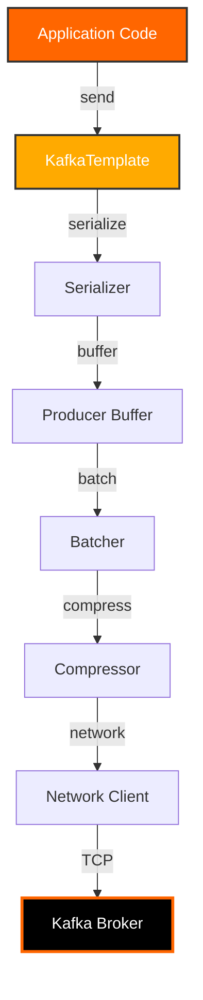
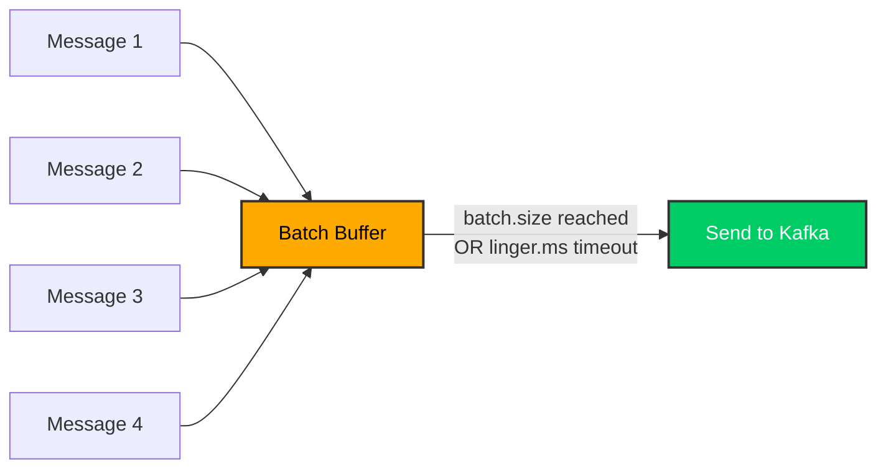
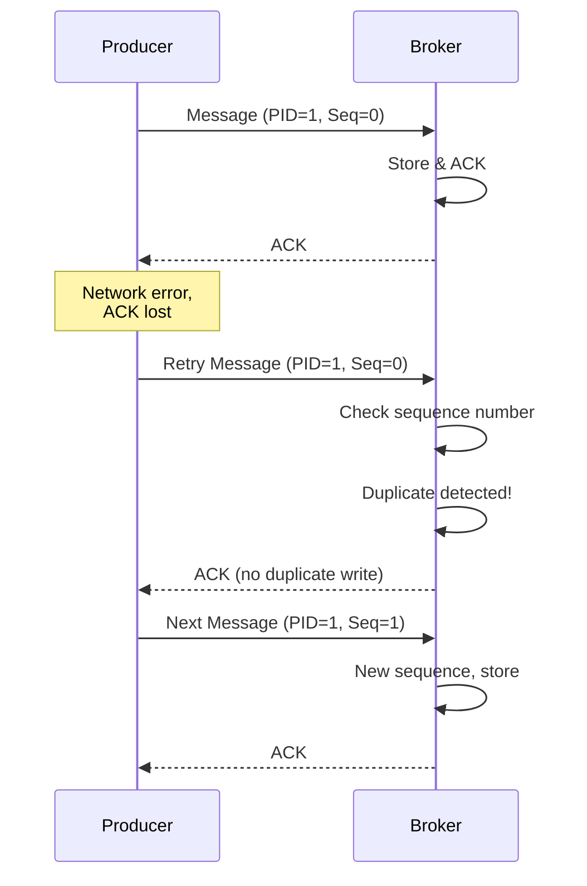

# Day 3: Kafka Producers

## Learning Objectives

By the end of Day 3, you will:

- [ ] Configure Kafka producers for different use cases
- [ ] Understand synchronous vs asynchronous sending
- [ ] Implement batching and compression strategies
- [ ] Use idempotent producers and transactions
- [ ] Handle errors and implement retry logic
- [ ] Work with callbacks and futures
- [ ] Optimize producer performance

## Producer Architecture



## Producer Configuration

### Basic Producer Setup

```java
@Configuration
public class KafkaProducerConfig {

    @Value("${spring.kafka.bootstrap-servers}")
    private String bootstrapServers;

    @Bean
    public ProducerFactory<String, String> producerFactory() {
        Map<String, Object> config = new HashMap<>();

        // Connection
        config.put(ProducerConfig.BOOTSTRAP_SERVERS_CONFIG, bootstrapServers);

        // Serialization
        config.put(ProducerConfig.KEY_SERIALIZER_CLASS_CONFIG,
            StringSerializer.class);
        config.put(ProducerConfig.VALUE_SERIALIZER_CLASS_CONFIG,
            StringSerializer.class);

        // Reliability
        config.put(ProducerConfig.ACKS_CONFIG, "all");
        config.put(ProducerConfig.RETRIES_CONFIG, Integer.MAX_VALUE);
        config.put(ProducerConfig.MAX_IN_FLIGHT_REQUESTS_PER_CONNECTION, 5);

        // Idempotence
        config.put(ProducerConfig.ENABLE_IDEMPOTENCE_CONFIG, true);

        // Performance
        config.put(ProducerConfig.BATCH_SIZE_CONFIG, 16384);
        config.put(ProducerConfig.LINGER_MS_CONFIG, 10);
        config.put(ProducerConfig.COMPRESSION_TYPE_CONFIG, "snappy");
        config.put(ProducerConfig.BUFFER_MEMORY_CONFIG, 33554432);

        return new DefaultKafkaProducerFactory<>(config);
    }

    @Bean
    public KafkaTemplate<String, String> kafkaTemplate() {
        return new KafkaTemplate<>(producerFactory());
    }
}
```

### Configuration Properties Explained

```properties
# Connection Settings
bootstrap.servers=localhost:9092
client.id=my-producer-1

# Serialization
key.serializer=org.apache.kafka.common.serialization.StringSerializer
value.serializer=org.apache.kafka.common.serialization.StringSerializer

# Reliability
acks=all                                      # Wait for all replicas
retries=2147483647                            # Retry indefinitely
retry.backoff.ms=100                          # Wait between retries
max.in.flight.requests.per.connection=5       # Parallel requests
enable.idempotence=true                       # Prevent duplicates
transactional.id=my-transactional-id         # For transactions

# Performance
batch.size=16384                              # Batch size in bytes
linger.ms=10                                  # Wait time before send
compression.type=snappy                       # snappy, gzip, lz4, zstd
buffer.memory=33554432                        # Total memory buffer (32MB)
max.block.ms=60000                            # Max wait for buffer space

# Request Settings
request.timeout.ms=30000                      # Request timeout
delivery.timeout.ms=120000                    # Overall delivery timeout
max.request.size=1048576                      # Max message size (1MB)

# Partitioning
partitioner.class=org.apache.kafka.clients.producer.internals.DefaultPartitioner
```

!!! note "Configuration Hierarchy"
    Producer configs can be set at:

    1. **Application properties** - Default for all producers
    2. **ProducerFactory** - Per producer factory bean
    3. **@KafkaListener properties** - Per listener
    4. **Programmatic** - Per send operation

## Synchronous vs Asynchronous Sending

### Synchronous Sending

Wait for acknowledgment before continuing.

```java
@Service
public class SynchronousProducer {

    @Autowired
    private KafkaTemplate<String, String> kafkaTemplate;

    public void sendSync(String topic, String key, String message) {
        try {
            // Block until send completes
            SendResult<String, String> result = kafkaTemplate
                .send(topic, key, message)
                .get(10, TimeUnit.SECONDS);  // Wait up to 10 seconds

            RecordMetadata metadata = result.getRecordMetadata();

            log.info("Message sent successfully: topic={}, partition={}, offset={}",
                metadata.topic(), metadata.partition(), metadata.offset());

        } catch (InterruptedException e) {
            Thread.currentThread().interrupt();
            log.error("Send interrupted", e);
        } catch (ExecutionException e) {
            log.error("Send failed", e.getCause());
            throw new RuntimeException("Failed to send message", e);
        } catch (TimeoutException e) {
            log.error("Send timed out", e);
            throw new RuntimeException("Send timeout", e);
        }
    }

    public void sendMultipleSync(String topic, List<String> messages) {
        for (String message : messages) {
            sendSync(topic, null, message);
            // Each send waits for acknowledgment
            // Slow but guaranteed ordering
        }
    }
}
```

**Characteristics:**
- Simple error handling
- Guaranteed ordering
- Low throughput
- Blocks application thread

**Use Cases:**
- Critical one-off messages
- Administrative operations
- Debugging and testing
- When ordering is critical

### Asynchronous Sending

Fire-and-forget with callback for result.

```java
@Service
public class AsynchronousProducer {

    @Autowired
    private KafkaTemplate<String, String> kafkaTemplate;

    public void sendAsync(String topic, String key, String message) {
        CompletableFuture<SendResult<String, String>> future =
            kafkaTemplate.send(topic, key, message);

        future.thenAccept(result -> {
            RecordMetadata metadata = result.getRecordMetadata();
            log.info("Async send successful: partition={}, offset={}",
                metadata.partition(), metadata.offset());
        }).exceptionally(ex -> {
            log.error("Async send failed: {}", ex.getMessage());
            // Handle failure (e.g., retry, alert, dead letter queue)
            return null;
        });
    }

    public void sendAsyncWithCallback(String topic, String key, String message) {
        ListenableFuture<SendResult<String, String>> future =
            kafkaTemplate.send(topic, key, message);

        future.addCallback(
            result -> {
                // Success callback
                RecordMetadata metadata = result.getRecordMetadata();
                log.info("Success: partition={}, offset={}",
                    metadata.partition(), metadata.offset());
            },
            ex -> {
                // Failure callback
                log.error("Failed to send message", ex);
                handleFailure(topic, key, message, ex);
            }
        );
    }

    private void handleFailure(String topic, String key, String message,
                              Throwable ex) {
        // Implement failure handling logic
        // - Retry with exponential backoff
        // - Send to dead letter queue
        // - Alert operations team
        // - Store for manual processing
    }

    public void sendBatchAsync(String topic, List<String> messages) {
        List<CompletableFuture<SendResult<String, String>>> futures =
            new ArrayList<>();

        for (String message : messages) {
            CompletableFuture<SendResult<String, String>> future =
                kafkaTemplate.send(topic, message);
            futures.add(future);
        }

        // Wait for all to complete
        CompletableFuture.allOf(futures.toArray(new CompletableFuture[0]))
            .thenRun(() -> log.info("All {} messages sent", messages.size()))
            .exceptionally(ex -> {
                log.error("Batch send failed", ex);
                return null;
            });
    }
}
```

**Characteristics:**
- High throughput
- Non-blocking
- Requires callback handling
- Order not guaranteed across batches

**Use Cases:**
- High-volume event streaming
- Real-time analytics
- Log aggregation
- Metrics collection

!!! success "Best Practice"
    Use asynchronous sending for production systems. It provides better throughput while still allowing error handling through callbacks.

## Batching and Compression

### Batching Configuration

Batching improves throughput by sending multiple messages together.

```java
@Configuration
public class BatchingProducerConfig {

    @Bean
    public ProducerFactory<String, String> batchingProducerFactory() {
        Map<String, Object> config = new HashMap<>();

        config.put(ProducerConfig.BOOTSTRAP_SERVERS_CONFIG, "localhost:9092");
        config.put(ProducerConfig.KEY_SERIALIZER_CLASS_CONFIG,
            StringSerializer.class);
        config.put(ProducerConfig.VALUE_SERIALIZER_CLASS_CONFIG,
            StringSerializer.class);

        // Batching Settings
        config.put(ProducerConfig.BATCH_SIZE_CONFIG, 32768);      // 32KB
        config.put(ProducerConfig.LINGER_MS_CONFIG, 100);         // Wait 100ms
        config.put(ProducerConfig.BUFFER_MEMORY_CONFIG, 67108864); // 64MB

        return new DefaultKafkaProducerFactory<>(config);
    }
}
```

**Batching Parameters:**

- **batch.size** - Maximum batch size in bytes
- **linger.ms** - Time to wait for batch to fill
- **buffer.memory** - Total memory for buffering



**Tuning Guidelines:**

```java
// High throughput, can tolerate latency
batch.size=65536         // 64KB batches
linger.ms=100           // Wait 100ms

// Low latency, smaller batches
batch.size=16384        // 16KB batches
linger.ms=0            // Send immediately

// Balanced
batch.size=32768        // 32KB batches
linger.ms=10           // Wait 10ms
```

### Compression

Compression reduces network bandwidth and storage.

```java
@Configuration
public class CompressionProducerConfig {

    @Bean
    public ProducerFactory<String, String> compressingProducerFactory() {
        Map<String, Object> config = new HashMap<>();

        config.put(ProducerConfig.BOOTSTRAP_SERVERS_CONFIG, "localhost:9092");
        config.put(ProducerConfig.KEY_SERIALIZER_CLASS_CONFIG,
            StringSerializer.class);
        config.put(ProducerConfig.VALUE_SERIALIZER_CLASS_CONFIG,
            StringSerializer.class);

        // Compression
        config.put(ProducerConfig.COMPRESSION_TYPE_CONFIG, "snappy");

        return new DefaultKafkaProducerFactory<>(config);
    }
}
```

**Compression Types:**

| Type | Compression Ratio | CPU Usage | Speed |
|------|------------------|-----------|-------|
| **none** | 1x | Low | Fastest |
| **snappy** | 2-4x | Low | Fast |
| **lz4** | 2-3x | Low | Fast |
| **gzip** | 3-5x | High | Slow |
| **zstd** | 3-5x | Medium | Medium |

**Choosing Compression:**

```properties
# High CPU available, want best compression
compression.type=zstd

# Low CPU, good balance (RECOMMENDED)
compression.type=snappy

# Legacy compatibility
compression.type=gzip

# Very low CPU, high bandwidth
compression.type=lz4

# No compression
compression.type=none
```

!!! tip "Compression Recommendation"
    Use **snappy** for most use cases. It provides good compression with minimal CPU overhead.

## Idempotent Producers

Idempotent producers prevent duplicate messages on retry.

### Enable Idempotence

```java
@Configuration
public class IdempotentProducerConfig {

    @Bean
    public ProducerFactory<String, String> idempotentProducerFactory() {
        Map<String, Object> config = new HashMap<>();

        config.put(ProducerConfig.BOOTSTRAP_SERVERS_CONFIG, "localhost:9092");
        config.put(ProducerConfig.KEY_SERIALIZER_CLASS_CONFIG,
            StringSerializer.class);
        config.put(ProducerConfig.VALUE_SERIALIZER_CLASS_CONFIG,
            StringSerializer.class);

        // Enable idempotence
        config.put(ProducerConfig.ENABLE_IDEMPOTENCE_CONFIG, true);

        // Required for idempotence
        config.put(ProducerConfig.ACKS_CONFIG, "all");
        config.put(ProducerConfig.RETRIES_CONFIG, Integer.MAX_VALUE);
        config.put(ProducerConfig.MAX_IN_FLIGHT_REQUESTS_PER_CONNECTION, 5);

        return new DefaultKafkaProducerFactory<>(config);
    }
}
```

### How Idempotence Works



**Key Concepts:**

- **Producer ID (PID)** - Unique identifier for producer
- **Sequence Number** - Incremental per partition
- **Duplicate Detection** - Broker rejects duplicate sequences

!!! success "Production Standard"
    Always enable idempotence in production. It has minimal overhead and prevents duplicate messages on network failures.

## Transactional Producers

Transactions enable atomic writes across multiple partitions.

### Configure Transactions

```java
@Configuration
public class TransactionalProducerConfig {

    @Bean
    public ProducerFactory<String, String> transactionalProducerFactory() {
        Map<String, Object> config = new HashMap<>();

        config.put(ProducerConfig.BOOTSTRAP_SERVERS_CONFIG, "localhost:9092");
        config.put(ProducerConfig.KEY_SERIALIZER_CLASS_CONFIG,
            StringSerializer.class);
        config.put(ProducerConfig.VALUE_SERIALIZER_CLASS_CONFIG,
            StringSerializer.class);

        // Transactional settings
        config.put(ProducerConfig.TRANSACTIONAL_ID_CONFIG,
            "my-transactional-producer-1");
        config.put(ProducerConfig.ENABLE_IDEMPOTENCE_CONFIG, true);
        config.put(ProducerConfig.ACKS_CONFIG, "all");

        return new DefaultKafkaProducerFactory<>(config);
    }

    @Bean
    public KafkaTransactionManager<String, String> kafkaTransactionManager() {
        return new KafkaTransactionManager<>(transactionalProducerFactory());
    }
}
```

### Use Transactions

```java
@Service
public class TransactionalProducer {

    @Autowired
    private KafkaTemplate<String, String> kafkaTemplate;

    @Transactional("kafkaTransactionManager")
    public void sendTransactional(Order order) {
        try {
            // Send order event
            kafkaTemplate.send("orders", order.getId(), toJson(order));

            // Send inventory update
            kafkaTemplate.send("inventory", order.getProductId(),
                toJson(new InventoryUpdate(order.getProductId(), -1)));

            // Send payment event
            kafkaTemplate.send("payments", order.getId(),
                toJson(new PaymentRequest(order)));

            // All committed together or all rolled back
            kafkaTemplate.flush();

        } catch (Exception e) {
            log.error("Transaction failed, rolling back", e);
            throw e;  // Triggers rollback
        }
    }

    @Transactional("kafkaTransactionManager")
    public void sendBatchTransactional(List<Order> orders) {
        for (Order order : orders) {
            kafkaTemplate.send("orders", order.getId(), toJson(order));
        }
        // All orders committed atomically
    }
}
```

**Transaction Guarantees:**

- All messages in transaction committed together
- Messages not visible to consumers until committed
- On failure, all messages rolled back
- Exactly-once semantics end-to-end

!!! warning "Transaction Performance"
    Transactions add latency. Use for critical business logic that requires atomic writes across topics, not for high-throughput streaming.

## Error Handling and Retries

### Retry Configuration

```properties
# Retry settings
retries=2147483647                   # Retry indefinitely
retry.backoff.ms=100                 # Initial backoff
retry.backoff.max.ms=1000           # Max backoff
delivery.timeout.ms=120000          # Overall timeout (2 minutes)
request.timeout.ms=30000            # Per-request timeout
```

### Error Handling Patterns

```java
@Service
public class RobustProducer {

    @Autowired
    private KafkaTemplate<String, String> kafkaTemplate;

    @Autowired
    private DeadLetterQueueService dlqService;

    public void sendWithErrorHandling(String topic, String key, String message) {
        kafkaTemplate.send(topic, key, message)
            .thenAccept(result -> {
                log.info("Message sent successfully");
                metricsService.incrementSuccess();
            })
            .exceptionally(ex -> {
                handleSendError(topic, key, message, ex);
                metricsService.incrementFailure();
                return null;
            });
    }

    private void handleSendError(String topic, String key, String message,
                                 Throwable ex) {
        if (ex.getCause() instanceof RecordTooLargeException) {
            log.error("Message too large: {} bytes", message.length());
            // Don't retry, send to DLQ
            dlqService.send(topic, key, message, "MESSAGE_TOO_LARGE");

        } else if (ex.getCause() instanceof TimeoutException) {
            log.error("Send timeout, message may be retried");
            // Kafka will retry automatically
            alertService.sendAlert("Producer timeout", ex);

        } else if (ex.getCause() instanceof SerializationException) {
            log.error("Serialization failed", ex);
            // Don't retry, send to DLQ
            dlqService.send(topic, key, message, "SERIALIZATION_ERROR");

        } else {
            log.error("Unknown error", ex);
            // Let Kafka retry, alert ops
            alertService.sendAlert("Producer error", ex);
        }
    }

    public void sendWithRetryLogic(String topic, String key, String message,
                                  int maxAttempts) {
        int attempt = 0;
        boolean sent = false;

        while (!sent && attempt < maxAttempts) {
            try {
                attempt++;
                kafkaTemplate.send(topic, key, message).get(5, TimeUnit.SECONDS);
                sent = true;
                log.info("Message sent on attempt {}", attempt);

            } catch (Exception e) {
                log.warn("Send attempt {} failed", attempt, e);

                if (attempt < maxAttempts) {
                    // Exponential backoff
                    long backoff = (long) Math.pow(2, attempt) * 100;
                    sleep(backoff);
                } else {
                    log.error("All {} attempts failed", maxAttempts);
                    dlqService.send(topic, key, message, "MAX_RETRIES_EXCEEDED");
                }
            }
        }
    }
}
```

### Dead Letter Queue

```java
@Service
public class DeadLetterQueueService {

    @Autowired
    private KafkaTemplate<String, String> kafkaTemplate;

    public void send(String originalTopic, String key, String message,
                    String errorReason) {
        String dlqTopic = originalTopic + ".dlq";

        Map<String, Object> metadata = Map.of(
            "originalTopic", originalTopic,
            "errorReason", errorReason,
            "timestamp", Instant.now().toString(),
            "originalMessage", message
        );

        kafkaTemplate.send(dlqTopic, key, toJson(metadata))
            .thenAccept(result -> {
                log.info("Sent to DLQ: {}", dlqTopic);
            })
            .exceptionally(ex -> {
                log.error("Failed to send to DLQ!", ex);
                // Last resort: persist to database
                saveToDatabaseDLQ(originalTopic, key, message, errorReason);
                return null;
            });
    }
}
```

## REST API Endpoints

### Run Day 3 Demo

```bash
curl -X POST http://localhost:8080/api/training/day03/demo
```

### Send Synchronously

```bash
curl -X POST http://localhost:8080/api/training/day03/send-sync \
  -H "Content-Type: application/json" \
  -d '{
    "topic": "test-topic",
    "key": "test-key",
    "message": "Synchronous message"
  }'
```

### Send Asynchronously

```bash
curl -X POST http://localhost:8080/api/training/day03/send-async \
  -H "Content-Type: application/json" \
  -d '{
    "topic": "test-topic",
    "key": "test-key",
    "message": "Asynchronous message"
  }'
```

### Send Batch

```bash
curl -X POST http://localhost:8080/api/training/day03/send-batch \
  -H "Content-Type: application/json" \
  -d '{
    "topic": "test-topic",
    "messages": [
      "Message 1",
      "Message 2",
      "Message 3"
    ]
  }'
```

### Send Transactional

```bash
curl -X POST http://localhost:8080/api/training/day03/send-transactional \
  -H "Content-Type: application/json" \
  -d '{
    "topics": ["orders", "payments", "inventory"],
    "messages": {
      "orders": "Order created",
      "payments": "Payment initiated",
      "inventory": "Stock reserved"
    }
  }'
```

## Hands-On Exercises

### Exercise 1: Synchronous vs Asynchronous Performance

```bash
# Test synchronous sending (slow)
time curl -X POST http://localhost:8080/api/training/day03/send-sync \
  -H "Content-Type: application/json" \
  -d '{"topic":"perf-test","messages":["msg1","msg2","msg3"]}'

# Test asynchronous sending (fast)
time curl -X POST http://localhost:8080/api/training/day03/send-async \
  -H "Content-Type: application/json" \
  -d '{"topic":"perf-test","messages":["msg1","msg2","msg3"]}'

# Compare execution times
```

### Exercise 2: Test Idempotence

```java
// Run this test
@Test
public void testIdempotence() {
    String message = "Test message " + UUID.randomUUID();

    // Send same message twice
    producer.send("test-topic", "key1", message);
    producer.send("test-topic", "key1", message);

    // Consume messages
    List<String> consumed = consumer.poll(Duration.ofSeconds(5));

    // With idempotence: only 1 message
    // Without idempotence: 2 messages (duplicate)
    assertEquals(1, consumed.size());
}
```

### Exercise 3: Transaction Rollback

```bash
# Send transactional batch with failure
curl -X POST http://localhost:8080/api/training/day03/send-transactional-with-failure

# Verify no messages were committed
docker exec kafka-training-kafka kafka-console-consumer \
  --bootstrap-server localhost:9092 \
  --topic orders \
  --from-beginning \
  --timeout-ms 5000

# Should see no new messages
```

## Key Takeaways

!!! success "What You Learned"
    1. **Asynchronous sending** provides better throughput than synchronous
    2. **Batching and compression** significantly improve performance
    3. **Idempotent producers** prevent duplicates on network failures
    4. **Transactions** enable atomic writes across multiple topics
    5. **Error handling** requires careful consideration of failure types
    6. **Dead letter queues** capture messages that can't be processed
    7. **Configuration tuning** balances latency, throughput, and reliability

## Practice Exercises

Ready to practice what you learned? Complete the **[Day 03 Exercises](../exercises/day03-exercises.md)** to apply today's concepts.

These hands-on exercises will help you master the material before moving forward.

## Next Steps

Continue to [Day 4: Consumers](day04-consumers.md) for deep dive into consumer patterns and configurations.

**Related Resources:**
- [API Reference](../api/training-endpoints.md)
- [Container Development](../containers/docker-compose.md)
- [Architecture](../architecture/data-flow.md)
