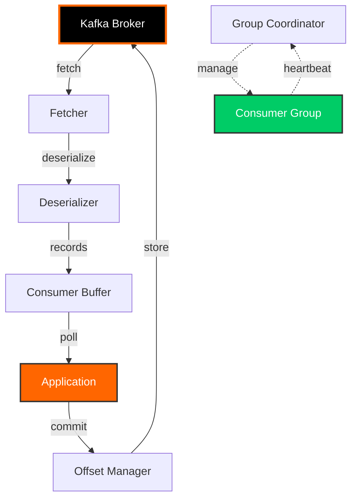
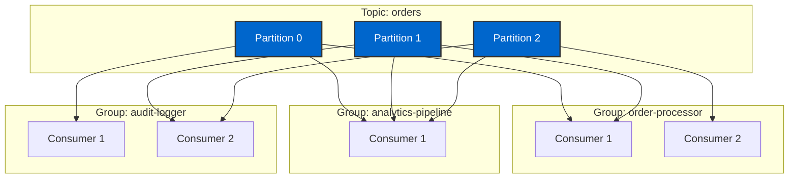

# Day 4: Kafka Consumers

## Learning Objectives

By the end of Day 4, you will:

- [ ] Configure Kafka consumers for different use cases
- [ ] Understand consumer groups and partition assignment
- [ ] Implement offset management strategies
- [ ] Handle consumer rebalancing gracefully
- [ ] Use seek operations for position control
- [ ] Implement error handling and retry logic
- [ ] Optimize consumer performance

## Consumer Architecture



## Consumer Configuration

### Basic Consumer Setup

```java
@Configuration
public class KafkaConsumerConfig {

    @Value("${spring.kafka.bootstrap-servers}")
    private String bootstrapServers;

    @Bean
    public ConsumerFactory<String, String> consumerFactory() {
        Map<String, Object> config = new HashMap<>();

        // Connection
        config.put(ConsumerConfig.BOOTSTRAP_SERVERS_CONFIG, bootstrapServers);

        // Deserialization
        config.put(ConsumerConfig.KEY_DESERIALIZER_CLASS_CONFIG,
            StringDeserializer.class);
        config.put(ConsumerConfig.VALUE_DESERIALIZER_CLASS_CONFIG,
            StringDeserializer.class);

        // Consumer Group
        config.put(ConsumerConfig.GROUP_ID_CONFIG, "my-consumer-group");
        config.put(ConsumerConfig.AUTO_OFFSET_RESET_CONFIG, "earliest");

        // Offset Management
        config.put(ConsumerConfig.ENABLE_AUTO_COMMIT_CONFIG, false);

        // Fetching
        config.put(ConsumerConfig.MAX_POLL_RECORDS_CONFIG, 500);
        config.put(ConsumerConfig.FETCH_MIN_BYTES_CONFIG, 1024);
        config.put(ConsumerConfig.FETCH_MAX_WAIT_MS_CONFIG, 500);

        // Session Management
        config.put(ConsumerConfig.SESSION_TIMEOUT_MS_CONFIG, 30000);
        config.put(ConsumerConfig.HEARTBEAT_INTERVAL_MS_CONFIG, 3000);
        config.put(ConsumerConfig.MAX_POLL_INTERVAL_MS_CONFIG, 300000);

        return new DefaultKafkaConsumerFactory<>(config);
    }

    @Bean
    public ConcurrentKafkaListenerContainerFactory<String, String>
            kafkaListenerContainerFactory() {
        ConcurrentKafkaListenerContainerFactory<String, String> factory =
            new ConcurrentKafkaListenerContainerFactory<>();
        factory.setConsumerFactory(consumerFactory());
        factory.setConcurrency(3);  // 3 consumer threads
        factory.getContainerProperties().setAckMode(AckMode.MANUAL);
        return factory;
    }
}
```

### Configuration Properties Explained

```properties
# Connection
bootstrap.servers=localhost:9092
client.id=my-consumer-1

# Deserialization
key.deserializer=org.apache.kafka.common.serialization.StringDeserializer
value.deserializer=org.apache.kafka.common.serialization.StringDeserializer

# Consumer Group
group.id=my-consumer-group
group.instance.id=consumer-1                # Static membership (optional)

# Offset Management
enable.auto.commit=false                     # Manual commit recommended
auto.commit.interval.ms=5000                 # If auto-commit enabled
auto.offset.reset=earliest                   # earliest, latest, none

# Fetching Behavior
max.poll.records=500                         # Records per poll
fetch.min.bytes=1024                         # Min bytes to fetch
fetch.max.bytes=52428800                     # Max bytes to fetch (50MB)
fetch.max.wait.ms=500                        # Max wait for fetch.min.bytes
max.partition.fetch.bytes=1048576            # Max per partition (1MB)

# Session Management
session.timeout.ms=30000                     # Heartbeat timeout
heartbeat.interval.ms=3000                   # Heartbeat frequency
max.poll.interval.ms=300000                  # Max time between polls (5 min)

# Partition Assignment
partition.assignment.strategy=org.apache.kafka.clients.consumer.CooperativeStickyAssignor

# Isolation Level (for transactional producers)
isolation.level=read_committed               # read_committed or read_uncommitted
```

## Consumer Groups

### Single Consumer Group

```java
@Service
public class OrderConsumer {

    @KafkaListener(
        topics = "orders",
        groupId = "order-processor"
    )
    public void consume(ConsumerRecord<String, String> record) {
        log.info("Consumed: partition={}, offset={}, key={}, value={}",
            record.partition(), record.offset(),
            record.key(), record.value());

        processOrder(record.value());
    }
}
```

### Multiple Consumers in Group

```java
@Service
public class ParallelOrderConsumer {

    // Consumer 1
    @KafkaListener(
        topics = "orders",
        groupId = "order-processor",
        containerFactory = "kafkaListenerContainerFactory"
    )
    public void consumePartition0And1(ConsumerRecord<String, String> record) {
        log.info("Consumer 1: partition={}, offset={}",
            record.partition(), record.offset());
        processOrder(record.value());
    }

    // Consumer 2 (same group, different partitions assigned automatically)
    @KafkaListener(
        topics = "orders",
        groupId = "order-processor",
        containerFactory = "kafkaListenerContainerFactory"
    )
    public void consumePartition2And3(ConsumerRecord<String, String> record) {
        log.info("Consumer 2: partition={}, offset={}",
            record.partition(), record.offset());
        processOrder(record.value());
    }
}
```

### Multiple Consumer Groups

```java
@Service
public class MultiGroupConsumers {

    // Group 1: Order Processing
    @KafkaListener(
        topics = "orders",
        groupId = "order-processor"
    )
    public void processOrders(String order) {
        orderService.process(order);
    }

    // Group 2: Analytics (same topic, independent consumption)
    @KafkaListener(
        topics = "orders",
        groupId = "analytics-pipeline"
    )
    public void analyzeOrders(String order) {
        analyticsService.analyze(order);
    }

    // Group 3: Audit Logging (same topic, independent consumption)
    @KafkaListener(
        topics = "orders",
        groupId = "audit-logger"
    )
    public void auditOrders(String order) {
        auditService.log(order);
    }
}
```



## Partition Assignment Strategies

### Range Assignor (Default)

Assigns partitions in ranges to consumers.

```java
@Configuration
public class RangeAssignorConfig {

    @Bean
    public ConsumerFactory<String, String> rangeConsumerFactory() {
        Map<String, Object> config = new HashMap<>();
        config.put(ConsumerConfig.BOOTSTRAP_SERVERS_CONFIG, "localhost:9092");
        config.put(ConsumerConfig.GROUP_ID_CONFIG, "range-group");
        config.put(ConsumerConfig.PARTITION_ASSIGNMENT_STRATEGY_CONFIG,
            RangeAssignor.class.getName());
        // ... other configs
        return new DefaultKafkaConsumerFactory<>(config);
    }
}
```

**Example:** Topic with 6 partitions, 3 consumers

- Consumer 1: Partitions 0, 1
- Consumer 2: Partitions 2, 3
- Consumer 3: Partitions 4, 5

### Round Robin Assignor

Distributes partitions evenly in round-robin fashion.

```properties
partition.assignment.strategy=org.apache.kafka.clients.consumer.RoundRobinAssignor
```

**Example:** Topic with 6 partitions, 3 consumers

- Consumer 1: Partitions 0, 3
- Consumer 2: Partitions 1, 4
- Consumer 3: Partitions 2, 5

### Sticky Assignor

Minimizes partition movement during rebalancing.

```properties
partition.assignment.strategy=org.apache.kafka.clients.consumer.StickyAssignor
```

**Benefits:**
- Preserves partition assignments when possible
- Reduces rebalancing disruption
- Maintains consumer state/cache

### Cooperative Sticky Assignor (Recommended)

Incremental rebalancing without stopping all consumers.

```properties
partition.assignment.strategy=org.apache.kafka.clients.consumer.CooperativeStickyAssignor
```

**Benefits:**
- Consumers keep processing during rebalance
- Only affected partitions are reassigned
- Minimal disruption
- Best for production

!!! success "Production Recommendation"
    Use **CooperativeStickyAssignor** for production systems. It provides the best balance of fairness and minimal disruption.

## Offset Management

### Auto-Commit (Simple)

```java
@Service
public class AutoCommitConsumer {

    @KafkaListener(
        topics = "events",
        groupId = "auto-commit-group",
        properties = {
            "enable.auto.commit=true",
            "auto.commit.interval.ms=5000"
        }
    )
    public void consume(String event) {
        log.info("Processing: {}", event);
        processEvent(event);
        // Offset committed automatically every 5 seconds
    }
}
```

**Pros:** Simple, no code required
**Cons:** May lose messages on crash, may process duplicates

### Manual Commit (Recommended)

```java
@Service
public class ManualCommitConsumer {

    @KafkaListener(
        topics = "orders",
        groupId = "manual-commit-group",
        properties = {
            "enable.auto.commit=false"
        }
    )
    public void consume(ConsumerRecord<String, String> record,
                       Acknowledgment acknowledgment) {
        try {
            // Process message
            Order order = parseOrder(record.value());
            orderService.save(order);

            // Commit offset after successful processing
            acknowledgment.acknowledge();

            log.info("Processed and committed offset: {}", record.offset());

        } catch (Exception e) {
            log.error("Processing failed, will retry", e);
            // Don't commit - message will be reprocessed
        }
    }
}
```

### Batch Commit

```java
@Service
public class BatchCommitConsumer {

    @KafkaListener(
        topics = "events",
        groupId = "batch-group",
        containerFactory = "batchContainerFactory"
    )
    public void consumeBatch(List<ConsumerRecord<String, String>> records,
                            Acknowledgment acknowledgment) {
        try {
            // Process entire batch
            for (ConsumerRecord<String, String> record : records) {
                processEvent(record.value());
            }

            // Commit after batch completes
            acknowledgment.acknowledge();

            log.info("Processed and committed batch of {} records",
                records.size());

        } catch (Exception e) {
            log.error("Batch processing failed", e);
            // Don't commit - entire batch will be reprocessed
        }
    }
}
```

### Manual Offset Control

```java
@Service
public class ManualOffsetConsumer {

    @Autowired
    private KafkaConsumer<String, String> kafkaConsumer;

    public void consumeWithManualOffset() {
        kafkaConsumer.subscribe(Collections.singletonList("events"));

        while (true) {
            ConsumerRecords<String, String> records =
                kafkaConsumer.poll(Duration.ofMillis(100));

            for (TopicPartition partition : records.partitions()) {
                List<ConsumerRecord<String, String>> partitionRecords =
                    records.records(partition);

                for (ConsumerRecord<String, String> record : partitionRecords) {
                    processEvent(record.value());
                }

                // Get last offset for this partition
                long lastOffset = partitionRecords
                    .get(partitionRecords.size() - 1)
                    .offset();

                // Commit specific offset
                Map<TopicPartition, OffsetAndMetadata> offsets = Map.of(
                    partition,
                    new OffsetAndMetadata(lastOffset + 1)
                );

                kafkaConsumer.commitSync(offsets);
                log.info("Committed offset {} for partition {}",
                    lastOffset + 1, partition.partition());
            }
        }
    }
}
```

## Consumer Rebalancing

### Rebalance Listener

```java
@Service
public class RebalanceAwareConsumer {

    private final Map<TopicPartition, OffsetAndMetadata> currentOffsets =
        new ConcurrentHashMap<>();

    @KafkaListener(topics = "events", groupId = "rebalance-group")
    public void consume(ConsumerRecord<String, String> record,
                       Consumer<?, ?> consumer) {
        processEvent(record.value());

        // Track offsets
        TopicPartition partition =
            new TopicPartition(record.topic(), record.partition());
        currentOffsets.put(partition,
            new OffsetAndMetadata(record.offset() + 1));
    }

    @Component
    public static class RebalanceListener implements ConsumerRebalanceListener {

        @Override
        public void onPartitionsRevoked(Collection<TopicPartition> partitions) {
            log.warn("Partitions revoked: {}", partitions);

            // Commit offsets before losing partitions
            for (TopicPartition partition : partitions) {
                OffsetAndMetadata offset = currentOffsets.get(partition);
                if (offset != null) {
                    consumer.commitSync(Map.of(partition, offset));
                    log.info("Committed offset for revoked partition: {}",
                        partition);
                }
            }

            // Clean up resources for revoked partitions
            closeResourcesForPartitions(partitions);
        }

        @Override
        public void onPartitionsAssigned(Collection<TopicPartition> partitions) {
            log.info("Partitions assigned: {}", partitions);

            // Initialize resources for new partitions
            initializeResourcesForPartitions(partitions);

            // Optional: Seek to specific offset
            for (TopicPartition partition : partitions) {
                long offset = getStoredOffset(partition);
                if (offset >= 0) {
                    consumer.seek(partition, offset);
                    log.info("Seeking partition {} to offset {}",
                        partition, offset);
                }
            }
        }
    }
}
```

### Graceful Shutdown

```java
@Service
public class GracefulShutdownConsumer {

    private final AtomicBoolean running = new AtomicBoolean(true);

    @Autowired
    private KafkaConsumer<String, String> kafkaConsumer;

    @PostConstruct
    public void startConsuming() {
        new Thread(() -> {
            try {
                kafkaConsumer.subscribe(Collections.singletonList("events"));

                while (running.get()) {
                    ConsumerRecords<String, String> records =
                        kafkaConsumer.poll(Duration.ofMillis(100));

                    for (ConsumerRecord<String, String> record : records) {
                        processEvent(record.value());
                    }

                    kafkaConsumer.commitSync();
                }
            } finally {
                kafkaConsumer.close();
                log.info("Consumer closed gracefully");
            }
        }).start();
    }

    @PreDestroy
    public void shutdown() {
        log.info("Initiating graceful shutdown");
        running.set(false);  // Stop polling loop
    }
}
```

## Seek Operations

### Seek to Beginning

```java
@Service
public class SeekOperations {

    @Autowired
    private KafkaConsumer<String, String> kafkaConsumer;

    public void seekToBeginning(String topic) {
        List<TopicPartition> partitions = kafkaConsumer.assignment();

        if (partitions.isEmpty()) {
            kafkaConsumer.subscribe(Collections.singletonList(topic));
            kafkaConsumer.poll(Duration.ofMillis(100));  // Trigger assignment
            partitions = new ArrayList<>(kafkaConsumer.assignment());
        }

        kafkaConsumer.seekToBeginning(partitions);
        log.info("Seeked to beginning for partitions: {}", partitions);
    }

    public void seekToEnd(String topic) {
        List<TopicPartition> partitions = new ArrayList<>(
            kafkaConsumer.assignment());
        kafkaConsumer.seekToEnd(partitions);
        log.info("Seeked to end for partitions: {}", partitions);
    }

    public void seekToOffset(String topic, int partition, long offset) {
        TopicPartition topicPartition = new TopicPartition(topic, partition);
        kafkaConsumer.seek(topicPartition, offset);
        log.info("Seeked partition {} to offset {}", partition, offset);
    }

    public void seekToTimestamp(String topic, long timestamp) {
        Map<TopicPartition, Long> timestampsToSearch = new HashMap<>();

        for (TopicPartition partition : kafkaConsumer.assignment()) {
            timestampsToSearch.put(partition, timestamp);
        }

        Map<TopicPartition, OffsetAndTimestamp> offsets =
            kafkaConsumer.offsetsForTimes(timestampsToSearch);

        for (Map.Entry<TopicPartition, OffsetAndTimestamp> entry :
                offsets.entrySet()) {
            if (entry.getValue() != null) {
                kafkaConsumer.seek(entry.getKey(), entry.getValue().offset());
                log.info("Seeked partition {} to timestamp offset {}",
                    entry.getKey().partition(), entry.getValue().offset());
            }
        }
    }
}
```

### Replay Messages

```java
@Service
public class MessageReplayService {

    @Autowired
    private KafkaConsumer<String, String> kafkaConsumer;

    public void replayLastHour(String topic) {
        long oneHourAgo = Instant.now()
            .minus(1, ChronoUnit.HOURS)
            .toEpochMilli();

        seekToTimestamp(topic, oneHourAgo);

        int count = 0;
        boolean reachedEnd = false;

        while (!reachedEnd) {
            ConsumerRecords<String, String> records =
                kafkaConsumer.poll(Duration.ofSeconds(1));

            for (ConsumerRecord<String, String> record : records) {
                if (record.timestamp() > System.currentTimeMillis()) {
                    reachedEnd = true;
                    break;
                }

                reprocessEvent(record.value());
                count++;
            }

            if (records.isEmpty()) {
                reachedEnd = true;
            }
        }

        log.info("Replayed {} messages from last hour", count);
    }
}
```

## Error Handling

### Retry with Backoff

```java
@Service
public class RetryableConsumer {

    private static final int MAX_RETRIES = 3;

    @Autowired
    private DeadLetterQueueService dlqService;

    @KafkaListener(topics = "orders", groupId = "retry-group")
    public void consume(ConsumerRecord<String, String> record,
                       Acknowledgment acknowledgment) {
        int retryCount = 0;
        boolean processed = false;

        while (!processed && retryCount < MAX_RETRIES) {
            try {
                processOrder(record.value());
                acknowledgment.acknowledge();
                processed = true;

                log.info("Processed successfully on attempt {}",
                    retryCount + 1);

            } catch (TransientException e) {
                retryCount++;
                log.warn("Transient error, retry {} of {}",
                    retryCount, MAX_RETRIES, e);

                if (retryCount < MAX_RETRIES) {
                    // Exponential backoff
                    long backoff = (long) Math.pow(2, retryCount) * 1000;
                    sleep(backoff);
                } else {
                    log.error("Max retries exceeded");
                    dlqService.send(record.topic(), record.key(),
                        record.value(), "MAX_RETRIES");
                    acknowledgment.acknowledge();  // Skip this message
                }

            } catch (PermanentException e) {
                log.error("Permanent error, sending to DLQ", e);
                dlqService.send(record.topic(), record.key(),
                    record.value(), "PERMANENT_ERROR");
                acknowledgment.acknowledge();  // Skip this message
                processed = true;
            }
        }
    }
}
```

### Error Handling Handler

```java
@Configuration
public class ErrorHandlingConfig {

    @Bean
    public ConsumerAwareErrorHandler errorHandler() {
        return (thrownException, data, consumer) -> {
            log.error("Error in consumer: {}", thrownException.getMessage());

            ConsumerRecord<?, ?> record = (ConsumerRecord<?, ?>) data;

            // Log error details
            log.error("Failed record: topic={}, partition={}, offset={}",
                record.topic(), record.partition(), record.offset());

            // Send to DLQ
            dlqService.send(record);

            // Don't throw - message will be skipped
        };
    }
}
```

## REST API Endpoints

### Run Day 4 Demo

```bash
curl -X POST http://localhost:8080/api/training/day04/demo
```

### Auto-Commit Consumer

```bash
curl -X POST http://localhost:8080/api/training/day04/consume-auto \
  -H "Content-Type: application/json" \
  -d '{
    "topic": "test-topic",
    "groupId": "auto-commit-group",
    "durationSeconds": 10
  }'
```

### Manual-Commit Consumer

```bash
curl -X POST http://localhost:8080/api/training/day04/consume-manual \
  -H "Content-Type: application/json" \
  -d '{
    "topic": "test-topic",
    "groupId": "manual-commit-group",
    "durationSeconds": 10
  }'
```

### Seek Demo

```bash
curl -X POST http://localhost:8080/api/training/day04/seek-demo \
  -H "Content-Type: application/json" \
  -d '{
    "topic": "test-topic",
    "partition": 0,
    "offset": 100
  }'
```

## Hands-On Exercises

### Exercise 1: Consumer Group Behavior

```bash
# Terminal 1: Start consumer 1
docker exec -it kafka-training-kafka kafka-console-consumer \
  --bootstrap-server localhost:9092 \
  --topic test-consumer-group \
  --group my-group \
  --property print.partition=true

# Terminal 2: Start consumer 2 (same group)
docker exec -it kafka-training-kafka kafka-console-consumer \
  --bootstrap-server localhost:9092 \
  --topic test-consumer-group \
  --group my-group \
  --property print.partition=true

# Terminal 3: Produce messages
for i in {1..10}; do
  echo "Message $i" | docker exec -i kafka-training-kafka \
    kafka-console-producer \
    --bootstrap-server localhost:9092 \
    --topic test-consumer-group
done

# Observe: Messages distributed between consumers
```

### Exercise 2: Offset Reset

```bash
# Consume from beginning
docker exec kafka-training-kafka kafka-console-consumer \
  --bootstrap-server localhost:9092 \
  --topic test-topic \
  --group reset-group \
  --from-beginning

# Reset offsets to earliest
docker exec kafka-training-kafka kafka-consumer-groups \
  --bootstrap-server localhost:9092 \
  --group reset-group \
  --reset-offsets \
  --to-earliest \
  --topic test-topic \
  --execute

# Consume again - replays all messages
```

### Exercise 3: Seek to Timestamp

```bash
# Get offset for timestamp (1 hour ago)
TIMESTAMP=$(($(date +%s) * 1000 - 3600000))

docker exec kafka-training-kafka kafka-run-class \
  kafka.tools.GetOffsetShell \
  --broker-list localhost:9092 \
  --topic test-topic \
  --time $TIMESTAMP

# Use REST API to seek
curl -X POST http://localhost:8080/api/training/day04/seek-timestamp \
  -H "Content-Type: application/json" \
  -d "{\"topic\":\"test-topic\",\"timestamp\":$TIMESTAMP}"
```

## Key Takeaways

!!! success "What You Learned"
    1. **Consumer groups** enable parallel processing and fault tolerance
    2. **Partition assignment strategies** affect load distribution
    3. **Manual offset management** provides precise control
    4. **Rebalancing** must be handled gracefully in production
    5. **Seek operations** enable message replay and recovery
    6. **Error handling** requires retry logic and dead letter queues
    7. **Configuration tuning** balances throughput and reliability

## Next Steps

Continue to [Day 5: Schema Registry](day05-schema-registry.md) to learn about schema management and evolution.

**Related Resources:**
- [API Reference](../api/training-endpoints.md)
- [TestContainers Testing](../containers/testcontainers.md)
- [Data Flow Architecture](../architecture/data-flow.md)
