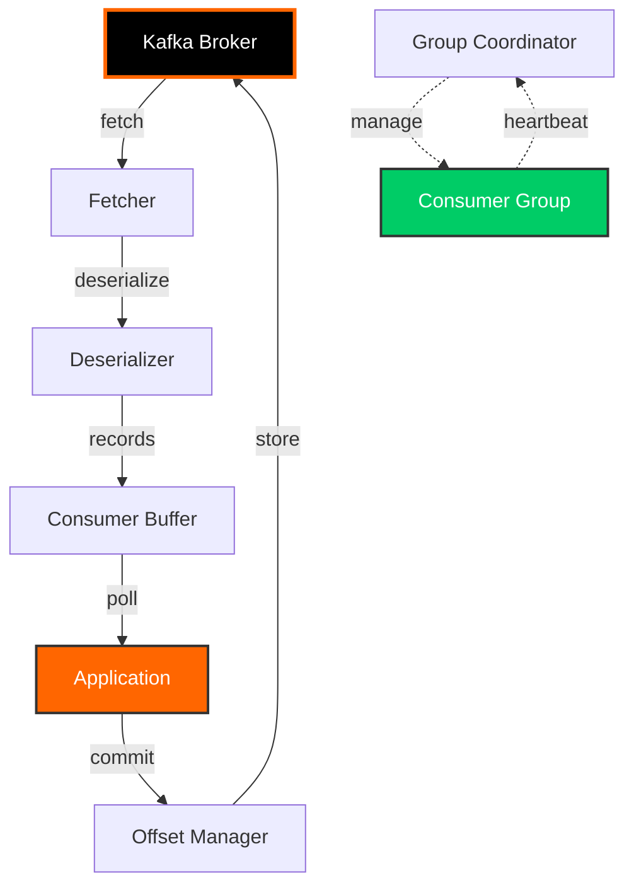
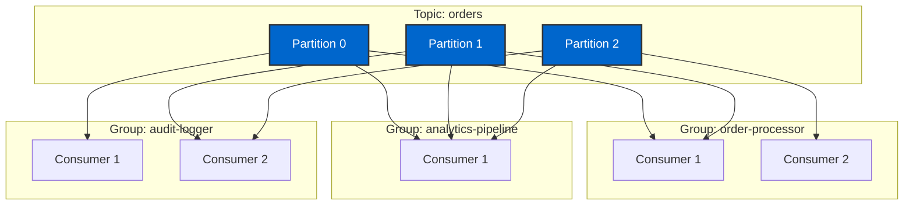

# Day 4: Kafka Consumers

> **Primary Audience:** Data Engineers
> **Learning Track:** Platform-agnostic Kafka concepts. Data engineers focus on CLI/pure API. Java developers see Spring Boot sections (marked optional).

## Learning Objectives

By the end of Day 4, you will:

- [ ] Configure Kafka consumers for different use cases
- [ ] Understand consumer groups and partition assignment
- [ ] Implement offset management strategies
- [ ] Handle consumer rebalancing gracefully
- [ ] Use seek operations for position control
- [ ] Implement error handling and retry logic
- [ ] Optimize consumer performance

## Core Concepts

### Consumer Architecture



### Consumer Groups

Consumer groups enable parallel processing and fault tolerance:

- **Single consumer group**: Partitions divided among consumers
- **Multiple consumer groups**: Each group reads all messages independently
- **Scalability**: Add consumers up to partition count
- **Fault tolerance**: Automatic rebalancing on failure



## CLI Approach (Data Engineer Track)

### kafka-console-consumer

Basic consumption from the command line:

```bash
# Consume from beginning
docker exec -it kafka-training-kafka kafka-console-consumer \
  --bootstrap-server localhost:9092 \
  --topic orders \
  --from-beginning

# Consume with key and partition info
docker exec -it kafka-training-kafka kafka-console-consumer \
  --bootstrap-server localhost:9092 \
  --topic orders \
  --property print.key=true \
  --property print.partition=true \
  --property print.offset=true \
  --property print.timestamp=true

# Consume with consumer group
docker exec -it kafka-training-kafka kafka-console-consumer \
  --bootstrap-server localhost:9092 \
  --topic orders \
  --group order-processor \
  --from-beginning

# Consume specific partition
docker exec -it kafka-training-kafka kafka-console-consumer \
  --bootstrap-server localhost:9092 \
  --topic orders \
  --partition 0 \
  --offset earliest
```

### Consumer Group Management

```bash
# List all consumer groups
docker exec kafka-training-kafka kafka-consumer-groups \
  --bootstrap-server localhost:9092 \
  --list

# Describe consumer group
docker exec kafka-training-kafka kafka-consumer-groups \
  --bootstrap-server localhost:9092 \
  --group order-processor \
  --describe

# Output shows:
# - Current offset per partition
# - Log end offset
# - Lag (difference)
# - Consumer ID
# - Host

# View offsets only
docker exec kafka-training-kafka kafka-consumer-groups \
  --bootstrap-server localhost:9092 \
  --group order-processor \
  --describe \
  --offsets

# View member details
docker exec kafka-training-kafka kafka-consumer-groups \
  --bootstrap-server localhost:9092 \
  --group order-processor \
  --describe \
  --members

# View state
docker exec kafka-training-kafka kafka-consumer-groups \
  --bootstrap-server localhost:9092 \
  --group order-processor \
  --describe \
  --state
```

### Offset Management

```bash
# Reset offsets to earliest
docker exec kafka-training-kafka kafka-consumer-groups \
  --bootstrap-server localhost:9092 \
  --group order-processor \
  --reset-offsets \
  --to-earliest \
  --topic orders \
  --execute

# Reset to latest
docker exec kafka-training-kafka kafka-consumer-groups \
  --bootstrap-server localhost:9092 \
  --group order-processor \
  --reset-offsets \
  --to-latest \
  --topic orders \
  --execute

# Reset to specific offset
docker exec kafka-training-kafka kafka-consumer-groups \
  --bootstrap-server localhost:9092 \
  --group order-processor \
  --reset-offsets \
  --to-offset 100 \
  --topic orders:0 \
  --execute

# Reset to specific datetime
docker exec kafka-training-kafka kafka-consumer-groups \
  --bootstrap-server localhost:9092 \
  --group order-processor \
  --reset-offsets \
  --to-datetime 2024-01-01T00:00:00.000 \
  --topic orders \
  --execute

# Shift offsets forward/backward
docker exec kafka-training-kafka kafka-consumer-groups \
  --bootstrap-server localhost:9092 \
  --group order-processor \
  --reset-offsets \
  --shift-by -10 \
  --topic orders \
  --execute

# Delete consumer group (must be empty)
docker exec kafka-training-kafka kafka-consumer-groups \
  --bootstrap-server localhost:9092 \
  --delete \
  --group order-processor
```

## Production Example: SimpleConsumer.java

> **See Working Example**: `src/main/java/com/training/kafka/Day04Consumers/SimpleConsumer.java`

This is the actual consumer implementation from the repository, showing production-ready patterns for reliable message consumption.

### Consumer Configuration (Lines 26-40)

From `SimpleConsumer.java:26-40`:

```java
Properties props = new Properties();
props.put(ConsumerConfig.BOOTSTRAP_SERVERS_CONFIG, bootstrapServers);
props.put(ConsumerConfig.GROUP_ID_CONFIG, groupId);
props.put(ConsumerConfig.CLIENT_ID_CONFIG, "simple-consumer");
props.put(ConsumerConfig.KEY_DESERIALIZER_CLASS_CONFIG, StringDeserializer.class.getName());
props.put(ConsumerConfig.VALUE_DESERIALIZER_CLASS_CONFIG, StringDeserializer.class.getName());

// Consumer behavior settings
props.put(ConsumerConfig.AUTO_OFFSET_RESET_CONFIG, "earliest");
props.put(ConsumerConfig.ENABLE_AUTO_COMMIT_CONFIG, "false"); // Manual commit for better control
props.put(ConsumerConfig.MAX_POLL_RECORDS_CONFIG, "100");
props.put(ConsumerConfig.SESSION_TIMEOUT_MS_CONFIG, "30000");
props.put(ConsumerConfig.HEARTBEAT_INTERVAL_MS_CONFIG, "10000");

this.consumer = new KafkaConsumer<>(props);
```

**Key Configuration Decisions:**
- `auto.offset.reset=earliest`: Start from beginning if no committed offset
- `enable.auto.commit=false`: Manual offset control (more reliable)
- `max.poll.records=100`: Limit records per poll for controlled batch processing
- `session.timeout.ms=30000`: 30 seconds before consumer is considered failed
- `heartbeat.interval.ms=10000`: Send heartbeat every 10 seconds

### Basic Consumption with Batch Commit (Lines 46-80)

From `SimpleConsumer.java:46-80`:

```java
public void consumeMessages(String topicName) {
    logger.info("Starting to consume messages from topic: {}", topicName);

    // Subscribe to the topic
    consumer.subscribe(Collections.singletonList(topicName));

    try {
        while (running) {
            ConsumerRecords<String, String> records = consumer.poll(Duration.ofMillis(1000));

            if (records.isEmpty()) {
                continue;
            }

            logger.info("Received {} messages", records.count());

            for (ConsumerRecord<String, String> record : records) {
                processMessage(record);
            }

            // Commit offsets after processing all messages in this batch
            try {
                consumer.commitSync();
                logger.debug("Offsets committed successfully");
            } catch (Exception e) {
                logger.error("Failed to commit offsets: {}", e.getMessage());
            }
        }
    } catch (Exception e) {
        logger.error("Error in consumer loop: {}", e.getMessage(), e);
    } finally {
        consumer.close();
        logger.info("Consumer closed");
    }
}
```

**Key Pattern**: Poll → Process all records → Commit batch. This is efficient but means reprocessing entire batch on failure.

### Manual Offset Management (Lines 85-121)

From `SimpleConsumer.java:85-121`:

```java
public void consumeWithManualOffsetManagement(String topicName, int maxMessages) {
    logger.info("Starting to consume {} messages from topic: {}", maxMessages, topicName);

    consumer.subscribe(Collections.singletonList(topicName));

    int messageCount = 0;

    try {
        while (running && messageCount < maxMessages) {
            ConsumerRecords<String, String> records = consumer.poll(Duration.ofMillis(1000));

            for (ConsumerRecord<String, String> record : records) {
                try {
                    processMessage(record);
                    messageCount++;

                    // Commit offset for this specific record
                    TopicPartition partition = new TopicPartition(record.topic(), record.partition());
                    OffsetAndMetadata offsetMetadata = new OffsetAndMetadata(record.offset() + 1);
                    consumer.commitSync(Collections.singletonMap(partition, offsetMetadata));

                    logger.debug("Committed offset {} for partition {}", record.offset() + 1, partition);

                    if (messageCount >= maxMessages) {
                        break;
                    }
                } catch (Exception e) {
                    logger.error("Error processing message at offset {}: {}", record.offset(), e.getMessage());
                    // In real applications, you might want to implement retry logic or dead letter queues
                }
            }
        }
    } finally {
        consumer.close();
        logger.info("Processed {} messages and closed consumer", messageCount);
    }
}
```

**Key Pattern**: Process record → Commit specific offset. This ensures exactly-once processing but is slower due to more commits.

### Consumer Group Demo (Lines 144-175)

From `SimpleConsumer.java:144-175`:

```java
public static void demonstrateConsumerGroup(String bootstrapServers, String topicName) {
    logger.info("Demonstrating consumer group behavior...");

    // Create multiple consumers in the same group
    String groupId = "demo-consumer-group";

    // Consumer 1
    Thread consumer1Thread = new Thread(() -> {
        SimpleConsumer consumer1 = new SimpleConsumer(bootstrapServers, groupId);
        consumer1.consumeWithManualOffsetManagement(topicName, 5);
    }, "Consumer-1");

    // Consumer 2
    Thread consumer2Thread = new Thread(() -> {
        SimpleConsumer consumer2 = new SimpleConsumer(bootstrapServers, groupId);
        consumer2.consumeWithManualOffsetManagement(topicName, 5);
    }, "Consumer-2");

    // Start both consumers
    consumer1Thread.start();
    consumer2Thread.start();

    try {
        consumer1Thread.join();
        consumer2Thread.join();
    } catch (InterruptedException e) {
        Thread.currentThread().interrupt();
        logger.error("Interrupted while waiting for consumer threads");
    }

    logger.info("Consumer group demonstration completed");
}
```

**Key Pattern**: Multiple consumers in same group automatically partition work. Kafka handles load balancing.

## Python Consumer Implementation (Data Engineer Track)

### Using kafka-python

Install the library:
```bash
pip install kafka-python
```

**Complete Python Example**: `examples/python/day04_consumer.py`

```bash
# Run the Python consumer example
python examples/python/day04_consumer.py
```

**Key code from day04_consumer.py:**

```python
from kafka import KafkaConsumer
import json

def create_consumer():
    """
    Create Kafka consumer with configuration
    Compare to Java: new KafkaConsumer<>(properties)
    """
    return KafkaConsumer(
        # Subscribe to topic
        'training-day01-cli',

        # Connection
        bootstrap_servers='localhost:9092',
        group_id='python-consumer-cli',
        client_id='python-consumer-1',

        # Deserialization (Java: StringDeserializer)
        key_deserializer=lambda k: k.decode('utf-8') if k else None,
        value_deserializer=lambda v: json.loads(v.decode('utf-8')),

        # Consumer behavior (same as Java)
        auto_offset_reset='earliest',      # ConsumerConfig.AUTO_OFFSET_RESET_CONFIG
        enable_auto_commit=False,          # ConsumerConfig.ENABLE_AUTO_COMMIT_CONFIG
        max_poll_records=100,              # ConsumerConfig.MAX_POLL_RECORDS_CONFIG
        session_timeout_ms=30000,          # ConsumerConfig.SESSION_TIMEOUT_MS_CONFIG
        heartbeat_interval_ms=10000        # ConsumerConfig.HEARTBEAT_INTERVAL_MS_CONFIG
    )

def consume_messages_manual_commit(consumer, max_messages=10):
    """
    Consume messages with manual commit (at-least-once semantics)
    Compare to Java: consumer.poll() + consumer.commitSync()
    """
    message_count = 0

    try:
        print(f"Polling for up to {max_messages} messages...")

        while message_count < max_messages:
            # Poll for messages (Java: consumer.poll(Duration.ofMillis(1000)))
            records = consumer.poll(timeout_ms=1000)

            if not records:
                continue

            # Process messages
            for message in records:
                print(f"✓ Consumed message:")
                print(f"  Partition: {message.partition}")
                print(f"  Offset: {message.offset}")
                print(f"  Key: {message.key}")
                print(f"  Value: {message.value}")

                message_count += 1

                # Manual commit after each message
                consumer.commit()

                if message_count >= max_messages:
                    break
    finally:
        consumer.close()

# Usage
consumer = create_consumer()
consume_messages_manual_commit(consumer, max_messages=10)
```

**Install Dependencies:**

```bash
pip install kafka-python
# Or install all training dependencies
pip install -r examples/python/requirements.txt
```

### Using confluent-kafka (Faster, C-based)

> **Note**: This section shows confluent-kafka for comparison. Day 4 examples use kafka-python. For working confluent-kafka examples, see Day 5 (Avro with Schema Registry) at `examples/python/day05_avro_consumer.py`.

Install the library:
```bash
pip install confluent-kafka
```

**Confluent Kafka Consumer:**

```python
from confluent_kafka import Consumer, TopicPartition, OFFSET_BEGINNING
import json

class ConfluentConsumer:
    def __init__(self, bootstrap_servers='localhost:9092', group_id='python-consumer-group'):
        self.config = {
            'bootstrap.servers': bootstrap_servers,
            'group.id': group_id,
            'client.id': 'simple-consumer',

            # Consumer behavior
            'auto.offset.reset': 'earliest',
            'enable.auto.commit': False,  # Manual commit
            'max.poll.interval.ms': 300000,
            'session.timeout.ms': 30000,
            'heartbeat.interval.ms': 10000
        }

        self.consumer = Consumer(self.config)

    def consume_messages(self, topics):
        """Consume messages with batch commit"""
        print(f"Starting to consume messages from topics: {topics}")

        self.consumer.subscribe(topics)

        try:
            while True:
                # Poll for message (1 second timeout)
                msg = self.consumer.poll(timeout=1.0)

                if msg is None:
                    continue

                if msg.error():
                    print(f"Consumer error: {msg.error()}")
                    continue

                # Process message
                self.process_message(msg)

                # Commit offset after processing
                try:
                    self.consumer.commit(asynchronous=False)
                except Exception as e:
                    print(f"Failed to commit offset: {e}")

        except KeyboardInterrupt:
            print("Shutdown signal received")
        finally:
            self.consumer.close()
            print("Consumer closed")

    def consume_with_batch_commit(self, topics, batch_size=100):
        """Consume messages with periodic batch commit"""
        print(f"Starting batch consumer for topics: {topics}")

        self.consumer.subscribe(topics)
        message_count = 0
        batch = []

        try:
            while True:
                msg = self.consumer.poll(timeout=1.0)

                if msg is None:
                    continue

                if msg.error():
                    print(f"Consumer error: {msg.error()}")
                    continue

                # Process and add to batch
                self.process_message(msg)
                batch.append(msg)
                message_count += 1

                # Commit batch when full
                if len(batch) >= batch_size:
                    try:
                        self.consumer.commit(asynchronous=False)
                        print(f"Committed batch of {len(batch)} messages")
                        batch.clear()
                    except Exception as e:
                        print(f"Failed to commit batch: {e}")

        except KeyboardInterrupt:
            print("Shutdown signal received")
            # Commit remaining messages
            if batch:
                self.consumer.commit()
                print(f"Committed final batch of {len(batch)} messages")
        finally:
            self.consumer.close()
            print(f"Processed {message_count} messages and closed consumer")

    def process_message(self, msg):
        """Process an individual message"""
        # Decode value
        try:
            value = json.loads(msg.value().decode('utf-8'))
        except:
            value = msg.value().decode('utf-8')

        key = msg.key().decode('utf-8') if msg.key() else None

        print(f"Processing: topic={msg.topic()}, partition={msg.partition()}, "
              f"offset={msg.offset()}, key={key}, value={value}")

    def seek_to_beginning(self, topics):
        """Seek to beginning of all partitions"""
        self.consumer.subscribe(topics)

        # Wait for assignment
        assignment = []
        while not assignment:
            self.consumer.poll(timeout=1.0)
            assignment = self.consumer.assignment()

        # Seek each partition to beginning
        for partition in assignment:
            partition.offset = OFFSET_BEGINNING
            self.consumer.seek(partition)

        print(f"Seeked to beginning of {len(assignment)} partitions")

# Usage example
if __name__ == "__main__":
    consumer = ConfluentConsumer(group_id='training-consumer-group')

    # Consume with per-message commit
    # consumer.consume_messages(['user-events'])

    # Or consume with batch commit
    consumer.consume_with_batch_commit(['user-events'], batch_size=50)
```

### Consumer Group Management with Python

> **Note**: This is a utility reference snippet. Similar functionality is included in `examples/python/day01_admin.py` for admin operations.

```python
from kafka import KafkaAdminClient
from kafka.admin import ConsumerGroupDescription

def describe_consumer_group(bootstrap_servers, group_id):
    """Describe consumer group (like kafka-consumer-groups CLI)"""
    admin_client = KafkaAdminClient(
        bootstrap_servers=bootstrap_servers,
        client_id='admin-client'
    )

    # Get group description
    groups = admin_client.describe_consumer_groups([group_id])

    for group in groups:
        print(f"Group: {group.group_id}")
        print(f"State: {group.state}")
        print(f"Protocol: {group.protocol}")
        print(f"Members: {len(group.members)}")

        for member in group.members:
            print(f"  Member ID: {member.member_id}")
            print(f"  Client ID: {member.client_id}")
            print(f"  Host: {member.host}")
            print(f"  Assignments: {member.member_assignment}")

    admin_client.close()

# Usage
describe_consumer_group('localhost:9092', 'training-consumer-group')
```

**Key Differences: kafka-python vs confluent-kafka:**

| Feature | kafka-python | confluent-kafka |
|---------|-------------|-----------------|
| Implementation | Pure Python | C-based (librdkafka) |
| Performance | Good for moderate loads | Excellent for high throughput |
| API Style | More Pythonic (poll returns dict) | More similar to Java API |
| Offset Management | Both auto and manual | Both auto and manual |
| Consumer Groups | Full support | Full support |
| Use Case | Development, data pipelines | Production, high-performance |

## Pure Java Implementation (Additional Examples)

The examples below show additional patterns beyond the production code in SimpleConsumer.java.

### Basic Consumer Configuration

```java
import org.apache.kafka.clients.consumer.*;
import org.apache.kafka.common.serialization.StringDeserializer;
import java.time.Duration;
import java.util.*;

public class BasicConsumer {

    public static void main(String[] args) {
        // 1. Configure consumer
        Properties props = new Properties();
        props.put(ConsumerConfig.BOOTSTRAP_SERVERS_CONFIG, "localhost:9092");
        props.put(ConsumerConfig.GROUP_ID_CONFIG, "my-consumer-group");
        props.put(ConsumerConfig.KEY_DESERIALIZER_CLASS_CONFIG,
            StringDeserializer.class.getName());
        props.put(ConsumerConfig.VALUE_DESERIALIZER_CLASS_CONFIG,
            StringDeserializer.class.getName());
        props.put(ConsumerConfig.AUTO_OFFSET_RESET_CONFIG, "earliest");

        // 2. Create consumer
        KafkaConsumer<String, String> consumer = new KafkaConsumer<>(props);

        // 3. Subscribe to topics
        consumer.subscribe(Collections.singletonList("orders"));

        // 4. Poll loop
        try {
            while (true) {
                ConsumerRecords<String, String> records =
                    consumer.poll(Duration.ofMillis(100));

                for (ConsumerRecord<String, String> record : records) {
                    System.out.printf("Consumed: partition=%d, offset=%d, key=%s, value=%s%n",
                        record.partition(), record.offset(),
                        record.key(), record.value());
                }
            }
        } finally {
            consumer.close();
        }
    }
}
```

### Consumer Configuration Properties

```properties
# Connection
bootstrap.servers=localhost:9092
client.id=my-consumer-1

# Deserialization
key.deserializer=org.apache.kafka.common.serialization.StringDeserializer
value.deserializer=org.apache.kafka.common.serialization.StringDeserializer

# Consumer Group
group.id=my-consumer-group
group.instance.id=consumer-1                # Static membership (optional)

# Offset Management
enable.auto.commit=false                     # Manual commit recommended
auto.commit.interval.ms=5000                 # If auto-commit enabled
auto.offset.reset=earliest                   # earliest, latest, none

# Fetching Behavior
max.poll.records=500                         # Records per poll
fetch.min.bytes=1024                         # Min bytes to fetch
fetch.max.bytes=52428800                     # Max bytes to fetch (50MB)
fetch.max.wait.ms=500                        # Max wait for fetch.min.bytes
max.partition.fetch.bytes=1048576            # Max per partition (1MB)

# Session Management
session.timeout.ms=30000                     # Heartbeat timeout
heartbeat.interval.ms=3000                   # Heartbeat frequency
max.poll.interval.ms=300000                  # Max time between polls (5 min)

# Partition Assignment
partition.assignment.strategy=org.apache.kafka.clients.consumer.CooperativeStickyAssignor

# Isolation Level (for transactional producers)
isolation.level=read_committed               # read_committed or read_uncommitted
```

### Manual Offset Management

```java
import org.apache.kafka.clients.consumer.*;
import org.apache.kafka.common.TopicPartition;
import java.util.*;

public class ManualOffsetConsumer {

    public static void main(String[] args) {
        Properties props = new Properties();
        props.put(ConsumerConfig.BOOTSTRAP_SERVERS_CONFIG, "localhost:9092");
        props.put(ConsumerConfig.GROUP_ID_CONFIG, "manual-commit-group");
        props.put(ConsumerConfig.ENABLE_AUTO_COMMIT_CONFIG, "false");
        props.put(ConsumerConfig.KEY_DESERIALIZER_CLASS_CONFIG,
            "org.apache.kafka.common.serialization.StringDeserializer");
        props.put(ConsumerConfig.VALUE_DESERIALIZER_CLASS_CONFIG,
            "org.apache.kafka.common.serialization.StringDeserializer");

        KafkaConsumer<String, String> consumer = new KafkaConsumer<>(props);
        consumer.subscribe(Collections.singletonList("orders"));

        try {
            while (true) {
                ConsumerRecords<String, String> records =
                    consumer.poll(Duration.ofMillis(100));

                for (TopicPartition partition : records.partitions()) {
                    List<ConsumerRecord<String, String>> partitionRecords =
                        records.records(partition);

                    for (ConsumerRecord<String, String> record : partitionRecords) {
                        processRecord(record);
                    }

                    // Commit offset after processing partition
                    long lastOffset = partitionRecords
                        .get(partitionRecords.size() - 1)
                        .offset();

                    consumer.commitSync(Collections.singletonMap(
                        partition,
                        new OffsetAndMetadata(lastOffset + 1)
                    ));

                    System.out.printf("Committed offset %d for partition %d%n",
                        lastOffset + 1, partition.partition());
                }
            }
        } finally {
            consumer.close();
        }
    }

    private static void processRecord(ConsumerRecord<String, String> record) {
        System.out.printf("Processing: %s%n", record.value());
    }
}
```

### Partition Assignment Strategies

#### Range Assignor (Default)

```properties
partition.assignment.strategy=org.apache.kafka.clients.consumer.RangeAssignor
```

Example: Topic with 6 partitions, 3 consumers
- Consumer 1: Partitions 0, 1
- Consumer 2: Partitions 2, 3
- Consumer 3: Partitions 4, 5

#### Round Robin Assignor

```properties
partition.assignment.strategy=org.apache.kafka.clients.consumer.RoundRobinAssignor
```

Example: Topic with 6 partitions, 3 consumers
- Consumer 1: Partitions 0, 3
- Consumer 2: Partitions 1, 4
- Consumer 3: Partitions 2, 5

#### Sticky Assignor

```properties
partition.assignment.strategy=org.apache.kafka.clients.consumer.StickyAssignor
```

Benefits:
- Preserves partition assignments when possible
- Reduces rebalancing disruption
- Maintains consumer state/cache

#### Cooperative Sticky Assignor (Recommended)

```properties
partition.assignment.strategy=org.apache.kafka.clients.consumer.CooperativeStickyAssignor
```

Benefits:
- Consumers keep processing during rebalance
- Only affected partitions are reassigned
- Minimal disruption
- Best for production

!!! success "Production Recommendation"
    Use **CooperativeStickyAssignor** for production systems. It provides the best balance of fairness and minimal disruption.

### Seek Operations

```java
import org.apache.kafka.clients.consumer.*;
import org.apache.kafka.common.TopicPartition;
import java.time.Instant;
import java.util.*;

public class SeekOperations {

    public static void seekToBeginning(KafkaConsumer<String, String> consumer) {
        Collection<TopicPartition> partitions = consumer.assignment();
        consumer.seekToBeginning(partitions);
        System.out.println("Seeked to beginning for partitions: " + partitions);
    }

    public static void seekToEnd(KafkaConsumer<String, String> consumer) {
        Collection<TopicPartition> partitions = consumer.assignment();
        consumer.seekToEnd(partitions);
        System.out.println("Seeked to end for partitions: " + partitions);
    }

    public static void seekToOffset(KafkaConsumer<String, String> consumer,
                                   String topic, int partition, long offset) {
        TopicPartition topicPartition = new TopicPartition(topic, partition);
        consumer.seek(topicPartition, offset);
        System.out.printf("Seeked partition %d to offset %d%n", partition, offset);
    }

    public static void seekToTimestamp(KafkaConsumer<String, String> consumer,
                                      long timestamp) {
        Map<TopicPartition, Long> timestampsToSearch = new HashMap<>();

        for (TopicPartition partition : consumer.assignment()) {
            timestampsToSearch.put(partition, timestamp);
        }

        Map<TopicPartition, OffsetAndTimestamp> offsets =
            consumer.offsetsForTimes(timestampsToSearch);

        for (Map.Entry<TopicPartition, OffsetAndTimestamp> entry : offsets.entrySet()) {
            if (entry.getValue() != null) {
                consumer.seek(entry.getKey(), entry.getValue().offset());
                System.out.printf("Seeked partition %d to timestamp offset %d%n",
                    entry.getKey().partition(), entry.getValue().offset());
            }
        }
    }

    public static void main(String[] args) {
        Properties props = new Properties();
        props.put(ConsumerConfig.BOOTSTRAP_SERVERS_CONFIG, "localhost:9092");
        props.put(ConsumerConfig.GROUP_ID_CONFIG, "seek-demo-group");
        props.put(ConsumerConfig.KEY_DESERIALIZER_CLASS_CONFIG,
            "org.apache.kafka.common.serialization.StringDeserializer");
        props.put(ConsumerConfig.VALUE_DESERIALIZER_CLASS_CONFIG,
            "org.apache.kafka.common.serialization.StringDeserializer");

        KafkaConsumer<String, String> consumer = new KafkaConsumer<>(props);
        consumer.subscribe(Collections.singletonList("orders"));

        // Trigger partition assignment
        consumer.poll(Duration.ofMillis(100));

        // Seek to 1 hour ago
        long oneHourAgo = Instant.now().minusSeconds(3600).toEpochMilli();
        seekToTimestamp(consumer, oneHourAgo);

        // Now consume
        while (true) {
            ConsumerRecords<String, String> records = consumer.poll(Duration.ofMillis(100));
            for (ConsumerRecord<String, String> record : records) {
                System.out.printf("Consumed: %s%n", record.value());
            }
        }
    }
}
```

### Rebalance Listener

```java
import org.apache.kafka.clients.consumer.*;
import org.apache.kafka.common.TopicPartition;
import java.util.*;

public class RebalanceAwareConsumer {

    private static Map<TopicPartition, OffsetAndMetadata> currentOffsets =
        new HashMap<>();

    public static class RebalanceListener implements ConsumerRebalanceListener {

        private KafkaConsumer<String, String> consumer;

        public RebalanceListener(KafkaConsumer<String, String> consumer) {
            this.consumer = consumer;
        }

        @Override
        public void onPartitionsRevoked(Collection<TopicPartition> partitions) {
            System.out.println("Partitions revoked: " + partitions);

            // Commit offsets before losing partitions
            for (TopicPartition partition : partitions) {
                OffsetAndMetadata offset = currentOffsets.get(partition);
                if (offset != null) {
                    consumer.commitSync(Collections.singletonMap(partition, offset));
                    System.out.println("Committed offset for revoked partition: " + partition);
                }
            }

            // Clean up resources for revoked partitions
            cleanupResources(partitions);
        }

        @Override
        public void onPartitionsAssigned(Collection<TopicPartition> partitions) {
            System.out.println("Partitions assigned: " + partitions);

            // Initialize resources for new partitions
            initializeResources(partitions);
        }

        private void cleanupResources(Collection<TopicPartition> partitions) {
            // Close connections, flush buffers, etc.
        }

        private void initializeResources(Collection<TopicPartition> partitions) {
            // Open connections, initialize caches, etc.
        }
    }

    public static void main(String[] args) {
        Properties props = new Properties();
        props.put(ConsumerConfig.BOOTSTRAP_SERVERS_CONFIG, "localhost:9092");
        props.put(ConsumerConfig.GROUP_ID_CONFIG, "rebalance-aware-group");
        props.put(ConsumerConfig.ENABLE_AUTO_COMMIT_CONFIG, "false");
        props.put(ConsumerConfig.KEY_DESERIALIZER_CLASS_CONFIG,
            "org.apache.kafka.common.serialization.StringDeserializer");
        props.put(ConsumerConfig.VALUE_DESERIALIZER_CLASS_CONFIG,
            "org.apache.kafka.common.serialization.StringDeserializer");

        KafkaConsumer<String, String> consumer = new KafkaConsumer<>(props);

        consumer.subscribe(
            Collections.singletonList("orders"),
            new RebalanceListener(consumer)
        );

        try {
            while (true) {
                ConsumerRecords<String, String> records =
                    consumer.poll(Duration.ofMillis(100));

                for (ConsumerRecord<String, String> record : records) {
                    processRecord(record);

                    // Track offsets
                    TopicPartition partition =
                        new TopicPartition(record.topic(), record.partition());
                    currentOffsets.put(partition,
                        new OffsetAndMetadata(record.offset() + 1));
                }
            }
        } finally {
            consumer.close();
        }
    }

    private static void processRecord(ConsumerRecord<String, String> record) {
        System.out.printf("Processing: %s%n", record.value());
    }
}
```

## Spring Boot Integration (Java Developer Track - Optional)

> **Java Developer Track Only**
> Spring Boot integration for Java microservices.

### Configuration

```java
@Configuration
public class KafkaConsumerConfig {

    @Value("${spring.kafka.bootstrap-servers}")
    private String bootstrapServers;

    @Bean
    public ConsumerFactory<String, String> consumerFactory() {
        Map<String, Object> config = new HashMap<>();

        // Connection
        config.put(ConsumerConfig.BOOTSTRAP_SERVERS_CONFIG, bootstrapServers);

        // Deserialization
        config.put(ConsumerConfig.KEY_DESERIALIZER_CLASS_CONFIG,
            StringDeserializer.class);
        config.put(ConsumerConfig.VALUE_DESERIALIZER_CLASS_CONFIG,
            StringDeserializer.class);

        // Consumer Group
        config.put(ConsumerConfig.GROUP_ID_CONFIG, "my-consumer-group");
        config.put(ConsumerConfig.AUTO_OFFSET_RESET_CONFIG, "earliest");

        // Offset Management
        config.put(ConsumerConfig.ENABLE_AUTO_COMMIT_CONFIG, false);

        // Fetching
        config.put(ConsumerConfig.MAX_POLL_RECORDS_CONFIG, 500);
        config.put(ConsumerConfig.FETCH_MIN_BYTES_CONFIG, 1024);
        config.put(ConsumerConfig.FETCH_MAX_WAIT_MS_CONFIG, 500);

        // Session Management
        config.put(ConsumerConfig.SESSION_TIMEOUT_MS_CONFIG, 30000);
        config.put(ConsumerConfig.HEARTBEAT_INTERVAL_MS_CONFIG, 3000);
        config.put(ConsumerConfig.MAX_POLL_INTERVAL_MS_CONFIG, 300000);

        return new DefaultKafkaConsumerFactory<>(config);
    }

    @Bean
    public ConcurrentKafkaListenerContainerFactory<String, String>
            kafkaListenerContainerFactory() {
        ConcurrentKafkaListenerContainerFactory<String, String> factory =
            new ConcurrentKafkaListenerContainerFactory<>();
        factory.setConsumerFactory(consumerFactory());
        factory.setConcurrency(3);  // 3 consumer threads
        factory.getContainerProperties().setAckMode(AckMode.MANUAL);
        return factory;
    }
}
```

### Listener Examples

```java
@Service
public class OrderConsumer {

    @KafkaListener(
        topics = "orders",
        groupId = "order-processor"
    )
    public void consume(ConsumerRecord<String, String> record) {
        log.info("Consumed: partition={}, offset={}, key={}, value={}",
            record.partition(), record.offset(),
            record.key(), record.value());

        processOrder(record.value());
    }

    @KafkaListener(
        topics = "orders",
        groupId = "manual-commit-group",
        properties = {
            "enable.auto.commit=false"
        }
    )
    public void consumeWithManualCommit(ConsumerRecord<String, String> record,
                                       Acknowledgment acknowledgment) {
        try {
            processOrder(record.value());
            acknowledgment.acknowledge();
            log.info("Processed and committed offset: {}", record.offset());
        } catch (Exception e) {
            log.error("Processing failed, will retry", e);
            // Don't commit - message will be reprocessed
        }
    }

    @KafkaListener(
        topics = "events",
        groupId = "batch-group",
        containerFactory = "batchContainerFactory"
    )
    public void consumeBatch(List<ConsumerRecord<String, String>> records,
                            Acknowledgment acknowledgment) {
        try {
            for (ConsumerRecord<String, String> record : records) {
                processEvent(record.value());
            }
            acknowledgment.acknowledge();
            log.info("Processed and committed batch of {} records", records.size());
        } catch (Exception e) {
            log.error("Batch processing failed", e);
        }
    }
}
```

## Hands-On Exercises

### Exercise 1: Consumer Group Behavior

```bash
# Terminal 1: Start consumer 1
docker exec -it kafka-training-kafka kafka-console-consumer \
  --bootstrap-server localhost:9092 \
  --topic test-consumer-group \
  --group my-group \
  --property print.partition=true

# Terminal 2: Start consumer 2 (same group)
docker exec -it kafka-training-kafka kafka-console-consumer \
  --bootstrap-server localhost:9092 \
  --topic test-consumer-group \
  --group my-group \
  --property print.partition=true

# Terminal 3: Produce messages
for i in {1..10}; do
  echo "Message $i" | docker exec -i kafka-training-kafka \
    kafka-console-producer \
    --bootstrap-server localhost:9092 \
    --topic test-consumer-group
done

# Observe: Messages distributed between consumers
```

### Exercise 2: Offset Reset

```bash
# Consume from beginning
docker exec kafka-training-kafka kafka-console-consumer \
  --bootstrap-server localhost:9092 \
  --topic test-topic \
  --group reset-group \
  --from-beginning

# Reset offsets to earliest
docker exec kafka-training-kafka kafka-consumer-groups \
  --bootstrap-server localhost:9092 \
  --group reset-group \
  --reset-offsets \
  --to-earliest \
  --topic test-topic \
  --execute

# Consume again - replays all messages
```

### Exercise 3: Seek to Timestamp

```bash
# Get offset for timestamp (1 hour ago)
TIMESTAMP=$(($(date +%s) * 1000 - 3600000))

docker exec kafka-training-kafka kafka-run-class \
  kafka.tools.GetOffsetShell \
  --broker-list localhost:9092 \
  --topic test-topic \
  --time $TIMESTAMP
```

## Learning Track Guidance

### Data Engineer Track (Recommended)

**Focus Areas:**
- CLI consumer commands (kafka-console-consumer)
- Consumer group management (kafka-consumer-groups)
- Pure Java KafkaConsumer API
- Offset management strategies
- Partition assignment strategies
- Rebalance handling

**Skills Gained:**
- Platform-agnostic consumer knowledge
- Transferable to any language (Python, Go, etc.)
- Deep understanding of Kafka internals
- Production troubleshooting capabilities

### Java Developer Track (Optional)

**Additional Topics:**
- Spring Boot @KafkaListener
- ConsumerFactory configuration
- Acknowledgment modes
- Error handling with ErrorHandler

**When to Use:**
- Building Spring Boot microservices
- Need Spring dependency injection
- Require Spring ecosystem integration

## Key Takeaways

!!! success "What You Learned"
    1. **Consumer groups** enable parallel processing and fault tolerance
    2. **Partition assignment strategies** affect load distribution
    3. **Manual offset management** provides precise control
    4. **Rebalancing** must be handled gracefully in production
    5. **Seek operations** enable message replay and recovery
    6. **Error handling** requires retry logic and dead letter queues
    7. **Configuration tuning** balances throughput and reliability

## Practice Exercises

Ready to practice what you learned? Complete the **[Day 04 Exercises](../exercises/day04-exercises.md)** to apply today's concepts.

These hands-on exercises will help you master the material before moving forward.

## Next Steps

Continue to [Day 5: Schema Registry](day05-schema-registry.md) to learn about schema management and evolution.

**Related Resources:**
- [API Reference](../api/training-endpoints.md)
- [TestContainers Testing](../containers/testcontainers.md)
- [Data Flow Architecture](../architecture/data-flow.md)
