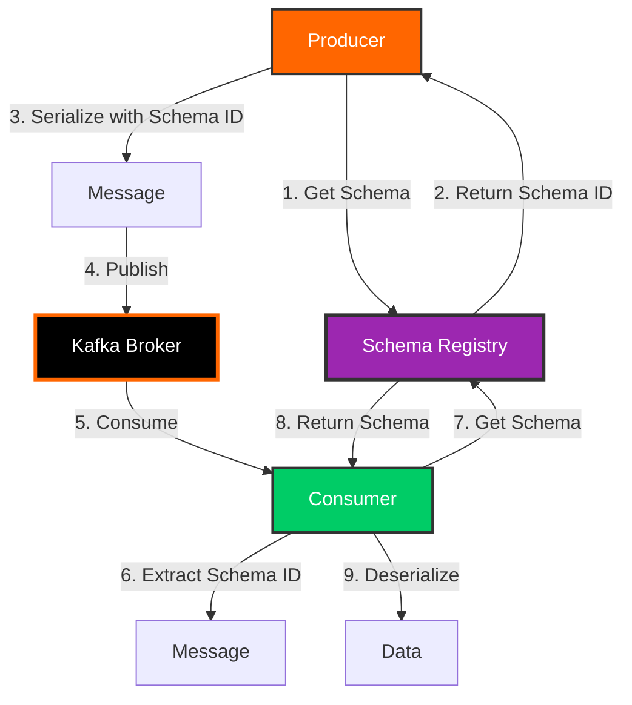

# Day 5: Schema Registry and Avro

> **Primary Audience:** Data Engineers
> **Learning Track:** Platform-agnostic schema management with Avro. CLI and pure Java API shown first, Spring Boot integration is optional.

## Learning Objectives

By the end of Day 5, you will:

- [ ] Understand Schema Registry architecture and benefits
- [ ] Work with Avro schemas and serialization
- [ ] Implement schema evolution strategies
- [ ] Configure compatibility modes
- [ ] Integrate producers and consumers with Avro
- [ ] Handle schema versioning
- [ ] Implement best practices for schema management

## What is Schema Registry?

Schema Registry is a centralized service that stores and manages schemas for Kafka messages.



### Benefits

1. **Schema Validation** - Ensures data quality
2. **Compatibility Checking** - Prevents breaking changes
3. **Documentation** - Self-documenting data contracts
4. **Evolution** - Safe schema changes over time
5. **Efficiency** - Binary serialization saves space
6. **Type Safety** - Strong typing for data

## Apache Avro

Avro is a binary serialization format with schema support.

### Avro Schema Example

```json
{
  "type": "record",
  "name": "User",
  "namespace": "com.kafkatraining.model",
  "fields": [
    {
      "name": "id",
      "type": "string"
    },
    {
      "name": "username",
      "type": "string"
    },
    {
      "name": "email",
      "type": "string"
    },
    {
      "name": "createdAt",
      "type": "long",
      "logicalType": "timestamp-millis"
    },
    {
      "name": "isActive",
      "type": "boolean",
      "default": true
    },
    {
      "name": "preferences",
      "type": {
        "type": "map",
        "values": "string"
      },
      "default": {}
    }
  ]
}
```

### Avro Data Types

| Type | Description | Example |
|------|-------------|---------|
| **null** | No value | null |
| **boolean** | True/false | true, false |
| **int** | 32-bit integer | 42 |
| **long** | 64-bit integer | 9223372036854775807 |
| **float** | Single precision | 3.14f |
| **double** | Double precision | 3.14159265359 |
| **bytes** | Byte sequence | [0x01, 0x02] |
| **string** | Unicode string | "Hello" |
| **array** | Ordered collection | ["a", "b", "c"] |
| **map** | Key-value pairs | {"key": "value"} |
| **record** | Complex type | See example above |
| **enum** | Enumeration | "RED", "GREEN", "BLUE" |
| **union** | One of several types | ["null", "string"] |
| **fixed** | Fixed-size bytes | 16-byte UUID |

### Complex Schema Example

```json
{
  "type": "record",
  "name": "Order",
  "namespace": "com.kafkatraining.eventmart.model",
  "fields": [
    {
      "name": "orderId",
      "type": "string"
    },
    {
      "name": "userId",
      "type": "string"
    },
    {
      "name": "status",
      "type": {
        "type": "enum",
        "name": "OrderStatus",
        "symbols": ["PENDING", "CONFIRMED", "SHIPPED", "DELIVERED", "CANCELLED"]
      }
    },
    {
      "name": "items",
      "type": {
        "type": "array",
        "items": {
          "type": "record",
          "name": "OrderItem",
          "fields": [
            {"name": "productId", "type": "string"},
            {"name": "quantity", "type": "int"},
            {"name": "price", "type": "double"}
          ]
        }
      }
    },
    {
      "name": "shippingAddress",
      "type": ["null", {
        "type": "record",
        "name": "Address",
        "fields": [
          {"name": "street", "type": "string"},
          {"name": "city", "type": "string"},
          {"name": "state", "type": "string"},
          {"name": "zipCode", "type": "string"}
        ]
      }],
      "default": null
    },
    {
      "name": "total",
      "type": "double"
    },
    {
      "name": "createdAt",
      "type": "long",
      "logicalType": "timestamp-millis"
    }
  ]
}
```

## CLI Approach (Data Engineer Track)

### Schema Registry CLI Commands

```bash
# List all schemas
curl http://localhost:8081/subjects

# Register a new schema
curl -X POST http://localhost:8081/subjects/users-value/versions \
  -H "Content-Type: application/vnd.schemaregistry.v1+json" \
  -d '{"schema": "{\"type\":\"record\",\"name\":\"User\",\"namespace\":\"com.example\",\"fields\":[{\"name\":\"id\",\"type\":\"string\"},{\"name\":\"name\",\"type\":\"string\"}]}"}'

# Get schema by ID
curl http://localhost:8081/schemas/ids/1

# Get latest version of a schema
curl http://localhost:8081/subjects/users-value/versions/latest

# Check compatibility
curl -X POST http://localhost:8081/compatibility/subjects/users-value/versions/latest \
  -H "Content-Type: application/vnd.schemaregistry.v1+json" \
  -d '{"schema": "..."}'

# Set compatibility mode
curl -X PUT http://localhost:8081/config/users-value \
  -H "Content-Type: application/json" \
  -d '{"compatibility": "BACKWARD"}'
```

### Producing with Avro CLI

```bash
# Produce Avro messages using kafka-avro-console-producer
kafka-avro-console-producer \
  --broker-list localhost:9092 \
  --topic users-avro \
  --property value.schema='{"type":"record","name":"User","fields":[{"name":"id","type":"string"},{"name":"name","type":"string"}]}' \
  --property schema.registry.url=http://localhost:8081

# Then enter JSON data (converted to Avro automatically):
{"id": "user1", "name": "Alice"}
{"id": "user2", "name": "Bob"}
```

### Consuming with Avro CLI

```bash
# Consume Avro messages
kafka-avro-console-consumer \
  --bootstrap-server localhost:9092 \
  --topic users-avro \
  --from-beginning \
  --property schema.registry.url=http://localhost:8081

# Output shows deserialized data:
# {"id":"user1","name":"Alice"}
# {"id":"user2","name":"Bob"}
```

## Pure Java Implementation (Data Engineer Track)

> **See Working Example**: `src/main/java/com/training/kafka/Day06Schemas/AvroProducer.java`

This project includes a complete, production-ready Avro producer implementation. Below are the key concepts from the actual code.

### Pure Java Avro Producer Configuration

From `AvroProducer.java:29-50`:

```java
public AvroProducer(String bootstrapServers, String schemaRegistryUrl, String topicName) {
    this.topicName = topicName;

    Properties props = new Properties();
    props.put(ProducerConfig.BOOTSTRAP_SERVERS_CONFIG, bootstrapServers);
    props.put(ProducerConfig.CLIENT_ID_CONFIG, "avro-producer");
    props.put(ProducerConfig.KEY_SERIALIZER_CLASS_CONFIG, StringSerializer.class.getName());
    props.put(ProducerConfig.VALUE_SERIALIZER_CLASS_CONFIG, KafkaAvroSerializer.class.getName());

    // Schema Registry configuration
    props.put("schema.registry.url", schemaRegistryUrl);
    props.put("auto.register.schemas", "true");
    props.put("use.latest.version", "true");

    // Producer settings for reliability
    props.put(ProducerConfig.ACKS_CONFIG, "all");
    props.put(ProducerConfig.RETRIES_CONFIG, 3);
    props.put(ProducerConfig.ENABLE_IDEMPOTENCE_CONFIG, true);

    this.producer = new KafkaProducer<>(props);
}
```

**Key Configuration Points:**
- `KafkaAvroSerializer` handles Avro serialization
- `schema.registry.url` points to Schema Registry
- `auto.register.schemas=true` automatically registers new schemas
- Idempotence enabled for exactly-once semantics

### Sending Avro Messages

From `AvroProducer.java:55-92`:

```java
public void sendUserEvent(String userId, ActionType action, Map<String, String> properties) {
    // Create device info (nested Avro record)
    DeviceInfo deviceInfo = DeviceInfo.newBuilder()
        .setDeviceType("web")
        .setUserAgent("Mozilla/5.0 (training)")
        .setIpAddress("192.168.1.100")
        .setLocation("Training Center")
        .build();

    // Create user event (using Avro-generated class)
    UserEvent userEvent = UserEvent.newBuilder()
        .setUserId(userId)
        .setAction(action)
        .setTimestamp(Instant.now().toEpochMilli())
        .setSessionId("session_" + System.currentTimeMillis())
        .setProperties(properties != null ? new HashMap<>(properties) : new HashMap<>())
        .setDeviceInfo(deviceInfo)
        .setVersion(1)
        .build();

    ProducerRecord<String, UserEvent> record =
        new ProducerRecord<>(topicName, userId, userEvent);

    // Send asynchronously with callback
    producer.send(record, (metadata, exception) -> {
        if (exception == null) {
            logger.info("Sent Avro message: topic={}, partition={}, offset={}, key={}",
                metadata.topic(), metadata.partition(), metadata.offset(), userId);
        } else {
            logger.error("Failed to send Avro message for user {}: {}", userId, exception.getMessage());
        }
    });
}
```

**Run the Example:**

```bash
# From project root
mvn exec:java -Dexec.mainClass="com.training.kafka.Day06Schemas.AvroProducer"
```

## Python Avro Implementation (Data Engineer Track)

For data engineers using Python, here's how to produce and consume Avro messages:

### Python Avro Producer

**Complete Example**: `examples/python/day05_avro_producer.py`

```bash
# Ensure Schema Registry is running
curl http://localhost:8081

# Run the Avro producer
python examples/python/day05_avro_producer.py
```

**Key code from day05_avro_producer.py:**

```python
from confluent_kafka import Producer
from confluent_kafka.schema_registry import SchemaRegistryClient
from confluent_kafka.schema_registry.avro import AvroSerializer
from confluent_kafka.serialization import StringSerializer, SerializationContext, MessageField

# Avro schema definition
USER_EVENT_SCHEMA = """
{
  "type": "record",
  "name": "UserEvent",
  "namespace": "com.training.kafka.avro",
  "fields": [
    {"name": "user_id", "type": "string"},
    {"name": "event_type", "type": "string"},
    {"name": "timestamp", "type": "long"},
    {"name": "properties", "type": {"type": "map", "values": "string"}}
  ]
}
"""

# Schema Registry client
schema_registry_client = SchemaRegistryClient({'url': 'http://localhost:8081'})

# Avro serializer (automatically registers schema)
avro_serializer = AvroSerializer(
    schema_registry_client,
    USER_EVENT_SCHEMA,
    user_event_to_dict  # Convert object to dict for serialization
)

# Producer configuration
producer_config = {
    'bootstrap.servers': 'localhost:9092',
    'acks': 'all',
    'retries': 3,
    'enable.idempotence': True
}

producer = Producer(producer_config)

# Send Avro message
user_event = {
    'user_id': 'user-123',
    'event_type': 'LOGIN',
    'timestamp': int(time.time() * 1000),
    'properties': {'device': 'mobile', 'os': 'iOS'}
}

producer.produce(
    topic='user-events-avro',
    key=string_serializer('user-123'),
    value=avro_serializer(user_event, SerializationContext('user-events-avro', MessageField.VALUE)),
    on_delivery=delivery_callback
)

producer.flush()
```

**Install Dependencies:**

```bash
pip install confluent-kafka[avro]
# Or install all training dependencies
pip install -r examples/python/requirements.txt
```

### Python Avro Consumer

**Complete Example**: `examples/python/day05_avro_consumer.py`

```bash
# Run the Avro consumer (in a separate terminal)
python examples/python/day05_avro_consumer.py
```

**Key code from day05_avro_consumer.py:**

```python
from confluent_kafka import Consumer
from confluent_kafka.schema_registry import SchemaRegistryClient
from confluent_kafka.schema_registry.avro import AvroDeserializer

# Schema Registry client
schema_registry_client = SchemaRegistryClient({'url': 'http://localhost:8081'})

# Avro deserializer (automatically fetches schema from registry)
avro_deserializer = AvroDeserializer(
    schema_registry_client,
    schema_str=None,  # Auto-fetch from Schema Registry
    from_dict=user_event_from_dict
)

# Consumer configuration
consumer_config = {
    'bootstrap.servers': 'localhost:9092',
    'group.id': 'python-avro-consumer-group',
    'auto.offset.reset': 'earliest',
    'enable.auto.commit': False
}

consumer = Consumer(consumer_config)
consumer.subscribe(['user-events-avro'])

try:
    while True:
        msg = consumer.poll(1.0)

        if msg is None:
            continue

        if msg.error():
            continue

        # Deserialize Avro message (schema automatically fetched!)
        user_event = avro_deserializer(msg.value(), None)

        print(f"✓ Consumed Avro message:")
        print(f"  User ID: {user_event['user_id']}")
        print(f"  Event Type: {user_event['event_type']}")
        print(f"  Properties: {user_event['properties']}")

        consumer.commit()

except KeyboardInterrupt:
    pass
finally:
    consumer.close()
```

**Install Python Dependencies:**

```bash
pip install confluent-kafka[avro]
# Or install all training dependencies
pip install -r examples/python/requirements.txt
```

**Python Avro Benefits:**
- Same Schema Registry as Java applications
- Automatic schema evolution handling
- Interoperable with Java, Scala, Go Kafka applications
- Perfect for data engineering pipelines (Spark, Airflow, Pandas)

## Spring Boot Integration (Java Developer Track - Optional)

> **Warning: Java Developer Track Only**
> This section covers Spring Boot integration with Avro. Data engineers can use the pure Java approach above with any framework (Spark, Flink, Python, etc.).

### Maven Dependencies (Spring Boot)

```xml
<dependencies>
    <!-- Kafka Avro Serializer -->
    <dependency>
        <groupId>io.confluent</groupId>
        <artifactId>kafka-avro-serializer</artifactId>
        <version>7.5.0</version>
    </dependency>

    <!-- Avro -->
    <dependency>
        <groupId>org.apache.avro</groupId>
        <artifactId>avro</artifactId>
        <version>1.11.3</version>
    </dependency>

    <!-- Schema Registry Client -->
    <dependency>
        <groupId>io.confluent</groupId>
        <artifactId>kafka-schema-registry-client</artifactId>
        <version>7.5.0</version>
    </dependency>
</dependencies>

<!-- Confluent Repository -->
<repositories>
    <repository>
        <id>confluent</id>
        <url>https://packages.confluent.io/maven/</url>
    </repository>
</repositories>
```

### Avro Maven Plugin

```xml
<build>
    <plugins>
        <plugin>
            <groupId>org.apache.avro</groupId>
            <artifactId>avro-maven-plugin</artifactId>
            <version>1.11.3</version>
            <executions>
                <execution>
                    <phase>generate-sources</phase>
                    <goals>
                        <goal>schema</goal>
                    </goals>
                    <configuration>
                        <sourceDirectory>${project.basedir}/src/main/resources/avro</sourceDirectory>
                        <outputDirectory>${project.basedir}/src/main/java</outputDirectory>
                        <stringType>String</stringType>
                    </configuration>
                </execution>
            </executions>
        </plugin>
    </plugins>
</build>
```

### Spring Boot Configuration

```properties
# Schema Registry URL
spring.kafka.properties.schema.registry.url=http://localhost:8081

# Producer with Avro
spring.kafka.producer.key-serializer=org.apache.kafka.common.serialization.StringSerializer
spring.kafka.producer.value-serializer=io.confluent.kafka.serializers.KafkaAvroSerializer

# Consumer with Avro
spring.kafka.consumer.key-deserializer=org.apache.kafka.common.serialization.StringDeserializer
spring.kafka.consumer.value-deserializer=io.confluent.kafka.serializers.KafkaAvroDeserializer
spring.kafka.consumer.properties.specific.avro.reader=true
```

### Spring Boot Avro Producer Configuration

```java
@Configuration
public class AvroProducerConfig {

    @Value("${spring.kafka.bootstrap-servers}")
    private String bootstrapServers;

    @Value("${spring.kafka.properties.schema.registry.url}")
    private String schemaRegistryUrl;

    @Bean
    public ProducerFactory<String, GenericRecord> avroProducerFactory() {
        Map<String, Object> config = new HashMap<>();

        config.put(ProducerConfig.BOOTSTRAP_SERVERS_CONFIG, bootstrapServers);
        config.put(ProducerConfig.KEY_SERIALIZER_CLASS_CONFIG,
            StringSerializer.class);
        config.put(ProducerConfig.VALUE_SERIALIZER_CLASS_CONFIG,
            KafkaAvroSerializer.class);
        config.put("schema.registry.url", schemaRegistryUrl);

        return new DefaultKafkaProducerFactory<>(config);
    }

    @Bean
    public KafkaTemplate<String, GenericRecord> avroKafkaTemplate() {
        return new KafkaTemplate<>(avroProducerFactory());
    }
}
```

### Sending Avro Messages (Spring Boot)

```java
@Service
public class AvroProducerService {

    @Autowired
    private KafkaTemplate<String, GenericRecord> avroKafkaTemplate;

    public void sendUser(String userId, String username, String email) {
        // Load schema
        Schema schema = loadSchema("user.avsc");

        // Create Avro record
        GenericRecord user = new GenericData.Record(schema);
        user.put("id", userId);
        user.put("username", username);
        user.put("email", email);
        user.put("createdAt", System.currentTimeMillis());
        user.put("isActive", true);
        user.put("preferences", Map.of("theme", "dark"));

        // Send to Kafka
        avroKafkaTemplate.send("users-avro", userId, user)
            .thenAccept(result -> {
                log.info("Avro message sent: offset={}",
                    result.getRecordMetadata().offset());
            })
            .exceptionally(ex -> {
                log.error("Failed to send Avro message", ex);
                return null;
            });
    }

    private Schema loadSchema(String filename) {
        try {
            InputStream inputStream = getClass()
                .getClassLoader()
                .getResourceAsStream("avro/" + filename);
            return new Schema.Parser().parse(inputStream);
        } catch (IOException e) {
            throw new RuntimeException("Failed to load schema", e);
        }
    }
}
```

### Using Generated Classes (Spring Boot)

```java
@Service
public class TypedAvroProducer {

    @Autowired
    private KafkaTemplate<String, User> userKafkaTemplate;

    public void sendTypedUser(String userId, String username, String email) {
        // Use generated Avro class
        User user = User.newBuilder()
            .setId(userId)
            .setUsername(username)
            .setEmail(email)
            .setCreatedAt(System.currentTimeMillis())
            .setIsActive(true)
            .setPreferences(Map.of("theme", "dark"))
            .build();

        userKafkaTemplate.send("users-avro", userId, user)
            .thenAccept(result -> {
                log.info("Typed Avro user sent: {}", userId);
            });
    }
}
```

### Spring Boot Avro Consumer Configuration

```java
@Configuration
public class AvroConsumerConfig {

    @Value("${spring.kafka.bootstrap-servers}")
    private String bootstrapServers;

    @Value("${spring.kafka.properties.schema.registry.url}")
    private String schemaRegistryUrl;

    @Bean
    public ConsumerFactory<String, GenericRecord> avroConsumerFactory() {
        Map<String, Object> config = new HashMap<>();

        config.put(ConsumerConfig.BOOTSTRAP_SERVERS_CONFIG, bootstrapServers);
        config.put(ConsumerConfig.GROUP_ID_CONFIG, "avro-consumer-group");
        config.put(ConsumerConfig.KEY_DESERIALIZER_CLASS_CONFIG,
            StringDeserializer.class);
        config.put(ConsumerConfig.VALUE_DESERIALIZER_CLASS_CONFIG,
            KafkaAvroDeserializer.class);
        config.put("schema.registry.url", schemaRegistryUrl);
        config.put("specific.avro.reader", true);

        return new DefaultKafkaConsumerFactory<>(config);
    }
}
```

### Consuming Avro Messages (Spring Boot)

```java
@Service
public class AvroConsumerService {

    @KafkaListener(
        topics = "users-avro",
        groupId = "avro-consumer-group",
        containerFactory = "avroKafkaListenerContainerFactory"
    )
    public void consumeUser(GenericRecord record) {
        String id = record.get("id").toString();
        String username = record.get("username").toString();
        String email = record.get("email").toString();
        Long createdAt = (Long) record.get("createdAt");

        log.info("Consumed Avro user: id={}, username={}, email={}",
            id, username, email);

        processUser(id, username, email);
    }

    @KafkaListener(
        topics = "users-avro",
        groupId = "typed-avro-consumer-group"
    )
    public void consumeTypedUser(User user) {
        log.info("Consumed typed Avro user: id={}, username={}",
            user.getId(), user.getUsername());

        // Work with strongly-typed object
        if (user.getIsActive()) {
            processActiveUser(user);
        }
    }
}
```

### EventMart with Avro (Spring Boot)

```java
@Service
public class EventMartAvroService {

    @Autowired
    private KafkaTemplate<String, Order> orderTemplate;

    public void publishOrder(OrderRequest request) {
        // Create Avro Order
        Order order = Order.newBuilder()
            .setOrderId(UUID.randomUUID().toString())
            .setUserId(request.getUserId())
            .setStatus(OrderStatus.PENDING)
            .setItems(convertItems(request.getItems()))
            .setTotal(calculateTotal(request.getItems()))
            .setCreatedAt(System.currentTimeMillis())
            .build();

        // Publish to Kafka
        orderTemplate.send("eventmart-orders-avro", order.getOrderId(), order);
    }

    @KafkaListener(
        topics = "eventmart-orders-avro",
        groupId = "order-processor"
    )
    public void processOrder(Order order) {
        log.info("Processing order: {}", order.getOrderId());

        // Type-safe processing
        if (order.getStatus() == OrderStatus.PENDING) {
            validateOrder(order);
            confirmOrder(order);
        }
    }
}
```

### Spring Boot REST API Endpoints

#### Run Day 5 Demo

```bash
curl -X POST http://localhost:8080/api/training/day05/demo
```

#### List Schemas

```bash
curl http://localhost:8080/api/training/day05/schemas
```

#### Register Schema

```bash
curl -X POST http://localhost:8080/api/training/day05/register-schema \
  -H "Content-Type: application/json" \
  -d '{
    "subject": "users-avro-value",
    "schema": "{\"type\":\"record\",\"name\":\"User\",\"fields\":[{\"name\":\"id\",\"type\":\"string\"}]}"
  }'
```

#### Produce Avro Message

```bash
curl -X POST http://localhost:8080/api/training/day05/produce-avro \
  -H "Content-Type: application/json" \
  -d '{
    "userId": "user123",
    "username": "john_doe",
    "email": "john@example.com"
  }'
```

#### Consume Avro Messages

```bash
curl -X POST http://localhost:8080/api/training/day05/consume-avro \
  -H "Content-Type: application/json" \
  -d '{
    "durationSeconds": 10
  }'
```

## Schema Evolution (Platform-Agnostic)

Schema evolution allows you to modify schemas while maintaining compatibility.

### Compatibility Modes

| Mode | Description | Producer | Consumer |
|------|-------------|----------|----------|
| **BACKWARD** | New schema can read old data | Update consumers first | Default |
| **FORWARD** | Old schema can read new data | Update producers first | |
| **FULL** | Both backward and forward | Any order | Most restrictive |
| **NONE** | No compatibility checking | No guarantees | Not recommended |

### Configure Compatibility

```bash
# Set compatibility mode for subject
curl -X PUT http://localhost:8081/config/users-avro-value \
  -H "Content-Type: application/json" \
  -d '{"compatibility": "BACKWARD"}'

# Get compatibility mode
curl http://localhost:8081/config/users-avro-value
```

### Backward Compatible Changes

Safe changes that allow new schema to read old data:

```json
{
  "type": "record",
  "name": "User",
  "namespace": "com.kafkatraining.model",
  "fields": [
    {"name": "id", "type": "string"},
    {"name": "username", "type": "string"},
    {"name": "email", "type": "string"},
    {"name": "createdAt", "type": "long"},
    {"name": "isActive", "type": "boolean", "default": true},

    // SAFE: Add field with default
    {"name": "phoneNumber", "type": ["null", "string"], "default": null},

    // SAFE: Delete field
    // "preferences" field removed
  ]
}
```

**Allowed Changes:**
- Add field with default value
- Delete field
- Add union type with null

### Forward Compatible Changes

Safe changes that allow old schema to read new data:

```json
{
  "type": "record",
  "name": "User",
  "namespace": "com.kafkatraining.model",
  "fields": [
    {"name": "id", "type": "string"},
    {"name": "username", "type": "string"},
    {"name": "email", "type": "string"},

    // SAFE: Delete field (old consumers ignore)
    // "createdAt" field removed
  ]
}
```

**Allowed Changes:**
- Delete field
- Add optional field (union with null)

### Full Compatible Changes

Safe changes in both directions:

```json
{
  "type": "record",
  "name": "User",
  "namespace": "com.kafkatraining.model",
  "fields": [
    {"name": "id", "type": "string"},
    {"name": "username", "type": "string"},
    {"name": "email", "type": "string"},

    // SAFE: Add optional field with default
    {"name": "lastLoginAt", "type": ["null", "long"], "default": null}
  ]
}
```

**Allowed Changes:**
- Add optional field with default value

!!! warning "Breaking Changes"
    These changes break compatibility:

    - Rename field
    - Change field type
    - Add required field (no default)
    - Delete required field
    - Change default value

## Hands-On Exercises

### Exercise 1: Schema Evolution

```bash
# 1. Create initial schema
curl -X POST http://localhost:8081/subjects/exercise-user-value/versions \
  -H "Content-Type: application/vnd.schemaregistry.v1+json" \
  -d @user-v1.json

# 2. Produce messages with v1 schema
curl -X POST http://localhost:8080/api/training/day05/produce-avro \
  -d '{"userId":"1","username":"alice","email":"alice@example.com"}'

# 3. Evolve schema (add optional field)
curl -X POST http://localhost:8081/subjects/exercise-user-value/versions \
  -H "Content-Type: application/vnd.schemaregistry.v1+json" \
  -d @user-v2.json

# 4. Produce with v2 schema
curl -X POST http://localhost:8080/api/training/day05/produce-avro \
  -d '{"userId":"2","username":"bob","email":"bob@example.com","phoneNumber":"555-1234"}'

# 5. Consumer reads both v1 and v2 messages successfully
```

### Exercise 2: Test Compatibility

```bash
# Set BACKWARD compatibility
curl -X PUT http://localhost:8081/config/test-subject-value \
  -H "Content-Type: application/json" \
  -d '{"compatibility":"BACKWARD"}'

# Try incompatible change (should fail)
curl -X POST http://localhost:8081/subjects/test-subject-value/versions \
  -H "Content-Type: application/vnd.schemaregistry.v1+json" \
  -d '{
    "schema": "{\"type\":\"record\",\"name\":\"User\",\"fields\":[{\"name\":\"userId\",\"type\":\"string\"}]}"
  }'
# Error: Field "id" removed without default
```

### Exercise 3: Performance Comparison

```bash
# Compare JSON vs Avro message sizes
# JSON: ~150 bytes
# Avro: ~50 bytes (3x smaller!)

# Produce 1000 JSON messages
time curl -X POST http://localhost:8080/api/training/day05/produce-json-batch

# Produce 1000 Avro messages
time curl -X POST http://localhost:8080/api/training/day05/produce-avro-batch

# Compare throughput and storage
```

## Learning Track Guidance

### For Data Engineers (Recommended Path)
1. Master Schema Registry CLI commands for managing schemas
2. Use `kafka-avro-console-producer/consumer` for testing
3. Implement pure Java producers/consumers with Avro serializers
4. These skills transfer to any language: Python, Scala, Go, Rust
5. Works with Spark, Flink, Kafka Streams (pure API)

**When to use:** Any Kafka project, any programming language, any data processing framework

### For Java Developers (Alternative Path)
1. Use Spring Boot configuration and annotations
2. KafkaTemplate and @KafkaListener abstractions
3. Spring-specific features (actuator, auto-configuration)
4. Suitable for Java microservices

**When to use:** Building Java/Spring Boot microservices specifically

### Key Difference
- **Data Engineer approach**: Platform-agnostic, transferable to Python/Scala/Spark/Flink
- **Java Developer approach**: Spring Boot specific, Java ecosystem only

## Key Takeaways

!!! success "What You Learned"
    1. **Schema Registry** provides centralized schema management
    2. **Avro** offers efficient binary serialization with schema support
    3. **Schema evolution** enables safe schema changes over time
    4. **Compatibility modes** enforce evolution rules
    5. **Generated classes** provide type safety and IDE support
    6. **Binary serialization** reduces message size significantly
    7. **Schema validation** ensures data quality

## Best Practices

!!! tip "Production Guidelines"
    - Use **BACKWARD** compatibility for most use cases
    - Always add **default values** to new fields
    - Never rename or change field types
    - Use **specific.avro.reader=true** for typed consumers
    - Version your schemas explicitly
    - Document breaking changes clearly
    - Test schema evolution in staging
    - Monitor Schema Registry health

## Practice Exercises

Ready to practice what you learned? Complete the **[Day 05 Exercises](../exercises/day05-exercises.md)** to apply today's concepts.

These hands-on exercises will help you master the material before moving forward.

## Next Steps

Continue to [Day 6: Streams Processing](day06-streams.md) to learn about real-time stream processing with Kafka Streams.

**Related Resources:**
- [API Reference](../api/training-endpoints.md)
- [Architecture](../architecture/data-flow.md)
- [EventMart Project](../architecture/system-design.md)
