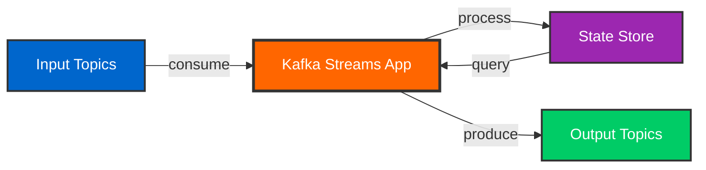
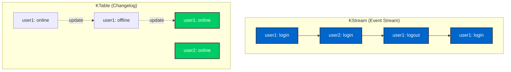
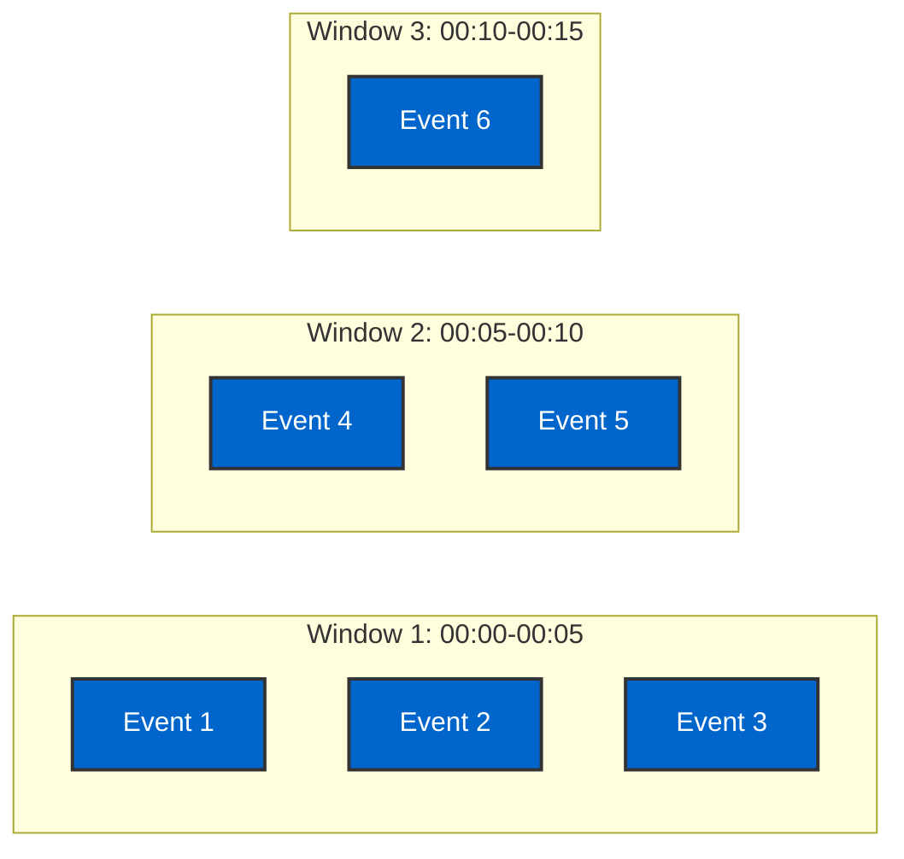

# Day 6: Kafka Streams Processing

> **Primary Audience:** Data Engineers
> **Learning Track:** Platform-agnostic stream processing with pure Kafka Streams API. Spring Boot integration is optional.

## Learning Objectives

By the end of Day 6, you will:

- [ ] Understand Kafka Streams architecture and topology
- [ ] Differentiate between KStream and KTable
- [ ] Implement stateless transformations (filter, map, flatMap)
- [ ] Implement stateful operations (aggregations, joins, windowing)
- [ ] Build stream processing topologies
- [ ] Use interactive queries for state stores
- [ ] Handle time semantics and windowing

## What is Kafka Streams?

Kafka Streams is a client library for building real-time stream processing applications.



### Key Features

- **Stream Processing** - Process records one at a time
- **Stateful Processing** - Maintain state across records
- **Exactly-Once Semantics** - No duplicates or data loss
- **Fault Tolerance** - Automatic failover and recovery
- **Scalability** - Horizontal scaling by adding instances
- **No External Dependencies** - Pure Kafka-based

## Kafka Streams Concepts

### Stream vs Table



**KStream:**
- Represents a stream of records
- Each record is an independent event
- Append-only sequence
- All records are retained

**KTable:**
- Represents a changelog table
- Latest value per key
- Updates previous values
- Only current state matters

## Pure Kafka Streams API (Data Engineer Track)

### Maven Dependencies (Pure Java)

```xml
<dependencies>
    <!-- Kafka Streams (Pure API) -->
    <dependency>
        <groupId>org.apache.kafka</groupId>
        <artifactId>kafka-streams</artifactId>
        <version>3.8.0</version>
    </dependency>

    <!-- Kafka Clients -->
    <dependency>
        <groupId>org.apache.kafka</groupId>
        <artifactId>kafka-clients</artifactId>
        <version>3.6.0</version>
    </dependency>
</dependencies>
```

## Production Example: StreamProcessor.java

> **See Working Example**: `src/main/java/com/training/kafka/Day05Streams/StreamProcessor.java`

This project includes a complete production-grade stream processing application demonstrating:
- Filtering and transformations
- Windowed aggregations
- Stream-stream joins
- Fraud detection patterns
- State store management

### Configuration from Actual Code

From `StreamProcessor.java:39-57`:

```java
public StreamProcessor(String bootstrapServers) {
    Properties props = new Properties();
    props.put(StreamsConfig.APPLICATION_ID_CONFIG, "stream-processor-app");
    props.put(StreamsConfig.BOOTSTRAP_SERVERS_CONFIG, bootstrapServers);
    props.put(StreamsConfig.DEFAULT_KEY_SERDE_CLASS_CONFIG, Serdes.String().getClass());
    props.put(StreamsConfig.DEFAULT_VALUE_SERDE_CLASS_CONFIG, Serdes.String().getClass());

    // Performance and reliability settings
    props.put(StreamsConfig.NUM_STREAM_THREADS_CONFIG, 2);
    props.put(StreamsConfig.PROCESSING_GUARANTEE_CONFIG, StreamsConfig.EXACTLY_ONCE_V2);
    props.put(StreamsConfig.COMMIT_INTERVAL_MS_CONFIG, 10000);
    props.put(StreamsConfig.STATESTORE_CACHE_MAX_BYTES_CONFIG, 10 * 1024 * 1024L);

    // Build the topology
    StreamsBuilder builder = new StreamsBuilder();
    buildTopology(builder);

    this.streams = new KafkaStreams(builder.build(), props);
}
```

**Key Configuration:**
- `EXACTLY_ONCE_V2` for reliable processing
- 2 stream threads for parallelism
- 10MB state store cache
- 10-second commit interval

### Stream Processing with Filtering and Branching

From `StreamProcessor.java:83-105`:

```java
private void processUserEvents(KStream<String, String> userEvents) {
    userEvents
        // Filter valid JSON events
        .filter((key, value) -> isValidJson(value))

        // Transform and enrich events
        .mapValues(this::enrichUserEvent)

        // Filter high-value events
        .filter((key, value) -> isHighValueEvent(value))

        // Log processed events
        .peek((key, value) ->
            logger.info("Processed high-value user event: key={}, value={}", key, value))

        // Split stream by event type
        .split(Named.as("user-events-"))
        .branch((key, value) -> getEventType(value).equals("login"),
               Branched.as("login"))
        .branch((key, value) -> getEventType(value).equals("purchase"),
               Branched.as("purchase"))
        .defaultBranch(Branched.as("other"));
}
```

### Windowed Aggregations

From `StreamProcessor.java:110-134`:

```java
private void processOrderEvents(KStream<String, String> orderEvents) {
    orderEvents
        .filter((key, value) -> isValidJson(value))
        .mapValues(this::enrichOrderEvent)

        // Group by user and create windowed aggregations
        .groupBy((key, value) -> getUserIdFromOrder(value))
        .windowedBy(TimeWindows.ofSizeWithNoGrace(Duration.ofMinutes(15)))
        .aggregate(
            () -> 0.0, // Initial value
            (aggKey, newValue, aggValue) -> aggValue + getOrderAmount(newValue), // Aggregator
            Materialized.with(Serdes.String(), Serdes.Double())
        )

        // Convert back to stream
        .toStream()

        // Filter high-value windows
        .filter((windowedKey, totalAmount) -> totalAmount > 1000.0)

        // Alert on high spending
        .peek((windowedKey, totalAmount) ->
            logger.warn("High spending detected for user {} in window {}: ${}",
                windowedKey.key(), windowedKey.window(), totalAmount));
}
```

### Stream-Stream Joins

From `StreamProcessor.java:139-158`:

```java
private void detectFraudulentActivity(KStream<String, String> userEvents,
                                    KStream<String, String> orderEvents) {

    // Create windowed joins to detect suspicious patterns
    userEvents
        .filter((key, value) -> getEventType(value).equals("login"))
        .join(
            orderEvents.filter((key, value) -> isValidJson(value)),
            this::joinUserEventWithOrder,
            JoinWindows.ofTimeDifferenceWithNoGrace(Duration.ofMinutes(5)),
            StreamJoined.with(Serdes.String(), Serdes.String(), Serdes.String())
        )

        // Detect suspicious patterns
        .filter(this::isSuspiciousActivity)

        // Send alerts
        .mapValues(this::createFraudAlert)
        .to(FRAUD_ALERTS_TOPIC);
}
```

**Run the Example:**

```bash
# From project root
mvn exec:java -Dexec.mainClass="com.training.kafka.Day05Streams.StreamProcessor"
```

## Python Kafka Streams Alternative

While Kafka Streams is Java-specific, Python data engineers can use **Faust** or **kafka-python** for stream processing:

### Option 1: Faust (Kafka Streams for Python)

**Complete Example**: `examples/python/day06_streams_faust.py`

```bash
# Install Faust
pip install faust-streaming

# Run the Faust worker
faust -A day06_streams_faust worker -l info

# In another terminal, send test data
faust -A day06_streams_faust produce-test-data

# View stats in browser
open http://localhost:6066/stats/
```

**Key code from day06_streams_faust.py:**

```python
import faust
from datetime import timedelta

# Create Faust app (similar to Kafka Streams StreamsBuilder)
app = faust.App(
    'python-faust-stream-processor',
    broker='kafka://localhost:9092',
    value_serializer='json',
    store='rocksdb://',  # State store
)

# Define data models (like Avro schemas)
class UserEvent(faust.Record, serializer='json'):
    user_id: str
    event_type: str
    timestamp: int
    properties: dict

# Define topics (like KStream)
input_topic = app.topic('user-events', value_type=UserEvent)
filtered_topic = app.topic('high-value-events', value_type=UserEvent)

# Stream Processing Agent 1: Filter (like stream.filter())
@app.agent(input_topic)
async def filter_high_value_events(stream):
    high_value_types = {'LOGIN', 'PURCHASE', 'CHECKOUT'}

    async for event in stream:
        if event.event_type in high_value_types:
            print(f"[FILTER] High-value event: {event.event_type}")
            await filtered_topic.send(value=event)

# Stream Processing Agent 2: Stateful aggregation (like groupByKey().count())
user_event_counts = app.Table('user_event_counts', default=int)

@app.agent(input_topic)
async def count_events_per_user(stream):
    async for event in stream.group_by(UserEvent.user_id):
        user_event_counts[event.user_id] += 1
        print(f"[COUNT] User {event.user_id}: {user_event_counts[event.user_id]} events")

# Stream Processing Agent 3: Windowed aggregation (like windowedBy())
@app.agent(input_topic)
async def windowed_event_counts(stream):
    async for window, events in stream.tumbling(timedelta(seconds=60)).items():
        event_list = [event async for event in events]
        count = len(event_list)
        if count > 0:
            print(f"[WINDOW] {window.start} -> {window.end}: {count} events")

# Web view for monitoring (bonus Faust feature)
@app.page('/stats/')
async def stats_view(web, request):
    return web.json({
        'app_id': 'python-faust-stream-processor',
        'user_event_counts': dict(user_event_counts.items()),
        'total_users': len(user_event_counts)
    })
```

**Faust vs Kafka Streams Comparison:**

| Kafka Streams (Java) | Faust (Python) |
|---------------------|----------------|
| `StreamsBuilder` | `faust.App` |
| `KStream` | `app.topic()` + `@app.agent` |
| `KTable` | `app.Table()` |
| `stream.filter()` | `async for` with `if` |
| `groupByKey()` | `stream.group_by()` |
| `count()` | Stateful counter in Table |
| `windowedBy()` | `stream.tumbling()` |

**Install Dependencies:**

```bash
pip install faust-streaming
# Or install all training dependencies
pip install -r examples/python/requirements.txt
```

### Option 2: kafka-python with Manual State

```python
from kafka import KafkaConsumer, KafkaProducer
from collections import defaultdict
import json
from datetime import datetime, timedelta

# Initialize consumer and producer
consumer = KafkaConsumer(
    'user-events',
    bootstrap_servers=['localhost:9092'],
    value_deserializer=lambda m: json.loads(m.decode('utf-8')),
    group_id='python-stream-processor'
)

producer = KafkaProducer(
    bootstrap_servers=['localhost:9092'],
    value_serializer=lambda m: json.dumps(m).encode('utf-8')
)

# State store (in-memory)
user_revenue = defaultdict(float)
event_counts = defaultdict(int)

# Window state (tumbling 5-minute windows)
window_size = timedelta(minutes=5)
current_window_start = datetime.now()
window_counts = defaultdict(int)

try:
    for message in consumer:
        event = message.value
        user_id = event.get('userId')
        action = event.get('action')

        # Stateless transformation: Filter
        if action in ['LOGIN', 'PURCHASE']:
            print(f"High-value event: {user_id} - {action}")

            # Stateful operation: Count
            event_counts[user_id] += 1

            # Windowed aggregation
            now = datetime.now()
            if now - current_window_start > window_size:
                # Window closed - emit results
                for key, count in window_counts.items():
                    producer.send('windowed-counts', {
                        'user_id': key,
                        'count': count,
                        'window_start': current_window_start.isoformat(),
                        'window_end': now.isoformat()
                    })

                # Reset window
                window_counts.clear()
                current_window_start = now

            window_counts[user_id] += 1

            # Aggregation: Track revenue
            if action == 'PURCHASE':
                amount = event.get('amount', 0.0)
                user_revenue[user_id] += amount

                # Alert on high spending
                if user_revenue[user_id] > 1000.0:
                    fraud_alert = {
                        'alert_type': 'HIGH_SPENDING',
                        'user_id': user_id,
                        'total_revenue': user_revenue[user_id],
                        'timestamp': datetime.now().isoformat()
                    }
                    producer.send('fraud-alerts', fraud_alert)
                    print(f"Fraud alert: {user_id} spent ${user_revenue[user_id]}")

except KeyboardInterrupt:
    print("Stream processor stopped")
finally:
    consumer.close()
    producer.close()
```

**Python Streaming Benefits:**
- **Faust**: Kafka Streams-like API for Python
- **kafka-python**: Full control over processing logic
- **Integration**: Works with Pandas, NumPy, Spark for analytics
- **Flexibility**: Easier for data scientists familiar with Python

**Install Dependencies:**

```bash
# Faust (recommended for stream processing)
pip install faust-streaming

# kafka-python (for manual control)
pip install kafka-python
```

## Simplified Examples for Learning

Below are simplified examples to understand core concepts:

### Pure Kafka Streams Configuration

```java
import org.apache.kafka.streams.*;
import org.apache.kafka.streams.kstream.*;
import org.apache.kafka.common.serialization.Serdes;

import java.util.Properties;

public class PureStreamsExample {

    public static void main(String[] args) {
        // Configuration
        Properties props = new Properties();
        props.put(StreamsConfig.APPLICATION_ID_CONFIG, "kafka-training-streams");
        props.put(StreamsConfig.BOOTSTRAP_SERVERS_CONFIG, "localhost:9092");
        props.put(StreamsConfig.DEFAULT_KEY_SERDE_CLASS_CONFIG, Serdes.String().getClass());
        props.put(StreamsConfig.DEFAULT_VALUE_SERDE_CLASS_CONFIG, Serdes.String().getClass());
        props.put(StreamsConfig.PROCESSING_GUARANTEE_CONFIG, StreamsConfig.EXACTLY_ONCE_V2);
        props.put(StreamsConfig.STATE_DIR_CONFIG, "/tmp/kafka-streams");
        props.put(StreamsConfig.COMMIT_INTERVAL_MS_CONFIG, 1000);
        props.put(StreamsConfig.NUM_STREAM_THREADS_CONFIG, 2);

        // Build topology
        StreamsBuilder builder = new StreamsBuilder();
        buildTopology(builder);

        // Create and start streams
        KafkaStreams streams = new KafkaStreams(builder.build(), props);

        // Add shutdown hook
        Runtime.getRuntime().addShutdownHook(new Thread(streams::close));

        // Start processing
        streams.start();
    }

    private static void buildTopology(StreamsBuilder builder) {
        // Topology code goes here
        KStream<String, String> sourceStream = builder.stream("input-topic");
        sourceStream.to("output-topic");
    }
}
```

### Pure API: Stateless Transformations

#### Filter

```java
private static void buildFilterTopology(StreamsBuilder builder) {
    KStream<String, String> sourceStream = builder.stream("user-events");

    // Filter active users only
    KStream<String, String> activeUsers = sourceStream
        .filter((key, value) -> value.contains("\"isActive\":true"));

    activeUsers.to("active-user-events");
}
```

#### Map

```java
private static void buildMapTopology(StreamsBuilder builder) {
    KStream<String, String> sourceStream = builder.stream("orders");

    // Transform order to summary
    KStream<String, String> orderSummaries = sourceStream
        .mapValues(value -> {
            // Simple JSON parsing (or use Jackson)
            double total = extractTotal(value);
            String orderId = extractOrderId(value);
            return String.format("Order %s: $%.2f", orderId, total);
        });

    orderSummaries.to("order-summaries");
}

private static double extractTotal(String json) {
    // Simple extraction - in production use Jackson
    String[] parts = json.split("\"total\":");
    if (parts.length > 1) {
        String numStr = parts[1].split(",|\\}")[0].trim();
        return Double.parseDouble(numStr);
    }
    return 0.0;
}

private static String extractOrderId(String json) {
    String[] parts = json.split("\"orderId\":\"");
    if (parts.length > 1) {
        return parts[1].split("\"")[0];
    }
    return "unknown";
}
```

#### FlatMap

```java
import java.util.Arrays;
import java.util.List;

private static void buildFlatMapTopology(StreamsBuilder builder) {
    KStream<String, String> ordersStream = builder.stream("orders");

    // Split order into individual items
    KStream<String, String> orderItems = ordersStream
        .flatMapValues(order -> extractItems(order)); // Returns List<String>

    orderItems.to("order-items");
}

private static List<String> extractItems(String orderJson) {
    // Simple JSON parsing - extract items array
    // In production, use Jackson or Gson
    String[] parts = orderJson.split("\"items\":\\[")[1].split("\\]")[0].split(",");
    return Arrays.asList(parts);
}
```

### Pure API: Stateful Operations

#### Aggregations

```java
import org.apache.kafka.streams.state.KeyValueStore;
import org.apache.kafka.common.utils.Bytes;

private static void buildAggregationTopology(StreamsBuilder builder) {
    KStream<String, String> ordersStream = builder.stream("orders");

    // Aggregate total revenue by user
    KTable<String, Double> userRevenue = ordersStream
        .groupByKey()
        .aggregate(
            () -> 0.0,  // Initializer
            (key, value, aggregate) -> {  // Aggregator
                double orderTotal = extractTotal(value);
                return aggregate + orderTotal;
            },
            Materialized.<String, Double, KeyValueStore<Bytes, byte[]>>as("user-revenue-store")
                .withKeySerde(Serdes.String())
                .withValueSerde(Serdes.Double())
        );

    userRevenue.toStream().to("user-revenue",
        Produced.with(Serdes.String(), Serdes.Double()));
}
```

#### Count

```java
private static void buildCountTopology(StreamsBuilder builder) {
    KStream<String, String> eventsStream = builder.stream("user-events");

    // Count events by user
    KTable<String, Long> eventCounts = eventsStream
        .groupByKey()
        .count(Materialized.as("event-counts-store"));

    eventCounts.toStream().to("event-counts",
        Produced.with(Serdes.String(), Serdes.Long()));
}
```

### Pure API: Windowing

#### Tumbling Window

```java
import org.apache.kafka.streams.kstream.TimeWindows;
import org.apache.kafka.streams.kstream.Windowed;
import org.apache.kafka.streams.KeyValue;
import java.time.Duration;

private static void buildTumblingWindowTopology(StreamsBuilder builder) {
    KStream<String, String> eventsStream = builder.stream("page-views");

    // Count page views per 5-minute window
    KTable<Windowed<String>, Long> windowedCounts = eventsStream
        .groupByKey()
        .windowedBy(TimeWindows.ofSizeWithNoGrace(Duration.ofMinutes(5)))
        .count(Materialized.as("page-view-counts"));

    windowedCounts.toStream()
        .map((windowedKey, count) -> {
            String key = String.format("%s@%d-%d",
                windowedKey.key(),
                windowedKey.window().start(),
                windowedKey.window().end());
            return KeyValue.pair(key, count.toString());
        })
        .to("windowed-page-view-counts");
}
```

### Pure API: Joins

#### Stream-Stream Join

```java
import org.apache.kafka.streams.kstream.JoinWindows;
import org.apache.kafka.streams.kstream.StreamJoined;

private static void buildStreamJoinTopology(StreamsBuilder builder) {
    KStream<String, String> ordersStream = builder.stream("orders");
    KStream<String, String> paymentsStream = builder.stream("payments");

    // Join orders with payments (within 5 minute window)
    KStream<String, String> orderPayments = ordersStream.join(
        paymentsStream,
        (order, payment) -> String.format("{\"order\":%s,\"payment\":%s}", order, payment),
        JoinWindows.ofTimeDifferenceWithNoGrace(Duration.ofMinutes(5)),
        StreamJoined.with(Serdes.String(), Serdes.String(), Serdes.String())
    );

    orderPayments.to("order-payments");
}
```

### Pure API: Interactive Queries

```java
import org.apache.kafka.streams.state.*;

public class QueryStateStore {

    public static Double getUserRevenue(KafkaStreams streams, String userId) {
        ReadOnlyKeyValueStore<String, Double> store =
            streams.store(
                StoreQueryParameters.fromNameAndType(
                    "user-revenue-store",
                    QueryableStoreTypes.keyValueStore()
                )
            );

        return store.get(userId);
    }

    public static void printAllUserRevenue(KafkaStreams streams) {
        ReadOnlyKeyValueStore<String, Double> store =
            streams.store(
                StoreQueryParameters.fromNameAndType(
                    "user-revenue-store",
                    QueryableStoreTypes.keyValueStore()
                )
            );

        KeyValueIterator<String, Double> iterator = store.all();
        while (iterator.hasNext()) {
            KeyValue<String, Double> entry = iterator.next();
            System.out.printf("User %s: $%.2f%n", entry.key, entry.value);
        }
        iterator.close();
    }
}
```

### Complete Pure Java Example

```java
import org.apache.kafka.streams.*;
import org.apache.kafka.streams.kstream.*;
import org.apache.kafka.common.serialization.Serdes;
import java.time.Duration;
import java.util.Properties;

public class RealTimeAnalytics {

    public static void main(String[] args) {
        Properties props = new Properties();
        props.put(StreamsConfig.APPLICATION_ID_CONFIG, "real-time-analytics");
        props.put(StreamsConfig.BOOTSTRAP_SERVERS_CONFIG, "localhost:9092");
        props.put(StreamsConfig.DEFAULT_KEY_SERDE_CLASS_CONFIG, Serdes.String().getClass());
        props.put(StreamsConfig.DEFAULT_VALUE_SERDE_CLASS_CONFIG, Serdes.String().getClass());

        StreamsBuilder builder = new StreamsBuilder();

        // Input: page view events
        KStream<String, String> pageViews = builder.stream("page-views");

        // Filter valid page views
        KStream<String, String> validViews = pageViews
            .filter((key, value) -> value.contains("userId") && value.contains("pageUrl"));

        // Count views per page (5-minute tumbling window)
        KTable<Windowed<String>, Long> pageViewCounts = validViews
            .selectKey((key, value) -> extractPageUrl(value))
            .groupByKey()
            .windowedBy(TimeWindows.ofSizeWithNoGrace(Duration.ofMinutes(5)))
            .count(Materialized.as("page-view-counts"));

        // Output results
        pageViewCounts.toStream()
            .map((windowedKey, count) ->
                KeyValue.pair(formatWindowedKey(windowedKey), count.toString()))
            .to("page-analytics");

        // Start streams
        KafkaStreams streams = new KafkaStreams(builder.build(), props);
        Runtime.getRuntime().addShutdownHook(new Thread(streams::close));
        streams.start();
    }

    private static String extractPageUrl(String json) {
        // Simple JSON extraction (or use Jackson)
        String[] parts = json.split("\"pageUrl\":\"");
        if (parts.length > 1) {
            return parts[1].split("\"")[0];
        }
        return "unknown";
    }

    private static String formatWindowedKey(Windowed<String> windowedKey) {
        return String.format("%s@%d-%d",
            windowedKey.key(),
            windowedKey.window().start(),
            windowedKey.window().end());
    }
}
```

## Spring Boot Integration (Java Developer Track - Optional)

> **Warning: Java Developer Track Only**
> This section covers Spring Kafka Streams integration. Data engineers can use the pure Kafka Streams API above with any framework (Spark, Flink) or standalone.

### Spring Boot Dependencies

```xml
<dependency>
    <groupId>org.apache.kafka</groupId>
    <artifactId>kafka-streams</artifactId>
    <version>3.8.0</version>
</dependency>

<dependency>
    <groupId>org.springframework.kafka</groupId>
    <artifactId>spring-kafka</artifactId>
</dependency>
```

### Spring Boot Configuration

```java
@Configuration
@EnableKafkaStreams
public class KafkaStreamsConfig {

    @Value("${spring.kafka.bootstrap-servers}")
    private String bootstrapServers;

    @Bean(name = KafkaStreamsDefaultConfiguration.DEFAULT_STREAMS_CONFIG_BEAN_NAME)
    public KafkaStreamsConfiguration kStreamsConfig() {
        Map<String, Object> props = new HashMap<>();

        props.put(StreamsConfig.APPLICATION_ID_CONFIG, "kafka-training-streams");
        props.put(StreamsConfig.BOOTSTRAP_SERVERS_CONFIG, bootstrapServers);
        props.put(StreamsConfig.DEFAULT_KEY_SERDE_CLASS_CONFIG,
            Serdes.String().getClass());
        props.put(StreamsConfig.DEFAULT_VALUE_SERDE_CLASS_CONFIG,
            Serdes.String().getClass());

        // Processing guarantees
        props.put(StreamsConfig.PROCESSING_GUARANTEE_CONFIG,
            StreamsConfig.EXACTLY_ONCE_V2);

        // State directory
        props.put(StreamsConfig.STATE_DIR_CONFIG, "/tmp/kafka-streams");

        // Commit interval
        props.put(StreamsConfig.COMMIT_INTERVAL_MS_CONFIG, 1000);

        // Number of stream threads
        props.put(StreamsConfig.NUM_STREAM_THREADS_CONFIG, 2);

        return new KafkaStreamsConfiguration(props);
    }
}
```

### Spring Boot: Stateless Transformations

#### Filter

```java
@Component
public class FilterStream {

    @Autowired
    public void buildPipeline(StreamsBuilder streamsBuilder) {
        KStream<String, String> sourceStream =
            streamsBuilder.stream("user-events");

        // Filter active users only
        KStream<String, String> activeUsers = sourceStream
            .filter((key, value) -> {
                JsonNode event = parseJson(value);
                return event.get("isActive").asBoolean();
            });

        activeUsers.to("active-user-events");
    }
}
```

#### Map

```java
@Component
public class MapStream {

    @Autowired
    public void buildPipeline(StreamsBuilder streamsBuilder) {
        KStream<String, String> sourceStream =
            streamsBuilder.stream("orders");

        // Transform order to order summary
        KStream<String, String> orderSummaries = sourceStream
            .mapValues((key, value) -> {
                JsonNode order = parseJson(value);
                return String.format("Order %s: $%.2f",
                    order.get("orderId").asText(),
                    order.get("total").asDouble());
            });

        orderSummaries.to("order-summaries");
    }
}
```

#### FlatMap

```java
@Component
public class FlatMapStream {

    @Autowired
    public void buildPipeline(StreamsBuilder streamsBuilder) {
        KStream<String, String> ordersStream =
            streamsBuilder.stream("orders");

        // Split order into individual items
        KStream<String, String> orderItems = ordersStream
            .flatMapValues((key, order) -> {
                JsonNode orderJson = parseJson(order);
                JsonNode items = orderJson.get("items");

                List<String> itemList = new ArrayList<>();
                for (JsonNode item : items) {
                    itemList.add(item.toString());
                }
                return itemList;
            });

        orderItems.to("order-items");
    }
}
```

#### Branch

```java
@Component
public class BranchStream {

    @Autowired
    public void buildPipeline(StreamsBuilder streamsBuilder) {
        KStream<String, String> ordersStream =
            streamsBuilder.stream("orders");

        // Branch by order total
        Map<String, KStream<String, String>> branches = ordersStream
            .split(Named.as("order-"))
            .branch((key, value) -> {
                double total = parseJson(value).get("total").asDouble();
                return total > 1000;
            }, Branched.as("high-value"))
            .branch((key, value) -> {
                double total = parseJson(value).get("total").asDouble();
                return total > 100;
            }, Branched.as("medium-value"))
            .defaultBranch(Branched.as("low-value"));

        branches.get("order-high-value").to("high-value-orders");
        branches.get("order-medium-value").to("medium-value-orders");
        branches.get("order-low-value").to("low-value-orders");
    }
}
```

### Spring Boot: Stateful Operations

#### Aggregations

```java
@Component
public class AggregationStream {

    @Autowired
    public void buildPipeline(StreamsBuilder streamsBuilder) {
        KStream<String, String> ordersStream =
            streamsBuilder.stream("orders");

        // Aggregate total revenue by user
        KTable<String, Double> userRevenue = ordersStream
            .groupByKey()
            .aggregate(
                () -> 0.0,  // Initializer
                (key, value, aggregate) -> {  // Aggregator
                    double orderTotal = parseJson(value)
                        .get("total")
                        .asDouble();
                    return aggregate + orderTotal;
                },
                Materialized.<String, Double, KeyValueStore<Bytes, byte[]>>as(
                    "user-revenue-store")
                    .withKeySerde(Serdes.String())
                    .withValueSerde(Serdes.Double())
            );

        userRevenue.toStream().to("user-revenue",
            Produced.with(Serdes.String(), Serdes.Double()));
    }
}
```

#### Count

```java
@Component
public class CountStream {

    @Autowired
    public void buildPipeline(StreamsBuilder streamsBuilder) {
        KStream<String, String> eventsStream =
            streamsBuilder.stream("user-events");

        // Count events by user
        KTable<String, Long> eventCounts = eventsStream
            .groupByKey()
            .count(Materialized.as("event-counts-store"));

        eventCounts.toStream().to("event-counts",
            Produced.with(Serdes.String(), Serdes.Long()));
    }
}
```

#### Reduce

```java
@Component
public class ReduceStream {

    @Autowired
    public void buildPipeline(StreamsBuilder streamsBuilder) {
        KStream<String, String> ordersStream =
            streamsBuilder.stream("orders");

        // Keep latest order per user
        KTable<String, String> latestOrders = ordersStream
            .groupByKey()
            .reduce(
                (oldValue, newValue) -> newValue,  // Keep newest
                Materialized.as("latest-orders-store")
            );

        latestOrders.toStream().to("latest-orders");
    }
}
```

### Spring Boot: Joins

#### Stream-Stream Join

```java
@Component
public class StreamJoinStream {

    @Autowired
    public void buildPipeline(StreamsBuilder streamsBuilder) {
        KStream<String, String> ordersStream =
            streamsBuilder.stream("orders");
        KStream<String, String> paymentsStream =
            streamsBuilder.stream("payments");

        // Join orders with payments (within 5 minute window)
        KStream<String, String> orderPayments = ordersStream.join(
            paymentsStream,
            (order, payment) -> {
                // Combine order and payment
                return String.format("{\"order\":%s,\"payment\":%s}",
                    order, payment);
            },
            JoinWindows.ofTimeDifferenceWithNoGrace(Duration.ofMinutes(5)),
            StreamJoined.with(
                Serdes.String(),
                Serdes.String(),
                Serdes.String()
            )
        );

        orderPayments.to("order-payments");
    }
}
```

#### Stream-Table Join

```java
@Component
public class StreamTableJoin {

    @Autowired
    public void buildPipeline(StreamsBuilder streamsBuilder) {
        KStream<String, String> ordersStream =
            streamsBuilder.stream("orders");
        KTable<String, String> usersTable =
            streamsBuilder.table("users");

        // Enrich orders with user data
        KStream<String, String> enrichedOrders = ordersStream
            .selectKey((key, value) ->
                parseJson(value).get("userId").asText())
            .join(
                usersTable,
                (order, user) -> {
                    JsonNode orderJson = parseJson(order);
                    JsonNode userJson = parseJson(user);

                    ObjectNode enriched = objectMapper.createObjectNode();
                    enriched.set("order", orderJson);
                    enriched.set("user", userJson);

                    return enriched.toString();
                },
                Joined.with(
                    Serdes.String(),
                    Serdes.String(),
                    Serdes.String()
                )
            );

        enrichedOrders.to("enriched-orders");
    }
}
```

#### Table-Table Join

```java
@Component
public class TableJoin {

    @Autowired
    public void buildPipeline(StreamsBuilder streamsBuilder) {
        KTable<String, String> usersTable =
            streamsBuilder.table("users");
        KTable<String, String> profilesTable =
            streamsBuilder.table("profiles");

        // Join users with profiles
        KTable<String, String> userProfiles = usersTable.join(
            profilesTable,
            (user, profile) -> {
                return String.format("{\"user\":%s,\"profile\":%s}",
                    user, profile);
            }
        );

        userProfiles.toStream().to("user-profiles");
    }
}
```

### Spring Boot: Windowing

#### Tumbling Window

Fixed-size, non-overlapping windows.

```java
@Component
public class TumblingWindowStream {

    @Autowired
    public void buildPipeline(StreamsBuilder streamsBuilder) {
        KStream<String, String> eventsStream =
            streamsBuilder.stream("page-views");

        // Count page views per 5-minute window
        KTable<Windowed<String>, Long> windowedCounts = eventsStream
            .groupByKey()
            .windowedBy(TimeWindows.ofSizeWithNoGrace(Duration.ofMinutes(5)))
            .count(Materialized.as("page-view-counts"));

        windowedCounts.toStream()
            .map((windowedKey, count) -> {
                String key = String.format("%s@%d-%d",
                    windowedKey.key(),
                    windowedKey.window().start(),
                    windowedKey.window().end());
                return KeyValue.pair(key, count.toString());
            })
            .to("windowed-page-view-counts");
    }
}
```



#### Hopping Window

Fixed-size, overlapping windows.

```java
@Component
public class HoppingWindowStream {

    @Autowired
    public void buildPipeline(StreamsBuilder streamsBuilder) {
        KStream<String, String> ordersStream =
            streamsBuilder.stream("orders");

        // Sum order totals: 10-minute windows, advancing every 5 minutes
        KTable<Windowed<String>, Double> windowedRevenue = ordersStream
            .groupByKey()
            .windowedBy(TimeWindows
                .ofSizeWithNoGrace(Duration.ofMinutes(10))
                .advanceBy(Duration.ofMinutes(5)))
            .aggregate(
                () -> 0.0,
                (key, value, aggregate) ->
                    aggregate + parseJson(value).get("total").asDouble(),
                Materialized.with(Serdes.String(), Serdes.Double())
            );

        windowedRevenue.toStream()
            .map((windowedKey, revenue) -> {
                String key = String.format("revenue@%d",
                    windowedKey.window().start());
                return KeyValue.pair(key, revenue.toString());
            })
            .to("windowed-revenue");
    }
}
```

#### Sliding Window

Windows slide with each record.

```java
@Component
public class SlidingWindowStream {

    @Autowired
    public void buildPipeline(StreamsBuilder streamsBuilder) {
        KStream<String, String> clicksStream =
            streamsBuilder.stream("clicks");

        // Count clicks within 1-minute sliding window
        KTable<Windowed<String>, Long> slidingCounts = clicksStream
            .groupByKey()
            .windowedBy(SlidingWindows.ofTimeDifferenceWithNoGrace(
                Duration.ofMinutes(1)))
            .count();

        slidingCounts.toStream()
            .map((windowedKey, count) -> {
                String key = String.format("%s@%d",
                    windowedKey.key(),
                    windowedKey.window().start());
                return KeyValue.pair(key, count.toString());
            })
            .to("sliding-click-counts");
    }
}
```

#### Session Window

Windows based on inactivity gaps.

```java
@Component
public class SessionWindowStream {

    @Autowired
    public void buildPipeline(StreamsBuilder streamsBuilder) {
        KStream<String, String> eventsStream =
            streamsBuilder.stream("user-activity");

        // Create sessions with 5-minute inactivity gap
        KTable<Windowed<String>, Long> sessions = eventsStream
            .groupByKey()
            .windowedBy(SessionWindows.ofInactivityGapWithNoGrace(
                Duration.ofMinutes(5)))
            .count(Materialized.as("user-sessions"));

        sessions.toStream()
            .map((windowedKey, count) -> {
                String key = String.format("session:%s:%d-%d",
                    windowedKey.key(),
                    windowedKey.window().start(),
                    windowedKey.window().end());
                return KeyValue.pair(key, count.toString());
            })
            .to("user-sessions");
    }
}
```

### Spring Boot: Interactive Queries

Query state stores from your application.

```java
@Service
public class StreamsQueryService {

    @Autowired
    private KafkaStreams kafkaStreams;

    public Double getUserRevenue(String userId) {
        ReadOnlyKeyValueStore<String, Double> store =
            kafkaStreams.store(
                StoreQueryParameters.fromNameAndType(
                    "user-revenue-store",
                    QueryableStoreTypes.keyValueStore()
                )
            );

        return store.get(userId);
    }

    public Map<String, Double> getAllUserRevenue() {
        ReadOnlyKeyValueStore<String, Double> store =
            kafkaStreams.store(
                StoreQueryParameters.fromNameAndType(
                    "user-revenue-store",
                    QueryableStoreTypes.keyValueStore()
                )
            );

        Map<String, Double> results = new HashMap<>();
        KeyValueIterator<String, Double> iterator = store.all();

        while (iterator.hasNext()) {
            KeyValue<String, Double> entry = iterator.next();
            results.put(entry.key, entry.value);
        }

        iterator.close();
        return results;
    }

    public List<Map.Entry<String, Double>> getTopRevenueUsers(int limit) {
        Map<String, Double> allRevenue = getAllUserRevenue();

        return allRevenue.entrySet().stream()
            .sorted(Map.Entry.<String, Double>comparingByValue().reversed())
            .limit(limit)
            .collect(Collectors.toList());
    }
}
```

### Spring Boot: Complete Example

```java
@Component
public class RealTimeAnalytics {

    @Autowired
    public void buildTopology(StreamsBuilder streamsBuilder) {
        // Input: page view events
        KStream<String, String> pageViews =
            streamsBuilder.stream("page-views");

        // 1. Filter valid page views
        KStream<String, String> validViews = pageViews
            .filter((key, value) -> {
                JsonNode event = parseJson(value);
                return event.has("userId") && event.has("pageUrl");
            });

        // 2. Count views per page (5-minute tumbling window)
        KTable<Windowed<String>, Long> pageViewCounts = validViews
            .selectKey((key, value) ->
                parseJson(value).get("pageUrl").asText())
            .groupByKey()
            .windowedBy(TimeWindows.ofSizeWithNoGrace(Duration.ofMinutes(5)))
            .count(Materialized.as("page-view-counts"));

        // 3. Aggregate by user (total views)
        KTable<String, Long> userViewCounts = validViews
            .selectKey((key, value) ->
                parseJson(value).get("userId").asText())
            .groupByKey()
            .count(Materialized.as("user-view-counts"));

        // 4. Join with user table for enrichment
        KTable<String, String> users = streamsBuilder.table("users");

        KStream<String, String> enrichedViews = validViews
            .selectKey((key, value) ->
                parseJson(value).get("userId").asText())
            .join(
                users,
                (view, user) -> enrichPageView(view, user)
            );

        // 5. Output results
        pageViewCounts.toStream()
            .map((windowedKey, count) ->
                KeyValue.pair(
                    formatWindowedKey(windowedKey),
                    count.toString()
                ))
            .to("page-analytics");

        enrichedViews.to("enriched-page-views");
    }
}
```

### Spring Boot: REST API Endpoints

#### Run Day 6 Demo

```bash
curl -X POST http://localhost:8080/api/training/day06/demo
```

#### Stateless Demo

```bash
curl -X POST http://localhost:8080/api/training/day06/stateless-demo
```

#### Stateful Demo

```bash
curl -X POST http://localhost:8080/api/training/day06/stateful-demo
```

#### Windowing Demo

```bash
curl -X POST http://localhost:8080/api/training/day06/windowing-demo
```

#### Query State Store

```bash
curl http://localhost:8080/api/training/day06/state/user-revenue/user123
```

### Spring Boot: Hands-On Exercises

#### Exercise 1: Word Count

Classic streaming example:

```java
@Component
public class WordCountStream {

    @Autowired
    public void buildTopology(StreamsBuilder streamsBuilder) {
        KStream<String, String> textLines =
            streamsBuilder.stream("text-input");

        KTable<String, Long> wordCounts = textLines
            .flatMapValues(line -> Arrays.asList(line.toLowerCase().split("\\W+")))
            .groupBy((key, word) -> word)
            .count(Materialized.as("word-counts"));

        wordCounts.toStream().to("word-counts-output");
    }
}
```

#### Exercise 2: Fraud Detection

Detect suspicious activity:

```java
@Component
public class FraudDetection {

    @Autowired
    public void buildTopology(StreamsBuilder streamsBuilder) {
        KStream<String, String> transactions =
            streamsBuilder.stream("transactions");

        // Count transactions per user in 5-minute window
        KTable<Windowed<String>, Long> txCounts = transactions
            .groupByKey()
            .windowedBy(TimeWindows.ofSizeWithNoGrace(Duration.ofMinutes(5)))
            .count();

        // Flag users with more than 10 transactions in window
        KStream<String, String> suspiciousActivity = txCounts
            .toStream()
            .filter((windowedKey, count) -> count > 10)
            .map((windowedKey, count) ->
                KeyValue.pair(
                    windowedKey.key(),
                    String.format("ALERT: %d transactions in 5 min", count)
                ));

        suspiciousActivity.to("fraud-alerts");
    }
}
```

## Learning Track Guidance

### For Data Engineers (Recommended Path)

1. Master pure Kafka Streams API with Properties and StreamsBuilder
2. Understand topology building without framework dependencies
3. Use standalone Java applications or integrate with Spark/Flink
4. Skills transfer to Scala, Python (pykafka-streams), Go
5. Works in any environment: containers, Kubernetes, cloud functions

**When to use:** Any stream processing project, any language, any infrastructure

### For Java Developers (Alternative Path)

1. Use Spring Boot auto-configuration and dependency injection
2. @EnableKafkaStreams, @Component, @Autowired annotations
3. Spring Boot REST endpoints for monitoring
4. Suitable for Java microservices ecosystems

**When to use:** Building Java/Spring Boot microservices specifically

### Key Difference

- **Data Engineer approach**: Platform-agnostic Kafka Streams API, works everywhere
- **Java Developer approach**: Spring Boot specific, requires Spring ecosystem
- **Both produce identical stream processing topologies** - Spring Boot is just a wrapper

## Key Takeaways

!!! success "What You Learned"
    1. **Kafka Streams** enables real-time stream processing
    2. **KStream vs KTable** represent different data semantics
    3. **Stateless operations** transform records independently
    4. **Stateful operations** maintain state across records
    5. **Windowing** enables time-based aggregations
    6. **Joins** combine data from multiple streams
    7. **Interactive queries** expose state store data

## Practice Exercises

Ready to practice what you learned? Complete the **[Day 06 Exercises](../exercises/day06-exercises.md)** to apply today's concepts.

These hands-on exercises will help you master the material before moving forward.

## Next Steps

Continue to [Day 7: Kafka Connect](day07-connect.md) to learn about data integration with Kafka Connect.

**Related Resources:**
- [API Reference](../api/training-endpoints.md)
- [Architecture](../architecture/data-flow.md)
- [Container Development](../containers/docker-compose.md)
