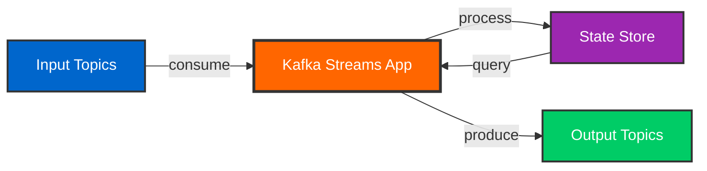
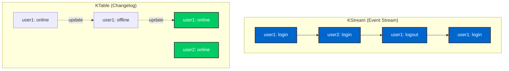
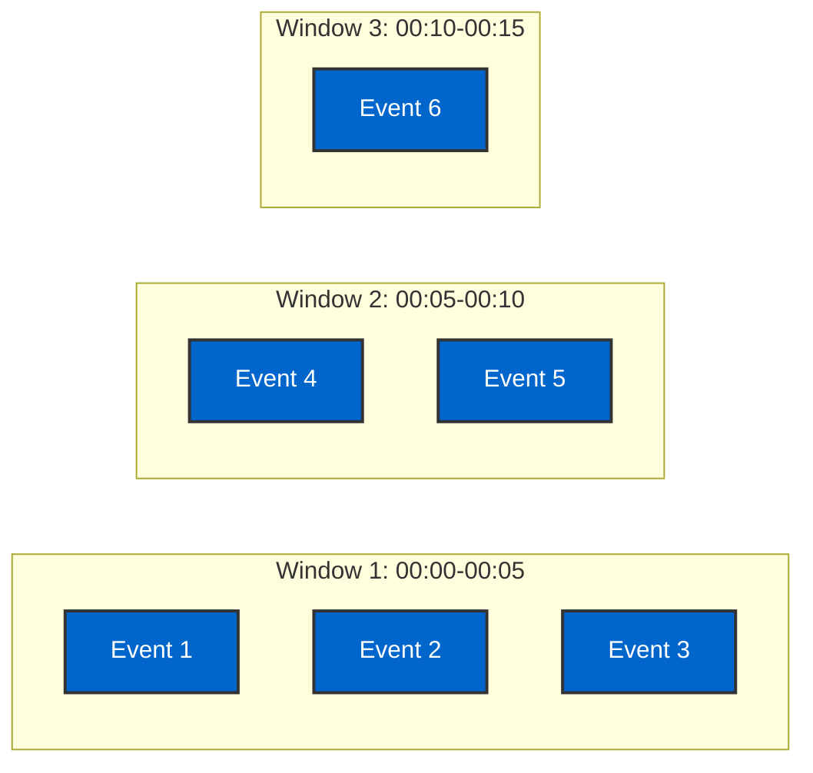

# Day 6: Kafka Streams Processing

## Learning Objectives

By the end of Day 6, you will:

- [ ] Understand Kafka Streams architecture and topology
- [ ] Differentiate between KStream and KTable
- [ ] Implement stateless transformations (filter, map, flatMap)
- [ ] Implement stateful operations (aggregations, joins, windowing)
- [ ] Build stream processing topologies
- [ ] Use interactive queries for state stores
- [ ] Handle time semantics and windowing

## What is Kafka Streams?

Kafka Streams is a client library for building real-time stream processing applications.



### Key Features

- **Stream Processing** - Process records one at a time
- **Stateful Processing** - Maintain state across records
- **Exactly-Once Semantics** - No duplicates or data loss
- **Fault Tolerance** - Automatic failover and recovery
- **Scalability** - Horizontal scaling by adding instances
- **No External Dependencies** - Pure Kafka-based

## Kafka Streams Concepts

### Stream vs Table



**KStream:**
- Represents a stream of records
- Each record is an independent event
- Append-only sequence
- All records are retained

**KTable:**
- Represents a changelog table
- Latest value per key
- Updates previous values
- Only current state matters

## Setup Kafka Streams

### Maven Dependencies

```xml
<dependency>
    <groupId>org.apache.kafka</groupId>
    <artifactId>kafka-streams</artifactId>
    <version>3.8.0</version>
</dependency>

<dependency>
    <groupId>org.springframework.kafka</groupId>
    <artifactId>spring-kafka</artifactId>
</dependency>
```

### Configuration

```java
@Configuration
@EnableKafkaStreams
public class KafkaStreamsConfig {

    @Value("${spring.kafka.bootstrap-servers}")
    private String bootstrapServers;

    @Bean(name = KafkaStreamsDefaultConfiguration.DEFAULT_STREAMS_CONFIG_BEAN_NAME)
    public KafkaStreamsConfiguration kStreamsConfig() {
        Map<String, Object> props = new HashMap<>();

        props.put(StreamsConfig.APPLICATION_ID_CONFIG, "kafka-training-streams");
        props.put(StreamsConfig.BOOTSTRAP_SERVERS_CONFIG, bootstrapServers);
        props.put(StreamsConfig.DEFAULT_KEY_SERDE_CLASS_CONFIG,
            Serdes.String().getClass());
        props.put(StreamsConfig.DEFAULT_VALUE_SERDE_CLASS_CONFIG,
            Serdes.String().getClass());

        // Processing guarantees
        props.put(StreamsConfig.PROCESSING_GUARANTEE_CONFIG,
            StreamsConfig.EXACTLY_ONCE_V2);

        // State directory
        props.put(StreamsConfig.STATE_DIR_CONFIG, "/tmp/kafka-streams");

        // Commit interval
        props.put(StreamsConfig.COMMIT_INTERVAL_MS_CONFIG, 1000);

        // Number of stream threads
        props.put(StreamsConfig.NUM_STREAM_THREADS_CONFIG, 2);

        return new KafkaStreamsConfiguration(props);
    }
}
```

## Stateless Transformations

### Filter

```java
@Component
public class FilterStream {

    @Autowired
    public void buildPipeline(StreamsBuilder streamsBuilder) {
        KStream<String, String> sourceStream =
            streamsBuilder.stream("user-events");

        // Filter active users only
        KStream<String, String> activeUsers = sourceStream
            .filter((key, value) -> {
                JsonNode event = parseJson(value);
                return event.get("isActive").asBoolean();
            });

        activeUsers.to("active-user-events");
    }
}
```

### Map

```java
@Component
public class MapStream {

    @Autowired
    public void buildPipeline(StreamsBuilder streamsBuilder) {
        KStream<String, String> sourceStream =
            streamsBuilder.stream("orders");

        // Transform order to order summary
        KStream<String, String> orderSummaries = sourceStream
            .mapValues((key, value) -> {
                JsonNode order = parseJson(value);
                return String.format("Order %s: $%.2f",
                    order.get("orderId").asText(),
                    order.get("total").asDouble());
            });

        orderSummaries.to("order-summaries");
    }
}
```

### FlatMap

```java
@Component
public class FlatMapStream {

    @Autowired
    public void buildPipeline(StreamsBuilder streamsBuilder) {
        KStream<String, String> ordersStream =
            streamsBuilder.stream("orders");

        // Split order into individual items
        KStream<String, String> orderItems = ordersStream
            .flatMapValues((key, order) -> {
                JsonNode orderJson = parseJson(order);
                JsonNode items = orderJson.get("items");

                List<String> itemList = new ArrayList<>();
                for (JsonNode item : items) {
                    itemList.add(item.toString());
                }
                return itemList;
            });

        orderItems.to("order-items");
    }
}
```

### Branch

```java
@Component
public class BranchStream {

    @Autowired
    public void buildPipeline(StreamsBuilder streamsBuilder) {
        KStream<String, String> ordersStream =
            streamsBuilder.stream("orders");

        // Branch by order total
        Map<String, KStream<String, String>> branches = ordersStream
            .split(Named.as("order-"))
            .branch((key, value) -> {
                double total = parseJson(value).get("total").asDouble();
                return total > 1000;
            }, Branched.as("high-value"))
            .branch((key, value) -> {
                double total = parseJson(value).get("total").asDouble();
                return total > 100;
            }, Branched.as("medium-value"))
            .defaultBranch(Branched.as("low-value"));

        branches.get("order-high-value").to("high-value-orders");
        branches.get("order-medium-value").to("medium-value-orders");
        branches.get("order-low-value").to("low-value-orders");
    }
}
```

## Stateful Operations

### Aggregations

```java
@Component
public class AggregationStream {

    @Autowired
    public void buildPipeline(StreamsBuilder streamsBuilder) {
        KStream<String, String> ordersStream =
            streamsBuilder.stream("orders");

        // Aggregate total revenue by user
        KTable<String, Double> userRevenue = ordersStream
            .groupByKey()
            .aggregate(
                () -> 0.0,  // Initializer
                (key, value, aggregate) -> {  // Aggregator
                    double orderTotal = parseJson(value)
                        .get("total")
                        .asDouble();
                    return aggregate + orderTotal;
                },
                Materialized.<String, Double, KeyValueStore<Bytes, byte[]>>as(
                    "user-revenue-store")
                    .withKeySerde(Serdes.String())
                    .withValueSerde(Serdes.Double())
            );

        userRevenue.toStream().to("user-revenue",
            Produced.with(Serdes.String(), Serdes.Double()));
    }
}
```

### Count

```java
@Component
public class CountStream {

    @Autowired
    public void buildPipeline(StreamsBuilder streamsBuilder) {
        KStream<String, String> eventsStream =
            streamsBuilder.stream("user-events");

        // Count events by user
        KTable<String, Long> eventCounts = eventsStream
            .groupByKey()
            .count(Materialized.as("event-counts-store"));

        eventCounts.toStream().to("event-counts",
            Produced.with(Serdes.String(), Serdes.Long()));
    }
}
```

### Reduce

```java
@Component
public class ReduceStream {

    @Autowired
    public void buildPipeline(StreamsBuilder streamsBuilder) {
        KStream<String, String> ordersStream =
            streamsBuilder.stream("orders");

        // Keep latest order per user
        KTable<String, String> latestOrders = ordersStream
            .groupByKey()
            .reduce(
                (oldValue, newValue) -> newValue,  // Keep newest
                Materialized.as("latest-orders-store")
            );

        latestOrders.toStream().to("latest-orders");
    }
}
```

## Joins

### Stream-Stream Join

```java
@Component
public class StreamJoinStream {

    @Autowired
    public void buildPipeline(StreamsBuilder streamsBuilder) {
        KStream<String, String> ordersStream =
            streamsBuilder.stream("orders");
        KStream<String, String> paymentsStream =
            streamsBuilder.stream("payments");

        // Join orders with payments (within 5 minute window)
        KStream<String, String> orderPayments = ordersStream.join(
            paymentsStream,
            (order, payment) -> {
                // Combine order and payment
                return String.format("{\"order\":%s,\"payment\":%s}",
                    order, payment);
            },
            JoinWindows.ofTimeDifferenceWithNoGrace(Duration.ofMinutes(5)),
            StreamJoined.with(
                Serdes.String(),
                Serdes.String(),
                Serdes.String()
            )
        );

        orderPayments.to("order-payments");
    }
}
```

### Stream-Table Join

```java
@Component
public class StreamTableJoin {

    @Autowired
    public void buildPipeline(StreamsBuilder streamsBuilder) {
        KStream<String, String> ordersStream =
            streamsBuilder.stream("orders");
        KTable<String, String> usersTable =
            streamsBuilder.table("users");

        // Enrich orders with user data
        KStream<String, String> enrichedOrders = ordersStream
            .selectKey((key, value) ->
                parseJson(value).get("userId").asText())
            .join(
                usersTable,
                (order, user) -> {
                    JsonNode orderJson = parseJson(order);
                    JsonNode userJson = parseJson(user);

                    ObjectNode enriched = objectMapper.createObjectNode();
                    enriched.set("order", orderJson);
                    enriched.set("user", userJson);

                    return enriched.toString();
                },
                Joined.with(
                    Serdes.String(),
                    Serdes.String(),
                    Serdes.String()
                )
            );

        enrichedOrders.to("enriched-orders");
    }
}
```

### Table-Table Join

```java
@Component
public class TableJoin {

    @Autowired
    public void buildPipeline(StreamsBuilder streamsBuilder) {
        KTable<String, String> usersTable =
            streamsBuilder.table("users");
        KTable<String, String> profilesTable =
            streamsBuilder.table("profiles");

        // Join users with profiles
        KTable<String, String> userProfiles = usersTable.join(
            profilesTable,
            (user, profile) -> {
                return String.format("{\"user\":%s,\"profile\":%s}",
                    user, profile);
            }
        );

        userProfiles.toStream().to("user-profiles");
    }
}
```

## Windowing

### Tumbling Window

Fixed-size, non-overlapping windows.

```java
@Component
public class TumblingWindowStream {

    @Autowired
    public void buildPipeline(StreamsBuilder streamsBuilder) {
        KStream<String, String> eventsStream =
            streamsBuilder.stream("page-views");

        // Count page views per 5-minute window
        KTable<Windowed<String>, Long> windowedCounts = eventsStream
            .groupByKey()
            .windowedBy(TimeWindows.ofSizeWithNoGrace(Duration.ofMinutes(5)))
            .count(Materialized.as("page-view-counts"));

        windowedCounts.toStream()
            .map((windowedKey, count) -> {
                String key = String.format("%s@%d-%d",
                    windowedKey.key(),
                    windowedKey.window().start(),
                    windowedKey.window().end());
                return KeyValue.pair(key, count.toString());
            })
            .to("windowed-page-view-counts");
    }
}
```



### Hopping Window

Fixed-size, overlapping windows.

```java
@Component
public class HoppingWindowStream {

    @Autowired
    public void buildPipeline(StreamsBuilder streamsBuilder) {
        KStream<String, String> ordersStream =
            streamsBuilder.stream("orders");

        // Sum order totals: 10-minute windows, advancing every 5 minutes
        KTable<Windowed<String>, Double> windowedRevenue = ordersStream
            .groupByKey()
            .windowedBy(TimeWindows
                .ofSizeWithNoGrace(Duration.ofMinutes(10))
                .advanceBy(Duration.ofMinutes(5)))
            .aggregate(
                () -> 0.0,
                (key, value, aggregate) ->
                    aggregate + parseJson(value).get("total").asDouble(),
                Materialized.with(Serdes.String(), Serdes.Double())
            );

        windowedRevenue.toStream()
            .map((windowedKey, revenue) -> {
                String key = String.format("revenue@%d",
                    windowedKey.window().start());
                return KeyValue.pair(key, revenue.toString());
            })
            .to("windowed-revenue");
    }
}
```

### Sliding Window

Windows slide with each record.

```java
@Component
public class SlidingWindowStream {

    @Autowired
    public void buildPipeline(StreamsBuilder streamsBuilder) {
        KStream<String, String> clicksStream =
            streamsBuilder.stream("clicks");

        // Count clicks within 1-minute sliding window
        KTable<Windowed<String>, Long> slidingCounts = clicksStream
            .groupByKey()
            .windowedBy(SlidingWindows.ofTimeDifferenceWithNoGrace(
                Duration.ofMinutes(1)))
            .count();

        slidingCounts.toStream()
            .map((windowedKey, count) -> {
                String key = String.format("%s@%d",
                    windowedKey.key(),
                    windowedKey.window().start());
                return KeyValue.pair(key, count.toString());
            })
            .to("sliding-click-counts");
    }
}
```

### Session Window

Windows based on inactivity gaps.

```java
@Component
public class SessionWindowStream {

    @Autowired
    public void buildPipeline(StreamsBuilder streamsBuilder) {
        KStream<String, String> eventsStream =
            streamsBuilder.stream("user-activity");

        // Create sessions with 5-minute inactivity gap
        KTable<Windowed<String>, Long> sessions = eventsStream
            .groupByKey()
            .windowedBy(SessionWindows.ofInactivityGapWithNoGrace(
                Duration.ofMinutes(5)))
            .count(Materialized.as("user-sessions"));

        sessions.toStream()
            .map((windowedKey, count) -> {
                String key = String.format("session:%s:%d-%d",
                    windowedKey.key(),
                    windowedKey.window().start(),
                    windowedKey.window().end());
                return KeyValue.pair(key, count.toString());
            })
            .to("user-sessions");
    }
}
```

## Interactive Queries

Query state stores from your application.

```java
@Service
public class StreamsQueryService {

    @Autowired
    private KafkaStreams kafkaStreams;

    public Double getUserRevenue(String userId) {
        ReadOnlyKeyValueStore<String, Double> store =
            kafkaStreams.store(
                StoreQueryParameters.fromNameAndType(
                    "user-revenue-store",
                    QueryableStoreTypes.keyValueStore()
                )
            );

        return store.get(userId);
    }

    public Map<String, Double> getAllUserRevenue() {
        ReadOnlyKeyValueStore<String, Double> store =
            kafkaStreams.store(
                StoreQueryParameters.fromNameAndType(
                    "user-revenue-store",
                    QueryableStoreTypes.keyValueStore()
                )
            );

        Map<String, Double> results = new HashMap<>();
        KeyValueIterator<String, Double> iterator = store.all();

        while (iterator.hasNext()) {
            KeyValue<String, Double> entry = iterator.next();
            results.put(entry.key, entry.value);
        }

        iterator.close();
        return results;
    }

    public List<Map.Entry<String, Double>> getTopRevenueUsers(int limit) {
        Map<String, Double> allRevenue = getAllUserRevenue();

        return allRevenue.entrySet().stream()
            .sorted(Map.Entry.<String, Double>comparingByValue().reversed())
            .limit(limit)
            .collect(Collectors.toList());
    }
}
```

## Complete Example: Real-Time Analytics

```java
@Component
public class RealTimeAnalytics {

    @Autowired
    public void buildTopology(StreamsBuilder streamsBuilder) {
        // Input: page view events
        KStream<String, String> pageViews =
            streamsBuilder.stream("page-views");

        // 1. Filter valid page views
        KStream<String, String> validViews = pageViews
            .filter((key, value) -> {
                JsonNode event = parseJson(value);
                return event.has("userId") && event.has("pageUrl");
            });

        // 2. Count views per page (5-minute tumbling window)
        KTable<Windowed<String>, Long> pageViewCounts = validViews
            .selectKey((key, value) ->
                parseJson(value).get("pageUrl").asText())
            .groupByKey()
            .windowedBy(TimeWindows.ofSizeWithNoGrace(Duration.ofMinutes(5)))
            .count(Materialized.as("page-view-counts"));

        // 3. Aggregate by user (total views)
        KTable<String, Long> userViewCounts = validViews
            .selectKey((key, value) ->
                parseJson(value).get("userId").asText())
            .groupByKey()
            .count(Materialized.as("user-view-counts"));

        // 4. Join with user table for enrichment
        KTable<String, String> users = streamsBuilder.table("users");

        KStream<String, String> enrichedViews = validViews
            .selectKey((key, value) ->
                parseJson(value).get("userId").asText())
            .join(
                users,
                (view, user) -> enrichPageView(view, user)
            );

        // 5. Output results
        pageViewCounts.toStream()
            .map((windowedKey, count) ->
                KeyValue.pair(
                    formatWindowedKey(windowedKey),
                    count.toString()
                ))
            .to("page-analytics");

        enrichedViews.to("enriched-page-views");
    }
}
```

## REST API Endpoints

### Run Day 6 Demo

```bash
curl -X POST http://localhost:8080/api/training/day06/demo
```

### Stateless Demo

```bash
curl -X POST http://localhost:8080/api/training/day06/stateless-demo
```

### Stateful Demo

```bash
curl -X POST http://localhost:8080/api/training/day06/stateful-demo
```

### Windowing Demo

```bash
curl -X POST http://localhost:8080/api/training/day06/windowing-demo
```

### Query State Store

```bash
curl http://localhost:8080/api/training/day06/state/user-revenue/user123
```

## Hands-On Exercises

### Exercise 1: Word Count

Classic streaming example:

```java
@Component
public class WordCountStream {

    @Autowired
    public void buildTopology(StreamsBuilder streamsBuilder) {
        KStream<String, String> textLines =
            streamsBuilder.stream("text-input");

        KTable<String, Long> wordCounts = textLines
            .flatMapValues(line -> Arrays.asList(line.toLowerCase().split("\\W+")))
            .groupBy((key, word) -> word)
            .count(Materialized.as("word-counts"));

        wordCounts.toStream().to("word-counts-output");
    }
}
```

### Exercise 2: Fraud Detection

Detect suspicious activity:

```java
@Component
public class FraudDetection {

    @Autowired
    public void buildTopology(StreamsBuilder streamsBuilder) {
        KStream<String, String> transactions =
            streamsBuilder.stream("transactions");

        // Count transactions per user in 5-minute window
        KTable<Windowed<String>, Long> txCounts = transactions
            .groupByKey()
            .windowedBy(TimeWindows.ofSizeWithNoGrace(Duration.ofMinutes(5)))
            .count();

        // Flag users with more than 10 transactions in window
        KStream<String, String> suspiciousActivity = txCounts
            .toStream()
            .filter((windowedKey, count) -> count > 10)
            .map((windowedKey, count) ->
                KeyValue.pair(
                    windowedKey.key(),
                    String.format("ALERT: %d transactions in 5 min", count)
                ));

        suspiciousActivity.to("fraud-alerts");
    }
}
```

## Key Takeaways

!!! success "What You Learned"
    1. **Kafka Streams** enables real-time stream processing
    2. **KStream vs KTable** represent different data semantics
    3. **Stateless operations** transform records independently
    4. **Stateful operations** maintain state across records
    5. **Windowing** enables time-based aggregations
    6. **Joins** combine data from multiple streams
    7. **Interactive queries** expose state store data

## Practice Exercises

Ready to practice what you learned? Complete the **[Day 06 Exercises](../exercises/day06-exercises.md)** to apply today's concepts.

These hands-on exercises will help you master the material before moving forward.

## Next Steps

Continue to [Day 7: Kafka Connect](day07-connect.md) to learn about data integration with Kafka Connect.

**Related Resources:**
- [API Reference](../api/training-endpoints.md)
- [Architecture](../architecture/data-flow.md)
- [Container Development](../containers/docker-compose.md)
