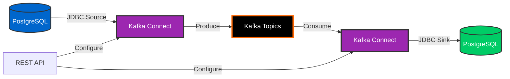
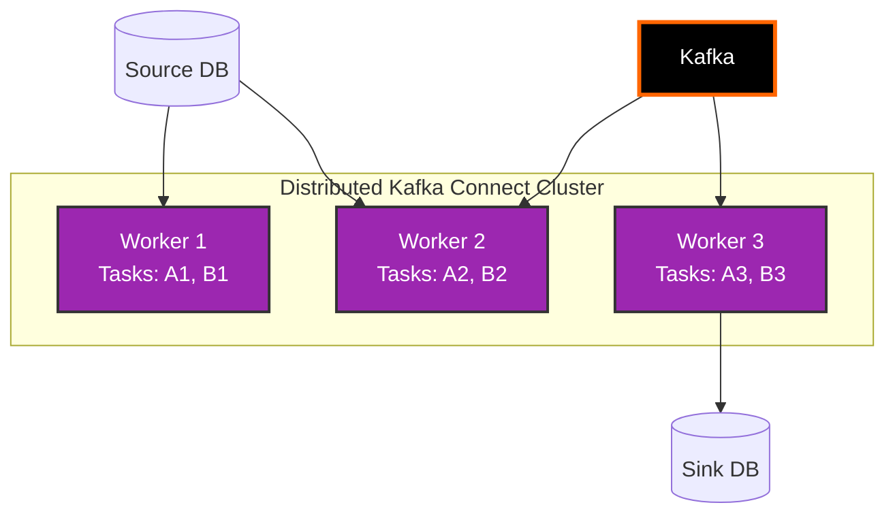

# Day 7: Kafka Connect

> **Primary Audience:** Data Engineers
> **Learning Track:** Platform-agnostic Kafka Connect framework using REST API. Spring Boot integration for custom REST endpoints is optional.

## Learning Objectives

By the end of Day 7, you will:

- [ ] Understand Kafka Connect architecture and components
- [ ] Configure Source and Sink connectors
- [ ] Set up JDBC Source connector (PostgreSQL to Kafka)
- [ ] Set up JDBC Sink connector (Kafka to PostgreSQL)
- [ ] Use Single Message Transforms (SMTs)
- [ ] Monitor and manage connectors
- [ ] Integrate Kafka Connect with EventMart

## What is Kafka Connect?

Kafka Connect is a framework for streaming data between Kafka and external systems.



### Key Components

- **Source Connectors** - Import data from external systems into Kafka
- **Sink Connectors** - Export data from Kafka to external systems
- **Transforms** - Modify data as it flows through Connect
- **Converters** - Serialize/deserialize data between Connect and Kafka

### Benefits

1. **No Code Required** - Configuration-based integration
2. **Fault Tolerant** - Automatic recovery and resumption
3. **Scalable** - Distributed execution across workers
4. **Exactly-Once Semantics** - No data loss or duplication
5. **Built-in Monitoring** - REST API for management
6. **Rich Ecosystem** - 100+ pre-built connectors

## Kafka Connect Architecture

### Standalone vs Distributed Mode

**Standalone Mode:**
- Single process
- Simple configuration
- Good for development
- No fault tolerance

**Distributed Mode:**
- Multiple workers
- High availability
- Automatic failover
- Production recommended



## JDBC Source Connector

Import database tables into Kafka topics.

### Configuration

```json
{
  "name": "postgres-source-connector",
  "config": {
    "connector.class": "io.confluent.connect.jdbc.JdbcSourceConnector",
    "tasks.max": "3",
    "connection.url": "jdbc:postgresql://postgres:5432/eventmart",
    "connection.user": "eventmart_user",
    "connection.password": "eventmart_pass",

    "mode": "incrementing",
    "incrementing.column.name": "id",
    "table.whitelist": "users,products,orders",

    "topic.prefix": "eventmart.",
    "poll.interval.ms": "5000",

    "transforms": "createKey,extractKey",
    "transforms.createKey.type": "org.apache.kafka.connect.transforms.ValueToKey",
    "transforms.createKey.fields": "id",
    "transforms.extractKey.type": "org.apache.kafka.connect.transforms.ExtractField$Key",
    "transforms.extractKey.field": "id"
  }
}
```

### Configuration Properties

```properties
# Connector Configuration
connector.class=io.confluent.connect.jdbc.JdbcSourceConnector
tasks.max=3
name=postgres-source

# Connection
connection.url=jdbc:postgresql://postgres:5432/eventmart
connection.user=eventmart_user
connection.password=eventmart_pass

# Mode
mode=incrementing                    # incrementing, timestamp, bulk
incrementing.column.name=id          # For incrementing mode
timestamp.column.name=updated_at     # For timestamp mode

# Tables
table.whitelist=users,products       # Include tables
table.blacklist=internal_*           # Exclude tables
query=SELECT * FROM orders WHERE...  # Custom query

# Topic Configuration
topic.prefix=eventmart.              # Prefix for topic names
poll.interval.ms=5000                # Poll database every 5 seconds

# Batch Size
batch.max.rows=1000                  # Rows per batch

# Numeric Mapping
numeric.mapping=best_fit             # best_fit, precision, none
```

### Modes

**Incrementing Mode:**
```json
{
  "mode": "incrementing",
  "incrementing.column.name": "id"
}
```
- Tracks highest ID value
- Only fetches new rows
- Requires auto-incrementing column

**Timestamp Mode:**
```json
{
  "mode": "timestamp",
  "timestamp.column.name": "updated_at"
}
```
- Tracks latest timestamp
- Captures updates and inserts
- Requires timestamp column

**Timestamp + Incrementing Mode:**
```json
{
  "mode": "timestamp+incrementing",
  "timestamp.column.name": "updated_at",
  "incrementing.column.name": "id"
}
```
- Best of both worlds
- Handles updates with duplicate timestamps

**Bulk Mode:**
```json
{
  "mode": "bulk"
}
```
- Fetches all rows every poll
- No change detection
- High overhead

### Create Source Connector

```bash
curl -X POST http://localhost:8083/connectors \
  -H "Content-Type: application/json" \
  -d '{
    "name": "eventmart-users-source",
    "config": {
      "connector.class": "io.confluent.connect.jdbc.JdbcSourceConnector",
      "tasks.max": "1",
      "connection.url": "jdbc:postgresql://postgres:5432/eventmart",
      "connection.user": "eventmart_user",
      "connection.password": "eventmart_pass",
      "mode": "timestamp+incrementing",
      "incrementing.column.name": "id",
      "timestamp.column.name": "updated_at",
      "table.whitelist": "users",
      "topic.prefix": "eventmart.",
      "poll.interval.ms": "5000"
    }
  }'
```

## JDBC Sink Connector

Export Kafka topics to database tables.

### Configuration

```json
{
  "name": "postgres-sink-connector",
  "config": {
    "connector.class": "io.confluent.connect.jdbc.JdbcSinkConnector",
    "tasks.max": "3",
    "connection.url": "jdbc:postgresql://postgres:5432/analytics",
    "connection.user": "analytics_user",
    "connection.password": "analytics_pass",

    "topics": "eventmart.orders,eventmart.payments",
    "auto.create": "true",
    "auto.evolve": "true",

    "insert.mode": "upsert",
    "pk.mode": "record_key",
    "pk.fields": "id",

    "table.name.format": "${topic}",
    "batch.size": "3000"
  }
}
```

### Configuration Properties

```properties
# Connector Configuration
connector.class=io.confluent.connect.jdbc.JdbcSinkConnector
tasks.max=3
name=postgres-sink

# Connection
connection.url=jdbc:postgresql://postgres:5432/analytics
connection.user=analytics_user
connection.password=analytics_pass

# Topics
topics=orders,payments               # Topics to consume
topics.regex=eventmart.*             # Or use regex

# Table Configuration
auto.create=true                     # Create tables automatically
auto.evolve=true                     # Evolve schema automatically
table.name.format=${topic}           # Table naming pattern

# Insert Mode
insert.mode=insert                   # insert, upsert, update
pk.mode=record_key                   # none, kafka, record_key, record_value
pk.fields=id                         # Primary key fields

# Batch Configuration
batch.size=3000                      # Batch size
max.retries=10                       # Retry attempts
retry.backoff.ms=3000                # Backoff between retries
```

### Insert Modes

**Insert Mode:**
```json
{
  "insert.mode": "insert"
}
```
- Append-only
- No updates
- Fastest performance

**Upsert Mode:**
```json
{
  "insert.mode": "upsert",
  "pk.mode": "record_key",
  "pk.fields": "id"
}
```
- Insert or update
- Requires primary key
- Handles updates

**Update Mode:**
```json
{
  "insert.mode": "update",
  "pk.mode": "record_key",
  "pk.fields": "id"
}
```
- Update only
- Fails if record doesn't exist
- Requires primary key

### Create Sink Connector

```bash
curl -X POST http://localhost:8083/connectors \
  -H "Content-Type: application/json" \
  -d '{
    "name": "eventmart-orders-sink",
    "config": {
      "connector.class": "io.confluent.connect.jdbc.JdbcSinkConnector",
      "tasks.max": "1",
      "connection.url": "jdbc:postgresql://postgres:5432/analytics",
      "connection.user": "analytics_user",
      "connection.password": "analytics_pass",
      "topics": "eventmart.orders",
      "auto.create": "true",
      "auto.evolve": "true",
      "insert.mode": "upsert",
      "pk.mode": "record_key",
      "pk.fields": "id",
      "table.name.format": "orders_materialized"
    }
  }'
```

## Single Message Transforms (SMTs)

Transform data as it flows through Connect.

### Common Transforms

**ValueToKey** - Copy field from value to key:
```json
{
  "transforms": "createKey",
  "transforms.createKey.type": "org.apache.kafka.connect.transforms.ValueToKey",
  "transforms.createKey.fields": "userId"
}
```

**ExtractField** - Extract single field:
```json
{
  "transforms": "unwrap",
  "transforms.unwrap.type": "org.apache.kafka.connect.transforms.ExtractField$Value",
  "transforms.unwrap.field": "after"
}
```

**ReplaceField** - Rename or exclude fields:
```json
{
  "transforms": "renameField",
  "transforms.renameField.type": "org.apache.kafka.connect.transforms.ReplaceField$Value",
  "transforms.renameField.renames": "old_name:new_name",
  "transforms.renameField.exclude": "password,ssn"
}
```

**Cast** - Change field types:
```json
{
  "transforms": "cast",
  "transforms.cast.type": "org.apache.kafka.connect.transforms.Cast$Value",
  "transforms.cast.spec": "price:float64,quantity:int32"
}
```

**TimestampConverter** - Convert timestamp formats:
```json
{
  "transforms": "convertTimestamp",
  "transforms.convertTimestamp.type": "org.apache.kafka.connect.transforms.TimestampConverter$Value",
  "transforms.convertTimestamp.field": "created_at",
  "transforms.convertTimestamp.target.type": "Timestamp",
  "transforms.convertTimestamp.format": "yyyy-MM-dd HH:mm:ss"
}
```

**Filter** - Filter records:
```json
{
  "transforms": "filter",
  "transforms.filter.type": "org.apache.kafka.connect.transforms.Filter",
  "transforms.filter.predicate": "isDeleted",
  "predicates": "isDeleted",
  "predicates.isDeleted.type": "org.apache.kafka.connect.transforms.predicates.TopicNameMatches",
  "predicates.isDeleted.pattern": ".*deleted.*"
}
```

### Chaining Transforms

```json
{
  "transforms": "createKey,extractKey,rename,cast",
  "transforms.createKey.type": "org.apache.kafka.connect.transforms.ValueToKey",
  "transforms.createKey.fields": "id",
  "transforms.extractKey.type": "org.apache.kafka.connect.transforms.ExtractField$Key",
  "transforms.extractKey.field": "id",
  "transforms.rename.type": "org.apache.kafka.connect.transforms.ReplaceField$Value",
  "transforms.rename.renames": "user_id:userId,order_date:orderDate",
  "transforms.cast.type": "org.apache.kafka.connect.transforms.Cast$Value",
  "transforms.cast.spec": "total:float64"
}
```

## Connector Management

### List Connectors

```bash
curl http://localhost:8083/connectors
```

### Get Connector Status

```bash
curl http://localhost:8083/connectors/eventmart-users-source/status
```

**Response:**
```json
{
  "name": "eventmart-users-source",
  "connector": {
    "state": "RUNNING",
    "worker_id": "kafka-connect:8083"
  },
  "tasks": [
    {
      "id": 0,
      "state": "RUNNING",
      "worker_id": "kafka-connect:8083"
    }
  ]
}
```

### Get Connector Configuration

```bash
curl http://localhost:8083/connectors/eventmart-users-source/config
```

### Update Connector

```bash
curl -X PUT http://localhost:8083/connectors/eventmart-users-source/config \
  -H "Content-Type: application/json" \
  -d '{
    "tasks.max": "2",
    "poll.interval.ms": "10000"
  }'
```

### Pause Connector

```bash
curl -X PUT http://localhost:8083/connectors/eventmart-users-source/pause
```

### Resume Connector

```bash
curl -X PUT http://localhost:8083/connectors/eventmart-users-source/resume
```

### Restart Connector

```bash
curl -X POST http://localhost:8083/connectors/eventmart-users-source/restart
```

### Delete Connector

```bash
curl -X DELETE http://localhost:8083/connectors/eventmart-users-source
```

## EventMart Integration

### Source: PostgreSQL to Kafka

```bash
# Create connector for users table
curl -X POST http://localhost:8083/connectors \
  -H "Content-Type: application/json" \
  -d '{
    "name": "eventmart-users-source",
    "config": {
      "connector.class": "io.confluent.connect.jdbc.JdbcSourceConnector",
      "tasks.max": "1",
      "connection.url": "jdbc:postgresql://postgres:5432/eventmart",
      "connection.user": "eventmart_user",
      "connection.password": "eventmart_pass",
      "mode": "timestamp+incrementing",
      "incrementing.column.name": "id",
      "timestamp.column.name": "updated_at",
      "table.whitelist": "users",
      "topic.prefix": "eventmart.db.",
      "poll.interval.ms": "5000"
    }
  }'

# Create connector for orders table
curl -X POST http://localhost:8083/connectors \
  -H "Content-Type: application/json" \
  -d '{
    "name": "eventmart-orders-source",
    "config": {
      "connector.class": "io.confluent.connect.jdbc.JdbcSourceConnector",
      "tasks.max": "2",
      "connection.url": "jdbc:postgresql://postgres:5432/eventmart",
      "connection.user": "eventmart_user",
      "connection.password": "eventmart_pass",
      "mode": "timestamp+incrementing",
      "incrementing.column.name": "id",
      "timestamp.column.name": "created_at",
      "table.whitelist": "orders",
      "topic.prefix": "eventmart.db.",
      "poll.interval.ms": "5000"
    }
  }'
```

### Sink: Kafka to Analytics Database

```bash
# Create sink for materialized views
curl -X POST http://localhost:8083/connectors \
  -H "Content-Type: application/json" \
  -d '{
    "name": "eventmart-analytics-sink",
    "config": {
      "connector.class": "io.confluent.connect.jdbc.JdbcSinkConnector",
      "tasks.max": "2",
      "connection.url": "jdbc:postgresql://postgres:5432/analytics",
      "connection.user": "analytics_user",
      "connection.password": "analytics_pass",
      "topics": "eventmart.orders,eventmart.user-activity",
      "auto.create": "true",
      "auto.evolve": "true",
      "insert.mode": "upsert",
      "pk.mode": "record_key",
      "pk.fields": "id",
      "table.name.format": "${topic}_materialized"
    }
  }'
```

## Python Kafka Connect Management (Data Engineer Track)

For data engineers using Python, here's how to programmatically manage Kafka Connect using the REST API:

### Python Connector Management Script

**Complete Example**: `examples/python/day07_connect_client.py`

```bash
# Ensure Kafka Connect is running
curl http://localhost:8083

# Run the Python Kafka Connect client
python examples/python/day07_connect_client.py
```

**Key code from day07_connect_client.py:**

```python
import requests
import json
from typing import Dict, List, Optional

class KafkaConnectClient:
    """
    Kafka Connect REST API Client
    Platform-agnostic - same REST API from any language!
    """

    def __init__(self, connect_url: str = 'http://localhost:8083'):
        self.connect_url = connect_url
        self.headers = {'Content-Type': 'application/json'}

    def list_connectors(self) -> Optional[List[str]]:
        """List all connectors"""
        return self._request('GET', '/connectors')

    def get_connector(self, name: str) -> Optional[Dict]:
        """Get connector configuration"""
        return self._request('GET', f'/connectors/{name}')

    def create_connector(self, config: Dict) -> Optional[Dict]:
        """Create a new connector"""
        return self._request('POST', '/connectors', config)

    def get_connector_status(self, name: str) -> Optional[Dict]:
        """Get connector status"""
        return self._request('GET', f'/connectors/{name}/status')

    def pause_connector(self, name: str) -> bool:
        """Pause a connector"""
        result = self._request('PUT', f'/connectors/{name}/pause')
        return result is not None

    def resume_connector(self, name: str) -> bool:
        """Resume a paused connector"""
        result = self._request('PUT', f'/connectors/{name}/resume')
        return result is not None

    def delete_connector(self, name: str) -> bool:
        """Delete a connector"""
        result = self._request('DELETE', f'/connectors/{name}')
        return result is not None

# Usage
client = KafkaConnectClient()

# Get cluster info
info = client.get_cluster_info()
print(f"Kafka Connect Version: {info.get('version')}")

# Create connector
connector_config = {
    "name": "python-file-source-demo",
    "config": {
        "connector.class": "org.apache.kafka.connect.file.FileStreamSourceConnector",
        "tasks.max": "1",
        "file": "/tmp/kafka-connect-test-input.txt",
        "topic": "connect-test-topic"
    }
}
client.create_connector(connector_config)

# List connectors
connectors = client.list_connectors()
print(f"Active connectors: {connectors}")

# Get status
status = client.get_connector_status("python-file-source-demo")
print(f"Connector state: {status.get('connector', {}).get('state')}")

# Pause/Resume lifecycle
client.pause_connector("python-file-source-demo")
client.resume_connector("python-file-source-demo")
```

**Install Dependencies:**

```bash
pip install requests
# Or install all training dependencies
pip install -r examples/python/requirements.txt
```

**Key Insight**: Kafka Connect uses the **same REST API** regardless of language! This Python client works identically to Java, Go, or curl clients.

### Creating a JDBC Sink Connector with Python

> **Note**: The following are reference patterns for advanced connector configurations. See the complete working example at `examples/python/day07_connect_client.py` for basic connector management.

```python
# Create JDBC Sink Connector
def create_jdbc_sink_connector(client: KafkaConnectClient) -> Dict:
    """Create a JDBC sink connector to PostgreSQL"""

    sink_config = {
        "name": "python-postgres-sink",
        "config": {
            "connector.class": "io.confluent.connect.jdbc.JdbcSinkConnector",
            "tasks.max": "3",
            "connection.url": "jdbc:postgresql://postgres:5432/analytics",
            "connection.user": "analytics_user",
            "connection.password": "analytics_pass",

            # Topics
            "topics": "eventmart.orders,eventmart.payments",

            # Table configuration
            "auto.create": "true",
            "auto.evolve": "true",
            "table.name.format": "${topic}_materialized",

            # Insert mode
            "insert.mode": "upsert",
            "pk.mode": "record_key",
            "pk.fields": "id",

            # Batch configuration
            "batch.size": "3000",
            "max.retries": "10",
            "retry.backoff.ms": "3000"
        }
    }

    return client.create_connector(sink_config)


# Monitor connector health
def monitor_connector_health(client: KafkaConnectClient, connector_name: str):
    """Monitor connector and restart if failed"""

    status = client.get_connector_status(connector_name)

    connector_state = status['connector']['state']
    print(f"Connector state: {connector_state}")

    if connector_state == 'FAILED':
        print(f"Restarting failed connector: {connector_name}")
        client.restart_connector(connector_name)

    # Check tasks
    for task in status['tasks']:
        task_id = task['id']
        task_state = task['state']
        print(f"Task {task_id} state: {task_state}")

        if task_state == 'FAILED':
            print(f"Restarting failed task: {connector_name}/task/{task_id}")
            client.restart_task(connector_name, task_id)


# Example: Automated connector lifecycle management
client = KafkaConnectClient()

# Create sink connector
create_jdbc_sink_connector(client)

# Monitor health
import time
while True:
    for connector in client.list_connectors():
        monitor_connector_health(client, connector)

    time.sleep(30)  # Check every 30 seconds
```

### Managing Connectors with Transforms (SMTs)

```python
def create_connector_with_transforms(client: KafkaConnectClient) -> Dict:
    """Create connector with Single Message Transforms"""

    config = {
        "name": "postgres-source-with-transforms",
        "config": {
            "connector.class": "io.confluent.connect.jdbc.JdbcSourceConnector",
            "tasks.max": "1",
            "connection.url": "jdbc:postgresql://postgres:5432/eventmart",
            "connection.user": "eventmart_user",
            "connection.password": "eventmart_pass",
            "mode": "incrementing",
            "incrementing.column.name": "id",
            "table.whitelist": "users",
            "topic.prefix": "raw.",

            # Single Message Transforms (SMTs)
            "transforms": "RenameField,AddMetadata,MaskSensitive",

            # Rename field transform
            "transforms.RenameField.type": "org.apache.kafka.connect.transforms.ReplaceField$Value",
            "transforms.RenameField.renames": "user_email:email",

            # Add metadata transform
            "transforms.AddMetadata.type": "org.apache.kafka.connect.transforms.InsertField$Value",
            "transforms.AddMetadata.timestamp.field": "ingested_at",
            "transforms.AddMetadata.static.field": "source",
            "transforms.AddMetadata.static.value": "postgres",

            # Mask sensitive data
            "transforms.MaskSensitive.type": "org.apache.kafka.connect.transforms.MaskField$Value",
            "transforms.MaskSensitive.fields": "password,ssn"
        }
    }

    return client.create_connector(config)
```

### Install Python Dependencies

```bash
pip install requests
```

**Python Kafka Connect Benefits:**
- **Programmatic Control**: Automate connector deployment and management
- **Integration**: Works with Airflow, Prefect, Luigi for workflow orchestration
- **Monitoring**: Build custom monitoring dashboards
- **CI/CD**: Deploy connectors as part of data pipeline deployments
- **Platform-Agnostic**: Same REST API regardless of language

## Spring Boot Integration (Java Developer Track - Optional)

> **Java Developer Track Only**
> This section shows custom REST API endpoints built with Spring Boot to wrap Kafka Connect REST API calls. Data engineers use Kafka Connect's native REST API directly (shown above).

### Spring Boot REST API Wrapper

The training application provides convenience endpoints that wrap Kafka Connect's REST API:

#### Run Day 7 Demo

```bash
curl -X POST http://localhost:8080/api/training/day07/demo
```

#### List Connectors

```bash
curl http://localhost:8080/api/training/day07/connectors
```

#### Create Source Connector

```bash
curl -X POST http://localhost:8080/api/training/day07/create-source \
  -H "Content-Type: application/json" \
  -d '{
    "name": "my-source",
    "table": "users"
  }'
```

#### Create Sink Connector

```bash
curl -X POST http://localhost:8080/api/training/day07/create-sink \
  -H "Content-Type: application/json" \
  -d '{
    "name": "my-sink",
    "topic": "users"
  }'
```

#### Delete Connector

```bash
curl -X DELETE http://localhost:8080/api/training/day07/connector/my-source
```

## Hands-On Exercises (Platform-Agnostic)

> **Note:** These exercises use Kafka Connect's native REST API and work for both tracks.

### Exercise 1: Full Pipeline

```bash
# 1. Create source database table
docker exec -it postgres psql -U eventmart_user -d eventmart -c "
  CREATE TABLE test_users (
    id SERIAL PRIMARY KEY,
    username VARCHAR(100),
    email VARCHAR(100),
    created_at TIMESTAMP DEFAULT NOW(),
    updated_at TIMESTAMP DEFAULT NOW()
  );"

# 2. Create source connector
curl -X POST http://localhost:8083/connectors \
  -H "Content-Type: application/json" \
  -d @source-connector.json

# 3. Insert test data
docker exec -it postgres psql -U eventmart_user -d eventmart -c "
  INSERT INTO test_users (username, email)
  VALUES ('alice', 'alice@example.com'),
         ('bob', 'bob@example.com');"

# 4. Verify data in Kafka
docker exec kafka-training-kafka kafka-console-consumer \
  --bootstrap-server localhost:9092 \
  --topic eventmart.test_users \
  --from-beginning

# 5. Create sink connector
curl -X POST http://localhost:8083/connectors \
  -H "Content-Type: application/json" \
  -d @sink-connector.json

# 6. Verify data in sink database
docker exec -it postgres psql -U analytics_user -d analytics -c "
  SELECT * FROM test_users_materialized;"
```

### Exercise 2: Transform Data

```bash
# Create connector with transforms
curl -X POST http://localhost:8083/connectors \
  -H "Content-Type: application/json" \
  -d '{
    "name": "transformed-source",
    "config": {
      "connector.class": "io.confluent.connect.jdbc.JdbcSourceConnector",
      "connection.url": "jdbc:postgresql://postgres:5432/eventmart",
      "table.whitelist": "orders",
      "transforms": "mask,addField",
      "transforms.mask.type": "org.apache.kafka.connect.transforms.MaskField$Value",
      "transforms.mask.fields": "customer_email",
      "transforms.addField.type": "org.apache.kafka.connect.transforms.InsertField$Value",
      "transforms.addField.static.field": "source",
      "transforms.addField.static.value": "postgres"
    }
  }'
```

## Monitoring

### Check Connector Health

```bash
# Get status
curl http://localhost:8083/connectors/eventmart-users-source/status | jq

# Check logs
docker logs kafka-connect

# Monitor lag
curl http://localhost:8083/connectors/eventmart-users-source/tasks/0/status
```

### Common Issues

**Connector Failed:**
```bash
# Check task status
curl http://localhost:8083/connectors/my-connector/tasks/0/status

# Restart task
curl -X POST http://localhost:8083/connectors/my-connector/tasks/0/restart
```

**Connection Issues:**
```bash
# Verify database connectivity
docker exec kafka-connect curl postgres:5432

# Check credentials
docker exec postgres psql -U eventmart_user -d eventmart -c "SELECT 1"
```

## Learning Track Guidance

### For Data Engineers (Recommended Path)

1. Master Kafka Connect REST API for connector management
2. Configure JDBC Source/Sink connectors with JSON
3. Use Single Message Transforms (SMTs) for data transformation
4. Deploy in distributed mode for production
5. Skills transfer to any Kafka deployment (Confluent, Apache, AWS MSK, etc.)

**When to use:** Any data integration project with Kafka - works everywhere

### For Java Developers (Alternative Path)

1. Use Kafka Connect's native REST API (same as data engineers)
2. Optionally wrap Connect REST API in Spring Boot for custom endpoints
3. Suitable for adding business logic around connector management

**When to use:** Building Spring Boot applications that need to manage connectors programmatically

### Key Point

- **Kafka Connect is framework-agnostic** - it's a separate JVM process with REST API
- Data engineers and Java developers use the same Kafka Connect REST API
- Spring Boot section shows optional custom wrappers, not required for Kafka Connect
- This is one of the most portable Kafka features - no code required!

## Key Takeaways

!!! success "What You Learned"
    1. **Kafka Connect** enables no-code data integration
    2. **Source connectors** import data from external systems
    3. **Sink connectors** export data to external systems
    4. **Transforms** modify data in flight
    5. **Distributed mode** provides scalability and fault tolerance
    6. **REST API** enables programmatic management
    7. **EventMart integration** demonstrates real-world usage

## Practice Exercises

Ready to practice what you learned? Complete the **[Day 07 Exercises](../exercises/day07-exercises.md)** to apply today's concepts.

These hands-on exercises will help you master the material before moving forward.

## Next Steps

Continue to [Day 8: Advanced Topics](day08-advanced.md) for security, monitoring, and production best practices.

**Related Resources:**
- [API Reference](../api/training-endpoints.md)
- [Deployment Guide](../deployment/deployment-guide.md)
- [Architecture](../architecture/data-flow.md)
