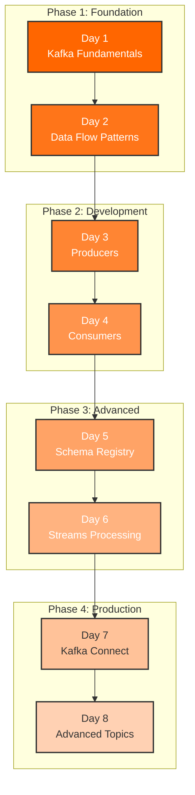

# Training Curriculum

Welcome to the 8-day Apache Kafka training curriculum. This comprehensive program takes you from Kafka fundamentals to production-ready implementations using Spring Boot and containers.

## Training Structure

## Curriculum Overview

### Phase 1: Foundation (Days 1-2)

<h4><a href="day01-foundation/">Day 1: Kafka Fundamentals</a></h4>
<ul>
<li>Kafka architecture and core concepts</li>
<li>Brokers, topics, and partitions</li>
<li>AdminClient API operations</li>
<li>Cluster metadata management</li>
</ul>
<strong>Time:</strong> 3-4 hours

<h4><a href="day02-dataflow/">Day 2: Data Flow Patterns</a></h4>
<ul>
<li>Event-driven architecture</li>
<li>Message ordering and partitioning</li>
<li>Delivery semantics</li>
<li>Offset management strategies</li>
</ul>
<strong>Time:</strong> 3-4 hours

### Phase 2: Development (Days 3-4)

<h4><a href="day03-producers/">Day 3: Producer Development</a></h4>
<ul>
<li>Producer API deep dive</li>
<li>Synchronous vs asynchronous sending</li>
<li>Idempotent producers and transactions</li>
<li>Error handling and retries</li>
</ul>
<strong>Time:</strong> 3-4 hours

<h4><a href="day04-consumers/">Day 4: Consumer Implementation</a></h4>
<ul>
<li>Consumer API fundamentals</li>
<li>Consumer groups and rebalancing</li>
<li>Offset management</li>
<li>Error handling patterns</li>
</ul>
<strong>Time:</strong> 3-4 hours

### Phase 3: Advanced (Days 5-6)

<h4><a href="day05-schema-registry/">Day 5: Schema Registry</a></h4>
<ul>
<li>Apache Avro serialization</li>
<li>Confluent Schema Registry</li>
<li>Schema evolution and compatibility</li>
<li>Spring Boot integration</li>
</ul>
<strong>Time:</strong> 3-4 hours

<h4><a href="day06-streams/">Day 6: Streams Processing</a></h4>
<ul>
<li>Kafka Streams API</li>
<li>Stateless and stateful operations</li>
<li>Windowing and aggregations</li>
<li>Stream topologies</li>
</ul>
<strong>Time:</strong> 3-4 hours

### Phase 4: Production (Days 7-8)

<h4><a href="day07-connect/">Day 7: Kafka Connect</a></h4>
<ul>
<li>Kafka Connect architecture</li>
<li>Source and sink connectors</li>
<li>JDBC connector configuration</li>
<li>Custom connector development</li>
</ul>
<strong>Time:</strong> 3-4 hours

<h4><a href="day08-advanced/">Day 8: Advanced Topics</a></h4>
<ul>
<li>Security (SSL/SASL)</li>
<li>Monitoring and observability</li>
<li>Performance tuning</li>
<li>Production best practices</li>
</ul>
<strong>Time:</strong> 3-4 hours

## Daily Learning Pattern

Each day follows a structured approach:

### 1. Theory (45-60 minutes)

- Core concepts introduction
- Architecture diagrams
- Best practices overview

### 2. Hands-On Examples (60-90 minutes)

- Live coding demonstrations
- Spring Boot implementations
- Docker container exercises

### 3. Practice Exercises (45-60 minutes)

- Independent coding tasks
- Problem-solving challenges
- Code review and discussion

### 4. EventMart Integration (30 minutes)

- Apply concepts to real project
- Build progressive features
- Integration testing

## REST API Endpoints by Day

Each training day has corresponding REST API endpoints:

| Day | Endpoint | Description |
|-----|----------|-------------|
| Day 1 | `POST /api/training/day01/demo` | Foundation demonstration |
| Day 2 | `GET /api/training/day02/concepts` | Data flow concepts |
| Day 3 | `POST /api/training/day03/demo` | Producer patterns demo |
| Day 4 | `POST /api/training/day04/demo` | Consumer groups demo |
| Day 5 | `POST /api/training/day05/schema` | Schema Registry demo |
| Day 6 | `POST /api/training/day06/stream` | Streams processing demo |
| Day 7 | `POST /api/training/day07/connect` | Kafka Connect demo |
| Day 8 | `GET /api/training/day08/metrics` | Advanced monitoring |

## Skills Progression

Track your learning progress:

<strong>Days 1-2: Beginner</strong> 
Understanding Kafka basics, topics, and partitions

<strong>Days 3-4: Intermediate</strong> 
Building producers and consumers with Spring Boot

<strong>Days 5-6: Advanced</strong> 
Schema management and stream processing

<strong>Days 7-8: Expert</strong> 
Integration patterns and production deployment

## Learning Resources

### Documentation

- **Day Guides** - Comprehensive daily documentation
- **API Reference** - Complete REST API documentation
- **Code Examples** - 90+ integration tests with TestContainers
- **EventMart Project** - Progressive real-world application

### Container Resources

- **Docker Compose** - Complete development environment
- **Kubernetes Manifests** - Production deployment configs
- **TestContainers** - Integration testing framework
- **Monitoring Stack** - Prometheus and Grafana setup

## Recommended Schedule

### Full-Time Track (8 Days)

- **Daily Time**: 3-4 hours
- **Schedule**: One day per training day
- **Best For**: Bootcamps, dedicated learning periods

### Part-Time Track (4 Weeks)

- **Weekly Time**: 6-8 hours
- **Schedule**: 2 days per week
- **Best For**: Working professionals

### Self-Paced Track

- **Flexible Schedule**: Your own pace
- **Recommended**: 2-4 hours per session
- **Best For**: Independent learners

## Next Steps

<strong>Ready to Start?</strong> 
Begin with <a href="day01-foundation/">Day 1: Foundation</a>

<strong>Need Prerequisites?</strong> 
Check <a href="../getting-started/prerequisites/">Prerequisites Guide</a>

<strong>Want Quick Setup?</strong> 
Follow <a href="../getting-started/quick-start/">5-Minute Quick Start</a>

<strong>Explore API?</strong> 
Review <a href="../api/training-endpoints/">API Reference</a>

---

Start your Kafka journey with [Day 1: Kafka Fundamentals and Foundation](day01-foundation/)
